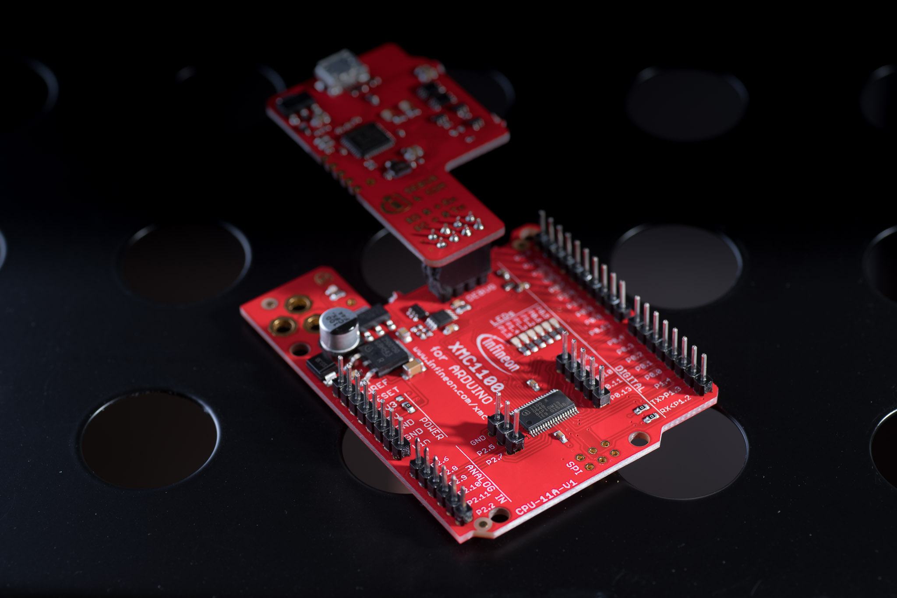
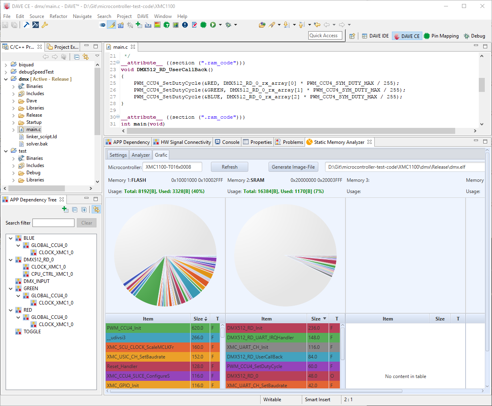
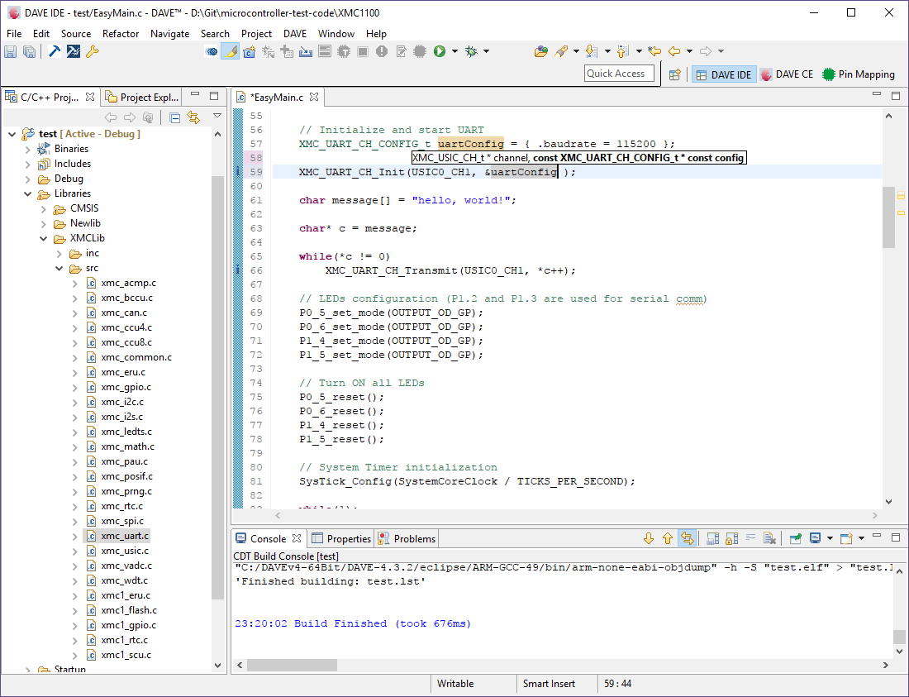
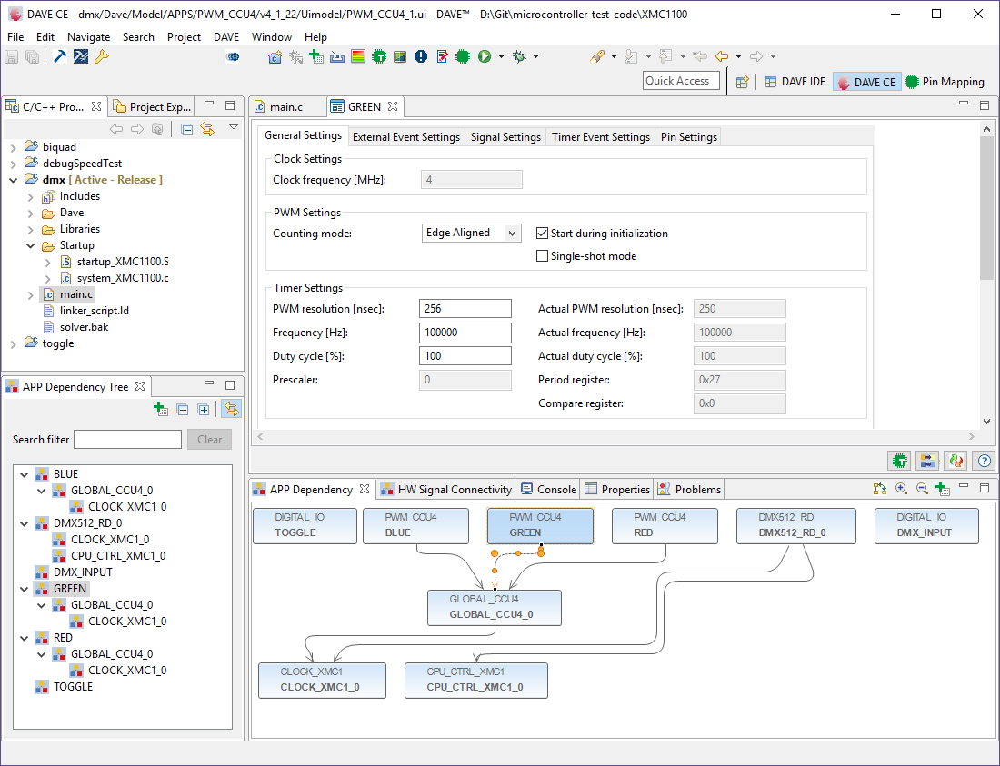
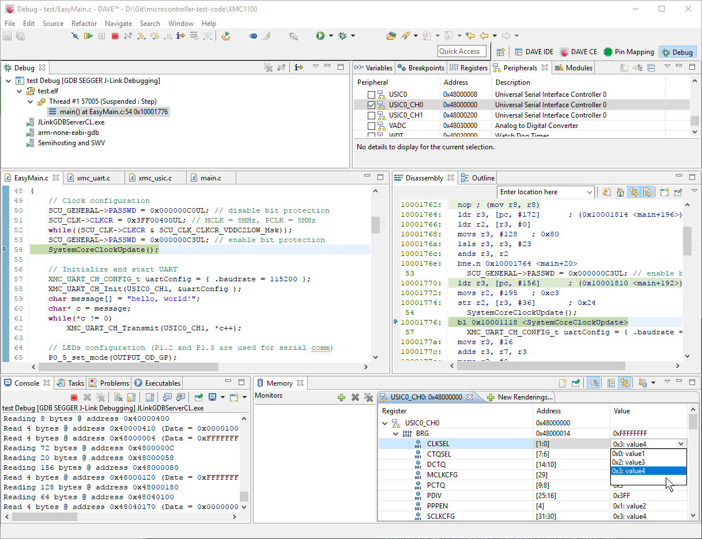
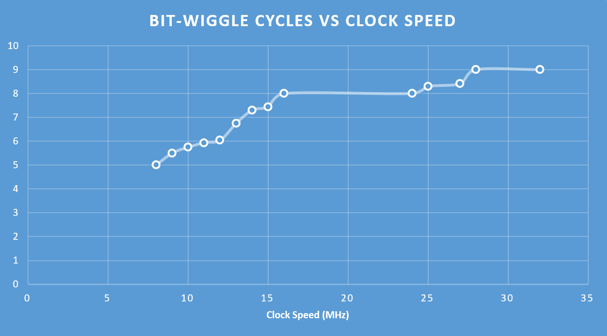
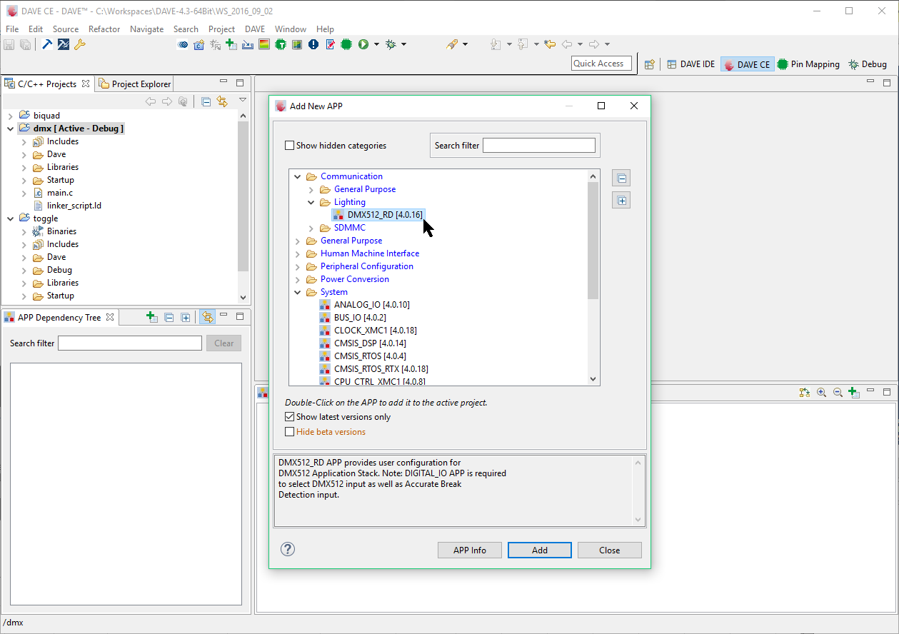

INFINEON
XMC-1100

https://jaycarlson.net/pf/infineon-xmc1100/


September 15, 2017  Microcontrollers  [7](https://jaycarlson.net/pf/infineon-xmc1100/#)

The XMC1000 series is Infineon’s entry-level Cortex-M0 microcontroller designed for industrial control applications. The XMC1000 was introduced in early 2013, making it one of the older Arm parts reviewed here.

Infineon distinguishes these parts from the run-of-the-mill Cortex-M0 microcontroller with some interesting peripherals across the family. The XMC1200 has a 9-channel logarithmic-brightness LED control module; the XMC1300 adds two hall/encoder counters and a math co-processor; and the XMC1400 adds dual CAN controllers and 16-channel capture compare unit.

Alas, I’m reviewing the base device — the XMC1100 — although the XMC1300 is often found only a few inches away from the $1 price point (and well under it when building in quantity).

Features:

- 32 MHz Cortex-M0
- 8 KB of flash, 16 KB of RAM
- 8 KB boot ROM with flexible boot options
- 1000 ksps 12-bit ADC with 6, 8 or 12 external pin channels (depending on package)
- Four capture-compare units with four channels of capture inputs each, and chaining support
- Two USIC universal serial modules — configurable as a transceiver for UART, LIN, SPI, I2C, as well as I2S.

You’ll notice the memory configuration for this device is backward — this part has 16 KB of RAM, which is four times more any other device tested. This makes the XMC1000 suitable for running code out of RAM for increased speed and lower power consumption.

All these devices come in both QFN packages, as well as TSSOP — all the way up to 38-pin — a somewhat-rare packaging option useful for lower-cost assembly processes (and hand-soldering hobbyists and professionals building prototypes).

# CORE & PERIPHERALS

The XMC1100 has an Arm Cortex-M0 — not the M0+ more commonly seen in modern parts.

The XMC1000 has a unique boot mode ROM system that provides a ton of different boot options without requiring a user-provided software bootloader. In addition to starting code from flash, the BMI system can load the user executable into SRAM from EEPROM, or CAN (if the device has a CAN transceiver).

It can also program flash from the UART, or perform debugging duties with either a two-wire SWD interface or a single-wire Infineon-specific DAP protocol. There’s also a protection mode that locks out the debugger

There are two oscillators: a 64 MHz DCO1 designed as the main oscillator; and a 32-kHz standby clock, DCO2. While the core can only run at 32 MHz, this 64 MHz signal can be used by the capture-compare timer unit.

## TIMERS

The XMC1000 series uses an arrayed capture/compare unit comprised of four identical CCU timer slices. Each timer slice provides a 16-bit auto-reload period timer, four separate capture registers (for a total of 16 independent capture inputs), and a compare register (for a single PWM or compare output).

The CCU has a few tricks up its sleeve: timer slices can be linked in pairs to form 32-bit timers; those two resulting 32-bit timers can link to form a 64-bit capture-compare unit, allowing extremely high-dynamic range captures.

With its 64 MHz maximum operating frequency into a 64-bit timer, you can time events at a precision of 15.625 nanoseconds that last up to 9134 years. While that may sound insanely unnecessary, consider a normal 16-bit timer would overflow after about a millisecond; a 32-bit timer after about 67 seconds; and a 48-bit timer after 51 days.

There’s also the usual control-friendly features you’d expect from a part like the XMC1000: center-aligned PWM, output gating from external signals, half-bridge control — plus a few features you wouldn’t: dithering PWM, modulation control, and tons of event lines for interrupts, ADC triggering, and other peripheral control.

## COMMUNICATIONS

The XMC1100 has a Universal Serial Interface Channel (USIC) module, which contains two channels able to operate independently in one of seven protocols: UART, LIN, SPI, I2C, as well as I2S. The USIC supports a massive 64-word FIFO buffer structure (that can be disabled for reduced latency) and has a unique Transmit Data Format (TDF) system that allows the CPU to pre-program the communication modes needed to complete entire transactions.

The UART has a minimum 4x sampling rate and supports up to 63 bits per frame — a highly unusual feature that should allow supporting many protocols that aren’t traditionally implemented with UART peripherals.

The IIC module supports master, multi-master, and slave I2C operation. The TDF system allows entire I2C transactions to commence without essentially any host involvement.

 

# DEVELOPMENT ECOSYSTEM

DAVE provides a static memory analyzer view that can show flash and RAM usage in a graphical view.

## DEVELOPMENT ENVIRONMENT

Infineon DAVE is the Eclipse-based IDE for the XMC line of microcontrollers. The current version of DAVE is based on Eclipse Luna SR2 (4.4.2). There are a few changes DAVE made to the stock version of Eclipse, and I think I like all them.

When you have multiple projects open in Eclipse, you’ve probably run into the situation where you’re jumping between same-named files, getting confused as to which one belongs to which project. DAVE will grey out text in files that don’t belong to the current project.

There are also dedicated project properties, build, and rebuild buttons.

Beyond that, there’s a static memory analyzer view that can inspect the size occupied by different symbols and functions in a flash image.

XMCLib, the runtime peripheral library for the XMC microcontrollers, provides basic routines but doesn’t attempt to duplicate the functionality of the DAVE code-gen tool.

 

## SDK

XMCLib is Infineon’s relatively high-level runtime peripheral library. The DAVE IDE provides an “Easy Start” project type that will automatically add all the required XMCLib library files to the new project. This may not seem noteworthy, but strangely, many Arm vendors don’t do this automatically — even from their own IDE. With the Infineon ecosystem, there’s no plug-ins to or extra SDKs to install, or weird web-based SDK generator tools — rather, XMCLib is built-in, and just works.

Where runtime peripheral libraries get clunky is with interrupt-driven callbacks. Here, code-gen tools work much better, as they can provide function stubs the user can fill in with his or her custom code. Infineon must have recognized this, and decided to keep XMCLib simple and lightweight, consequently, XMCLib doesn’t try to be everything to everyone.

The XMCLib communications libraries for the UART, I2C, and SPI use polling, and are limited to a single byte (or operation, in the case of I2C). Any interrupt operation has to be implemented manually by the user (though the NVIC obviously has its own peripheral libraries for making this easier).

The GPIO library uses fast, inlined functions that don’t require big config structures, which is nice for quick prototyping. The timer libraries probably require the most underlying knowledge of the architecture — but I still found them easy to use (as long as you’ve glanced at the data sheet and are familiar with the basic structure of the CCU).

Most importantly, Infineon did what so few Arm vendors seem comfortable doing: making the peripheral libraries holistic, instead of compartmentalizing them by peripheral. For example, the only configuration necessary to start using the UART is

1. XMC_UART_CH_CONFIG_t uartConfig = { .baudrate = 115200 }; 
2. XMC_UART_CH_Init(USIC0_CH1, &uartConfig );

Note that there’s no need to call into the GPIO peripheral for pin-muxing, or call into the SCU to gate the clock — the peripheral libraries do this for you.

Again, this seems basic enough, but many Arm vendors have far less-integrated libraries than XMCLib.

DAVE provides a property-based GUI code generator that integrates well into the IDE.

## DAVE APPS

DAVE Apps are GUI-configured high-level libraries that sit on top — and call into — XMCLib. Like most code-gen tools, there are DAVE Apps to configure communication peripherals, timers, analog and digital I/O, and the clock/power management system.

Unlike other code-gen tools, though, there are DAVE Apps built for special-purpose, application-level functions. For example, there are DAVE Apps for FOC motor control, power converters, DALI and DMX512 lighting, as well as human interfaces (touch and display interfacing).

## DEVELOPMENT TOOLS

Infineon has a cute [XMC2GO](https://www.infineon.com/cms/en/product/evaluation-boards/KIT_XMC_2GO_XMC1100_V1/productType.html?productType=db3a304443537c4e01436ccecb5d154f) dev board that’s [about $6 on DigiKey](https://www.digikey.com/product-detail/en/infineon-technologies/KITXMC2GOXMC1100V1TOBO1/KITXMC2GOXMC1100V1TOBO1-ND/4832815). If you want the full 38-pin device, you’ll have to splurge on the [$23 XMC11 Boot Kit](https://www.digikey.com/product-detail/en/infineon-technologies/KIT_XMC11_BOOT_001/KIT_XMC11_BOOT_001-ND/4946372).

Both dev kits have onboard debugging, courtesy of a USB full-speed XMC4200 running a SEGGER J-Link firmware image out-of-the-box.

This is a nice contrast to the USB HID-based CMSIS-DAP debuggers found in some other Arm dev boards.

DAVE provides a pretty typical Eclipse debugging environment, though the peripheral inspector doesn’t quite hit the mark with its clunky memory view rendering and the lack of enumeration values for multi-bit registers.

## DEBUGGING EXPERIENCE

Infineon DAVE provides a pretty typical Eclipse-based debugging. There’s built-in support for J-Link and CMSIS-DAP debuggers.

There’s a view for displaying peripheral registers; however, I found it to be extremely clunky and buggy. When you click the checkbox by the peripheral, I anticipated seeing a new view appear for that peripheral. Sometimes, this worked and a new rendering appeared in the Memory view; sometimes, this instead populated the “New Renderings…” view (without actually creating it). And sometimes…. it did nothing.

This really soured the debugging experience for me, as this is a core part of developing embedded projects.

With no caching mechanism on the XMC1100, the bit-wiggle clock-cycle count test continued increasing as clock speed was brought up. At 32 MHz, it takes 9 clock cycles — to execute two instructions that execute on the core in 5 cycles.

# PERFORMANCE

## GPIO TOGGLING

As the XMC1100 uses an older Cortex-M0 processor, a bit-wiggle should take 5 cycles — two for the GPIO toggle, and three for the branch instruction. However, at full speed (32 MHz), the XMC1100 required 9 clock cycles for this operation. After playing with the system clocking, I realized the XMC1100 doesn’t appear to have any sort of flash accelerator, and the chip seems to have extremely slow flash read speeds — above 8 MHz, the XMC1100 has to start inserting wait-states into its operation. The other Arm MCUs evaluated can read from the flash with zero wait-states at speeds up to 24 MHz, so the XMC1000 is at an obvious disadvantage.

Of course, running the code out of the spacious 16 KB of RAM would let this part achieve full speed, even when operating at the maximum 32 MHz clock speed. Running code out of RAM instead of flash has the other advantage of dramatically reducing power consumption, as we’ll see in the following section.

## BIQUAD

Running the biquad filter out of flash, the XMC1100 brings in rather unimpressive numbers when compared to other Arm processors in the round-up; the lack of a flash caching mechanism penalized this 32 MHz core so badly that it performed at less than half the speed of the 48 MHz Arm cores tested, making it look more like a 24 MHz chip. Drawing 4.26 mA with an 805 ksps biquad processing rate put it toward the bottom side of ARM competitors.

However, as mentioned before, this chip seems built to run code out of RAM. Simply decorate your main() function with:

```
__attribute__ 1%MINIFYHTMLa1feecd56aa073359335afc9bb9d185423%)
```

and reap the benefits of RAM execution: 27 clocks per sample (one of the fastest in our round-up), and 2.90 mA active current (the lowest in our roundup). With one attribute addition, the XMC1100 just went from a below-average student to the leader in the pack, with an impressive 8.03 nJ/sample.

**Is this cheating?** Infineon’s DAVE tool actually has a DMX-512 “DAVE App” receiver that works out-of-the-box.

## DMX-512 RECEIVER

DAVE has a built-in DMX-512 receiver APP you can add to any project. This gave me an opportunity to experiment with these high-level applications, and I really enjoyed it. The code generator tool allowed me to name a callback function I wished to use whenever a DMX packet had been successfully received; this call was statically compiled into the APP code. In it, I inserted three PWM duty-cycle function calls, and the project was complete.

While many people worry about bogged-down, bloated generated code and peripheral libraries, that couldn’t be further from the case: the Infineon DAVE code executed in 72 cycles — the fewest of any Arm part reviewed (code-generated or not). It also used the fewest amount of flash memory of any Arm controller: occupying 2680 bytes.

This part is not designed for low-power prowess, and its current-consumption numbers disappoint a bit, unfortunately: the device pulled in 1.39 mA. This was because of the relatively-fast 4.5 MHz oscillator speed caused by limited clock-divider options.

# BOTTOM LINE

Infineon is known for heavy-duty, automotive microcontrollers (that come with a hefty price tag). They’ve dipped their toes in the entry-level Cortex-M0 market and came up with the XMC1000 series — a great microcontroller for basic control applications.

The XMC1100 has unique, interesting peripherals that set it apart from the pack. A unique communication peripheral enables highly-automated handling of complex transactions with little to no CPU intervention. The timer unit — while limited to four PWM channels — has an ample 16-channel capture ability, and supports up to 64-bit-wide extension by combining units together. Plus, the 16 KB RAM capacity — even on the entry-level devices — gives you ample space to execute code from RAM when power or performance are critical.

For professionals and hobbyists looking to get up and running quickly, DAVE provides a compelling environment for quickly building lighting controls, motor drivers, and other industrial and controls applications. While some indie developers and hobbyists will scoff at the lack of support for macOS and Linux from DAVE (the only Eclipse-based IDE I reviewed that was Windows-only).

But because DAVE calls into XMCLib, people with allergies to code-gen tools can skip over DAVE and head straight to one of the easiest-to-use Arm peripheral libraries reviewed here.

Rounding up the XMC1000’s strengths are its low-cost dev boards and easy-to-solder 0.65mm TSSOP packages.