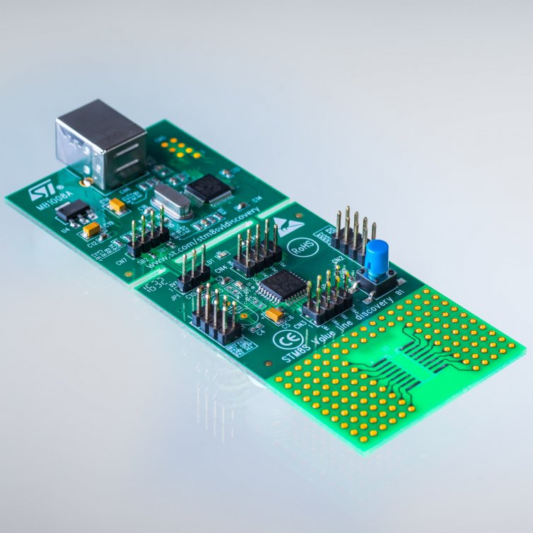
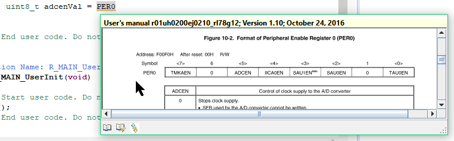

>This repo is intended to be used as a space for translating Jay Carlson's wonderful articles about the amazing $1 microcontrollers into Chinese language.

>Every single post is written in markdown format and Chinese verion will be created indepenently.


#THE AMAZING $1 MICROCONTROLLER

A new series that explores 21 different microcontrollers — all less than $1 — to help familiarize you with all the major ecosystems out there.

As an embedded design consultant, the diverse collection of projects on my desk need an equally-diverse collection of microcontroller architectures that have the performance, peripheral selection, and power numbers to be the backbone of successful projects. At the same time, we all have our go-to chips — those parts that linger in our toolkit after being picked up in school, through forum posts, or from previous projects.

In 2017, we saw several new MCUs hit the market, as well as general trends continuing in the industry: the migration to open-source, cross-platform development environments and toolchains; new code-generator tools that integrate seamlessly (or not so seamlessly…) into IDEs; and, most notably, the continued invasion of ARM Cortex-M0+ parts into the 8-bit space.

I wanted to take a quick pulse of the industry to see where everything is — and what I’ve been missing while backed into my corner of DigiKey’s web site.

It’s time for a good ol’ microcontroller shoot-out.

# THE RULES

While some projects that come across my desk are complex enough to require a hundreds-of-MHz microcontroller with all the bells and whistles, it’s amazing how many projects work great using nothing more than a $1 chip — so this is the only rule I established for this microcontroller review. 1

I wanted to explore the $1 pricing zone specifically because it’s the least amount of money you can spend on an MCU that’s still general-purpose enough to be widely useful in a diverse array of projects.

Any cheaper, and you end up with 6- or 8-pin parts with only a few dozen bytes of RAM, no ADC, nor any peripherals other than a single timer and some GPIO.

Any more expensive, and the field completely opens up to an overwhelming number of parts — all with heavily-specialized peripherals and connectivity options.

These MCUs were selected to represent their entire families — or sub-families, depending on the architecture — and in my analysis, I’ll offer some information about the family as a whole.

If you want to scroll down and find out who the winner is, don’t bother — there’s really no sense in trying to declare the “king of $1 MCUs” as everyone knows the best microcontroller is the one that best matches your application needs. I mean, everyone knows the best microcontroller is the one you already know how to use. No, wait — the best microcontroller is definitely the one that is easiest to prototype with. Or maybe that has the lowest impact on BOM pricing?

I can’t even decide on the criteria for the best microcontroller — let alone crown a winner.

What I will do, however, is offer a ton of different recommendations for different users at the end. Read on!

# THE CRITERIA

This microcontroller selection guide will have both qualitative and quantitative assessments. Overall, I’ll be looking at a few different categories:

## PARAMETRICS, PACKAGING, AND PERIPHERALS

Within a particular family, what is the range of core speed? Memory? Peripherals? Price? Package options?

**Some microcontroller families are huge** — with hundreds of different models that you can select from to find the perfect MCU for your application. Some families are much smaller, which means you’re essentially going to pay for peripherals, memory, or features you don’t need. But these have an economies-of-scale effect; if we only have to produce five different MCU models, we’ll be able to make a lot more of each of them, driving down the price. How do different MCU families end up on that spectrum?

**Package availability** is another huge factor to consider. A professional electronics engineer working on a wearable consumer product might be looking for a wafer-level CSP package that’s less than 2×2 mm in size. A hobbyist who is uncomfortable with surface-mount soldering may be looking for a legacy DIP package that can be used with breadboards and solder protoboards. Different manufacturers choose packaging options carefully, so before you dive into an architecture for a project, one of the first things to consider is making sure that it’s in a package you actually want to deal with.

**Peripherals** can vary widely from architecture to architecture. Some MCUs have extremely powerful peripherals with multiple interrupt channels, DMA, internal clock generators, tons of power configuration control, and various clocking options. Others are incredibly simple — almost *basic*. Just as before, different people will be looking for different things (even for different applications). It would be a massive undertaking to go over every single peripheral on these MCUs, but I’ll focus on the ones that all MCUs have in common, and point out fine-print “gotchas” that datasheets always seem to glance over.

## DEVELOPMENT EXPERIENCE

Any microcontroller review or selection guide should include a discussion of the overall development environment and experience.

While this is where things get subjective and opinion-oriented, I’ll attempt to present “just the facts” and let you decide what you care about. The main source of subjectivity comes from *weighing* these facts appropriately, which I will not attempt to do.

**IDEs / SDKs / Compilers:** What is the manufacturer-suggested IDE for developing code on the MCU? Are there other options? What compilers does the microcontroller support? Is the software cross-platform? How much does it cost? These are the sorts of things I’ll be exploring while evaluating the software for the MCU architecture.

Platform functionality and features will vary a lot by architecture, but I’ll look at basic project management, source-code editor quality, initialization code-generation tools, run-time peripheral libraries, debugging experience, and documentation accessibility.

I’ll focus on manufacturer-provided or manufacturer-suggested IDEs and compilers (and these will be what I use to benchmark the MCU). There are more than a dozen compilers / IDEs available for many of these architectures, so I can’t reasonably review all of them. Feel free to express your contempt of my methodology in the comments section.

**Programmers / debuggers / emulators / dev boards:** What dev boards and debuggers are available for the ecosystem? How clunky is the debugging experience? Every company has a slightly different philosophy for development boards and debuggers, so this will be interesting to compare.

## PERFORMANCE

I’ve established three different code samples I’ll be using to benchmark the parts in this microcontroller review; I’ll be measuring quantitative parameters like benchmark speed, clock-cycle efficiency, power efficiency, and code-size efficiency.

### WHILE(1) BLINK

For this test, I’ll toggle a pin in a `while()` loop. I’ll use the fastest C code possible — while also reporting if the code generator tool or peripheral libraries were able to produce efficient code. I’ll use bitwise complement or GPIO-specific “toggle” registers if the platform supports it, otherwise, I’ll resort to a read-modify-write operation. I’ll report on which instructions were executed, and the number of cycles they took.

**What this tests:** This gives some good intuition for how the platform works — because it is so low-level, we’ll be able to easily look at the assembly code and individual instruction timing. Since many of these parts operate above flash read speed, this will allow us to see what’s going on with the flash read accelerator (if one exists), and as a general diagnostic / debugging tool for getting the platform up and running at the proper speed. This routine will obviously also test bit manipulation performance (though this is rarely important in general-purpose projects).

### 64-SAMPLE BIQUAD FILTER

This is an example of a real-world application where you often need good, real-time performance, so I thought it would be a perfect test to evaluate the raw processing power of each microcontroller. For this test, I’ll process 16-bit signed integer data through a 400 Hz second-order high-pass filter (Transposed Direct Form II implementation, for those playing along at home), assuming a sample rate of 8 kHz. We won’t *actually* sample the data from an ADC — instead, we’ll process 64-element arrays of dummy input data, and record the time it takes to complete this process (by wiggling a GPIO pin run into my [500 MHz Saleae Logic Pro 16 logic analyzer](https://www.saleae.com/)).

In addition to the samples-per-second measure of raw processing power, I’ll also measure power consumption, which will give us a “nanojoule-per-sample” measure; this will help you figure out how *efficient* a processor is. While I’ve traditionally used [µCurrent](https://www.eevblog.com/projects/ucurrent/) units for this, I ended up using a [Silicon Labs EFM8 Sleepy Bee STK](https://www.silabs.com/products/development-tools/mcu/8-bit/slstk2010a-efm8-sleepy-bee-starter-kit) — I ripped the target processor off the board, turning it into a $30 time-domain logarithmic power meter. If you’re interested in more information, check out my [EFM8](https://jaycarlson.net/pf/silicon-labs-efm8/) review, which has the details of these excellent tools.

**What this tests:** Memory and 16-bit math performance per microamp, essentially. The 8-bit MCUs in our round up are going to struggle with this pretty hardcore — it’ll be interesting to see just how much better the 16 and 32-bit MCUs do. Like it or hate it, this will also evaluate a compiler’s optimization abilities since different compilers implement math routines quite differently.

### DMX-512 RGB LIGHT

DMX-512 is a commonly-used lighting protocol for stage, club, and commercial lighting systems. Electrically, it uses RS-485; the protocol uses a long BREAK message at the beginning, followed by a “0” and then 511 bytes of data, transmitted at 250 kbaud. In this test, I’ll implement a DMX-512 receiver that directly drives a common-anode RGB LED. I will do this with whatever peripheral library or code-generator tool the manufacturer provides (if any at all).

While you should really look for a precisely-timed break message, since this is only for prototyping, I’ll detect the start-of-frame by looking for an RX framing error (or a “break” signal, as some UARTs support LIN).

I’ll minimize power consumption by lowering the frequency of the CPU as much as possible, using interrupt-based UART receiver routines, and halting or sleeping the CPU. I’ll report the average power consumption (with the LED removed from the circuit, of course). To get a rough idea of the completeness and quality of the code-generator tools or peripheral libraries, I’ll report the total number of statements I had to write, as well as the flash usage.

**What this tests:** This is a sort of holistic test that lets me get into the ecosystem and play around with the platform. This stuff is the bread and butter of embedded programming: interrupt-based UART reception with a little bit of flair (framing error detection), multi-channel PWM configuration, and nearly-always-halted state-machine-style CPU programming. Once you have your hardware set up and you know what you’re doing (say, after you’ve implemented this on a dozen MCUs before…), with a good code-gen tool or peripheral library, you should be able to program this with just a few lines of code in an hour or less — hopefully without having to hit the datasheet much at all.

**Test notes:** I’m using [FreeStyler](http://freestylerdmx.be/) to generate DMX messages through an FTDI USB-to-serial converter (the program uses the [Enttec Open DMX](https://www.enttec.com/us/products/controls/dmx-usb/open-dmx-usb/) plugin to do this). As my FTDI cable is 5V, I put a 1k resistor with a 3.3V zener diode to to ground, which clamps the signal to 3.3V. The zener clamp isn’t there to protect the MCU — all of these chips tested have diode catches to protect from over-voltage — but rather, so that the MCU doesn’t inadvertently draw power from the Rx pin, which would ruin my current measurement results.

# EVALUATION CODE

All code I used to evaluate these parts in this microcontroller selection guide is available on my [microcontroller-test-code GitHub repo](https://github.com/jaydcarlson/microcontroller-test-code). Check it out, fork it, submit patches, and keep me honest — if your results differ from mine, let’s get this post updated.


THE CONTENDERS

This page will compare the devices, development tools, and IDEs all together. However, to prevent this article from getting overwhelmingly long, I’ve created review pages for each device that cover way more details about the architecture — along with more complete testing notes, different benchmarking variations, and in-depth assessment. If an architecture strikes your interest, you should definitely check out the full review below.


ATMEL TINYAVR


Part: ATtiny1616
The new-for-2017 tinyAVR line includes seven parts with XMEGA-style peripherals, a two-cycle 8×8 multiplier, the new UPDI one-wire debug interface, and a 20 MHz oscillator that should shoot some energy into this line of entry-level AVR controllers that was looking quite long in the tooth next to other 8-bit parts.


ATMEL MEGAAVR


Part: ATmega168PB
The AVR earned its hobbyist-friendly badge as the first MCU programmed in C with open-source tools. The “B” version of the classic ATmega168 takes a price cut due to a die-shrink, but little else has changed, including the anemic 8 MHz internal oscillator — and, like the tinyAVR, must sip on 5V to hit its full 20 MHz speed.


ATMEL SAM D10


Part: ATSAMD10D14A
Atmel is positioning their least-expensive ARM Cortex-M0 offering — the new SAM D10 — to kill off all but the smallest TinyAVR MCUs with its performance numbers, peripherals, and price. Stand-out analog peripherals capstone a peripheral set and memory configuration that endows this part with good value.


CYPRESS PSOC 4000S


Part: CY8C4024LQI
Reconfigurable digital logic — the PSoC’s claim to fame — is absent from this entry-level 24 MHz Arm part that also sports average analog features, and no support for Cypress’s handy “it just works” capacitive-touch hardware. Other than its unique development environment, this part treads water in a sea of low-cost ARM devices.


FREESCALE KE04


Part: MKE04Z8VTG4
Freescale introduced the Arm Cortex-M0 KE04 to kill off 8-bit MCUs — and with 2.7-5.5V support, tons of timers and analog options, it’s a step in that direction. Processor Expert provides a unique development experience for rapid-prototyping, which may be enough to lure some developers away from newer parts.


FREESCALE KL03


Part: MKL03Z8VFG4
While the KE series attacks the 8-bit sector with bells and whistles, the KL series focuses on being some of the lowest-power Arm parts on the market, with good low leakage performance in sleep mode. I’m testing this 48 MHz Arm part inside of NXP’s MCUXpresso, which recently added support for the newer Kinetis devices.


HOLTEK HT-66


Part: HT66F0185
A basic 8-bit microcontroller with a slow, 4-cycle PIC16-style single-accumulator core. An anemic peripheral selection and limited memory capacity makes this a better one-trick pony than a main system controller. Holtek has a wide range of application-specific MCUs that integrate this core with HV power and other goodies.


INFINEON XMC1100


Part: XMC1100T016X0016
Infineon Arm chips are common picks for control projects, and the new XMC1100 is no different. With 16K of RAM, a 1 MSPS six-channel ADC, flexible communications, up to 16 timer capture channels, and the ability to form a 64-bit timer for large-range timing gives this part a bit of personality among entry-level Cortex-M0 microcontrollers.


MICROCHIP PIC16


Part: PIC16LF18325
Vying with the 8051 as the most famous microcontroller of all time, the latest PIC16 Five-Digit Enhanced parts feature improved peripheral interconnectivity, more timers, and better analog. Still driven by a sluggish core that clambers along at one-fourth its clock speed, the PIC16 has always been best-suited for peripheral-heavy workloads.


MICROCHIP PIC24


Part: PIC24F04KL100
An expensive 16-bit part that’s designed (and priced) to mirror the MSP430. While it has decent performance and power consumption, it’s hard not to look toward other parts — especially the PIC32MM — which offer better pricing, and can beat the PIC24 at everything other than deep-sleep current consumption.


MICROCHIP PIC32MM


Part: PIC32MM0064
The 32-bit MIPS-powered PIC32MM compares similarly with ARM controllers on a per-cycle basis, but doesn’t provide the same flexibility with tooling that ARM does. It’s a great part for 32-bit beginners, though, as it brings along PIC18/PIC24-style peripherals and fuse-based configuration, easing development.


NUVOTON N76


Part: N76E003AT20
The N76 is a 1T-style 8051 that brings a few twists and useful additions to the basic set of ’51 peripherals. This MCU has a slower instruction timing versus the EFM8 or STC8, but it’s hard to complain about a well-documented, fully-featured MCU with North American support that you can buy with East Asia pricing.


NUVOTON M051


Part: M052LDN
The M051 series is a high-value, 50 MHz Cortex-M0 with excellent timers and comms peripherals, a coherent, easy-to-use functional-oriented peripheral library, a relatively high pin-count, and utilitarian dev tools. The Achilles’ heel is the somewhat-limited IDE options, buggy software, and gross power consumption figures.


NXP LPC811


Part: LPC811M001JDH16
The LPC81x is famous among hobbyists for the LPC810 — an 8-pin DIP-package MCU. For everyone else, the LPC81x is an older, forgettable 30 MHz ARM that’s short on peripherals (it doesn’t even have an ADC). An easy-to-use function-oriented peripheral library, serial loader, and plenty of code examples on blog posts keep this part alive.


RENESAS RL-78


Part: R5F102A8ASP
With the RL-78, Renesas built a clever hybrid MCU with an 8-bit-wide data path and a 16-bit-wide ALU, balancing cost and performance. Excellent low-power consumption, arrayed comms and timer peripherals, plus a good code-gen tool built into the free Eclipse IDE makes this part a strong competitor against the PIC24 and MSP430.


SANYO LC87


Part: LC87F1M16
There’s not much to like in the LC-87. Abysmal power consumption, lackluster peripherals, unfriendly pricing, and an obnoxiously antiquated development ecosystem should steer away almost any rational person from this architecture that, from the copyright dates on the development tools, looks to be headed to the grave.


SILICON LABS EFM8


Part: EFM8LB11
The EFM8 Laser Bee is a snappy 72 MHz 8051 MCU that’s both the fastest 8-bit MCU in our round-up, as well as one of the lowest-power. Low-cost tools, a free cross-platform Eclipse-based IDE, and a slew of easy-to-program peripherals should get both professionals and hobbyists interested in exploring this platform.




ST STM8


Part: STM8S103F3P6
The STM8 feels like an ARM in disguise: a 32-bit-wide program memory bus with efficient compute performance, peripheral power gating, and a nested vector interrupt controller makes this thing look more like its STM32 big brothers. If only its STVD development environment felt as modern as its peripheral set does.


ST STM32F0


Part: STM32F030F4P6
While the F0 has an average peripheral set and worse-than-average power consumption, its low-cost ST-Link debugger, free IDE, good code-gen tools, and huge parametric latitude (up to the 180 MHz, 2 MB STM32F4) make this a useful family to learn — plus everyone seems to have an STM32 Discovery board laying around.


STCMICRO STC8


Part: STC8A8K64S4A12
A brand-new, single-cycle 8051 jam-packed full of flash, RAM, and oodles of peripherals — and a large, 64-pin package to make use of all these guts. Unfortunately, this part isn’t quite ready for prime-time: the datasheet hasn’t been translated into English yet, the errata is massive, and there’s limited availability of the part.


TI MSP430


Part: MSP430FR2111
Texas Instruments dials down the power consumption in the latest iteration of the MSP430. FRAM memory, flexible power states, and tons of internal clocking options make this part a battery’s dream come true. You’ll pay for this power, though: the MSP430 can be twice as expensive as many 8-bit parts.


SPECS COMPARISON

# CORE

Microcontrollers continue to divide into two camps — those with vendor-specific core architectures, and those who use a third-party core design. Out of the 21 microcontrollers reviewed here, eight of them use a 32-bit ARM core, which is becoming ubiquitous in the industry — even at this price point. Three of the microcontrollers use an 8-bit 8051-compatible ISA. The remaining ten use the vendor’s proprietary core design: six are 8-bit parts, three are 16-bit parts, and the [PIC32MM](https://jaycarlson.net/pf/microchip-pic32mm/) is the sole 32-bit part that doesn’t use an ARM core.

## AVR

The AVR core is a famous RISC design known for its clock-cycle efficiency — especially at the time it was introduced in 1997. I reviewed two microcontrollers with an AVR core — the [tinyAVR 1-Series](https://jaycarlson.net/pf/atmel-microchip-tinyavr-1-series/) and the [megaAVR](https://jaycarlson.net/pf/atmel-microchip-megaavr/).

The specific AVR instruction set and timing for both parts I reviewed is known as “AVRe” — this instruction set includes a two-cycle multiply and many single-cycle operations. Note that tinyAVR parts prior to the [tinyAVR 1-Series](https://jaycarlson.net/pf/atmel-microchip-tinyavr-1-series/) are essentially completely different MCUs with a less-capable AVR core that has no multiplier.

The AVR core has a 16-bit instruction fetch width; most instructions are 16 bits wide; some are 32. Still, this is a RISC architecture, so the instruction set is anything but orthogonal; while there are 32 registers you can operate with, there are very few instructions for working directly with RAM; and of those 32 registers, I’d say that only 16 of them are true “general purpose” registers, as R0-R15 can’t be used with all register operations (load-immediate probably being the most important).

All things said, though, AVR offered a huge performance improvement over the 12-cycle or 6-cycle 8051 processors when AVR was first introduced — and the AVR is always faster than even modern 8051 derivatives when it comes to working with large arrays of data that must be stored in extended (16-bit) RAM on the 8051.

It was also designed for C compilers, too — with 32 registers available at all times, compilers can efficiently juggle around many operands concurrently; the 8051, by comparison, has four banks of eight registers that are only easily switched between within interrupt contexts (which is actually quite useful).

And interrupts are one of the weak points of the AVR core: there’s only one interrupt priority, and depending on the ISR, many registers will have to be pushed to the stack and restored upon exit. In my testing, this often added 10 PUSH instructions or more — each taking 2 cycles.

Another issue with AVR is the generally slow clock speed — even the high-end XMEGA AVR parts can only run at up to 32 MHz, with both the parts reviewed here topping out at 20 MHz. Compare that to the [EFM8](https://jaycarlson.net/pf/silicon-labs-efm8/), of which is many varieties run at 48 MHz or higher (like the 72 MHz Laser Bee I reviewed). Even a 50%-better clock cycle efficiency doesn’t help much when the competition runs almost four times faster than the AVR.

## MICROCHIP PIC16

There’s something fundamentally goofy about almost all aspects of the [PIC16](https://jaycarlson.net/pf/microchip-pic16-five-digit-enhanced/) that make it seem, at first glance, completely bizarre that it is as popular as it is.

PIC16 uses an odd-ball 14-bit-wide program memory, yet it’s an 8-bit machine. This dramatically simplifies the core architecture: a 14-bit word can hold just enough data to specify every CPU instruction — with enough free space left in the word to address up to 128 registers or 2K of program memory (for the two jump/call routines).

Microchip calls the PIC16 a RISC machine since every PIC instruction (there’s just 49 of them) is precisely one word long2. The PIC16 is often described as a 4T architecture — taking 4 clock cycles to execute a single machine instruction. This isn’t *entirely* true, as the PIC16 takes an additional 4 cycles to *fetch* that instruction. Consequently, it’s actually an 8T machine, though it implements a pipeline scheme that allows each instruction to execute in 4 cycles — except jumps, which take 8.

Since real MCUs have more than 128 bytes of registers and 2K of program memory, this PIC has a bank selection register (BSR), which is written to whenever you need to swap banks (which happens *a lot*).

The PIC16 is a single-register machine, and that register is named *W*. Everything you do will essentially be moving *something* into W, doing *something* with it, and then moving it back to *somewhere*. Consequently, programming it in assembly is easy, and downright fun.

Because this part can store 8192 14-bit program words, Microchip will tell you this part has 14 KB of flash (close to 16 KB, right?), but users will tell you that it has 8K of program memory — 8192 *words* of memory — since storing an 8192-element byte array will occupy all 14 KB of its flash memory. Keep this in mind when comparing memory.

I have a longer write-up of PIC16 in the [main PIC16 article](https://jaycarlson.net/pf/microchip-pic16-five-digit-enhanced/).

## MICROCHIP PIC24

While the PIC10, 12, 16, and 18 are all 8-bit cores with 12-16 bit program memory, the PIC24 moves up to 16-bit data operated through 24-bit instructions (are you starting to catch onto the numbering system?)

While all the PICs before it were 4T machines, the [PIC24](https://jaycarlson.net/pf/microchip-pic24/) is 2T — that is, two clock cycles per instruction cycle.

The PIC24 has new indirect addressing modes that allow incrementing/decrementing and register-offset addressing, has a few more other instructions, and has three — instead of two — hardware breakpoints; but otherwise, the core is very much in the spirit of the [PIC16](https://jaycarlson.net/pf/microchip-pic16-five-digit-enhanced/).

The [PIC24](https://jaycarlson.net/pf/microchip-pic24/) carries the excellent power consumption figures that the [PIC16](https://jaycarlson.net/pf/microchip-pic16-five-digit-enhanced/) has, but many of the parts lack the clocking and oscillator options the [MSP430](https://jaycarlson.net/pf/texas-instruments-msp430fr/) has (and apples-to-apples, the MSP430 is lower-power).

The dsPIC versions of these parts — which add DSP-friendly instructions — are popular for motor drivers, but it’s not clear that the PIC24 has more widely been the runaway success Microchip had hoped.

## MICROCHIP PIC32

While everyone was migrating their 8-bit proprietary cores to Arm, Microchip was gleefully popping out PIC parts. But in 2007, they finally decided to add a new microcontroller — the [PIC32](https://jaycarlson.net/pf/microchip-pic32mm/) — which uses a third-party, industry-standard 32-bit core. Instead of following everyone to the Arm ecosystem, they took a different turn: PIC32 parts use the MIPS architecture — specifically the M4K core.

MIPS built this core for single-chip MCU applications. M4K has 32 registers, a 5-stage pipeline, vectored interrupts and exceptions, bit-manipulation, and 16-bit instruction encoding support.

It is not the same as an Arm processor, but at the C application level, they are similar enough that any Arm developer should have no problems (other than the usual manufacturer-to-manufacturer peripheral differences).

You can program and debug the PIC32 using the same PGC/PGD/MCLR set-up you use on all other PIC parts — but there’s also support for JTAG, though the most popular JTAG debugger — the Segger J-Link — has limited support for the PIC32MX parts, and no support for the PIC32MM.

## ARM CORTEX-M0

The Arm Cortex-M0 3is a 32-bit RISC architecture that serves as the entry-level Arm architecture available to silicon vendors for microcontroller applications. Arm cores are designed by [Arm Holdings](https://www.arm.com/) and licensed to semiconductor manufacturers for integration into their products.

Arm started out as a personal computer microprocessor when Advanced RISC Machines formed a joint venture between Acorn, Apple, and VLSI Technology to manufacture 32-bit processors for the Acorn computer. While Arm cores have grown in popularity as microprocessors for battery-powered systems (they are almost certainly powering your smartphone), Arm moved into the microcontroller sphere as well — the ARM7TDMI-S was probably the first Arm core that was used in microcontrollers — i.e., processors with completely self-contained RAM, flash, and peripherals. The Atmel AT91 and ST STR7 were probably the first microcontroller parts designed with an Arm core.

It’s important to understand the history of Arm because it explains a serious feature of Arm microcontrollers that differs substantially from the 8051 (the other multi-vendor architecture that dominates the field): Unlike the 8051, Arm is just a core, not a complete microcontroller.

The ARM7TDMI-S didn’t come with any GPIO designs, or provisions for UARTs or ADCs or timers — it was designed as a microprocessor. Thus, as vendors started stuffing this core into their extremely high-end MCUs, they had to add in their vendor-specific peripherals to the AHB (AMBA4High-performance Bus).

Consequently, Freescale used a lot of HC08 and ColdFire peripherals; while Atmel designed new peripherals from scratch. ST borrowed a bit from the ST7 (the precursor to the [STM8](https://jaycarlson.net/pf/st-stm8/)) but used new designs for timers and communications peripherals.

Since many microcontroller projects spend 90% or more of the code base manipulating peripherals, this is a serious consideration when switching from one Arm MCU vendor to another: there’s absolutely zero peripheral compatibility between vendors, and even within a single vendor, their Arm parts can have wildly different peripherals.

Unlike other Arm parts, the M0 series only supports a subset of the 16-bit Thumb instruction set, which allows it to be about 1/3 the size of a Cortex-M3 core. Still, there’s a full 32-bit ALU, with a 32-bit hardware multiplier supporting a 32-bit result. Arm provides the option of either a single-cycle multiply, or a 32-cycle multiply instruction, but in my browsing, it seems as though most vendors use the single-cycle multiply option.

In addition to the normal CPU registers, Arm cores have 13 general-purpose working registers, [which is roughly the sweet spot](http://researchbank.rmit.edu.au/eserv/rmit:2517/n2001000381.pdf). The core has a nested vector interrupt controller, with up to 32 interrupt vectors and 4 interrupt priorities — plenty when compared to the 8-bit competition, but a far cry from the 240 interrupts at 256 interrupt priorities that the larger Arm parts support. The core also has full support for runtime exceptions, which isn’t a feature found on 8-bit architectures.

The M0+ is an improved version of the M0 that supports faster two-cycle branches (due to the pipeline going from three-stage to two-stage), and lower power consumption. There are a slew of silicon options that vendors can choose from: single-cycle GPIO, support for a simple instruction trace buffer called Micro Trace Buffer (MTB), vector table relocation, and a rudimentary memory protection unit (MPU).

One of the biggest problems with ARM microcontrollers is their low code density for anything other than 16- and 32-bit math — even those that use the 16-bit Thumb instruction set. This means normal microcontroller type routines — shoving bytes out a communication port, wiggling bits around, performing software ADC conversions, and updating timers — can take a lot of code space on these parts. Exacerbating this problem is the peripherals, which tend to be more complex — I mean “flexible” — than 8-bit parts, often necessitating run-time peripheral libraries and tons of register manipulation.

Another problem with ARM processors is the severe 12-cycle interrupt latency. When coupled with the large number of registers that are saved and restored in the prologue and epilogue of the ISR handlers, these cycles start to add up. ISR latency is one area where a 16 MHz 8-bit part can easily beat a 72 MHz 32-bit Arm microcontroller.

## 8051

The 8051 was originally an Intel microcontroller introduced in 1980 as one of the first widely-deployed 8-bit parts. The 8-bit modified Harvard core has a fully-orthogonal variable-length CISC instruction set, hardware multiplier and hardware divider, bit-addressable RAM and specific bit-manipulation instructions, four switchable banks of eight registers each,  two-priority interrupt controller with automatic register bank-switching, 64 KB of both program and extended RAM addressability, with 128 bytes of “scratch pad” RAM accessible with fast instructions.

The 8051 was actually a specific *part* — not a family — but its name is now synonymous with the core architecture, peripherals, and even package pin-out 5.

The original had 4K of ROM 6, 128 bytes of RAM, four full 8-bit GPIO ports (32 I/O total), a UART, two or three timers, and a two-priority interrupt system.

The 8051 has a fully orthogonal CISC instruction set, which means you can do nearly any operation with immediate, direct, or indirect operands, and you can do these operations in RAM, registers, or the A accumulator.

Many vendors built direct, drop-in compatible clones of the 8051, and by the time Intel discontinued its MCS-51 products in 2007, barely anyone noticed — these third-party parts evolved from mimicking Intel functionality to outright beating them with tons of additional timers, peripherals, and special-purpose functionality.

Because of its small core and fast interrupt architecture, the 8051 architecture is extremely popular for managing peripherals used in real-time high-bandwidth systems, such as USB web cameras and audio DSPs, and is commonly deployed as a house-keeping processor in FPGAs used in audio/video processing and DSP work.

Old-timers associate the 8051 with “old and slow” because the original was a 12T microcontroller — each machine cycle took 12 clock cycles to complete. Since there was no pipelining, every instruction byte took a machine cycle to fetch, plus one or more additional machine cycles to execute — altogether, it could take more than 50 clock cycles to execute a given instruction. Ouch.

No need to worry about that anymore, though: all the modern 8051-style MCUs available are 1T processors, and many of them have a pipelined core, meaning many instructions take the same number of clock cycles to execute as the instruction’s length. Consequently, in many 8051 implementations, operations in A (the accumulator) are the fastest, followed by the register bank, and then RAM.

I ended up with three different 8051-compatible microcontrollers end the lineup: the [Nuvoton N76](https://jaycarlson.net/pf/nuvoton-n76/), the [Silicon Labs EFM8 Laser Bee](https://jaycarlson.net/pf/silicon-labs-efm8/), and the [STCmicro STC8](https://jaycarlson.net/pf/stcmicro-stc8/).

From a pure core design standpoint, the [STC8](https://jaycarlson.net/pf/stcmicro-stc8/) is probably the most interesting — while I can’t find documentation to confirm this, it appears that STCmicro uses a 24-bit (or more) parallel instruction-fetch size. This means that a huge number — more than 80% — of instructions can be executed in a single cycle, which is a substantial step up from all other 8051s on the market these days.

However, the [EFM8](https://jaycarlson.net/pf/silicon-labs-efm8/), from Silicon Labs’ C8051 lineage, can hit much higher clock speeds — topping out at 72 MHz — making it the fastest part I reviewed, by core speed.

I’ll be looking more at this in the performance section of the review.

## STM8

The [STM8](https://jaycarlson.net/pf/st-stm8/) core has six CPU registers: a single accumulator, two index registers, a 24-bit program counter, a 16-bit stack pointer, and a condition register. The STM8 has a Harvard architecture, but uses a unified address space. There’s a 32-bit-wide program memory bus which can fetch most instructions in a single cycle — and pipelined fetch/decode/execute operations permit many instructions to execute in a single cycle.

The claim to fame of the core is its comprehensive list of 20 addressing modes, including indexed indirect addressing and stack-pointer-relative modes. There’s three “reaches” for addressing — short (one-byte), long (two-byte), and extended (three-byte) — trading off memory area with performance.

This is the only architecture in this round-up that has this level of granularity — all the other chips are either RISC-style processors that have lots of general-purpose registers they do their work in, or 8051-style CISC parts that manipulate RAM directly — but pay a severe penalty when hitting 16-bit address space. The STM8 manages these trade-offs in an efficient manner.

# PERIPHERALS

Use the tabs below to compare precise specs across families.

- [SPEED](https://jaycarlson.net/microcontrollers/#1505597767097-61049c0b-4061)
- [FLASH](https://jaycarlson.net/microcontrollers/#1505597767173-b1b266cd-2c07)
- [RAM](https://jaycarlson.net/microcontrollers/#1505597874159-58117a22-19d3)
- [TIMERS](https://jaycarlson.net/microcontrollers/#1505597912216-38a724d5-574b)
- [PWM](https://jaycarlson.net/microcontrollers/#1506483266988-7b83f991-5057)
- [COMMS](https://jaycarlson.net/microcontrollers/#1506486291648-a5e6b80c-45f0)
- [ADC](https://jaycarlson.net/microcontrollers/#1508136887413-c1e94ebd-c312)

ATMEL TINYAVR20 MHZ

ATMEL MEGAAVR20 MHZ

ATMEL SAM D1048 MHZ

CYPRESS PSOC 4000S24 MHZ

FREESCALE KE0448 MHZ

FREESCALE KL0348 MHZ

HOLTEK HT6620 MHZ

INFINEON XMC110032 MHZ

MICROCHIP PIC1632 MHZ

MICROCHIP PIC2432 MHZ

MICROCHIP PIC32MM25 MHZ

NUVOTON N7616 MHZ

NUVOTON M05150 MHZ

NXP LPC81130 MHZ

RENESAS RL7824 MHZ

SANYO LC8712 MHZ

SILICON LABS EFM872 MHZ

ST STM816 MHZ

ST STM32F048 MHZ

STC STC830 MHZ

TI MSP430FR16 MHZ

The chart above illustrates the differences in core clock speed among each MCU. As will be seen in the evaluation section, core clock speed is not a good predictor of performance when comparing between different MCU families (especially between 8-, 16-, and 32-bit parts). However, most MCUs limit the maximum peripheral clock rate to that of the CPU, which may be a driving factor if your application requires fast peripheral clocks (say, for fast GPIO bit-banging or for high-speed capture/compare timer operations). The Infineon XMC1100 is a neat exception to this rule — its peripheral clock can run at up to 64 MHz.

There are other important asterisks to this data: the Atmel tinyAVR and megaAVR parts have severely limited operating ranges when running below 5V, which will affect most modern designs. The tinyAVR can only run at 10 MHz below 3.6V, and at 5 MHz below 2.2V. The megaAVR has the same speed grades, but even worse, has nothing faster than an 8 MHz internal oscillator. When talking about sub-$1 MCUs, adding a crystal or even low-cost ceramic resonator adds a sizable portion of the cost of the MCU to the BOM.

The Silicon Labs EFM8 Laser Bee, with its 72 MHz core clock speed, beats out even the ARM microcontrollers in this round-up. The Sanyo LC87 brings in a 12 MHz reading — but bear in mind this is a 3T architecture, which limits the actual instruction clock speed to 4 MHz. The Holtek HT66 and Microchip PIC16 are both 4T architectures, but the PIC16 has a relatively snappy 32 MHz core speed (thanks to its on-board PLL), which allows it to compete better with 8 MHz parts.


ATMEL TINYAVR1.0 X

ATMEL MEGAAVR2.1 X

ATMEL SAM D104.5 X

CYPRESS PSOC 4000S9.2 X

FREESCALE KE0416.4 X

FREESCALE KL0314.7 X

HOLTEK HT661.0 X

INFINEON XMC110023.6 X

MICROCHIP PIC168.0 X

MICROCHIP PIC2419.4 X

MICROCHIP PIC32MM66.0 X

NUVOTON N763.2 X

NUVOTON M05110.2 X

NXP LPC81127.0 X

RENESAS RL7810.5 X

SANYO LC874.2 X

SILICON LABS EFM83.9 X

ST STM82.6 X

ST STM32F027.0 X

STC STC81.0 X

TI MSP430FR15.3 X

## PARAMETRIC REACH

One of the major themes of this microcontroller selection guide is to show how easy it can be to get going with different parts, and comfortably jump around among ecosystems — picking the best part for the job.

But for casual hobbyists who may live far away from major distributors, and professionals who have to meet tight timelines, sometimes there’s no time to play around with new architectures.

If you want to commit to a single architecture, it’s important to know which one gives you the most headroom to move up. I created a fictious “times better” score by comparing the the part tested with the best part available in the same ecosystem — this usually means fairly comparable peripheral programming, along with identical development tools. I multiplied the core speed, package size, flash, and RAM capacities together, ratioed the two parts, and then took the quartic root. Essentially, if every parameter is double, it is considered “2.0 x” as powerful.

Surprisingly, the [PIC32](https://jaycarlson.net/pf/microchip-pic32mm/) came out on top: there are four PIC32 families — the PIC32MX was the first; it’s the mainstream core that runs up to 120 MHz, with up to 512 KB of flash and 128 KB of RAM.

But it’s the newer PIC32MZ that reaches even higher: up to 252 MHz, with 2 MB of flash, and — with the DA version of the part — includes 32 MB of onboard DDR2 memory. With the MZ-DA, you can build complex graphical apps without needing an application processor running Linux (and the PCB / BSP complexity that arrives with that). It’s essentially the PIC32 version of the Arm Cortex-M7.

Next up, the [STM32](https://jaycarlson.net/pf/st-stm32f0/) line. The STM32F0 has a famous big brother — the STM32F4 — that’s one of the most capable Arm Cortex parts ever built. Several versions run up to 180 MHz, with 2 MB of flash and up to 364 KB of RAM (in the case of the STM32F469).

But the brand-new STM32F7 — part of the new Cortex-M7 line of parts — goes even further, with 216 MHz maximum operating frequency, 2 MB of flash, and 512 KB of RAM.

The [LPC811](https://jaycarlson.net/pf/nxp-lpc811/) — one of the lower-performing parts in my round-up — has several big sisters, including the LPC546xx series, a giant Cortex-M4 with 220 MHz max frequency, 512 KB of flash, 200 KB of RAM, in up to 208-pin packages.

The [tinyAVR](https://jaycarlson.net/pf/atmel-microchip-tinyavr-1-series/) in this review has very little headroom — these devices top out at 16 KB of flash, 2 KB of RAM, 20 MHz, and 24-pin QFN packages; however, 32 KB tinyAVR parts are soon to be released.

The [megaAVR](https://jaycarlson.net/pf/atmel-microchip-megaavr/) has a bit of reach in pinning and memory. The ATmega3290 keeps the 20 MHz clock speed but bumps up the pin-count to 100 pins. There are many megaAVR parts with 64 KB of flash and 4 K of RAM, as this part has. Some megaAVR parts have as much as 16 KB of RAM or 256 KB of flash. Oddly, Atmel can’t seem to combine these specs — there is no 100-pin, 256 KB flash, 16 KB RAM megaAVR that is in current production.

The [SAM D10](https://jaycarlson.net/pf/atmel-microchip-sam-d10/) extends up to the SAM D21, which maintains its 48 MHz clock speed, but increases flash up to 256 KB, with up to 32 K of RAM, and sizable 64-pin package options.

There’s a lot of headroom left in the SAM Arm microcontroller ecosystem, but if you leave the D1x/D2x line of parts, you’ll lose familiarity with some of the peripherals (especially the communications interfaces). Having said that, the Arm Cortex-M7-based ATSAMS70 will get you up to 300 MHz of performance, 2 MB of flash, and 384 KB of RAM, in up to 144-pin packages. The older A revision parts are deeply discounted, including this 64-pin 1 MB flash part for $5.14 on DigiKey.

With the [PSoC 4000S](https://jaycarlson.net/pf/cypress-psoc-4000s/), you’re at rock-bottom in the PSoC ecosystem, so the only direction is up — the PSoC 5 devices run at 80 MHz, with up to 256 KB of flash and 64 KB of RAM in 100-pin packages. These parts come with all the PSOC goodness that Cypress users love — reconfigurable digital logic, lots of analog features, and excellent capacitive-touch sensing.

The just-around-the-corner PSoC 6 promises to bring even more performance to the ecosystem, with the PSoC 63 running a 150 MHz Arm Cortex-M4F, 1 MB of flash, 288 KB of RAM, integrated BTLE connectivity, and 100+ pin packages.

The Freescale [KE04](https://jaycarlson.net/pf/freescale-nxp-ke04/) and [KL03](https://jaycarlson.net/pf/freescale-nxp-kinetis-kl03/) are both entry-level devices in the E and L families within the Kinetis system. The E family has good reach up to the 168 MHz KE1x, with up to 512 KB of flash, 64 KB of RAM, and up to 100-pin packaging. Unfortunately, this is a fairly different process than the KE04 reviewed here — there’s no Processor Expert support, and the communications peripherals are quite different than those in the lower-end part. It retains its 5V operating range, which segments it into the E family.

The KL03 extends up to the KL28 — a 72 MHz Cortex-M0+ with 512 KB of flash, 128 KB of RAM, and up to 121-pin BGA packages available. Unlike the E series, the KL series has much more uniform peripherals across its range of devices.

The [Holtek HT-66](https://jaycarlson.net/pf/holtek-ht-66/) has no real latitude above the HT66F0185 — but as mentioned on the review page, there are tons of application-specific products Holtek makes that use this core.

The Infineon [XMC1000](https://jaycarlson.net/pf/infineon-xmc1100/) family extends up to the XMC1400, with 200 KB of flash, 16 K of RAM, a slightly-faster 48 MHz core clock, and a 64-pin package. Moving out of the XMC1000 ecosystem, the XMC4000 keeps the XMC1000 peripherals and swaps out the core for a Cortex-M4F, running up to 144 MHz, with 2 MB of flash, 352 KB of RAM, and up to 196-pin packaging options.

The [PIC16](https://jaycarlson.net/pf/microchip-pic16-five-digit-enhanced/) tops out in the 64-pin PIC16F19197 device, with 56 KB of flash (well, 32 K words, because PIC), 4 K of RAM. I’ll include PIC18 devices, though, as they’re targetted with the same compiler, programmed with the same debugger, and share peripherals and architectural decisions.

PIC18 devices can reach up to the PIC18F97J60 — a 100-pin beast with 128 KB of flash (64 K words), and almost 4K of RAM. While most of these 8-bit parts have similar peripherals across the board, I must note the Ethernet MAC and PHY present in the PIC18F97J60. While many higher-end microcontrollers have an Ethernet MAC, this low-end PIC18 part is one of the only microcontrollers — at any price — to also integrate a PHY 7.

The PIC24FJ1024GA610 supports up to a 1024 KB of flash, 32 KB of RAM, and a 32 MHz run speed — though there are dsPIC devices, like the dsPIC33EP512GM604, with up to 140 MHz operating frequency, 512 KB of flash, and 48 KB of RAM.

The [Nuvoton N76](https://jaycarlson.net/pf/nuvoton-n76/) can look up to the 40 MHz W79E658A, with 128 KB of flash, 100-pin packaging, and 1.25K of RAM.

The [Nuvoton M051](https://jaycarlson.net/pf/nuvoton-m051/) has a few Cortex-M4 big sisters: the M505 has 2 MB of embedded SPI flash (sounds slow to me), and 128 KB of RAM, runs at 100 MHz, and comes in a 48-pin package. Nuvoton hasn’t released the M487 yet, but it promises a 192 MHz CPU with 512 KB of flash, 160 KB of RAM, and at least 80-pin package options (though Nuvoton hasn’t unveiled all details yet).

[Renesas RL-78](https://jaycarlson.net/pf/renesas-rl-78/) extends up to the R5F101SLAFB, with 128-pin package, 512 KB of flash, 32 KB of RAM, and a slightly-faster 32 MHz clock speed.

Sanyo’s LC87 extend up to 100-pin 256 KB parts with 12 KB of RAM, and an 18 MHz clock with the LC87F7NP6AUE.

The [Silicon Labs EFM8LB1](https://jaycarlson.net/pf/silicon-labs-efm8/) is the top-of-the-line part in the EFM8 family — these top out at 64 KB of flash, 4.25 KB of RAM, and a relatively-small 32-pin package.

Having said that, you can stay in the Silicon Labs 8051 family with the C8051F120 — a 100 MHz 8051 with 128 KB of flash, 8.25 KB of RAM, and a 100-pin microcontroller. It’s an older part, but it’s still supported in Simplicity Studio (though not in Simplicity Configurator).

The [STC8](https://jaycarlson.net/pf/stcmicro-stc8/) I tested is the top-of-the-line part in their catalog.

The [MSP430](https://jaycarlson.net/pf/texas-instruments-msp430fr/) extends up to the MSP430F6779, with 512 KB of flash, 32 KB of RAM, and 128-pin packaging.


DEVELOPMENT ECOSYSTEM

The development ecosystem of a microcontroller has a profound impact on productivity and ease of use of the part, and these IDEs, peripheral libraries, dev boards, and debuggers varied wildly among the microcontrollers reviewed here.

# DEVELOPMENT ENVIRONMENTS

Eclipse-based development environments, such as Code Composer Studio from Texas Instruments, provide a complete text editor, toolchain, and debugging system in one application — plus many vendors choose to extend Eclipse with vendor-specific features, such as the ULP Advisor that Texas Instruments bundles to help developers get active- and sleep-mode current down to the minimum.

## ECLIPSE

Eclipse is a Java-based IDE originally developed at IBM to develop in Java. But since 2001, it has been an open-source project built by the Eclipse Foundation.

[Eclipse CDT](https://www.eclipse.org/cdt/) provides C/C++ tooling, and has taken off like wildfire in the embedded world — starting in the 32-bit ARM ecosystems, but migrating down to 16- and 8-bit parts as well. In fact, almost all the major microcontrollers here are programmed in an IDE based on Eclipse:

- [NXP Kinetis KE04](https://jaycarlson.net/pf/freescale-nxp-ke04/) uses [Kinetis Design Studio](https://www.nxp.com/products/wireless-connectivity/zigbee/kinetis-design-studio-integrated-development-environment-ide:KDS_IDE)
- [NXP Kinetis KL03](https://jaycarlson.net/pf/freescale-nxp-kinetis-kl03/) uses [MCUXpresso](https://www.nxp.com/support/developer-resources/run-time-software/mcuxpresso-software-and-tools/mcuxpresso-integrated-development-environment-ide-v10.0.2:MCUXpresso-IDE) (or [Kinetis Design Studio](https://www.nxp.com/products/wireless-connectivity/zigbee/kinetis-design-studio-integrated-development-environment-ide:KDS_IDE))
- [Infineon XMC1100](https://jaycarlson.net/pf/infineon-xmc1100/) uses [DAVE](https://www.infineon.com/cms/en/product/microcontroller/32-bit-industrial-microcontroller-based-on-arm-registered-cortex-registered-m/dave-version-4-free-development-platform-for-code-generation/channel.html?channel=db3a30433580b37101359f8ee6963814)
- [Nuvoton M051](https://jaycarlson.net/pf/nuvoton-m051/) uses [CooCox CoIDE](http://www.coocox.org/)
- [NXP LPC811](https://jaycarlson.net/pf/nxp-lpc811/) uses [MCUXpresso](https://www.nxp.com/support/developer-resources/run-time-software/mcuxpresso-software-and-tools/mcuxpresso-integrated-development-environment-ide-v10.0.2:MCUXpresso-IDE)
- [Renesas RL-78](https://jaycarlson.net/pf/renesas-rl-78/) uses [e2 studio](https://www.renesas.com/en-us/products/software-tools/tools/ide/e2studio.html?campaign=mc_b_e2s_rs_00002)
- [Silicon Labs EFM8](https://jaycarlson.net/pf/silicon-labs-efm8/) uses [Simplicity Studio](https://www.silabs.com/products/development-tools/software/simplicity-studio)
- [ST STM32F0](https://jaycarlson.net/pf/st-stm32f0/) uses [System Workbench for STM32](http://www.st.com/en/development-tools/sw4stm32.html)
- [Texas Instruments MSP430](https://jaycarlson.net/pf/texas-instruments-msp430fr/) uses [Code Composer Studio](http://www.ti.com/tool/CCSTUDIO)

Other than DAVE, CooCox, and e2 studio (which all only run on Windows), all of these toolchains have cross-platform support for Windows, macOS, and Linux.

Recent versions of Eclipse, like the 4.6.3 Neon release that System Workbench for STM32 uses, provide good dark theme support, as well as the incredibly snappy pop-up function browser that shows you the full source code of any function you hover over.

Main features of Eclipse CDT include multi-project workspaces, debugging with tons of introspection windows, support for different toolchains, plus a syntax-highlighting text editor with content assist text completion, macro definition browsing and highlighting, code snippets, and tons of refactoring capabilities.

The code editor in Eclipse is definitely a stand-out among IDEs tested — especially if you’re coming from other IDEs. Everything is completely customizable, very snappy, and full of features. The pop-up “Source Hover” is one of my favorite features: hover over a function, and the source of the function (including any docs) will pop-up immediately. If you’re still not sure about something, move your mouse down into the pop-up window and it turns into a scrollable editor window, allowing you to see the entire contents of the function (and copy-and-paste from it). One feature request: I would *love* to see Ctrl-Click working from *within* this pop-up, and it would also be amazing to see editing capability, too.

### VENDOR CUSTOMIZATIONS

The [GNU MCU Eclipse plug-ins](https://gnu-mcu-eclipse.github.io/) have made it trivial to set up an Eclipse-based workflow when working on many ARM processors; under the hood, some of these IDEs are basically just pre-packaged open-source components with a nice splash screen. This is definitely the case for Kinetis Design Studio, MCUXpresso, and System Workbench for STM32 (which didn’t even bother changing the Eclipse logo). There’s nothing wrong with that — it’s far less jarring to move between stock Eclipse IDEs, and if you’re short on hard drive space, you could probably install and configure plug-ins to essentially combine many of these IDEs together.

On the other hand, some vendors had to go through great lengths to get an Eclipse-based environment working with their parts. Silicon Labs had to write a debug interface from scratch that could communicate with their tools (and work with Keil C51 binaries), custom property panes for managing the build system — along with packaging a patched WINE system that can run Keil C51 seamlessly on macOS and Linux (and from my testing, they pulled it off).

CoIDE has a super-simple target configuration property pane, and Keil µVision-style buttons for building and rebuilding projects.

In fact, one IDE — CoIDE — is so far removed from Eclipse, I hesitated to even mention it in this list. CooCox essentially stripped Eclipse down to its base, and built up CoIDE saving little more than the Eclipse shell.

What results is an IDE that is extremely easy to use — great for students and hobbyists who many find the Eclipse project properties pane to be… well, a pain. This comes at the expense of flexibility, however — tons of the debugging options and windows are missing, and you can only open one project at a time. Sometimes the IDE does thing you may not want. For example, every folder you create in a project is automatically added to the list of project source files *as well as include files*. I imagine this will quickly cause filename conflicts in large projects (which CoIDE doesn’t seem built for).

When building out the DMX-512 demo for the RL-78, e2 studio’s Stack Analysis tool helped me see where my stack-heavy calls were.

Vendors like Freescale decided to stop heavily customizing Eclipse with their own proprietary debugging system (which they did in [CodeWarrior](https://www.nxp.com/pages/codewarrior-for-mcus-eclipse-ide-coldfire.-56800-e-dsc-kinetis.-nxp-56xx-rs08-s08-s12z-v10.7:CW-MCU10)), and switch to these open-source plug-ins. I have mixed feelings about this change, as CodeWarrior seemed much faster at starting and stopping debug sessions than the GDB-based system everyone uses these days.

On performance overall, recent versions of Eclipse (Mars or better) seem to be much snappier than the [disastrous Juno release](https://jaxenter.com/eclipse-4-2-performance-slated-will-the-community-come-out-in-force-104905.html), so if it felt slow and bloated last time you tried it, you may want to give it another shot.

Oxygen (4.7.0) was just released in June, so the newest IDEs — System Workbench, MCUXpresso, and Code Composer Studio — and are still on Neon (4.5). Other Eclipse-based IDEs are on older versions — with Kinetis Design Studio and DAVE being on the oldest release (Luna SR2 — 4.4.2).

Simplicity Studio has a beautiful and functional register view that allows you to interact with registers using names and drop-down lists — this saves a lot of time when tracking down problems — no datasheet required.

### DEBUGGING IN ECLIPSE

Eclipse — across nearly all vendors — provided the best out-of-the-box experience out of all the IDEs I tested. Projects support multiple debug configurations that allow you to use different debuggers and target configurations. Out of the box, you get a source code view with interactive breakpoints, a memory browser, a disassembly view, and a list of core CPU registers.

Debugging in Eclipse is relatively unified across the platforms — the biggest differences are the supported debuggers, and the custom debugging windows — especially the peripheral register view.

In my opinion, the peripheral register viewer is one of the most important debug windows — even more important than the disassembly view. My favorite register viewers are the ones used in TI’s Code Composer Studio and SiLabs’ Simplicity Studio. These have a contiguous list of all registers, organized in a tree view, with detailed descriptions of each register’s value, with combo-box selectors of all the values. Simplicity Studio edges out Code Composer Studio by naming all the constants. This is sometimes unnecessary (like: SYSCLK_DIV_12 (System clock divided by 12) ), but definitely keeps your eyes out of the datasheet for the part.

Kinetis Design Studio uses [EmbSysRegView](http://embsysregview.sourceforge.net/) — an open-source Eclipse plugin — which provides similar functionality. This uses [SVD](http://www.keil.com/pack/doc/CMSIS/SVD/html/index.html), a standardized set of tools for generating header files and descriptions of such.

System Workbench for STM32 has a similar view, but doesn’t automatically fetch the register values. This may not be a bad thing, as ARM microcontrollers tend to have a lot more register addresses than 8-bit parts, but it still feels a bit clunkier.

MCUXpresso and Infineon DAVE have a somewhat-strange two-step process — you select the peripheral in one view, and it creates a memory rendering. Registers are broken out logically into one or more bits, but the drop-down lists don’t have named enumerations that describe what each bit-pattern does.

DAVE has exactly the same plugin as MCUXpresso, but it seems buggy — it doesn’t always work. Hopefully this gets fixed in a future version, because is severely limits the usability of the debug system.

CoIDE and e2 studio both have the worst register views — they simply display a list of the peripheral register whole values, without breaking them up logically or annotating them with text.

e2 studio has real-time watches of variables; in addition to displaying variable values as a list, they can be plotted over time, or displayed in gimmicky GUI widgets that look ugly.

### OTHER FEATURES

Some vendors have gone above and beyond with useful (and not-so-useful) additional views and features. e2studio, despite the pesky peripheral register viewer, has a useful real-time view of variables that update while debugging. I suspect the IDE is periodically breaking the MCU, reading the contents of RAM, and updating the display — but they may have a mechanism for real-time tracing in the RL-78 core.

This IDE can also show flash and RAM usage — though it’s not plotted as nicely as it is in DAVE, which shows a pie chart of all symbols.

Specific to ARM parts, all Eclipse IDEs I tested support semihosting, which allows you to print characters to a console window during debugging. The characters are printed through the debugging interface, so there’s no need to configure a UART. MCUXpresso and CoIDE were the easiest Eclipse-based IDEs to configure with semihosting.

MCUXpresso has nice project properties panes for selecting a C runtime library (it includes Redlib in addition to Newlib Nano) as well as linker settings.

Which of these #ifdefs are enabled? Your guess is as good as mine; Atmel Studio is Visual Studio without Microsoft’s excellent IntelliSense engine, making it worse than even Keil µVision in terms of text-editing productivity — and far inferior to the Eclipse- and NetBeans-based IDEs from competitors. I added 6 publicly-visible global variables in this file among others in the project, and none of them appear in the auto-complete list.

## ATMEL STUDIO

This error started popping up recently in Atmel Studio — the only solution seems to restart my computer. It’s obviously from an old chunk of code, since it’s referring to the program as “AVR Studio.”

While many vendors have transitioned to Eclipse-based IDEs, Atmel went with a Visual Studio Isolated Shell-based platform starting with AVR Studio 5. I do a ton of .NET and desktop-based C++ development, so I expected to feel right at home in Atmel Studio when I first launched it. Unfortunately, Microsoft calls this product “Visual Studio Isolated Shell” for a reason — it’s simply the *shell* of Visual Studio, without any of the meat. The excellent IntelliSense engine that Microsoft spent years perfecting has been replaced by a third-party “Visual Assist” plugin that struggles to identify global variables, evaluate pre-processor definitions, or perform refactoring of items defined outside of the current file. The Toolchain editor is a near-clone of the Eclipse CDT one (no reason to reinvent the wheel), but it’s missing checkboxes and inputs for commonly-used compiler and linker options; one stunning omission is link-time optimization, which even when manually-specified as command parameters, doesn’t seem to work — odd, since Atmel is using a recent version of GCC.

My biggest issue with Atmel Studio is how incredibly buggy and unstable it has been every time I’ve used it in the last two years. I’m not referring to a specific installation on a specific computer: rather, every single time I’ve installed the software, I’ve fought with AVR Dragon drivers, a bad DLL file in the installer, programmer firmware issues, or, most recently, the software popping up the “Waiting for an operation to complete” message that prevents me from debugging *any* Atmel product without restarting my computer. Look, I get it: embedded firmware development is a highly-specialized task, so maintaining software that works reliably for such a small user-base can be challenging. Yet, every other vendor tools tested worked nearly flawlessly.

MPLAB X is a NetBeans-based IDE that is comparable to Eclipse in terms of OS support, editor capabilities, and debugging — but it lacks some of the advanced debug configurations and introspection features that make Eclipse so powerful.

## MPLAB X

While many vendors were moving from their proprietary Windows-only IDEs to an open-source Eclipse-based workflow, Microchip went a different route when they moved MPLAB 8 to the NetBeans-based MPLAB X in 2012.

On paper, NetBeans is a lot like Eclipse — it’s a Java-based IDE that was originally built to target Java development — but has since expanded to support C/C++ (along with web-centric languages: HTML, PHP, JavaScript, etc). Like Eclipse, NetBeans is open-source, and cross-platform. Unlike Workspaces in Eclipse, NetBeans doesn’t strongly enforce this paradigm — but it does offer “Project Groups” which has similar functionality. Both have good text-completion capabilities and source introspection; both have macro expansion.

I’ve used both for years, so I feel comfortable making this subjective claim: NetBeans feels simpler; Eclipse feels more powerful. A lot of this is a result of the UX design choices — Eclipse loads the window with tons of buttons, drop-down menus, and docked panes full of features. The entire IDE’s scale is much more dense than NetBeans.

Even though NetBeans has a lot of the same features, the UI is sparsely populated with the bare minimum of buttons you need to get your job done. Even the menu bar is light on options. Instead, advanced, rarely-used features are buried away inside sub-sub menus, or — somewhat more commonly — with keyboard combinations. As an example, I have no idea how to show the excellent Macro Expansion view in NetBeans, other than pressing Ctrl-Alt and clicking on a macro. Just to double-check, I went hunting for it in the menu bar, as well as digging through the context menus.

I think students and hobbyists might be drawn toward the simplicity of NetBeans, but I prefer Eclipse’s density, as it encourages users to go exploring and discover new features.

One big omission with the NetBeans text editor is the pop-up Source Hover code explorer that Eclipse has. Hover over any function in Eclipse, and the entire source code for that function pops up in a window you can scroll through. NetBeans will display code docs for functions, but if you want to look at the content of them, you’ll have to Ctrl-Click your way into the definition.

### MICROCHIP CUSTOMIZATIONS

I have to applaud Microchip for heavily customizing NetBeans into MPLAB X — an IDE that really feels like it was built for embedded development. The Project Properties window is all Microchip — you can select which tool you want to use to program the device (or the integrated simulator), as well as compiler options, include paths, and tool configuration.

Integrating the tool setup into individual project properties is useful for developers who switch between devices (and voltages!) a lot; but it may feel clunky to users who are always on the same device, using the same settings — every time they create a new project, they’ll have to go through the same tool configuration settings (debugger powers target, select correct voltage, blah blah blah).

One goof immediately visible is the redundant “Run Project” and “Make and Program Device” buttons. From what I can tell, these are identical (the manual says you can use either). However, from the bizarre Eclipse integrations I’ve seen, I’m used to dealing with UI oddities like this when dealing with embedded IDEs.

Microchip integrates a lovely dashboard view (visible in the bottom of the main photo), which indicates the device target, the compiler, and the memory usage.

The MPLAB X Options window allows you to add multiple instances of the Microchip XC compilers. As these compilers are [quite expensive](https://jaycarlson.net/microcontrollers/#XC) and don’t support new devices introduced after their release, it is common for shops to have several versions of XC compilers floating around — old, paid-for versions, and new code-size-limited versions they may grab to evaluate a new part before forking over dough.

I’m not a big fan of the hover-over-to-view-bit-values feature in the peripheral registers view.

### DEBUGGING

Debugging across all Microchip devices is much slower than in other IDEs. I’m not sure if this a limitation of the MCU, the PicKit 3, or the IDE (or all of the above). The default behavior of MPLAB X is to reconnect from the tool whenever starting a debug session, but you can shave a few seconds off the debug load time by instructing the IDE to maintain a constant connection to the tool by ticking the appropriate box in the Options dialogue. This really ought to be the default option, as few developers know of its existence, debugging is slow enough as it is, and there are very few usage cases where you’d want the IDE to disconnect from the debugger upon completing a debug session.

While there’s an option to display a Dissassembly view while debugging, this doesn’t come up by default, and even when you select it, it doesn’t seem to be “sticky” — you have to re-open the view every time you start a debug session. This is fine for Java or desktop C/C++ development, but for embedded microcontrollers, disassembly view is critical.

MPLAB X’s NetBeans backend seems confused by bit-field register definitions, which makes hover-over symbol inspection basically worthless when you’re in a debug session.

Another afterthought seems to be the peripheral register view, and peripheral register handling in general. Pull up the SFRs view, and you’ll be greeted by an extremely slow-loading window that’s painful to scroll through — especially on larger devices like the PIC32.

This view displays the address of the register (who cares?), the hard-to-understand short-form name, the hex value of the register, the decimal value of the register (who cares?), the binary value (hilariously long when working on 16- and 32-bit processors), and an ASCII interpretation of the register’s value (…why on Earth…?) — but what’s *not* in this view is: a human-readable name of the register, description of the register’s function, or a human-readable decoding of the register’s current value.

There’s a hover-over break-down of the register into its individual bits, but these use the same short-form datasheet names, don’t provide descriptions, and don’t contain enumeration values for multi-bit fields (or any explanation at all).

Basically, you’re going to have to have your datasheet open so that you can hand-decode the values of these registers, as Microchip doesn’t seem interested in integrating that style of documentation into their IDE.

These are the things that drive me nuts — it’s 2017; all of this data is already computerized. All they need to do is add a bit more functionality to their view (which many Eclipse-based vendor tools have), and all the sudden, the SFR view becomes ten times more productive to use.

For higher-end PIC32 and PIC24 devices, there’s a semihosting-like feature Microchip calls appIO (though it only works with their pricy ICD debuggers). There’s also runtime variable watch and instruction tracing, but that’s only supported by the *really* pricy RealICE debugger.

HT-IDE3000 looks like Office 2003’s ugly cousin, but its ancient GUI toolkit snaps along on modern systems at lightning speed. Text completion is basic but rocket-fast, and the IDE integrates well with the debugger and target MCU.

## HOLTEK HT-IDE3000

Anyone who complains about IDE bloat and download registration walls should immediately check out Holtek HT-IDE3000 (yes, that’s what it’s called). [Visit their website](http://www.holtek.com/ice-software), click the download link, and a small 90 MB ZIP file starts downloading.

They do make you type in the serial number on your $40 eLink debugger before using it (likely to deter debugger cloning), but that’s the only registration you’ll see.

Once you get the IDE up and running, the first thing you’ll notice is its Office 2003 look. It ain’t pretty, but it’s functional. All the menu buttons you see are completely customizable through a drag-and-drop editor, which I didn’t see in any other IDE tested.

The best part about having such an old-school IDE is that this thing *screams*: zero-lag text-editing, immediate hover-over pop-up tooltips with function source code (like the Hover Source feature in Eclipse, but much more lightweight), and zippy project building. I did a double-take when looking at RAM usage: *HT-IDE3000 uses 9.9 MB of RAM*. Yes, that decimal point is placed properly. Insane.

This comes at the expense of code intelligence features. IDE3000 can go to variables, macros, and function definitions; auto-complete variables and functions; and display pop-up source listings of functions when you hover over them. But there are no real macro expansion capabilities or code outline views, and the text completion is pretty basic: it recognizes C types and functions but doesn’t seem to like remembering SFRs or other types of things that get #define’d. There’s no macro expansion, and the text completion isn’t intelligent — it’s only a selectable list of all symbols visible in the given context.

This turns out to be good enough for the sorts of projects these small devices tackle. It’s not like you’re going to be juggling around more than a few dozen variables, and I’d bet 90% of the code-bases that target these parts comprise a single C file.

What you *do* get with Holtek is deep integration with the device you’re targetting. There’s built-in functionality for interacting with EEPROM on the device, programming using USB bootloaders present in some of their chips, as well as a built-in OTP workflow for generating the appropriate files Holtek needs to manufacture your parts (since most Holtek devices sold are OTP parts).

Debugging in HT-IDE3000 is lightweight and snappy, with most features you’d expect. I wish the register view had more information about the individual bits (at least their full name and description as a hover-over tooltip), but it gets the job done — especially considering how simple the architecture is this IDE targets.

As soon as you build a project, IDE3000 will jump into a debugging session in the background — even as you continue editing and building. This unconventional experience lures you tap that “Build” button often, and gush at your progress. As most firmware projects targetting this microcontroller will hover in a while() loop until interacted with, while you’re editing, you can double-click on a line of code to set a breakpoint, immediately check out what’s going on, make changes, and continue editing — without the manual process of uploading code, switching to a debug perspective, waiting for the image to flash, start running, and a breakpoint hit.

Code building and uploading are so fast, it almost feels like you’re in a simulator or a PC-based environment. The debugging views are basic but fully-functional. The peripheral register view will break down each register into the bits that are set and cleared — but I would have preferred hover-over descriptions of the registers and the bits they command.

While Holtek could modernize the UI, you’ll get no complaints about stability from me: I didn’t have a single crash, bug, hiccup, or driver installation kerfuffle the entire time I used IDE3000 — I tried it on both Windows 7 and Windows 10 Fall Creator’s Update, and the experience was identical. Holtek accelerates an update schedule by squashing bugs and adding new features several times a year — in fact, they had two updates over the course of my writing this review, which is more than any other IDE.

STVD supports decent text completion, and customizable editor colors and fonts.

## ST VISUAL DEVELOP (STVD)

STVD is the official IDE for the [STM8](https://jaycarlson.net/pf/st-stm8/). Its UI feels even older than IDE3000, but it’s a bit better when it comes to text-editing capabilities. Its code completion is invoked with the familiar ctrl-spacebar shortcut, and instead of just displaying all symbols discovered, it seems to default to symbols that make sense in the present context. It knows enough about C to walk into pointer-referenced structs, but unfortunately, has no pop-up documentation or source-code browsing when you hover over a method.

Unfortunately, it feels slow*.* Code completion can take a second or longer to pop-up in larger projects, rearranging toolbars was sluggish, going to the definition of a symbol took time to load the editor window, and menus were slow to appear.

The peripheral registers view had descriptions of all the registers, but didn’t break down registers into individual bits (or explain what they were).

Debugging was also worse than average. Breakpoints can’t be set while the target is running — you must manually pause it, add your breakpoint, and then continue execution. The peripheral registers view was also underwhelming: while it has descriptions of registers, it only displays the whole value of the register — in hex format — without giving you a per-bit breakdown useful for catching bit math bugs in your code. Yet again, you’ll be resigned to manually cross-checking register values with values from the datasheet — one of my biggest pet peeves.

 

PSoC Creator is built around Cypress’s code-gen tools, which provides a schematic capture interface for instantiating and connecting components; these tools generate the configuration bitstream along with an API for the peripherals.

## PSOC CREATOR

Cypress PSoC Creator is the official — and only — development environment available for Cypress’s line of PSoC devices, and encompasses a project management system, text editor, schematic capture tool, code generator, and debugger.

PSoC Creator’s interface lurks out of the last decade with its Office 2003 costume, and its .NET codebase ensures porting it to Linux or macOS will be an arduous task that Cypress, itself, resigns as unlikely.

PSoC Creator feels snappier and lighter-weight than Eclipse or NetBeans-based environments while maintaining 90% of the IDE features and code introspection abilities. Loadable workspaces weave together one or more projects — any number of which can be open at the same time — exactly as Eclipse does.

A Code Explorer pane leads you to variable and function definitions with a single click; while the text competition digs deep into functions, macros, and variables to bubble up suggestions with the familiar Ctrl-Spacebar shortcut.

Cypress needs to refashion hover-over tooltips into what Eclipse or IDE3000 does; as it stands, the tooltips print the name of the function and its parameters — there are no code docs, and no quick source view you can use to peek at a function’s implementation.

There’s one-click documentation access, plus a resource meter for monitoring both flash and SRAM usage — but also peripheral usage, which shows you exactly how integrated PSoC Creator is with the underlying PSoC hardware.

The 500 lb gorilla in the PSoC Creator ecosystem — the schematic capture configurator tool — is a major omnipresence in PSoC Creator — but I’ll save that discussion for Code Generator section of this review page.

PSoC Creator has no global register inspector like other environments; you can only view peripheral registers associated with instantiated components.

Flash load times were unimpressive (though not the worst seen in my round-up). A basic, 1.4 KB program took 7.82 seconds to load and run to main(). Filling flash up to 16 KB took 10.84 seconds.

PSoC Creator jostled my brain when I strained to reduce power consumption in my DMX project. I couldn’t find a standard list of all peripheral registers which would allow me to cross-reference bits from the datasheet — instead, you can select from the peripherals you’ve configured in the schematic capture view, which initiates a limited view of that specific peripheral (and only displaying the registers associated with its current function).

As this is an ARM microcontroller, you may intuit that a cross-platform GCC-based toolchain would be easy to set up — but because of the proprietary configuration bitstream required when flashing these devices, you’ll need to use Cypress’s tools to fit your design to the processor and merge this bitstream with your application binary code.

While Cypress stops short of supporting Linux or macOS outright, PSoC Creator can export projects to common cross-platform Eclipse or Makefile-based environments — as well to industry stalwarts µVision and IAR.

But if you’re on Windows, I wouldn’t bother — this is as close to an Eclipse/NetBeans workflow you’ll get with a proprietary IDE, and it’s definitely good enough to compete with either.

## KEIL UVISION

Keil’s fame ensues from their acclaimed 8051 compiler, C51, introduced in 1988 — but since 1997, their compilers have also shipped with their in-house IDE, Keil µVision.
Now at version 5, µVision continues to be popular among professional dev shops for both Arm and 8051 development, even as more and more manufacturers roll their own cross-platform toolchains.

Speaking of that, while every Arm part I reviewed has its own manufacturer-provided IDE (save for the M051), developers can use µVision as an officially-supported development environment for all them.

On the other end of the spectrum, among the 8051, only Silicon Labs maintains their own IDE for the EFM8 — both the N76 and STC8 only support µVision. Keil’s IDE has support for multi-project workspaces, though it doesn’t enforce their use.

Keil’s text editor is painful to use. The first two things you’ll notice are that there are no auto-indenting inside block statements, and out of the box, there’s no keyboard shortcut for commenting or uncommenting code. Sure, you can bind “comment text selection” and “uncomment text selection” to shortcut keys, but you have to select the text before invoking. This is ridiculous.

Even more painful: µVision has a Jekyll-and-Hyde act when switching between C51 (8051) and MDK (Arm) projects. When building Arm projects, µVision has ok-but-not-great text-completion (in the form of a pop-up list of discovered symbols) — but when building 8051 projects, that text completion inexplicably vanishes.

Keil µVision’s Arm debugging has a functional peripheral inspector that breaks each register into each logical field, with named descriptions of any enumeration values.

Debugging is the same sad song. Keil has good support for semihosting in Arm projects without needing much user intervention. A decent peripheral register explorer helps you diagnose peripheral issues with named-value fields that have nice descriptions.

Debugging on the 8051 is a different story — the pop-up peripheral inspectors are clunky, and not every vendor adds the proper support to Keil.

But in 8051land, weird pop-up peripheral inspectors stand in for the peripheral pane. While these curtail my productivity, I must admit they are more amusing than their Arm brethren (let’s be honest: who doesn’t love clicking checkboxes and watching LEDs light up?).

I scoured the menus, feature lists, help files, and online examples trying to redeem µVision by finding something it excelled at compared to the other IDEs I evaluated. I suppose it’s much lighter-weight than Eclipse is — coming in at 105 MB of RAM usage during a debug session. It makes too many concessions for me to even consider it alongside Eclipse, though.

In the end, consider µVision as nothing more than the free editor you get when you download C51 or MDK-ARM. And it’s not worth a penny more.

# CODE GENERATION TOOLS

Peripheral configuration and bring-up is generally a drop in the bucket when compared to the time required to implement an entire commercial embedded project — but if you’re working on tiny projects (either hobbyist stuff, or simple proof-of-concept engineering demos), having a code-gen tool can noticeably speed up the development cycle.

Many of the development environments tested have code-gen tools either integrated directly into the IDE (Microchip Code Configurator, Simplicity Configurator, Infineon DAVE, PSoC Creator, Processor Expert, or have stand-alone tools (STM32CubeMX, Atmel START, STC-ISP, MCUXpresso Config Tools).

Some generate initialization code that calls into the vendor’s general-purpose peripheral libraries (like STM32CubeMX), while some generate raw register initialization values from scratch (Silicon Labs’ Simplicity Configurator).

While Atmel START provides a nice-looking graphical interface especially useful for the flexible clocking schemes available on modern ARM microcontrollers, its design validation is hit or miss: in this picture, there’s absolutely no warning that the main 32 kHz oscillator isn’t enabled. Most seriously, the DFLL module indicates it’s outputting a frequency of 48 MHz, even though its multiplier is set to “0” in the configuration properties dialogue. Changing this to arbitrary values does not update the “48 MHz” display. This is a tool you cannot trust.

## ATMEL START

Microchip’s code-gen tool for its Atmel acquisition is a hold-over called Atmel START; it’s a web-based code configurator that supports nearly their whole catalog of current devices. Under the hood, it generates peripheral libraries that are considered part of ASF4 (Atmel… err, “Advanced”… Software Framework). This is a marked improvement over ASF3 on paper, but there are still significant problems with it.

First, the good: using the part with 8-bit megaAVR and tinyAVR devices is a no-brainer. You can use the “initialization” drivers instead of the “basic” drivers to generate init-only code, along with any stubbed out ISR functions you need. The generated code is beautifully documented, extremely readable, and compact. It’s written the way you would probably write it by hand, and I can imagine this would serve as a nice learning tool for someone coming from Arduino, looking to take baby steps toward programming MCUs at the register level.

Now the bad: Atmel START is extremely clunky to use. Projects must originate in the web browser, then get exported to a ZIP archive format, where Atmel Studio extracts them to a solution, where you can then open them. If you want to change something, thankfully Atmel Studio allows you to right-click on the project and reconfigure it — opening a browser window inside the app and automatically loading the project.

But this begs the question: why can’t Atmel Studio create these projects from the get-go, if it can edit and re-generate them? Another problem with Atmel START is the lack of placeholder markers the tool can use to determine what to preserve and what to overwrite — this is only done at a whole file level. I assume this is why they don’t pre-define user callback function stubs, as these would get overwritten on subsequent regenerations of the code. This is a lazy design decision that makes integrating code with Atmel START challenging.

More bad news for START: Atmel’s SAM D-series parts I evaluated require lots of clock configuration (like most Arm parts), but START provides absolutely no error-checking or clocking suggestions for you. It will gladly generate code that uses the main DFLL, without actually enabling the main DFLL, causing your program to hang in a while() loop waiting for the DFLL to start up, when it never will.

This is the crap that makes getting going on a new platform so challenging, and this is precisely why I like using code configuration tools. So if a tool can’t do that, I scarcely see much value to it that I can’t get from normal peripheral libraries.

Processor Expert provides a stunning array of configuration options and flexibility — but make sure you have a fast desktop PC, as this tool is a huge resource hog. It also generated some of the slowest peripheral code in the round-up.

## PROCESSOR EXPERT

Processor Expert is at the other end of the spectrum. PE generates initialization code, interrupts, user callbacks, linker files, and an entire peripheral library. It uses a component-oriented model with dependency resolution; for example, two high-level “PWM” component instances will share a common “Timer Unit” low-level component (as they will end up on different output-compare channels of that timer unit).

High-level components implement conceptual functionality, not peripheral functions. For example, if you wanted a function to execute every 25 ms, you would add a “TimerInt” component, and set the interval to 25 ms. Processor Expert will figure out which timer to use (FlexTimer, LPTimer, PIT, etc), route the clock appropriately, and calculate the necessary period register values, enable interrupts, generate an interrupt handler that takes care of any bits you need to set or clear. Of course, you can override any of its decisions at any point through its plethora of property panes — and unlike START, it will check your work to make sure everything is kosher.

While it’s extremely flexible, the biggest problem with Processor Expert is its interface is unbelievably slow — whenever you change a parameter, it can take several seconds (even on a fast computer) for that change to propagate. When you hit “Generate Code” prepare to wait 10-30 seconds at least — and project rebuilding takes forever, too.

DAVE provides a property-based GUI code generator that integrates well into the IDE. The tool calls into a lightweight peripheral library, XMClib.

## INFINEON DAVE

Infineon DAVE is similar from the user’s perspective, but instead of generating nearly-unreadable, multi-level library code, DAVE generates initialization code calls into XMClib to manage peripherals. And unlike Processor Expert, DAVE designers appear to have designed the generated code (as well as XMClib in general) for better optimization than Processor Expert, where even a single bit-toggle function ends up nearly completely unoptimized — taking 40 cycles to complete.

DAVE also integrates higher-level “apps” — like built-in lighting control systems (including a DMX-512 receiver), communication protocols, graphics libraries, and motor controller libraries (we’re talking about pretty advanced stuff: FOC of ACIMs and PMSMs).

Silicon Labs’ Simplicity Studio includes the built-in Simplicity Configurator for generating lightweight initialization code and ISR stubs.

## SILICON LABS SIMPLICITY CONFIGURATOR

Silicon Labs takes a much lighter-weight approach to code generation with Simplicity Configurator. All Simplicity Configurator does is create peripheral initialization code, by generating functions that directly initialize register values.

Silicon Labs has a full EFM8 peripheral library, but Simplicity Configurator does not call into it nor include it automatically — it just initializes peripherals, using raw register manipulation.

You can combine Simplicity Configurator projects with the EFM8 peripheral library, or use your own code for interacting with the peripherals during runtime (Or just use the peripheral library without any code configurator).

I really like this approach, as it provides a ton of flexibility, and keeps the size of generated code under control.

It’s also one of the snappiest code-gen tools reviewed — Silicon Labs has so much confidence in its tool’s speed that it programmed the tool to auto-regenerate all the initialization code whenever you save the Configurator document, and in my testing, this didn’t introduce any noticeable lag.

A neat perk unique to Simplicity Configurator is it can also generate stubs for ISRs — and the generated stubs include comments instructing you which bits to clear before leaving the ISR. Beautiful.

I really enjoyed the timer documentation in the datasheet, and I was glad to see much of it made it into the code generator tool. Too many embedded programmers don’t understand all the powerful functions of advanced timers, so this tool should help out a lot.

## RENESAS CODE CONFIGURATOR

Renesas e2studio includes Code Configurator, their code-gen tool built into their IDE. This tool integrates a nicely-organized visual layout that’s extremely readable and self-documenting.

This tool handles communication callbacks particularly effectively — the code generator creates an interrupt that handles the underlying ISR details, but then directly invokes a statically-declared callback function that’s stubbed out conveniently for the user. This callback has direct access to the buffer associated with the data, so there’s no expensive copying/buffering operation required in Processor Expert, Microchip Code Configurator, or Atmel START.

Unfortunately, some of the other peripherals — especially the timers — focus heavily on initialization code, and don’t provide high-level APIs. For example, with the PWM peripheral, you’ll still need to directly modify timer registers, which involves looking up the register names in the datasheet, and learning about the values those registers can take.

I would have preferred Code Configurator to generate PWM setDutyCycle()-type functions — more advanced users could directly modify the registers instead of relying on those functions, which would then be optimized out of the final code anyway.

## NUVOTON NUTOOL PINCONFIG

Nuvoton provided a code configurator tool for their M0, but I mention it here only to dissuade you from thinking it has absolutely any value at all, in case you see an advertisement for it. Rather, it is full of bugs, only uses an outdated, buggy peripheral library, and cannot restore configurations properly. Whoever wrote it on their lunch break needs to spend another day or two getting it working before they release version 2.0.

## NXP MCUXPRESSO CONFIG TOOLS

Similarly, NXP really dropped the ball on the MCUXpresso Config Tools program, which it uses in lieu of Processor Expert. This stand-alone program purports to do clock configuration and pin-muxing, but in practice, the only code it generates is clock gating code. It claims to generate MCUXpresso projects, but then it informs you it cannot generate projects for MCUXpresso.

You can export a weird archive format that you can import back into MCUXpresso, but if you want to make any changes, you have to go through the whole process again — recreating your project. It’s terrible.

I ended up forcing it to generate code in a “generated” folder inside an existing MCUXpresso project. I set up the include paths to look in the new, generated tree structure, and was able to get it going — but this is not a procedure for novices who may be unfamiliar with Eclipse C/C++ development.

STC-ISP is STC’s do-everything programmer, parametric search engine, and code-gen tool. It may look a little silly, but it’s both easy to use and very functional.

## STCMICRO STC-ISP

STC-ISP — STC’s do-everything programmer utility — has some built-in code-generation capabilities. On the 8051, the three things people struggle with the most is UART, timer, and delay functions, as these all require clock calculations dependent on your particular set-up. STC-ISP generates precisely three types of source code: UART initialization, timer initialization, and delay functions. Oh, and it will output both C and ASM code, and it nicely comments the values so you remember why they’re in your source code in 6 months when you go to look at it again.

Microchip Code Configurator provides a stellar pin-muxing perspective that other manufactures haven’t quite duplicated.

## MICROCHIP CODE CONFIGURATOR

Microchip Code Configurator (MCC) works with some (but not nearly all) 8-bit, 16-bit, and 32-bit PIC parts. This tool provides a nice pin manager view that shows you assignment possibilities for all peripherals. Each peripheral has an Easy Setup or a Registers view that lets you interact with the system at a lower level.

The tool generates a purpose-built, basic, compact runtime library that’s a great place to get started with, but I’d like to see the ability to generate ISR stubs — especially for communication peripherals — instead of relying on out-of-ISR-context functions for handling data (which requires buffering data and other overheads).

You can disable automatic reception to prevent MCC from generating these ISRs (allowing you to write your own), but I couldn’t find a way of being able to define my own ISR, but also have MCC generate code that automatically sets all the interrupt-enable bits that need to be present for ISRs to execute. Again, this results in an unnecessary trip to the datasheet.

The tool managed to generate extremely compact code — the best in the round-up of code configurator tool (though this is also just a product of the PIC16 architecture), and, like Atmel START’s 8-bit code, read like something a human would write.

PSoC Creator is built around Cypress’s code-gen tools, which provides a schematic capture interface for instantiating and connecting components; these tools generate the configuration bitstream along with an API for the peripherals.

## PSOC CREATOR

PSoC Creator is infamous for its deeply-integrated code configurator tool. Because PSoC devices have peripherals whose registers are configured directly from a bitstream in flash memory, the PSoC Creator’s tools are not optional.

This is an elaborate system that uses a schematic-capture interface to place individual blocks — PWM modules, SPI devices, ADC pins, and — in higher-end PSoC devices — reconfigurable analog and digital blocks.

Each block has a nicely laid-out properties window that allows you to configure nearly everything about the peripheral.

This system seems like it would be popular among people with an electronics — not programming — background. As much of a die-hard PCB layout guy as I am, I actually found the interface to be clunky and unproductive. You have to place *everything* on the schematic — even pins and clock sources. If you want to define an ISR, the “PSoC way” is to wire up an ISR component to an interrupt signal on the schematic.

I suppose you end up with nicely-documented PDF outputs explaining how the components fit together, but again, the system seems clunky and heavy-handed. Do I really have to create and configure a clock component, simply to route it into a timer? Can’t the timer just have a clock divider interface built-in?

It’s all a matter of personal preference.

STM32CubeMX is a lightweight, stand-alone code-gen tool that focuses on peripheral initialization, while pulling in the standard STM32 peripheral library for runtime duties.

## ST STM32CUBEMX

STM32CubeMX (the worst name in my round-up) is a lightweight, stand-alone Java app that’s oddly compelling to use. The tool supports initializing almost all peripherals of almost all STM32 devices — an impressive feat on its own. I couldn’t find a peripheral mode or feature that the tool didn’t support — but it’s important to understand the runtime code it generates uses the standard STM32 peripheral libraries, which have bothered some people due to their size.

And, truth be told, these were some of the fattest hex files I made — only topped by Atmel START’s D10 code, and Nuvoton’s non-LTO’d peripheral library.

The other problem is how basic some of the peripheral drivers are. But because the tool is intelligent enough to ignore strategically-placed user code, it’s easy to customize the generated code to suit your purposes.

As a plus, the tool can generate project formats that target all popular development ecosystems — and not just their official System Workbench for STM32.

# **COMPILERS**

There was a large contingent of hobbyists in the 1990s and 2000s who were lured by low-quality proprietary compilers that didn’t work well, crashed often, and quickly disappeared from the market without a trace. Those have all but vanished — these days, GCC builds code for several different MCU families, while the industry stand-bys — Keil, IAR, Cosmic, etc — continue to be popular choices for 8-bit MCUs that lack C-friendliness (and thus, GCC support).

The biggest change in the last 10 years is the democratization of tools — even proprietary, expensive compilers tend to have generous code-size limitations (64 KB or more in some cases — plenty for a quick evaluation or hobbyist projects).

And some vendors — like Silicon Labs and ST — work with compiler vendors to offer full versions of these expensive tools free of charge to the customer.

I conducted all my testing using nothing but freely-available versions of the vendor-recommended toolchains for their products. Throughout the months of testing on 21 different parts, I didn’t run into a single compiler bug — but I did run into several peculiarities and optimization snafus.

## GCC

GCC is an open-source, cross-platform part of the GNU Project, and first released in 1987. Since then, developers have ported GCC to dozens of architectures. In the microcontroller world, it can target the Arm, AVR, RL-78, and MSP-430 parts reviewed — as well as parts I wasn’t able to get to, including Xtensa, RX, M16C, SH, NIOS2, and Microblaze.

GCC can support MIPS processors, and there are several projects ([e.g.](https://github.com/is1200-example-projects/mcb32tools)) from people trying to build code for the PIC32, but you’ll get no help from Microchip 8.

GCC excels at producing fast math code, supporting recent C standards, and — with link-time-optimization — producing compact code.

Arm, especially, has seen a mass migration to GCC — even Arm Holdings (who own MDK-ARM) take part in GCC’s upkeep, and [distribute binary releases](https://developer.arm.com/open-source/gnu-toolchain/gnu-rm) of it on their site. I know several smaller shops that have stopped renewing their Keil MDK licenses, because GCC is as good — or better — than MDK.

I haven’t conducted thorough benchmarking myself, but in my biquad filtering test with the Nuvoton Cortex-M0 part, the GCC implementation required 30 clock cycles, while the MDK version needed 42. Code size was also better for GCC than MDK — 2880 bytes versus 3004 bytes.

The Achilles’ heel for GCC on MCUs is actually not GCC itself — but rather the C library — Newlib or Newlib-Nano  — that is often linked to the program whenever you need printf() or similar C routines.

Here, Keil MDK, IAR, and other vendors can produce much smaller code size, as they’re using their own C libraries that are highly-optimized for the architecture (and may not be 100% compatible with C99).

This compares with Newlib, the full GCC C library that’s aimed at much larger devices running full operating systems — or Newlib-Nano, which trims down, but is still much larger than proprietary MCU C libraries.

I want to highlight NXP’s MCUXpresso IDE, as they’re the only vendor to distribute a built-for-ARM C library, [Redlib](https://community.nxp.com/thread/389152), with their IDE. Redlib is part of their Code Red acquisition. All other vendors copy-and-paste the same newlib and newlib-nano options.

[Raisonance conducted a benchmark](http://www.raisonance.com/arm_benchmark.html) a few years ago that confirms everything I’ve written on the strengths and weaknesses of GCC.9

One minor annoyance with GCC is that its backend considers SFR accesses as an “optimization” — so with the optimizer off, it uses fairly slow code for accessing peripherals. I’ve verified this with both AVR and RL-78 targets.

On avr-gcc, compiling with -Og or higher will fix this issue, but this can introduce debugging headaches (though -Og minimizes them).

GCC’s RL-78 port, however, seems crippled by this issue — no optimization flags I tried were ever able to generate correct SFR accesses; everything always went through normal 16-bit space, issuing a strong performance penalty.

## CC-RL

While the RL-78 has rudimentary support for GCC, as I mentioned above, I was never able to coax it into generating good register I/O. CC-RL, the proprietary RL78 compiler from Renesas, has no issues with this.

But CC-RL doesn’t inline non-native math functions — instead, it calls into runtime libraries, which introduces extra overhead.

The free mode supports 64 K linking.

## **KEIL C51**

The 8051 harkens from a time where developers programmed microcomputers (and microcontrollers) in assembly, not C. Its fancy control-friendly features like small sets of banked registers (which can interchange in an interrupt context) don’t play well with compilers.

Worst still, the 8051 suffers from a small, 8-bit stack that struggles to keep up with traditional stack-based C implementations.

Early C compilers for the 8051 often started as 68K or x86 compilers hacked with an emulated software stack stored in XRAM. This produced code that dawdled through tasks at a snail’s pace.

PL/M-5110was an Intel compiler introduced in 1980 that got around this problem by passing variables in defined RAM locations.

Keil took this idea and ran with it. They introduced C51 in 1988 — and it flourished in popularity.

One of the problems with Keil is its trigger-happy use of nonstandard reserved words. But this what you would expect: when you’re building a C compiler for the 8051, you *have to* have the ability to declare variables in XRAM versus RAM — or be able to instruct the compiler to make a function reentrant if necessary. You don’t have the luxury of a stack-friendly microcontroller which treats all RAM equal.

While that’s unavoidable, the way Keil implemented these special attributes is not. Keil obnoxiously sets aside: alien, bdata, bit, code, compact, data, far, idata, interrupt, large, pdata, reentrant, sbit, sfr, sfr16, small, using, and xdata.

Because, as we all know, no developer ever declares variables named things like “data,” so that should work out fine.

This is a serious problem when porting large stacks built for other compilers, like GCC. 11

I would have preferred GCC-style __attribute__12or at least __xdata.

A bigger problem with C51 is that, like CC-RL, it calls into pre-built math libraries whenever it needs to perform a non-native operation (such as a 16-bit multiply), instead of inlining the appropriate set of operations, as GCC does. No optimization setting will fix this behavior, and because function calls are expensive on the 8051, this has dramatic performance implications.

## **MICROCHIP XC**

Microchip produces microcontrollers of three basic designs: an 8-bit, a 16-bit, and a 32-bit. The XC8, XC16, and XC32 are the current compilers in their collection that target each of these, respective.
These are quite different processors and, under the hood, these are quite different compilers.

The 8-bit processors, in particular, have gone through slow, incremental changes over the years: from 12-bit, to 14-bit, to 16-bit program word sizes, with each bump adding more address space, new instructions, and a bit more stack space.

With each improvement, these PIC devices became easier to write compilers for. The PIC18 was the first core for which Microchip supported C programming — though Hi-Tech had already developed a Keil C51-like compiler for the lower-end devices that lacked a proper stack.

Eventually, Microchip acquired Hi-Tech, and combined these two disparate products into XC8, which covers all 8-bit PIC devices.

None of the 8-bit PIC parts have a usable stack to store variables. To handle this shortcoming, XC8 can create a software stack on PIC18 devices, which have enough indirect addressing operators to support this.

Not so on PIC10/12/16 devices. Like Keil C51, XC8 will reuse certain RAM addresses to hold local auto variables and function parameters. This works well, and is often more efficient than a stack-based approach simpler compilers can use on more advanced hardware. As mentioned with Keil C51 above, the big problem is reentrancy — when a function attempts to call itself (i.e., recursion), or when an ISR calls the same function it happened to interrupt. Here, these auto variables — which should be unique to the function’s execution — will be at the same address, thus causing possible corruption.

XC8 beats out Keil C51 by tacitly duplicating any function that ISRs call into, eliminating the ISR reentrancy problem. Unfortunately, unlike Keil, XC8 has no way of forcing the compiler to generate reentrant-capable code on these midrange devices.

They support optimization through the “Omniscient Code Generation” optimizer. According to the documentation, for well-written code, the main advantage to OCG is bank-tracking. Because the PIC devices use banked memory pages (for both RAM and SFRs), most source code liters bank-select statements everywhere.

Most of the other optimizations — removal of dead code, unused variables, unreachable code, unused return expressions, and redundant assignments — seem only relevant to poorly-maintained code.

XC16 and XC32 use GCC. Microchip doesn’t advertise the source code, but it’s available from their [Archives page](http://www.microchip.com/development-tools/downloads-archive).

Nuvoton provides an entire transcript of the reference manual attached to each symbol in their header file, which is a huge step above other header-based documentation.

# HEADER FILES

I didn’t realize how important good header files were until I started working with some of these parts that simply have horrendous headers.

Since MCUs rely on setting, clearing, toggling, and inspecting bits in registers, it’s convenient for the compiler and header files to provide methods for setting and clearing individual bits (and preferably bit ranges) inside registers — even if the architecture doesn’t support atomic bit instructions.

#### Bit-Addressable Register Access

All Microchip PIC parts, Atmel [SAM D10](https://jaycarlson.net/pf/atmel-microchip-sam-d10/), and the [RL-78](https://jaycarlson.net/pf/renesas-rl-78/) all support bit-addressable register access. The SAM D10, in particular, is the only Arm part I’ve ever seen this feature in — and it’s fantastically useful — even if their notation is a bit heavy-handed. I’d love to see them go through and #define flat symbols to point to those structs, so instead of:

```
TCC0->CTRLA.bit.ENABLE = true;
```

I could write

```
TCC0_CTRLA_ENABLE = true;
```

But at this point, I’m just nit-picking.

While Renesas provides bit-addressable register definitions, there are absolutely zero docs in the header files. Same goes for Microchip PIC — there’s next to no documentation in the header files for the [PIC16](https://jaycarlson.net/pf/microchip-pic16-five-digit-enhanced/), [PIC24](https://jaycarlson.net/pf/microchip-pic24/), and [PIC32](https://jaycarlson.net/pf/microchip-pic32mm/).

It’s 2017 — storage is basically free. Header files should come chock-full of documentation, so you can keep your focus on your code — instead of having to jump around inside PDFs.

#### Header Documentation

By far, the best-documented header files were from the [Nuvoton M051](https://jaycarlson.net/pf/nuvoton-m051/). Essentially they copy-and-pasted the entire reference manual into their header files. You get every register name and description, with every bit described in the same detail as in the official documentation. This is absolutely incredible, and really sets the standard in the industry.

Renesas, while not having [RL-78](https://jaycarlson.net/pf/renesas-rl-78/) header documentation, does have a bizarre pop-up PDF viewer thing that displays the relevant reference manual section when you hover-over a variable. I kind of like it, but it’s pretty heavy, and I think if I used the architecture more, I’d prefer the Nuvoton approach.

Other than that, [Infineon](https://jaycarlson.net/pf/infineon-xmc1100/), [ST](https://jaycarlson.net/pf/st-stm32f0/), [NXP](https://jaycarlson.net/pf/nxp-lpc811/), and [Texas Instruments](https://jaycarlson.net/pf/texas-instruments-msp430fr/) provided good documentation in their header files — though I have to fault Eclipse for not displaying this more prominently in tooltips. Often, I had to click-through to the device header file to read the register description. Atmel Studio handled doc display much better.

[Silicon Labs](https://jaycarlson.net/pf/silicon-labs-efm8/) also provided excellent documentation, and along with the other 8051s, had all bit-addressable registers defined clearly. But because of the 8051 architecture, not all registers are bit-addressable — in fact, most aren’t.

I wish Keil C51 could be coaxed into generating ORL and ANDL bitwise instructions from some sort of proprietary bit definition structure that would allow *all* bits to be manipulated independently in the same way.

Even more puzzling is why there are no bitfield register definitions for the [tinyAVR](https://jaycarlson.net/pf/atmel-microchip-tinyavr-1-series/) or [megaAVR](https://jaycarlson.net/pf/atmel-microchip-megaavr/), even though the architecture clearly supports bit manipulation. Surely there could be a proprietary AVR-GCC attribute that allowed Atmel to build header files that the compiler could use to generate `sbit` and `clrbit` instructions, right?

#### Predefined Offset Bitmasks

A (slightly inferior) alternative to bit-level register access is predefined offset macros. This is the route Silicon Labs, Texas Instruments, Infineon, NXP, and Microchip go (though again, the first three provide much better documentation). Atmel also provides this — but only for their tinyAVR.

#### The Worst Headers

The worst header files were from the megaAVR, the [PSoC 4000S](https://jaycarlson.net/pf/cypress-psoc-4000s/), the [Kinetis KE04](https://jaycarlson.net/pf/freescale-nxp-ke04/), the HT-66, the [Sanyo LC-87](https://jaycarlson.net/pf/sanyo-on-semiconductor-lc87/). These header files have zero documentation, no predefined bit offsets, and no bit-addressable register definitions. Their header files are little more than register names attached to addresses.

From left, the STM32, PSoC 4000S, Microchip SAM D10, Silicon Labs EFM8, and NXP Kinetis KL03 development boards.

# DEVELOPMENT TOOLS

Development tools have been shrinking and simplifying over the last few years; no longer should you plan on spending hundreds of dollars on a giant beast that combines every peripheral imaginable into a horrible mess of poorly-documented schematics.

For general-purpose projects that these MCUs are geared toward, I still often breadboard a first iteration of the system (usually with break-out boards for the MCU, plus modules for the peripherals). If I’m working with a big microcontroller that has a lot of support circuitry, I’ll typically use an off-the-shelf dev board. For smaller parts, I’ll toss them on a breakout board.

#### Breakout-Friendly Dev Boards

In terms of overall form factor, I’ll allow my personal preferences to gush out: I *love* dev boards that integrate a debugger and a microcontroller, with nothing more than break-out pins. I think a dev board should have a row of jumpers that allow you to completely disconnect the target from the debugger.

Regardless of what marketing departments think, dev boards should be free of extraneous sensors, buttons, LEDs, or anything else that a user can easily breadboard. I’m OK with capacitive-touch sliders, as long as there isn’t a lot of junk (passives) hanging off the lines.

Consequently, I really enjoyed the MSP430 (and all Texas Instruments) LaunchPad boards. The integrated power measurement functionality is wonderful, and I love the no-frills jumper arrangement used to disconnect the target from the on-board debugger.

I didn’t get a chance to play with the Microchip Curiosity boards, but these look appealing as well.

#### Snap-Apart

The snap-apart dev boards were also fun to play with — the Nuvoton N76 and M051 boards, the STM32Discovery, and the Infineon XMC1100 board. Having said that, you think they’re going to be great until you try to put them back together again. I spent several minutes in front of my bench grinder cleaning up all the snap-apart boards so they could accept standard 0.1” headers and jumpers.

#### Arduino UNO Form-Factor

One pet peeve of mine is the insistence on building Arduino Uno form-factor dev boards.

I’m totally cool with vendors building UNO-compatible boards that support Wiring programming. This is a great way to get beginners interested in moving beyond Arduino. Nuvoton does a good job of this with the [M0 series](https://jaycarlson.net/pf/nuvoton-m051/). Their [NuMaker Uno](http://www.nuvoton.com/hq/support/tool-and-software/development-tool-hardware/numaker-uno/?__locale=en) board uses a 5V-compatible Arm Cortex-M0 part, and they [provide a board support package](https://github.com/OpenNuvoton/NuMaker_UNO)for the Arduino IDE.

But a lot of vendors build boards that are cosmetically similar to Arduino UNO dev boards, but have none of the software support necessary to use them with Arduino libraries or the Wiring environment in general.

While many vendors are guilty of this, I have to chastise NXP specifically for this.

NXP used to build fantastic little dev boards – the [LPCXpresso “stick” boards](https://www.nxp.com/products/microcontrollers-and-processors/arm-based-processors-and-mcus/lpc-cortex-m-mcus/lpc-developer-resources-/lpcxpresso-boards/lpc812-lpcxpresso-board:OM13053) — that were the first in the industry to have snap-off (well, cut-off) debuggers. They broke out all the pins of the MCU onto sensible 0.1” headers, making breadboard prototyping easy. These boards were great.

Unfortunately, they’ve discontinued them and switched to their new [LPCXpresso MAX](https://www.nxp.com/products/microcontrollers-and-processors/arm-based-processors-and-mcus/lpc-cortex-m-mcus/lpc-developer-resources-/lpcxpresso-boards/lpcxpresso812-max-board-for-lpc81x-family-mcus:OM13055) boards. These new boards cram their processors — which are very unlike the ATMega328p — into an Arduino Uno form-factor.

This is especially stupid for parts like the [LPC81x series](https://jaycarlson.net/pf/nxp-lpc811/), which only have 11 GPIO pins (excluding SWD and crystal) and don’t even have an ADC.

So what does NXP do to fit their square peg into a round hole? They throw in random I2C GPIO and ADC peripherals to pad the LPC’s I/O count (and endow it with an ADC it doesn’t inherently have) — and then provide zero software on their downloads page for actually interacting with these peripherals.

And in targeting this form factor, NXP hilariously misses the point. Do they provide Wiring support for these boards to be used inside Arduino? Nope. Do they provide libraries for all the Arduino shields that are supported by their MAX boards? Nope. Do they even have a list of which shields are compatible, and which ones are incompatible with various boards? No way.

So, they’ve saved me 30 seconds by allowing me to plug a shield directly into this board (without having to use jumper wires), but haven’t done any of the actual work for me.

At the same time, their debugger is no longer separable from their target, there’s a boat-load of random crap on the board that must be removed for accurate power consumption figures, and the pins no longer line up with standard 0.1” breadboards.

And even if it *were* properly executed, I think I reject the underlying goal of this strategy. The *whole purpose* of using an Arduino UNO form-factor is to *support Arduino shields* — yet I have *never* seen an Arduino shield on the desk of a professional engineer or advanced hobbyist. At least, not one plugged into one of these “Uno form-factor” dev boards.

#### Dev Board Surgery

For the low-power part of this project, I had to do some minor surgery to the STC8, Nuvoton, and the three Atmel Xplained Mini boards covering the tinyAVR, megaAVR, and SAMD10. This mostly involved removing LEDs or separating a power trace. The schematics were clearly documented, and I consider these changes to be completely routine — just the price of admission of trying to do low-power development.

While the Cypress PSoC 4000S dev board looks uncomplicated, I struggled to get accurate power consumption without several hacks that weren’t clearly documented.

The Infineon board’s power subsystem was slightly confusing, as there’s no power going between the debugger and the rest of the board once you snap the two apart. Once I figured that out, I had no further issues, and I like that they took the time to put headers on the board in a way that allows the two parts to be re-joined together.

I hate to say this because I was a huge fan when they first came out, but I’ve grown to fundamentally hate the Freescale (now NXP) FRDM dev boards. To even get my project to *work*, I had to do *major* reworking on the Kinetis KL03 FRDM board, which contained random filtering capacitors on UART RX pins. These weren’t mentioned in the documentation and were only traceable by studying six pages of schematics that came with the board.

Trying to get accurate low-power measurements was a further struggle on the FRDM board, which is full of button pull-ups, LEDs, I2C sensors, and no good power separation capabilities. This dev board is a total disaster — I wouldn’t recommend it to my worst enemy. NXP needs to take a step back, simplify the board to its essence, and try again.

I also had to do major hacking of the Renesas RL-78 promotional board, but this was because I was trying to be a cheap-skate and convert the kit to a general-purpose RL-78 programmer (since I needed to target a completely different microcontroller) — I can’t fault Renesas for that, but I *do* wish their boards had debugger jumpers that would have kept me away from the soldering iron.

#### On-Board Debugging & Other Features

All dev boards tested have built-in on-board debuggers, but they varied widely in capabilities.

In terms of functionality, the best dev board in the round-up is the [Silicon Labs SLSTK boards](https://www.silabs.com/products/development-tools/mcu/8-bit) have a full, USB 2.0 high-speed [J-Link On-Board](https://www.segger.com/products/debug-probes/j-link/models/j-link-ob/) debugger that has been augmented with a high-dynamic-range energy monitor, which is an amazing deal considering the cost of the dev boards ($30). While I only reviewed the EFM8 series in this review, the EFM32 ARM processors they make have nearly identical development boards.

The MSP430 LaunchPad also has an energy monitor, which is still a rare feature to find in this pricing.

While other manufacturers have J-Link OB debuggers, they’re usually USB 2.0 full speed, not high speed. This is the case with the Freescale KL03 and Infineon XMC1100 boards.

Cypress and Microchip’s SAM D10 went with CMSIS-DAP debuggers on their boards, while the Nuvoton used their proprietary NuLink for both their Arm and 8051 controllers.

Both Freescale and ST enable reprogramming the debugger firmware on their dev kits with SEGGER J-Link firmware. I don’t think anyone in the industry disagrees that J-Link is, by far, the best Arm debugger — and even operating at USB 2.0 full-speed specs (12 Mbps), flash download is snappy, and stepping through code is a breeze.

## DEBUG ADAPTERS

While you can hack all current development boards to provide off-board debugging, at best this is clunky, and at worst it can be a violation of the EULA for the dev board. Serious hobbyists and professionals usually have dedicated debug adapters laying around that can easily plug into different targets they’re designing.

In the Microchip camp, your choices are the [PicKit3](http://www.microchip.com/Developmenttools/ProductDetails.aspx?PartNO=PG164130) ([$48](http://www.microchipdirect.com/ProductSearch.aspx?Keywords=PG164130)), [ICD4](http://www.microchip.com/Developmenttools/ProductDetails.aspx?PartNO=DV164045) ([$249](http://www.microchipdirect.com/product/search/all/DV164045)), and [RealICE](http://www.microchip.com/Developmenttools/ProductDetails.aspx?PartNO=DV244005) ([$499](http://www.microchipdirect.com/ProductSearch.aspx?Keywords=DV244005)) — all of these debug adapters will work with all current Microchip PIC parts, but the PicKit3 is substantially slower than the ICD4, and only supports two breakpoints.

The Microchip (née Atmel) AVR and SAM parts are a different story: the $130 [Atmel-ICE](http://www.microchip.com/DevelopmentTools/ProductDetails.aspx?PartNO=ATATMEL-ICE) is your only option, assuming you want a debugger that can target all current Atmel parts. If you’re only interested in debugging older parts, like the megaAVR and non-1-Series tinyAVR parts, you can get by with a [$49 AVR Dragon](http://www.microchip.com/Developmenttools/ProductDetails.aspx?PartNO=ATAVRDRAGON).

The Silicon Labs EFM8 ecosystem has some of the fastest debug times, as well as some of the lowest-cost debugger hardware. Price descending, your options include the [SEGGER J-Link](https://www.segger.com/products/debug-probes/j-link/) debugger ($60-1000), the [USB Debug Adapter](https://www.silabs.com/products/development-tools/mcu/8-bit/8bit-mcu-accessories/8-bit-debug-adapter) ([$35](https://www.digikey.com/product-detail/en/silicon-labs/DEBUGADPTR1-USB/336-1182-ND/807653)), the [ToolStick Base Adapter](https://www.silabs.com/products/development-tools/mcu/8-bit/8bit-mcu-accessories/toolstick) ([$19](https://www.digikey.com/product-detail/en/silicon-labs/TOOLSTICKBA/336-1345-ND/1207734)), semi-sanctioned [eBay clone adapters](https://www.ebay.com/sch/i.html?_from=R40&_sacat=0&_nkw=USB+Debug+Adapter&_sop=15) ($10), or the [bare debugger chip](http://community.silabs.com/t5/8-bit-MCU-Knowledge-Base/Pre-Programmed-Debug-Adapter-Devices/ta-p/110859) you can use in your own design ([$1.78](https://www.digikey.com/product-detail/en/silicon-labs/CF326-SX0261GM/CF326-SX0261GM-ND/7349647)).

In the Arm ecosystem, just shut up and buy a J-Link. Seriously. It works in every Arm IDE, with every Arm part on the market. It has the fastest debug speeds, supports any target voltage, and has unlimited software breakpoints. If you’re a student, you can get a [J-Link EDU Mini for $18](https://shop-us.segger.com/J_Link_EDU_mini_p/8.08.91.htm) (cheaper than clones), or the [full EDU version for $60](https://shop-us.segger.com/J_Link_EDU_p/8.08.90.htm). If you’re a professional, buy the [$600 commercial version](http://shop-us.segger.com/J_Link_PLUS_p/8.08.28.htm) — it’s worth the handful of billable hours you’ll have to charge to pay for it.

Debug adapters varied widely in speed — with the PIC16, PIC32MM, and SAM D10 taking the longest to program flash memory — the latter two took 20 seconds to program their entire flash, which is entirely too long.

These parts also had the most inconsistent speeds — sometimes if I restarted my computer, they would be significantly slower or faster. I didn’t spend time fully characterizing their ineptitude, though, so your mileage may vary.

The fastest IDE flash load times came from the Infineon XMC1100, running the J-Link firmware, which could fill its entire 8 KB of flash and run to main() in 2.47 seconds. That’s impressive, coming from an Eclipse-based IDE not known for its debugging kick-off abilities.

Actually, the Sanyo LC87 beat it out at 1.87 seconds, but this is using their special RD87 application, which requires jumping away from their IDE to use (and has a ton of manual steps involved in loading the flash file), thus I’d take this result with a grain of salt.

Other than that, the EFM8, STM8, and STC8 all had sub-5-second debug speeds when loading average-sized programs, and none took more than 6.2 seconds to fill their flash memory.


PERFORMANCE

# BIT TOGGLING

ATMEL TINYAVR4 CYCLES

ATMEL MEGAAVR3 CYCLES

ATMEL SAM D103 CYCLES

CYPRESS PSOC 4000S11 CYCLES

FREESCALE KE043 CYCLES

FREESCALE KL034 CYCLES

HOLTEK HT6616 CYCLES

INFINEON XMC11009 CYCLES

MICROCHIP PIC1620 CYCLES

MICROCHIP PIC2410 CYCLES

MICROCHIP PIC32MM3 CYCLES

NUVOTON N767 CYCLES

NUVOTON M0518 CYCLES

NXP LPC8114 CYCLES

RENESAS RL785 CYCLES

SANYO LC8718 CYCLES

SILICON LABS EFM88 CYCLES

ST STM84 CYCLES

ST STM32F09 CYCLES

STC STC84 CYCLES

TI MSP430FR7 CYCLES

Some Cortex-M0+, megaAVR, and PIC32MM were able to hit 3 cycles with the help of single-cycle GPIO toggling and two-cycle jump instructions.

Cortex-M0 parts can theoretically hit 5 cycles (which the XMC1100 did when running from RAM), but many of the Arm microcontrollers tested need much more — as much as 11 — due to flash caching strategies or the lack of GPIO toggle registers.

Flash reading also plagued the [EFM8 Laser Bee](https://jaycarlson.net/pf/silicon-labs-efm8/), which takes 8 cycles to unconditionally jump when operating at 72 MHz (though, oddly, its 8-cycle toggling performance is better than the 10 cycles it should take, if one trusts the datasheet). The [N76](https://jaycarlson.net/pf/nuvoton-n76/) turned in poor results caused by poor bit math performance, while the [STC8](https://jaycarlson.net/pf/stcmicro-stc8/)‘s 4-cycle toggle was right up there with the best.

The [tinyAVR](https://jaycarlson.net/pf/atmel-microchip-tinyavr-1-series/) is a bit slower than the [megaAVR](https://jaycarlson.net/pf/atmel-microchip-megaavr/) due to its 16-bit peripheral address space, but there are special provisions for remapping specific GPIO ports into the 64-byte address space, which will give it identical performance (at the expense of only being able to access a single GPIO port from this mode).

At the bottom of the pack are the 4T and 3T architectures — the [Holtek HT66](https://jaycarlson.net/pf/holtek-ht-66/), the [Microchip PIC16](https://jaycarlson.net/pf/microchip-pic16-five-digit-enhanced/), and the [Sanyo LC87](https://jaycarlson.net/pf/sanyo-on-semiconductor-lc87/),  These 8-bit architectures must essentially load the working register with the toggle bit, XOR it into the port latches, and then jump back to the top. I’m not sure why the working register has to be reloaded each time (does the result of the XOR operation end up back in the working register before being written to the latch outputs?), and I’m planning on investigating some strange bank-select code that XC8 injects in the PIC16 loop.

Speaking of weird Microchip compiler issues, XC16 — even with the optimizations cranked all the way up — generates 5-machine-cycle bit-wiggling code for the [Microchip PIC24](https://jaycarlson.net/pf/microchip-pic24/), instead of a “btg” followed by a jump (which should be three machine cycles — 6 clock cycles — total).

# BIQUAD FILTERING

- [FILTERING SPEED](https://jaycarlson.net/microcontrollers/#1508116080202-ca28bfaf-2103)
- [CLOCK CYCLES](https://jaycarlson.net/microcontrollers/#1509922081005-f6dc4fcd-547d)
- [POWER CONSUMPTION](https://jaycarlson.net/microcontrollers/#1508116080269-02bea776-e56a)
- [EFFICIENCY](https://jaycarlson.net/microcontrollers/#1508116139102-c4613248-e204)

ATMEL TINYAVR159.80 KSPS

ATMEL MEGAAVR123.27 KSPS

ATMEL SAM D101822.32 KSPS

CYPRESS PSOC 4000S885.69 KSPS

FREESCALE KE041715.36 KSPS

FREESCALE KL031645.24 KSPS

HOLTEK HT662.71 KSPS

INFINEON XMC1100805.84 KSPS

MICROCHIP PIC1621.83 KSPS

MICROCHIP PIC24838.46 KSPS

MICROCHIP PIC32MM829.88 KSPS

NUVOTON N7638.79 KSPS

NUVOTON M0511732.07 KSPS

NXP LPC811731.93 KSPS

RENESAS RL78731.68 KSPS

SANYO LC8723.55 KSPS

SILICON LABS EFM8202.40 KSPS

ST STM879.49 KSPS

ST STM32F01647.79 KSPS

STC STC8156.56 KSPS

TI MSP430FR129.95 KSPS


I’m going to discuss the 8-bit and 16/32-bit results separately, as there are nearly three orders of magnitude of variation among all the parts — with a clear demarcation between the 8-bit and 16/32-bit parts.

## 16/32-BIT PROCESSORS

Except for the [MSP430](https://jaycarlson.net/pf/texas-instruments-msp430fr/) — which doesn’t have a hardware multiplier in the part I tested — all the 16- and 32-bit microcontrollers had similar results in terms of clock-cycle efficiency.

The Arm parts were the fastest in the round-up. I think the [Atmel D10](https://jaycarlson.net/pf/atmel-microchip-sam-d10/)‘s PLL was running a bit hotter than 48 MHz, which allowed it to edge out over the other 48 MHz ARM parts.

Looking at clock efficiency, I suspect the variation we see between parts is primarily the result of flash caching. Parts that have good flash caching can get near 27 clock cycles per filtering loop.

The [PSoC](https://jaycarlson.net/pf/cypress-psoc-4000s/) doesn’t need a flash accelerator since it can only run at 24 MHz — thus, it can access flash at full speed with no wait-states, and can consequently hit 27 cycles.

The [Infineon XMC1100](https://jaycarlson.net/pf/infineon-xmc1100/), on the other hand, only seems to be able to read flash with no wait-states when operating at 8 MHz or below. It has no flash accelerator either, which deeply penalizes its scores. However, when the part runs code from RAM instead of flash, it hits 27 cycles (at very low power figures, too). I discuss this more in the [XMC1100 article](https://jaycarlson.net/pf/infineon-xmc1100/).

The MIPS-based 32-bit [Microchip PIC32](https://jaycarlson.net/pf/microchip-pic32mm/) holds its own — just three cycles shy of the Cortex-M0+ results. Like the [PSoC 4000S](https://jaycarlson.net/pf/cypress-psoc-4000s/), this part runs slow enough to not need a flash accelerator. Before committing to higher-speed PIC32MX devices, I’d have to investigate the flash caching.

I was blown away by the performance of the 16-bit [Renesas RL-78](https://jaycarlson.net/pf/renesas-rl-78/), which only has 8-bit data pathways. It was only 6 cycles away from the hot-rod Cortex-M0+ parts, and pulled 7 cycles faster than the [PIC24](https://jaycarlson.net/pf/microchip-pic24/), which is a true 16-bit design. I only wish it had a faster core speed.

## 8-BIT PROCESSORS

Compared to the 16/32-bit results, the 8-bit processors can be described as either “mediocre” or “absolutely awful.”

The [Microchip PIC16](https://jaycarlson.net/pf/microchip-pic16-five-digit-enhanced/) and [Holtek HT-66](https://jaycarlson.net/pf/holtek-ht-66/) — with similar single-register 4T architectures — arrive at the party dead-last in terms of clock cycle count. These parts simply aren’t built to be doing much math at all; let along 16-bit multiplies and accumulates.

Because slow microcontrollers take a long time to process data, they’re often overwhelmed by static power consumption, and this test verifies this. The HT66, LC87, and PIC16 both required more than 500 nJ/sample to process the data — so much that I ended up clipping the data in the graph to help better show the variation of the more-efficient parts (without resorting to logarithmic plots).

At the other end of the spectrum lies the [tinyAVR](https://jaycarlson.net/pf/atmel-microchip-tinyavr-1-series/) and [megaAVR](https://jaycarlson.net/pf/atmel-microchip-megaavr/) processors, which both brought in excellent clock-cycle counts.

By the way, it’s important to note that neither of these AVR parts are running at full speed in this test. The [tinyAVR](https://jaycarlson.net/pf/atmel-microchip-tinyavr-1-series/)has an internal 20 MHz oscillator that has to be scaled down to 10 MHz so I can run the part at 3.3V without violating the ratings in the datasheet. The [megaAVR](https://jaycarlson.net/pf/atmel-microchip-megaavr/) only has an 8 MHz internal oscillator, so that’s what I have to run it on.

Both these parts are capable of 20 MHz operation, so it’s a little silly to have to down-clock them because Atmel doesn’t build these parts on a modern process allowing 1.8-3.6V operation at full speed, like most other parts tested. Every other part tested has a full-speed, better-than-2% oscillator; the [megaAVR](https://jaycarlson.net/pf/atmel-microchip-megaavr/) is stuck with an atrociously inaccurate 8 MHz job that severely limits the performance you can get out of this part. It’s 2017 — crystals on MCUs should only be necessary for RTCs and RF.

Anyway, back to the data: this should settle the PIC vs AVR debate about performance. Yes, the AVR typically has a lower clock speed, but unless you can run a PIC16 at 176 MHz, an 8 MHz AVR is going to win the math performance tests handily.

The [Sanyo LC87](https://jaycarlson.net/pf/sanyo-on-semiconductor-lc87/) and [STM8](https://jaycarlson.net/pf/st-stm8/) are both better than the [HT66](https://jaycarlson.net/pf/holtek-ht-66/) and the [PIC16](https://jaycarlson.net/pf/microchip-pic16-five-digit-enhanced/), but both have slow core speeds that limit their performance.

## BATTLE OF THE 8051S

One of the most interesting narrative that came out of this test was the wildly different performance numbers the 8051s produced.

First thing’s first: Keil C51 struggled to generate good code in the biquad experiment — the biggest problem being the 16-bit multiplication. Rather than producing raw assembly that operates on whichever registers end up with these variables, Keil generates function calls into a signed-16-bit multiply library routine. This has drastic performance implications when compared to the much-better AVR-GCC code.

With that said, the three different 8051s running **identical** binary images produced very different results — caused by both clock-cycle efficiency and core speed. Let’s dig in a bit:


- STC8
- EFM8
- STC15W
- Nuvoton N76

I’ve plotted a cycle-count cumulative distribution above — I’ve included the STC15, an older part closely related to the [STC8](https://jaycarlson.net/pf/stcmicro-stc8/) (and mentioned extensively in the STC8 review). The STC8 manages to execute 82% of its instruction set in a single cycle, and 96% of its instructions in three or fewer cycles. The other parts — the [EFM8](https://jaycarlson.net/pf/silicon-labs-efm8/), older STC15W, and [N76](https://jaycarlson.net/pf/nuvoton-n76/) — have much fewer single-cycle instructions. The [EFM8](https://jaycarlson.net/pf/silicon-labs-efm8/) starts to catch up to the STC8, while the [N76](https://jaycarlson.net/pf/nuvoton-n76/)remains much further behind.

Multiplies are two-cycle instructions on the [STC8](https://jaycarlson.net/pf/stcmicro-stc8/) and STC15 — twice as fast as the [EFM8](https://jaycarlson.net/pf/silicon-labs-efm8/) and [N76](https://jaycarlson.net/pf/nuvoton-n76/).13

The big advantage the [STC8](https://jaycarlson.net/pf/stcmicro-stc8/) has, though, is memory operations. STCmicro gave this part a large, parallel-fetch interface that allows it to read three or more bytes out of flash in a single cycle. That allows it to perform long op-code instructions — like “load immediate value into RAM location” — in a single cycle. This is a three-byte instruction which takes three cycles on the [N76](https://jaycarlson.net/pf/nuvoton-n76/) and [EFM8](https://jaycarlson.net/pf/silicon-labs-efm8/). While these architectures are pipelined, they still have a single-byte fetch, which means the length of the instruction is the main factor dictating how many cycles it will take to execute.

When pitted against the 8-bit darling of the RISC movement — the AVR — things get interesting.

On the AVR, there simply is no instruction to do anything with RAM other than move it from/to registers — so to “load immediate value into RAM location” you must first load an immediate value into a register (1 cycle), and then load the register into RAM (2 cycles). This is a three-cycle operation in total.

This may look like there’s no performance difference between the AVR and the 8051, but there’s a major hiccup for the 8051: there are only 128 bytes of true RAM in the 8051 — not enough to hold the 64-word 16-bit data arrays in this experiment.

On the 8051, to access 16-bit extended memory (XRAM), you have to load the RAM address in the DPTR, load the direct value into the accumulator, and then move the accumulator to @DPTR. On the slowest 8051 — the [N76](https://jaycarlson.net/pf/nuvoton-n76/) — those operations take 3, 2, and 6 cycles, respectively — 10 cycles total. On the [EFM8](https://jaycarlson.net/pf/silicon-labs-efm8/), those operations take 3, 2, and 3 cycles — 8 cycles total.

Compare that to the two-instruction, three-cycle AVR routine, which can actually store the immediate value to *any*RAM address — all 65,535 of them.

The [STC8](https://jaycarlson.net/pf/stcmicro-stc8/) comes closest to the AVR: it can perform these XRAM operations in 4 cycles total.

While this is still a penalty to pay when compared to AVR, consider that almost all RAM move instructions — and RAM arithmetic instructions — are single-cycle on the STC8. Since STC8 RAM is no slower than access to the 8 available registers the 8051 has, you get essentially 128 extra registers for free.

While the lousy Keil C51 code prevents you from comparing across AVR and 8051 parts in this experiment, note that the [STC8](https://jaycarlson.net/pf/stcmicro-stc8/) only needs 153 clock cycles — compared to the 272 and 413 of the [EFM8](https://jaycarlson.net/pf/silicon-labs-efm8/) and [N76](https://jaycarlson.net/pf/nuvoton-n76/).

Sure, the [EFM8](https://jaycarlson.net/pf/silicon-labs-efm8/) wins the overall prize in the 8-bit segment in this test. But it chugs to the finish line relying exclusively on its 72 MHz clock, which is running 9 times faster than the [megaAVR](https://jaycarlson.net/pf/atmel-microchip-megaavr/)‘s 8 MHz oscillator, while only performing about twice as fast as it is.

And the [EFM8](https://jaycarlson.net/pf/silicon-labs-efm8/) uses so much power that the standard adage — run as fast as possible to minimize static power — goes out the window. The slower [megaAVR](https://jaycarlson.net/pf/atmel-microchip-megaavr/) and [tinyAVR](https://jaycarlson.net/pf/atmel-microchip-tinyavr-1-series/) both use less power than the EFM8 and STC8.

# DMX-512 RECEIVER

- [POWER](https://jaycarlson.net/microcontrollers/#1508117441704-38dd8244-c194)
- [ISR LATENCY](https://jaycarlson.net/microcontrollers/#1508117851676-454e0f0f-46a7)
- [ISR CYCLES](https://jaycarlson.net/microcontrollers/#1508117441786-1e2c8d2b-93a9)
- [ISR TOTAL](https://jaycarlson.net/microcontrollers/#1508118054976-21e7d71a-8964)
- [FLASH](https://jaycarlson.net/microcontrollers/#1508117538280-30de95f2-383e)
- [FLASH (%)](https://jaycarlson.net/microcontrollers/#1508118421077-01d1c041-e53d)

ATMEL TINYAVR1430 MICROAMPS

ATMEL MEGAAVR1270 MICROAMPS

ATMEL SAM D103410 MICROAMPS

CYPRESS PSOC 4000S1030 MICROAMPS

FREESCALE KE043340 MICROAMPS

FREESCALE KL031340 MICROAMPS

HOLTEK HT66568 MICROAMPS

INFINEON XMC11001390 MICROAMPS

MICROCHIP PIC16470 MICROAMPS

MICROCHIP PIC24667 MICROAMPS

MICROCHIP PIC32MM493 MICROAMPS

NUVOTON N761750 MICROAMPS

NUVOTON M0511970 MICROAMPS

NXP LPC8113440 MICROAMPS

RENESAS RL78516 MICROAMPS

SANYO LC876420 MICROAMPS

SILICON LABS EFM8607 MICROAMPS

ST STM81620 MICROAMPS

ST STM32F0769 MICROAMPS

STC STC85470 MICROAMPS

TI MSP430FR279 MICROAMPS


There’s a lot going on in this project, so let’s break it down separately into performance (in this case, power consumption), development process, peripheral library bloat, and other platform-specific eccentricities.

In terms of performance, the MSP430 is the clear favorite. The next-lowest-consuming part, the PIC16, used almost 70% more power.

Most Arm chips struggled with this test. The SAM D10 was the worst — Atmel START’s ASF4 peripheral libraries have an insanely high-level UART abstraction mechanism that took almost 500 clock cycles to process a single byte. Processor Expert’s equally high-level interface fared considerably better — executing in 281 clock cycles on the KE04. But both were abysmal compared to the rest of the field.

It was Infineon DAVE-generated XMCLib code that brought in the fastest Arm performance: it took only 72 cycles in the ISR to process data on the XMC1100. The XMC1100 also got closest to the theoretical 15-cycle interrupt latency of the ARM Cortex-M0+. STM32Cube-generated STM32 peripheral libraries also performed well on the STM32F0 — needing only 83 clock cycles to process data.

The Nuvoton M051, with its lightweight, relatively easy-to-use peripheral library did moderately well, but the NXP Kinetis KL03 (running Kinetis SDK) and the LPC811 (running LPCware) both brought in mediocre numbers (102 and 159 cycles, respectively).

As mentioned before, the HT66 has a markedly similar architecture to the PIC16, and yet again in this test, these two 4T parts have very similar performance characteristics.

Halfway through my review, I noticed the PIC16 got really *really* slow. Sure, enough the infamous messages started popping up: “Using Omniscient Code Generation that is available in PRO mode, you could have produced up to 60% smaller and 400% faster code” — my 60-day evaluation license had expired. And they’re absolutely right — I had to *double* my device’s clock speed to hit the original performance numbers I had. The numbers mentioned in this review were from optimized code, so if you’re a student or indie developer (or even a professional who has better things to buy than a compiler), take the results with a *big* grain of salt.

The EFM8 proved to be the most flexible 8-bitter in the round-up. It beat out all 8-bit parts in the high-performance biquad math tests, and it turned around and achieved the third-lowest power consumption figures in the DMX test, too — needing only 607 µA, while running at a cool 1.531 MHz core speed. Again, a multi-byte FIFO helped immensely.

The tinyAVR and megaAVR both performed poorly — they consistently look like bigger, beefier 16- or 32-bit parts in performance testing: they bring in great math performance and run-mode active current, but they had some of the highest interrupt latencies among 8-bit parts that don’t have FIFO UARTs 14, and they both struggle with stop-mode and low-speed run-mode current.

Another 8-bit part that stood out was the STC8, which recorded a 6-cycle interrupt latency — that’s 6 cycles from the stop bit being received, all the way to your C interrupt handler executing. Interrupt latency is one major advantage these 8051 parts continue to press over the fancier RISC-based AVR and Arm cores, which have long prologue and epilogue code.  Unfortunately, the STC8 simply does not care about power consumption — so it barrels along at 5.47 mA.

As for ease of development, things were split across the board — even between parts that had code-gen tools, only peripheral libraries, or nothing at all.

With Cypress PSoC Creator, I had to write a custom ISR from scratch, as the generated code didn’t contain functions for handling this scenario. I got burned by the function documentation a bit — but was able to get it working after quite a bit of reading.

Infineon DAVE essentially cheated in this competition by providing a pre-built, one-click DMX-512 Receiver Dave APP. Consequently, I simply had to glue its callback to the LEDs by writing three set-duty-cycle calls. It was beautiful.

Excluding DAVE, the easiest to get going was actually the Renesas code generator, which provided function prototypes for me to implement that it called from the interrupt. I have no idea why more vendors don’t provide statically-invoked callback functions from their generated interrupt code. They either provide no callbacks at all (STM32CubeMX, Microchip MCC, Cypress PSoC Creator), or they provide a weird, super heavy-handed dynamically-invoked callback register event system (like Atmel), or provide a user callback can’t directly handle the (private) data, or manipulate the internal state of the driver — like in the case of Processor Expert on the KE04.

For this particular project I enjoyed Silicon Labs’ approach with Simplicity Configurator — it will automatically create the interrupt for you, and will even make sure it gets enabled in start-up code. It will give you helpful comments above the interrupt, telling you which flags to clear. But, the generated interrupt functions are just stubs — they contain no actual code. This is definitely the most flexible and lightest-weight route to take. And while some vendors (Microchip MCC, ST STM32CubeMX, NXP Processor Expert) provide “init-only” drivers, they don’t automatically stub the ISR, nor do they automatically enable the interrupt.

The HT66’s peripherals were simple to configure by hand — and it required the fewest bytes of flash.

The PSoC was the most efficient of the 32-bit parts — owing to the fact that the majority of code required for this project (peripheral initialization) lives in a compact bitstream representation inside the PSoC.

The Nuvoton runtime libraries are huge (since they’re so simple to use), and I’m not positive that CoIDE was properly doing link-time-optimization (I’ll need to investigate further).

DISCUSSION

#### Silcon Labs EFM8: Fantastic value and ease-of-use from the only 8-bit part with a totally-free cross-platform vendor ecosystem

The [EFM8](https://jaycarlson.net/pf/silicon-labs-efm8/) was the fastest 8-bit part in my round-up, and admittedly, my favorite 8-bit architecture to develop with overall. What these parts lack in brains they make up for in brawns — 14-bit ADCs, 12-bit DACs, lots of timers, and a 72 MHz core clock speed that gives you timing options not found in any other part in the round-up.

Plus, this is the only 8-bit part with a totally-free, cross-platform, vendor-provided ecosystem. Let that sink in.

Keil C51 is a silly compiler, but Silicon Labs does an excellent job hiding it under the hood — even when running its Eclipse-based Simplicity Studio on Linux or macOS.

Simplicity Configurator is the lightest-weight code generator in our round-up, using only 534 bytes of flash to house the entire DMX-512 receiver project. It was one of the easiest to use, and seemed to strike a good balance between abstraction, performance, and ease of use.

Debugging speeds are snappy with a J-Link debugger, but at $35, the official Silicon Labs USB Debug Adapter is one of the cheapest first-party debugger in the round-up, and clones of the hardware are even cheaper.

And call me old-fashioned, but I think the 8051 definitely has a place in 2017 — especially among hobbyists and students, where its bit-addressable memory, easy-to-use peripherals, and fuse-free configuration help get students comfortable with microcontrollers quickly.

#### Microchip megaAVR & tinyAVR 1-Series: Different strokes for different folks — still with the best 8-bit toolchain available

The [megaAVR](https://jaycarlson.net/pf/atmel-microchip-megaavr/) came in surprisingly flat for me: especially when compared with its lower-cost, new sibling, the [tinyAVR 1-Series](https://jaycarlson.net/pf/atmel-microchip-tinyavr-1-series/).

There’s no comparison when it comes to price: tinyAVR has incredible value — packing in a nice assortment of timers, analog peripherals (including a DAC), and a new 20 MHz internal oscillator — while costing 20-40% less than the megaAVR.

While the megaAVR has a perplexing debugging experience that requires two completely different interfaces and protocols to work with the part, the new one-wire UPDI interface the tinyAVR sports worked flawlessly in my testing.

But that’s the crux of the problem for the tinyAVR — by shedding many of its megaAVR roots, Microchip ended up with a wonderful microcontroller that will be challenging to use for a large base of Atmel fans: indie developers and hobbyists who use low-cost, open-source programmers (which don’t support the UPDI interface).

While the tinyAVR wasn’t the fastest part in the round-up (even among 8-bitters), it was the most efficient – both in terms of active-mode power and clock efficiency. Amazingly, the AVR only uses about twice as many instructions as 16- and 32-bit parts when performing 16-bit math.

Unfortunately, the AVR system as a whole is not without its issues. The Windows-only Atmel Studio is still buggy (especially with older megaAVR devices and AVR Dragon stuff in my tests), and there isn’t an under-$50 low-cost debugger available (other than hacking apart Xplained Mini dev boards).

In many ways, there seems to be a tacit demarcation Atmel creates between its hobbyist/indie developers, and the professional shops that use Atmel parts.

As a professional embedded developer, I most definitely have access to Windows computers, and I have no problem blowing a few billable hours’ worth of pay on a $140 debugger.

But even as popular as Atmel is among hobbyists, Atmel has largely stayed out of this space directly. Instead, they’ve secured small-volume AVR sales by relying on the open-source community to build their own tools for themselves: turning out a slew of hardware and software used to program the megaAVR devices.

While I applaud the efforts of these developers, these tools are inferior to Atmel’s. Their programming speeds are terrible, they don’t support the new tinyAVR 1-Series devices, and they have absolutely no debug capability.

Having said that, both the megaAVR and tinyAVR have the best toolchain available for 8-bit MCU development. The part supports a full, end-to-end Makefile-based GCC toolchain.

If you love printf() debugging, would never touch a proprietary toolchain, and hate IDEs, megaAVR and old tinyAVR parts are definitely for you. The older ones are still available in DIP packages, and as you probably know, there are a ton of low-cost programmers available across the world. The online community is massive, and as clunky as I find Atmel START to be, I have to applaud its support for Makefile-based project generation.

Consequently, the megaAVR remains the most open-source 8-bit microcontroller on the market — by a long shot.

But I’d really like to see Microchip provide a PicKit-priced debugger with UPDI support — and allow off-board debugging the way their PIC Curiosity Boards do.

I also hope these open-source projects can add UPDI support to their tools, so that hobbyists and indie developers can start integrating the tinyAVR into their projects — it’s a much better part, and if you’re an AVR user with access to Atmel Studio, you really ought to buy an Xplained Mini board and take it for a spin.

#### STM32F0: A low-cost, no-nonsense part with arguably the best Arm development ecosystem tested

[The STM32F0](https://jaycarlson.net/pf/st-stm32f0/) was the lowest-power Arm microcontroller in the round-up, and also one of the easiest to use. STM32CubeMX doesn’t generate the most compact code on Arm (that honor belongs to Cypress PSoC Creator and Infineon DAVE), but it has a snappy interface, and the generated code is easy enough to manipulate for your own goals.

I love the nearly-stock Eclipse-based environment that System Workbench for STM32 provides, and the ST-Link and excellent Discovery/Nucleo boards seals the deal for me.

Most pros have used ST parts in their work, but for all these reasons, any hobbyist looking at moving to Arm should probably pick up a dev board from this ecosystem, too. ST has a huge market footprint, so there’s tons of resources online — aimed at both hobbyists and professionals.

#### SAM D10: Killer performance & peripherals, but with runtime library hiccups

The Microchip/Atmel [SAM D10](https://jaycarlson.net/pf/atmel-microchip-sam-d10/) (and the broader D11/D20/D21 ecosystem) has good value (considering their analog portfolio includes a DAC, and they have good timing options), and the SAM D10 was the most efficient part tested when running at full speed.

Professionals will like the easy-to-use, well-documented header files, and hobbyists will appreciate the 1.27mm-pitch SOIC package options and GCC compilers that come with the Arm ecosystem. But before I grab this part for a project, Microchip really needs to fix the extremely slow, bloated peripheral library, and update their code-gen tool to do proper error-checking of clock and peripheral configurations.

As it is, whenever I use Atmel START on the D10, I want to STOP almost immediately. And there are no current, stand-alone peripheral drivers that Microchip has released for this part, so unless you want to do register programming from scratch, you’ll be relying on third-party, open-source projects — like Alex Taradov’s [code examples](https://github.com/ataradov/mcu-starter-projects).

#### Infineon XMC1100: Interesting peripheral perks make this Cortex-M0 stand out

The most interesting Arm chip was, without a doubt, the [Infineon XMC1100](https://jaycarlson.net/pf/infineon-xmc1100/) — and I think professionals who may be wary of getting out of the ST/NXP/Atmel Arm ecosystem need to take a second look at these XMC1000 (and XMC4000) parts.

The timer options are amazingly flexible, and you can squeeze fantastic performance out of the USIC module.

I’m going to go out on a limb and recommend that serious hobbyists who are building motor / lighting control projects look into these parts, too. DAVE makes setting up these complex peripherals painless, and the 38-pin TSSOP chips will be substantially easier to solder than the 0.5mm QFNs and QFPs you usually end up with in these pin counts.

Like many of the parts reviewed here, the biggest problem for hobbyists and indie developers is the tiny online communities and lack of GitHub repos with open-source projects that use these chips. My advice — be bold, and post in the forums. Infineon employees monitor and usually respond within a day or so.

#### PIC16: Tons of peripherals with a slower, power-efficient core

When you compare the [PIC16](https://jaycarlson.net/pf/microchip-pic16-five-digit-enhanced/) with other 8-bit parts out there, it’s obviously a part built for low-power applications, and not processing power. And while the development ecosystem is workable, there are other parts more friendlier pathways — especially for smaller shops, hobbyists, and students who need extremely low-cost tools (and free software).

To add fuel to the PIC-vs-AVR debate, my testing found that a 32 MHz PIC16 is roughly equivalent to an AVR part running at 1.4 MHz (in terms of math performance), and 9 MHz (in terms of bit-shuffling performance).

Having said that, the DMX-512 receiver seems a perfect match for the PIC16, and that’s where it looks best in my testing: the PIC16 was the lowest-power 8-bit part in my testing.

It’s also full of timers and digital logic-oriented peripherals that make it suitable for funky special-purpose projects that require some crafty use of configurable logic and and the numerically-controlled oscillator — these peripherals help offload the (relatively slow) CPU, at the expense of requiring more developer familiarity with the device and these peripherals.

The usual Microchip gotchas apply: clunky IDE, expensive compilers, and expensive debuggers.

The usual Microchip advantages apply: huge online community, seemingly infinite product lifetime guarantees, and DIP, SOIC, QFP, and QFN package availability.

#### PIC24: An expensive MSP430 wannabe that doesn’t hit the mark

The [PIC24](https://jaycarlson.net/pf/microchip-pic24/) is nearly forgettable. In the biquad test, it’s marginally faster than the [Renesas RL-78](https://jaycarlson.net/pf/renesas-rl-78/) but uses almost three times as much power. In the DMX-512 test, both the RL-78 and MSP430 beat it, too. It was also one of the least-endowed parts in the round-up (which really just means it’s expensive — higher-end PIC24 parts have no shortage of peripherals).

The usual Microchip gotchas apply: clunky IDE, expensive compilers, and expensive debuggers.

The usual Microchip advantages apply: huge online community, seemingly infinite product lifetime guarantees, and DIP, SOIC, QFP, and QFN package availability.

#### PIC32: An excellent 32-bit part that balances performance and power consumption

The [PIC32MM](https://jaycarlson.net/pf/microchip-pic32mm/) was my favorite Microchip part in the review. It brought in the lowest-power performance of every 32-bit part tested. Unfortunately, it was also the least-efficient 32-bit part tested in terms of math performance (well, excluding the couldn’t-care-less-about-power [Nuvoton M051](https://jaycarlson.net/pf/nuvoton-m051/)), and it’s pretty spartan on peripherals — it doesn’t even have a hardware I2C controller.

But PIC32MM parts have good flash / RAM density, and have simpler clocking / peripheral gating configurations than some of the more-flexible Arm parts, which makes them feel easier to program at a register level.

Plus, they have a lot of headroom: I think the high-end PIC32MZ DA devices have a home among small industrial dev shops that need Linux-like HMI functionality but don’t have the resources to bring a product like that to market.

The usual Microchip gotchas apply: clunky IDE, expensive compilers, and expensive debuggers.

The usual Microchip advantages apply: huge online community, seemingly infinite product lifetime guarantees, and DIP, SOIC, QFP, and QFN package availability.

#### Renesas RL-78: An agile, low-power, easy-to-use 16-bit part you really ought to try

I had never picked up a Renesas part before, and when I went shopping for dev kits and stumbled on only a smattering of expensive, traditional systems, I was a little anxious. But I found the [$25 RL78L1A Promotion Board](https://www.digikey.com/product-detail/en/YRPBRL78L1A/YRPBRL78L1A-ND/6605483?curr=usd&WT.z_cid=ref_octopart_dkc_buynow&site=us), gave it a shot, and really enjoyed it.

The [RL-78](https://jaycarlson.net/pf/renesas-rl-78/) is a snappy architecture that competes with Arm parts in math performance, yet it’s also relatively inexpensive — especially compared to the [MSP430](https://jaycarlson.net/pf/texas-instruments-msp430fr/) and [PIC24](https://jaycarlson.net/pf/microchip-pic24/). It can’t quite hit the MSP430 sleep-mode power consumption figures, but it gets close — and is, by far, the most power-efficient 5V-capable part in the review.

The code generator tool produces readable yet efficient code, and the IDE, e2studio, is Eclipse-based — and is getting Linux and macOS support in the next release.

I’d complain about the dev board, but the new [YRPBRL78G13 RL78/G13 development kit](https://www.renesas.com/en-us/products/software-tools/boards-and-kits/renesas-promotion-boards/yrpbrl78g13-for-rl78-g13.html) should remedy basically all my complains with it — I can’t wait for U.S. distributors to start carrying these. They could use a more active community and more people publishing code online, but I hope this article will help inspire some remedies for that.

#### N76, HT66, and STM8: Low-cost parts with a smattering of development headaches

The [STM8](https://jaycarlson.net/pf/st-stm8/) is probably the nicest of the “cheapie” parts. It has nice peripherals and really good performance for an 8-bit part running at its frequency, but I think the entry-level [38-cent STM8S103F2P6](https://lcsc.com/product-detail/ST-Microelectronics_STMicroelectronics_STM8S103F2P6TR_STM8S103F2P6TR_C8242.html) is a more compelling part than the higher-end one reviewed here — simply because of its ultra-low price. The part I reviewed here looks a lot like the other 8-bit microcontrollers — but with an ancient-looking IDE that’s not nearly as productive as the competition. And almost everything out there has better power consumption figures.

Still, this part is relatively cheap to get going (ahoy, $5 ST-Link clones), and the IDE and toolchain are completely free. But in that regard, you get what you pay for: STVD feels trapped in 2002, and there’s no way to set up a more modern development and debugging environment for it 15.

You’ll be forking over quite a bit of money for a Keil C51 license to develop for the [N76](https://jaycarlson.net/pf/nuvoton-n76/) — all for a part that doesn’t look much different than some entry-level EFM8s that have a day-and-night difference in ease of development. Still, at [23 cents per unit](https://lcsc.com/product-detail/NUVOTON_N76E003AT20_C82751.html), it’s tough to beat for volume applications — and hobbyists and hackers can probably get by with the 2K code limit of Keil’s evaluation version. SDCC users need not apply: there’s no stand-alone tools for loading code into this part, and I doubt µVision can be coaxed into loading an SDCC-compiled hex file.

The [Holtek HT-66](https://jaycarlson.net/pf/holtek-ht-66/) has terrible processing performance, but barely uses any run-mode current — there’s plenty of application-specific models to choose from, and while the IDE is goofy, I found it to be fairly productive — and it’s completely free. Careful, though: only the more-expensive “V” parts have on-chip debugging.

#### STC8: A neat performance-heavy part for hacking — but probably not for serious, professional work

I think every hacker and advanced hobbyist really ought to throw $10 at AliExpress/Taobao and get some STC15 and [STC8](https://jaycarlson.net/pf/stcmicro-stc8/) parts — just for fun.

Both are jam-packed full of peripherals and memory (more than every other part reviewed), and the STC8 is also *really* fast. There are some interesting projects you can do with a part that hits your C interrupt code 10 clock cycles after an interrupt occurs — that’s 320 nanoseconds. Both these parts support debugging over UART, so there’s no proprietary debugger to purchase.

I wouldn’t seriously consider using these parts in U.S-based commercial work, as we have no access to STC inventory here, but the part is just plain fun to play with.

#### ON Semiconductor LC-87: Skip

You can probably skip over the [ON Semiconductor LC87](https://jaycarlson.net/pf/sanyo-on-semiconductor-lc87/). This is a rare part outside the Japanese market, and it looks like it’s on its way out the door. I called Altium to try to get an evaluation version of the Tasking LC87 toolset, and the person I talked to had never heard of the LC87 before, and was almost positive they hadn’t made a compiler for it for at least three years. This part has terrible power consumption, few peripherals, and the worst development environment I saw in this review. Skip.

#### Kinetis KL03: Sleep-mode specialist not for beginners

While the [Kinetis KL03](https://jaycarlson.net/pf/freescale-nxp-kinetis-kl03/) has excellent deep-sleep current and ultra-tiny CSP package availability, it definitely feels like a specialized part not useful for the applications I evaluated. It has far fewer peripherals than the other parts reviewed, and despite NXP’s low-power claims, was consistently in the middle of my Arm rankings for the DMX-512 receiver test — though it nearly matches the [SAM D10](https://jaycarlson.net/pf/atmel-microchip-sam-d10/) in full-speed active mode.

Kinetis SDK is awkward to use, and the dev boards are terrible — requiring a lot of reverse-engineering and hacking to get the board doing anything other than running pre-written demos (especially if you’re interested in measuring power consumption). Still, MCUXpresso is a productive, modern Eclipse-based IDE, and the KL03 has some of the lowest-leakage power modes out there, which means you can get 8-bit-like performance when you’re running an RTC or interrupt wake-up project from a coin-cell battery.

#### Kinetis KE04: Decent peripheral assortment with a powerful — yet clunky — code gen tool

The [Kinetis KE04](https://jaycarlson.net/pf/freescale-nxp-ke04/) had pretty heavy power consumption in my testing — but this was largely due to the heavy-handed Processor Expert code that Kinetis Design Studio generated. This environment is really suited to much larger, faster microcontrollers running RTOSes and not needing especially good low-level I/O performance.

But, hey, if you don’t really care about performance, the nice thing about Processor Expert is it abstracts the peripherals to such a high level that you’ll never need to crack open a datasheet for the part if you’re using the peripherals in normal configurations.

Plus, the KE04 (and KE02) are 5V-compatible parts, and they’re available in old-school, easy-to-solder 1.27mm SOIC and 0.8mm packages — so I could imagine hobbyists would find this part useful.

#### LPC811: Few perks, and less interesting than the LPC810

The LPC810 drew people in with its odd, 8-pin DIP form-factor. That chip has since been discontinued, but the LPC81x line remains. The [LPC811](https://jaycarlson.net/pf/nxp-lpc811/) reviewed here is sparse on peripherals — not even having an ADC — and brought in poor performance. There’s really nothing that this part does that you can’t get from one of the other vendors; but don’t discredit NXP completely — their higher-end offerings have some interesting capabilities (like dual-core Cortex-M4/M0 designs), and their development environment, MCUXpresso, is an inoffensive Eclipse system.

#### PSoC 4000S & MSP430: Bottom-of-the-barrel parts that offer a glimpse into nice ecosystems

I hesitated to review the [PSoC](https://jaycarlson.net/pf/cypress-psoc-4000s/) and [MSP430](https://jaycarlson.net/pf/texas-instruments-msp430fr/) because they tend to be relatively expensive parts, so in a $1 shoot-out, you end up with bottom-end parts that don’t look nearly as useful as their higher-cost relatives. If you really want to get a feel for what the MSP430 or PSoC parts can do, I recommend buying into a higher-end part — preferably on one of the excellent dev boards that these manufacturers make.

PSoC Creator and the reconfigurable digital and analog blocks in the PSoC line draw many professional and hobbyist users into the architecture — but instead of grabbing the 4000S from this review, reach for a PSoC5 (or soon-to-launch PSoC6) dev board to get a feel for the platform.

Same with the MSP430. In the DMX-512 test, it dominated in power consumption, but barely put up marks in any other category (this is especially challenging when you have no hardware multiplier, and only a smattering of peripherals).

Still, the part has a solid development ecosystem with Code Composer Studio and a choice between the proprietary (but now free) TI compiler, and the open-source GCC one. Plus, hobbyists will love the easy Arduino migration path (with Code Composer Studio directly supporting Energia *.ino sketch projects) and $10 dev boards.

And really, everyone starting a battery-based product needs to go buy an MSP430 Launch Pad and play around with it — these really are amazing parts that still have a lot of relevance in 2017.

#### Nuvoton M051: Ecosystem issues stifle a performance-packed part

The [Nuvoton M051](https://jaycarlson.net/pf/nuvoton-m051/) — one of the most-endowed parts reviewed — suffers ecosystem issues that Nuvoton could easily remedy in the future, so I’ll reserve judgment. There’s no manufacturer-provided Eclipse-based IDE — instead, the only IDE options are CooCox, and Keil µVision — neither of which I’m particularly fond of.

I was able to get CooCox working (though the peripheral libraries that are in the CooCox repo are old and full of bugs). The M0 had some of the worst power-consumption figures in the review, but it makes up for that with tons of communications peripherals, beautiful 32-bit control-friendly timers, and easily-digestible runtime libraries and documentation that are far easier to use than other vendors’. When Nuvoton fixes the IDE absence, I’ll definitely move this part from the “meh” to “yeah” column — since it accomplishes all of these feats while remaining one of the lowest-cost Arm microcontrollers out there.

CONCLUSION

I had a ton of fun playing with all these different parts for the last few months for this microcontroller review, and in many ways, came away thinking what I already knew: there is no perfect microcontroller — no magic bullet that will please all users. What I *did* learn, however, is it’s getting easier and easier to pick up a new architecture you’ve never used before, and there have never been more exciting ecosystems to choose from.

And that’s what I want people to think about as they walk away from this microcontroller review. If you’re an Arduino hobbyist looking where to go next, I hope you realize there are a ton of great, easy-to-use choices. And for professional developers and hardcore hackers, perhaps there’s an odd-ball architecture you’ve noticed before, but never quite felt like plunging into — now’s the time.

It’s an exciting time to be involved with electronics — whatever parts you choose to pick up, I hope you’ve enjoyed learning about what’s out there, and can get inspired to go build something great. Definitely leave a note in the comments below if you’ve got something to contribute to the discussion!

Footnotes

| 1.   | ↑    | To get technical: I purchased several different MCUs — all less than a $1 — from a wide variety of brands and distributors. I’m sure people will chime in and either claim that a part is more than a dollar, or that I should have used another part which can be had for less than a dollar. I used a price-break of 100 units when determining pricing, and I looked at typical, general suppliers I personally use when shopping for parts — I avoided eBay/AliExpress/Taobao unless they were the only source for the parts, which is common for devices most popular in China and Taiwan. |
| ---- | ---- | ------------------------------------------------------------ |
| 2.   | ↑    | There’s considerable debate as to the precise definition of a “RISC architecture” is, but while the PIC16 has a single-word instruction length for all instructions, the PIC16 varies greatly from most RISC parts in that it is an accumulator-based machine, and has no working registers. I’ll leave it up to you to decide. |
| 3.   | ↑    | Formerly ARM, but as of August 1, 2017, “Arm” is the capitalization style [they now use](http://linuxgizmos.com/arm-becomes-arm-or-is-it-arm/). |
| 4.   | ↑    | Advanced Microcontroller Bus Architecture — these multi-level acronyms are getting tedious |
| 5.   | ↑    | the 8051 is a member of a family officially called the “MCS-51” — along with the 8031, 8032, 8051, and 8052 — plus all the subsequent versions that were introduced later |
| 6.   | ↑    | Expensive windows ceramic packages allowed [EPROM programming](https://jaycarlson.net/2017/06/27/blinking-an-led-with-an-original-intel-8051/) for developers, but production units were mask-ROM or OTP — or, in the case of the 8031, only external ROM was supported. |
| 7.   | ↑    | The only other mainstream MCU that has an integrated Ethernet PHY is the $14 Tiva-C TM4C129x, a giant 128-pin 120 MHz Arm Cortex-M4 from Texas Instruments. There are a few other (albeit odd) choices out there: Freescale’s legacy ColdFire microcontrollers include the MCF5223X, which has an integrated Ethernet PHY. Fabless designer ASIX manufacturers the AX11015, a 100 MHz 8051 with an integrated Ethernet PHY |
| 8.   | ↑    | and a [growing chorus](https://www.eevblog.com/forum/microcontrollers/is-microchip-violating-the-gpl/) is [questioning](https://www.embeddedrelated.com/showthread/comp.arch.embedded/91196-1.php) whether they’re in violation of GPL |
| 9.   | ↑    | Full disclosure: Raisonance has a stake in GCC, as they use it in their Ride7 proprietary IDE. |
| 10.  | ↑    | PL/M-51 wasn’t a C compiler — it actually compiled code written PL/M, a proprietary Intel high-level language. Man, the 80s were weird. |
| 11.  | ↑    | Yes, I know you can disable these extensions with the NOEXTEND compiler directive… but obviously then you can’t use these directives. |
| 12.  | ↑    | xdata                                                        |
| 13.  | ↑    | The [N76](https://jaycarlson.net/pf/nuvoton-n76/) and STC15 have poor performance at bit arithmetic (4 and 3 cycles, respectively) compared to the single-cycle EFM8 and STC8, but this shouldn’t affect the results of this experiment. |
| 14.  | ↑    | While interrupt latency is a property of the core — not the peripherals — we often measure interrupt latency relative to an actual event happening. Here, peripherals play a major role in determining latency. UARTs with FIFOs in this test had significantly higher interrupt latencies than UARTs without FIFOs. |
| 15.  | ↑    | Though, there’s some emerging SDCC / GDB support for pairing it with an ST-Link in an open-source fashion, which might help it make inroads with the classic tinyAVR and megaAVR users |
