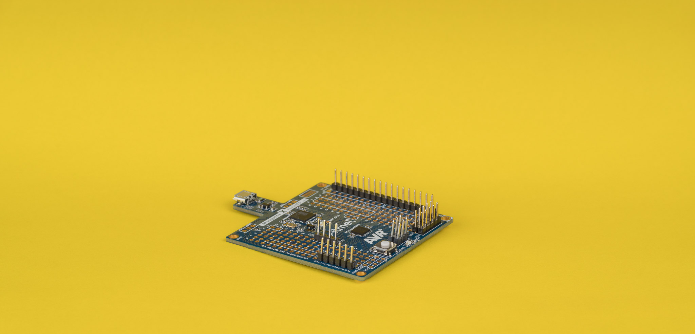
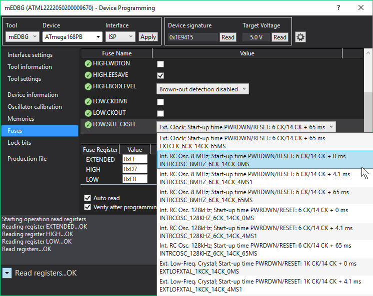
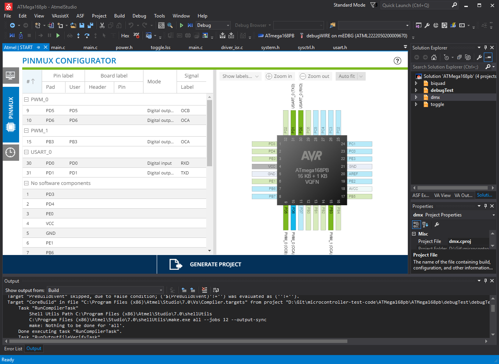
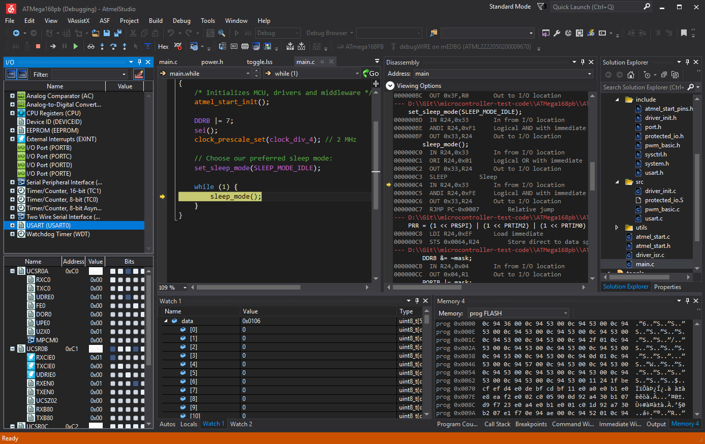

ATMEL (MICROCHIP)
megaAVR

https://jaycarlson.net/pf/atmel-microchip-megaavr/

September 15, 2017  Microcontrollers  [6](https://jaycarlson.net/pf/atmel-microchip-megaavr/#)

The Atmel (now Microchip) megaAVR is a popular family of 8-bit microcontrollers that served as the flagship of AVR for many years. While the first AVR — the AT90S1200 — was released in 1997, the megaAVR arrived soon after in 1998, in the form of the ATmega603 (with 64 KB of flash), and the ATmega103 (with a whopping 128 KB of flash). Early megaAVR devices were AT90 devices with huge flash and RAM capacities, with lots of peripherals, too.

Since then, the “AT90” name has been repurposed to specialized AVR parts (the AT90USB series for USB peripherals is one example). Meanwhile, basically everything built from that original lineage is an “ATmega” now. These go all the way up to the $12 ATMega2560 beasts, and also include some AT90 replacement parts, like the ATmega32U2 and U4 USB parts, along with other special-purpose ATmega devices.

Having said all that, I know why you’re here: the most famous set of ATmegas is the ATmega8 line — including the original ATmega8, plus the widened family: the ATmega48, ATmega88, Atmega168, and ATmega328. These are most famous for use by the Arduino Diecimila, Duemelanove, and Uno.

These range from 4K to 32K of flash, and vary from 512 to 4 KB of RAM — but otherwise have essentially the same peripherals and features, including:

- 20 MHz operation (with a 5V supply)
- Internal 8 MHz oscillator
- Eight channel 10-bit ADC
- Two 8-bit counters and one 16-bit counter (supporting six independent 8-bit PWM outputs)
- Separate USART, SPI, and TWI communications modules

We’ll be considering the “PB” (model “B” PicoPower) version of these MCUs — specifically the ATmega168PB, which rings in at $0.99 on Microchip Direct.

Atmel discontinued the DIP package of these MCUs with the introduction of the “B” revision; consequently, these chips are available in a 32-pin 5x5mm 0.5mm-pitch QFN or a 32-pin 7x7mm 0.8mm-pitch LQFP.

# CORE & PERIPHERALS

I discuss the AVR core in detail [on the main page](https://jaycarlson.net/microcontrollers/#avr).

Interestingly, power consumption can actually be *higher* in the newer PB chips when compared to the ATmega48/88/168P — 17% higher in active mode in low-voltage/low-speed modes, and more than twice as high in power-down mode. Atmel was able to squeeze out better power consumption figures at the top, though: 8 MHz 5V current consumption is down  27% to 5 mA.

These power consumption changes reflect the 130nm die-shrink Atmel did to reduce costs (and dynamic power consumption).1

## CLOCKING

A weak point in the megaAVR line is the clocking architecture: statically-programmed fuses choose between an external crystal, an internal 128 kHz oscillator, and an internal 8 MHz oscillator. The 8 MHz oscillator has an abysmal 10% error, and the error of the 128 kHz is so bad, it’s not even characterized in the datasheet. Another fuse optionally divides the clock by 8.

Modern electronics designs often switch between clock sources dynamically throughout program execution; none of that is possible with this architecture. The only run-mode control over clocking is a prescaler divider, with power-of-two factors between 1 and 256.

## GPIO

There are 27 I/O pins on the 32-pin package. Each pin supports either a totem-pole (push-pull) output or digital input with an optional pull-up resistor; it’s a bit strange, but the pull-up is enabled by writing a “1” to the port output register while the data-direction register is set to an input. Even more goofy, when the port is an output, you can toggle it by writing a 1 to the `PIN` register. Hey, at least Atmel is efficient with its register memory space!

Compared to the original ATmega48/88/168, The newer PB version reviewed here offers 4 additional GPIO pins in a fifth PORTE GPIO register.

There is no open-drain output support, so the only way emulate open-drain outputs is by switching between input and output-low. When using open-drain for communications/logic, the line is usually pulled high with a pull-up resistor — and it is common practice to use the MCU’s internal pull-ups to accomplish this.

But because of how pull-ups are implemented, there’s no way to switch from input-pullup to output-low without glitching: If you toggle the data-direction before toggling the port register, you’ll go from pulled-up-input, to output-high, to output-low. This could result in a bus contention glitch if something else on the open-drain bus is driving the pin low. However, if you toggle the port register, followed by the data-direction register, you’ll go from pulled-up-input, to floating-input, to output-low. In this case, the bus will momentarily float around, which could cause glitches. Consequently, most designs will resign to using an external pull-up, potentially with an external FET, too.

## ANALOG

The megaAVR has an eight-channel 10-bit ADC with an additional temperature sensor input channel. The ADC can only operate at 15 kSPS when operating at 10-bit resolution, making it the slowest ADC I encountered in this review.

In addition to referencing AVCC, the ADC can also select a 1.1V internal reference, as well as an external AREF pin, which can be used to reference arbitrary voltage levels from 0 to 5V.

The megaAVR also has an analog comparator with a single set of dedicated inputs, along with a bandgap option, as well as the ability to use the ADC mux’s output. The output of the comparator can generate an interrupt, trigger a timer capture event, and/or be routed to an external pin.

## TIMERS

The megaAVR has two 8-bit TC modules, each with a compare outputs, plus a 16-bit TC module with capture/compare functionality.

TC1 is a 16-bit auto-reload timer that can support two 16-bit compare/PWM outputs, as well as input capture capabilities. The auto-reload timer allows precise control of PWM period, along with generating interrupts at precision intervals.

TC0 and TC2 are 8-bit timers with two output-compare units, supporting normal output-compare and 8-bit PWM output (along with general-purpose timer interrupt generation). An optional two-bit prescalar selects divide-by 8, 64, 256, or 1024 options, but there’s no period register to allow more precise control of the PWM frequency.

TC2 can also be configured as an RTC, clocked asynchronously from an external RTC crystal, but note that only one crystal oscillator can be used, so if you’re using the TOSC functionality, you’ll have to use the 8 MHz internal RC oscillator for main chip functionality.

## COMMUNICATIONS

The megaAVR has a separate USART, SPI, and TWI (I2C) peripheral; These are bog-standard 8-bit peripherals that don’t feel much different than the 8051 and PIC offerings most designers will be used to.

The USART has a selectable 8x or 16x sampling frequency, an internal baud rate generator, an 8051-style multiprocessor communication mode, and start-of-frame detection.

The baud-rate generator uses a 12-bit counter, which allows you to use low baud rates, even at high clock speeds (a problem with early AVR MCUs). With the standard 16x sampling rate, the lowest baud rate you can generate at 20 MHz is 305 baud. I would have preferred a fractional baud-rate generator like the [Tiny 1-Series has](https://jaycarlson.net/pf/atmel-microchip-tinyavr-1-series#communications), but this would come at the expense of lower-frequency baud-rate possibilities.

Typical of UARTs, there’s a synchronous mode, too, which allows the USART to operate as an SPI master. However, unlike the USART modules on many MCUs, the megaAVR doesn’t have to share its TX pin for data out and data in; there’s a dedicated XCK clock pin, so the TX and RX pins turn into MOSI and MISO pins, respectively, making this a full-duplex SPI peripheral; there’s even clock phase/polarity control, ensuring full SPI compliance.

The USART has a start-of-frame detection that works in all power modes, allowing the MCU to wake up from any power mode and receive data.

The SPI peripheral is typical fair: master/slave operation (with hardware chip-select handling), basic clock divider for timing, and write collision detection. As there is no internal baud rate generator, if you need precise clock speeds, you’re better off with the USART module and its fractional baud rate generator.

The TWI peripheral supports master and slave I2C communication, along with multi-master arbitration. The address match unit supports general-call, too, and can fully operate in sleep mode.

Just like with most I2C peripherals, you’ll need to implement a state machine to build an SMBus-compliant master or slave device; the datasheet has diagrams illustrating which flags to check at each state.

# DEVELOPMENT ENVIRONMENT

## GCC COMPILER

GCC is an important component of the AVR ecosystem — in fact, I’d attribute AVR’s early GCC support as the main reason the platform has been adopted by so many hobbyists and indie developers. It’s also [one of the main reasons that your Arduino Uno has an AVR instead of a PIC processor](https://arduinohistory.github.io/#what-is-programma2003-and-how-is-it-related-to-you-or-to-wiring).

AVR-GCC produces better math and compute code than any of the proprietary compilers I tested — most likely due to the heavily-developed front-end of the compiler. With any optimization strategy I tested, GCC will generate fast 16-bit emulated math instructions instead of calling into math libraries, which [some compilers like Keil C51 do](https://jaycarlson.net/pf/silicon-labs-efm8#compiler).

My biggest problem with AVR-GCC is that GCC was never designed for embedded programming, so the front-end has no concept of SFRs or interrupts. Registers aren’t defined using any special syntax, but rather, just as a memory write. So, setting `PINB = 0x01` is equivalent to `(* (volatile uint8_t*)0x23) = 0x01` (by the way, writing a “1” to a PIN register of an output pin will toggle its value).

Note that no information is encoded for GCC to immediately know that PINB is an SFR that should be addressed with the OUT instruction. Other MCU-specific compilers may have a syntax for declaring PINB as an SFR, such as `sfr PINB = 0x23`. This allows the compiler to always generate the correct output code, regardless of the optimizer.

With the optimizer off, all GCC knows it needs to do is write 0x10 to a 16-bit address, which translates to

```assembly
ldi r24, 0x25 ; store 0x0023 in R24/R25
ldi r25, 0x00
ldi r18, 0x01 ; store 0x10 in R18
movw r30, r24 ; copy the 16-bit value from R24/R25 into R31/R32 (aliased with Z)
st Z, r18     ; write 0x01 to the address in Z (0x0023)
```

As soon as you turn on the optimizer, it will sweep through the code and notice that you’re attempting to write to a 16-bit address that sits in register space. It will replace those five instructions (which take 6 cycles!) with this two-cycle job:

```assembly
ldi r24, 0x01 ; load 0x01 into R24
out 0x03, r24 ; write R24's value to PINB's SFR (0x03)
```

Unfortunately, if you go to reach for `-O1` optimization (the default in Atmel Studio, importantly), this simple `while()` loop:

```C 
int i;
while(1) {
   PINB = 1; // toggle PB0 really fast
   i++;      // used for debugging just to check how many times we've wiggled
}
```

will turn into this:

```assembly
ldi r24, 0x01
out 0x03, r24
rjmp PC-1     ; jump to the out instruction
```

If we set a breakpoint inside the `while()` loop, it will hit precisely once — on first execution of the loop — and then will never run again.

Oh, and since we’ve enabled optimization, our unread `i` variable is optimized out, defeating its purpose altogether.

There are workarounds for some of these problems — you can edit the toolchain settings in Atmel Studio to do `-Og` (Optimize debugging experience), which will help with the breakpoint problem. And you can change `i` to `volatile` to prevent it from getting optimized out.

These optimizations can affect code you never even see; because the AVR lacks banking, it requires inefficient ISR prologues to save the state of registers that the ISR uses, so optimization can affect not just ISR duration, but also latency.

Consequently, while AVR-GCC can produce fantastic algorithmic code, it must be coaxed into producing non-garbage SFR code through optimization — which is a step that often has unintended consequences. You can work around them by massaging your source code, but it reflects my main annoyance with GCC.

One other thing to note is that GCC uses the normal convention for function calls: any call-saved registers the function needs will be pushed to the stack by the function and restored before returning. But there’s also a bunch of call-used registers available for user functions to clobber, which makes it easier to write assembly routines, and gives the compiler plenty of room for handling function locals.

This is normal if you come from PC or ARM development, but many MCU architectures and compilers don’t `PUSH` or `POP` registers at all; instead, specific registers (or RAM addresses) are set aside for specific functions. The advantage of GCC’s standard calling approach is simplicity, flexibility and the ability to support large projects efficiently — you also get reentrancy for free, which compilers like Keil’s C-51 require you to explicitly request when declaring the function.

The main disadvantage to GCC’s approach, however, is speed — and truth be told, function calls in GCC are more expensive than they are in other architectures.

These compiler implementation details are just design decisions that result in a balancing act — and one that probably doesn’t have as much relevance to people’s projects as other aspects of an MCU ecosystem; but for some users, these are important details for choosing an architecture.

## SDK

The header files for the AVR are about as bad as they come. There is absolutely no documentation in the comments of the header files — not even the register name is listed. The only saving grace is that register bits are also defined — but only by the place value.

Many architectures have several different definitions for a register’s bits to keep your code looking clean. It’s common to see things like:

```c
if(UART1STAT_RXEN_SET) { ... } // make sure RX is enabled
P0 |= P0_B5;                   // set P0_B5 high
T1 &= T1_EN_CLR                // disable T1
```

With the header files Atmel distributes, you get to do things like this:

```c
PORTC &= ~(1<<PC3);     //clear PC3
if(UCSR0B & (1 << FE0)) // check the FE0 bit
```

This requires more typing, and worse yet, it makes errors extremely likely. For example, in the above code, FE0 actually belongs to UCSR0A, not UCSR0B — though you would never know by reading the source code. Humans are really bad at memorizing these things and finding these bugs; anything that an MCU manufacturer can do in the SDK to make this easier will save many development hours in the long run.

You may wonder why I claim that `T1 &= ~(1<<T_EN)` requires more typing than `T1 &= T1_EN_CLR`, and it’s simple: because there’s no way for your text editor to autocomplete the first one, and only the worst text editors out there are incapable of autocompleting the second one.

And that’s the crux of the problem: while many MCU SDKs let you explore the architecture and be quite productive without having to keep the datasheet open, I was unable to program the megaAVR to do anything remotely interesting without a PDF on my screen of the register list.

All this stuff is auto-generated; it would be trivial for Atmel to add in all the extra defines I’m talking about without breaking existing code or anything — I don’t know why they haven’t kept up with the rest of the MCU vendors in this regard, especially when their other MCU families, like the Tiny 1-Series, [have essentially fixed everything I’m complaining about](https://jaycarlson.net/pf/atmel-microchip-tinyavr-1-series/#sdk).

## ATMEL STUDIO

Device Programming is a pop-up window inside Atmel Studio used to program fuses during development.

Atmel Studio is the vendor-provided development environment for the AVR. It uses Visual Studio Isolated Shell, the AVR-GCC toolchain, a “Visual Assist” feature that mimics IntelliSense, and a custom toolchain editor that lets Visual Studio play nicely with GNU tools.

I reviewed Atmel Studio more generally in the [main article](https://jaycarlson.net/microcontrollers/#development-environments). The main problems I have with AVR Studio is its lackluster text completion capabilities that don’t seem to work as well as Eclipse.

Other than that, Atmel Studio works fine for developing projects, and large, multi-device projects will surely benefit from the Visual Studio solution-centric workflow (where one solution can hold multiple projects). This is similar to Eclipse Workspaces, but it feels a bit more seamless to switch between solutions than to switch between workspaces.

Atmel Studio has a Device Programming window that can be used to program fuses. Unlike Microchip’s MPLAB X, there’s no way to specify fuse settings directly in source files or program them automatically during normal flashing operations. However, fuse settings appear in both a named list, as well as a fuse register value, which is a useful for quickly describing fuse settings.

Device Programming can also be used for general programming — though it’s not really designed for a production programming environment.

If fuse programming can’t be integrated into the source code (through some #pragma directives or something), I wish Device Programmer were a whole separate program that launched, instead of a pop-up window. It’s tedious to go back and forth between Atmel Studio and Device Programming since you can’t interact with Atmel Studio without closing the Device Programming window.

 

## PERIPHERAL LIBRARIES

Atmel Software Framework — now renamed to “Advanced Software Framework” due to Microchip’s take-over — provides standard peripheral libraries for the megaAVR. ASF is now on its fourth revision, and it’s a total rewrite of the previsious ASF3 version. I’ll be discussing both, as they each have pros and cons.

Atmel Studio has ASF integration for the ASF3-series libraries; to use them, simply create a new ASF project; this will allow you to use the ASF Wizard to add different driver components to your project. but to use the new ASF4-series, it appears you must go through Atmel START (more below).

ASF3 provides a struct-based runtime peripheral library for initializing and using peripherals. This feels akin to many ARM peripheral libraries, especially ones based on CMSIS design decisions. ASF3 seems targeted mostly at Atmel’s SAM line of ARM microcontrollers (which have a tendency to need peripheral libraries more — especially for configuring USB/Ethernet stacks, but also for more mundane tasks like clock configuration).

Consequently, ASF3 is totally incomplete for the megaAVR: the only peripheral drivers you can add are GPIO, Interrupt, and USART. It’s also almost certainly abandoned with the move to ASF4, so don’t expect new functionality to be added.

Atmel START projects originate on the Atmel START web site, but can be reconfigured inside Atmel Studio.

## ATMEL START & ASF4

Atmel START is the web-based GUI code-generator for the AVR (and ARM) ecosystem. Atmel START uses ASF4 as a backend; this library is a complete re-write of ASF3.

Since ASF4 can’t be added to a project without going through Atmel START, and Atmel START only knows how to generate ASF4 code, it may not seem to make sense to discuss these as separate entities — but they most certainly are.

Unlike ASF3, Atmel START / ASF4 have full support for all the peripherals on the megaAVR, and I didn’t find any bugs in the drivers. ASF4 feels much more lightweight than ASF3; most of the drivers are inlined when possible, and with the optimizer on, code size wasn’t much different than doing bare-metal programming.

While many AVR users grumbled about ASF3, I found ASF4 on the megaAVR to be excellent when compared to other peripheral libraries. It has support for different types of drivers that cover the same peripherals; for example, I was able to easily instruct Atmel START to use ASF4 for initializing the USART with the correct baud rate and interrupt settings, but without generating interrupt-based buffered Tx and Rx functions, allowing me to implement my own high-performance, application-specific ISR code.

Unfortunately, for all of ASF4’s advantages, the tool you have to use to interact with ASF4 is clunky and poorly-envisioned. Atmel START is a web-based GUI tool that does not integrate well into Atmel Studio; all projects must originate in the web browser. Once you have the project configured the way you want, the web site will download an atzip file to your computer, which can be loaded into Atmel Studio, which will extract it to a solution and project combination.

Once the project is loaded in Atmel Studio, you can right-click to “reconfigure” it — this will load in Atmel Studio properly (no, you don’t have to go back to the web browser), but the tool does not try to intelligently merge changes with files, as other code-gen tools will; instead, you’re given the option to select which of your files you’d like clobbered. Thanks, I guess?

I assume Atmel’s rationale for making Atmel START a web-based tool is to support its wide userbase that avoids using Atmel Studio and instead prefers command-line-based workflows using Linux or macOS. I’d argue that, when reading posts from these people online, I get the feeling that this user base will *never* use code-gen tools on the megaAVR: they learned the ecosystem long ago, and are comfortable with the time commitment required to program microcontrollers at the register level.

Professional and hobbyist users new to the megaAVR ecosystem will probably be more likely to use Atmel START — inside Atmel Studio — as this is the development paradigm used by most other microcontrollers on the market these days.

## DEVELOPMENT TOOLS

Most manufactures have \$10-30 dev boards that also be used for off-board debugging of your own circuit board. Many package these debuggers up into nice, plastic cases for $35-50, just as a convenience (but not as a profit center for the company).

Atmel has the Xplained Mini boards, which sort of cover my first point — but there’s an important issue with them: they can’t be used for off-board debugging, even with PCB modifications to the board. I talk about this more in the [ATtiny 1-Series development tools](https://jaycarlson.net/pf/atmel-microchip-tinyavr-1-series/#development-tools) section.

As for the \$35-50 debugger, I guess you can buy an [Atmel ICE PCB assembly for $55](https://www.digikey.com/product-detail/en/microchip-technology/ATATMEL-ICE-PCBA/ATATMEL-ICE-PCBA-ND/4753383) (sold as a replacement part) and build your own cable assemblies for it (maybe wrap it in some shrink-wrap to protect it, while you’re at it?). But other than that, your only low-cost debugging option is a on-its-way-out-of-production [$55 AVR Dragon](https://www.digikey.com/products/en?keywords=avrdragon). Obviously, a professional is going to [drop $140 on an Atmel ICE](https://www.digikey.com/products/en?mpart=ATATMEL-ICE&v=150), but for indie shops with 5 or 6 devs on their team working remotely, that’s the cost of an entire batch of assembled prototype PCBs — that’s not nothing.

Anyway, when re-approaching the megaAVR architecture after being away for so long, I realized how strange the ecosystem was compared to other architectures. There are hundreds upon hundreds of blog write-ups, forum posts, and GitHub repos full of open-source tools built by the community for these AVR products.

If you’re new to the megaAVR, and you start searching around, obviously the first development board you’ll stumble upon is the Arduino Uno. It relies on a serial bootloader that interfaces with the computer using an on-board USB-to-serial converter. It completely bypasses Atmel Studio, and while Atmel has begrudgingly offered a modicum of support for the Uno, the entire Arduino ecosystem seems completely content with bypassing Atmel’s tools altogether.

After reading about the Arduino, next, you’ll hear about the [USBtinyISP](https://learn.adafruit.com/usbtinyisp), [USBasp](http://www.fischl.de/usbasp/), and [Pocket AVR Programmer](https://www.sparkfun.com/products/9825). These are bizarre open-source projects that use ancient Atmel microcontrollers that have no built-in USB support; instead, they bit-bang a USB 1.1 Low-Speed interface. They all use a program called [avrdude](http://savannah.nongnu.org/projects/avrdude) — a command-line utility for interacting with these programmers.

It’s hard to imagine being particularly productive with these tools, as they offer no debugging capabilities, and don’t integrate into Atmel Studio at all.

In fact, somewhat strangely, Atmel seems completely out-of-the-loop on all of these projects. While many manufacturers have embraced the hobbyist community by offering low-cost, cross-platform tools (some are even open-source), Atmel is very tight-lipped about debugging interfaces, making it challenging to build debugging-capable open-source tools.

This is what’s so puzzling about the Atmel AVR ecosystem. On the record, Atmel’s tools are expensive, cumbersome, and decidedly Windows-only. But off the record, it seems like a large portion of the AVR’s userbase relies on FOSS-compliant cross-platform free utilities and programmers for all their projects, and while these tools have severe limitations (no debugging, no support of newer AVR parts, and slow programming speeds), they more or less work — and there’s basically no other game in town for FOSS-compatible 8-bit development (well, unless you want to count SDCC’s emerging support for the [PIC16](https://jaycarlson.net/pf/microchip-pic16-five-digit-enhanced/) and [STM8](https://jaycarlson.net/pf/st-stm8/)).

Atmel Studio offers a relatively normal debug experience, with an optional disassembly window you can dock side-by-side, a register viewer (that visually breaks down registers to the bit level), and decent variable watches.

# DEBUGGING EXPERIENCE

Debugging is a bit of a mess on the megaAVR. Unlike most vendors who blur the line between in-circuit programming and in-circuit debugging, there’s a clear demarcation with the AVR: You’ll need the 3-wire SPI interface, plus the reset pin, just to get code on your chip or program the fuses. If you want to debug your code, this is done through the debugWIRE interface, shared with the reset pin. I love one-pin debug interfaces, but debugWIRE has serious flaws.

Only one programming mode can be active at once, and the chips come factory-programmed in ISP mode. Consequently, when you’re laying out a prototype board with a megaAVR part, you’ll either have to solder down pre-programmed debugWIRE-enabled chips or break out the entire 4-pin (plus ground/power) ISP harness.

On designs with cramped pin muxing, you’re going to have to be a bit clever with your circuit design to ensure these SPI pins don’t conflict with your design.

Unfortunately, once you’re in debugWIRE mode, you won’t be able to perform common tasks like programming fuses. And as mentioned before, common clocking tasks like division and source selection are statically configured with fuses.

Consequently, I found myself oscillating back and forth quite a bit between debugWIRE and ISP modes. Be prepared to mentally train yourself to always remember to choose the *Debug > Disable debugWIRE and Close* option in Atmel Studio whenever you’re in the middle of a debug session and you need to change a fuse’s value — you can’t disable debugWIRE from outside of a debugging context.

Having said all that, once debugging was working properly, it was a reasonably good experience. Small programs launch within 3-5 seconds, stepping through code is fairly snappy, and variable watches seem fast enough — even large data arrays.

I wish you could inspect multiple peripheral registers at once in Atmel Studio — I prefer the large tree views that many Eclipse environments have: on my large 40″ 4K monitor, I can stretch the IDE to fill the screen, and essentially view the entire register list at all times. This is a minor nit-pick that only serves to illustrate the differences between platforms: it doesn’t make or break the experience.

One major problem with debugging has more to do with the hardware than Atmel Studio: if you’re working on large projects, be aware that debugWIRE is *very slow*. This isn’t as much of a problem for projects in the <2K area, but in my testing, an 8K project took more than 30 seconds to upload; and **a 16K project took more than a minute to load**. I didn’t have an Atmel ICE to compare, but I couldn’t imagine it would be night-and-day difference (surely the debug protocol is much slower than the 12 Mbps USB full-speed interface with the computer).

Yet again, the tinyAVR 1-Series — with its UPDI interface — is much faster; in fact, in large-program flashing speeds, it was 4.5x faster than the debugWIRE-equipped megaAVR. This isn’t a problem on smaller parts, but if you’re laying down an ATmega168PB, I assume it’s because you need 16 KB of flash. Expect awful load times over debugWIRE.

# PERFORMANCE

## BIT-WIGGLING

I made use of the GPIO’s toggle capability to reduce the bit-wiggling cock-cycle count as much as possible. The code compiles into three instructions:

```assembly
ldi r24, 0x01    ; load "0x01" -- runs once
out 0x03, r24    ; one cycle
rjmp PC-1        ; jump to the out instruction -- two cycles
```

This executes in three cycles.

## BIQUAD FILTER

To keep testing fair, the ATmega168PB was tested at 3.3V running at its maximum speed from its internal oscillator — 8 MHz, in this case.

Even still, the megaAVR pulled in impressive numbers: 123.27 ksps biquad filtering, into 3.11 mA of current, for an efficiency of 93.26 nJ/sample. This works out to 63 clock cycles per sample, so if your budget and board area allowed, running the chip at 20 MHz from a 5V supply could turn in performance numbers in excess of 300 kHz.

## DMX-512 RECEIVER

I used Atmel START to generate all the initialization code for the PWM outputs, as well as the USART receiver. Instead of using the “UART Basic” driver, I used the “UART Init” driver, allowing me to implement my own ISR handler.

I was able to divide down the ATmega168’s clock to 2 MHz without failure, which illustrates how lightweight the code base is.

Unfortunately, while the datasheet seems to indicate my ATmega168 should be in the 800 microamp range, I measured 1.27 mA. This was after hacking at my Xplained Mini board to try to decouple the mEDBG debugger (and remove that stray LED on the board, too).

I will look into further ways of reducing power, but unless there’s an obvious mistake in my code or measurement procedure, this figure will stand in the comparison measurements section, as it represents the “default” power consumption with a “wait for interrupt” idle while() main loop, and a reduced clock speed.

# BOTTOM LINE

It’s hard to recommend the megaAVR without recalling the expression “the best tool is the one you know how to use.” On the surface, this is an expensive microcontroller with good math performance, but unremarkable peripherals (especially in the timer department) and clunky development tools. However, the megaAVR has a history spanning nearly 20 years, and there’s a huge online community of forums, tutorials, and blog posts full of AVR example code. Among hobbyists and small-shop indie developers, there’s a healthy percentage of people who would never touch an architecture without an open-source GCC toolchain; for them, this AVR — combined with low-cost open-source AVR programmers — is sufficient for their work. For professionals loyal to Atmel, however, I suggest picking up an AVR ICE and stick with the lower-cost, better-endowed [tinyAVR 1-Series](https://jaycarlson.net/pf/atmel-microchip-tinyavr-1-series/) line, or the [SAM D10](https://jaycarlson.net/pf/atmel-microchip-sam-d10/) for an ARM experience.