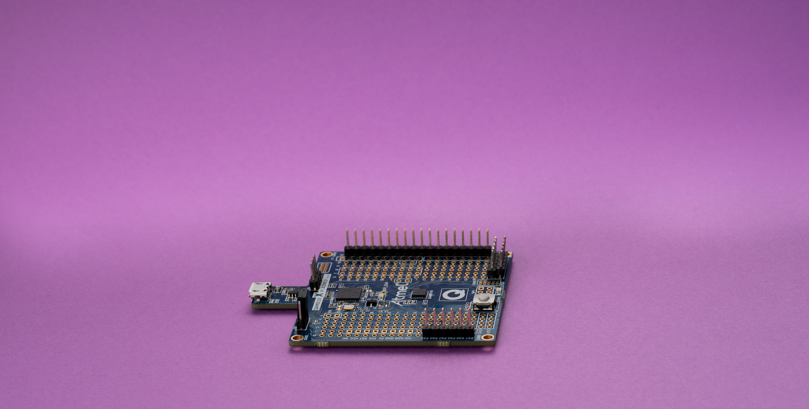
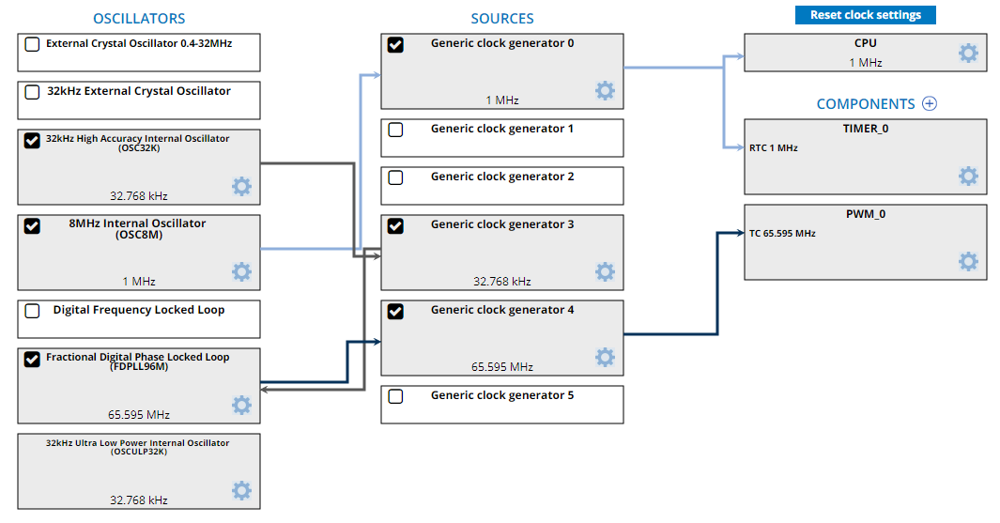
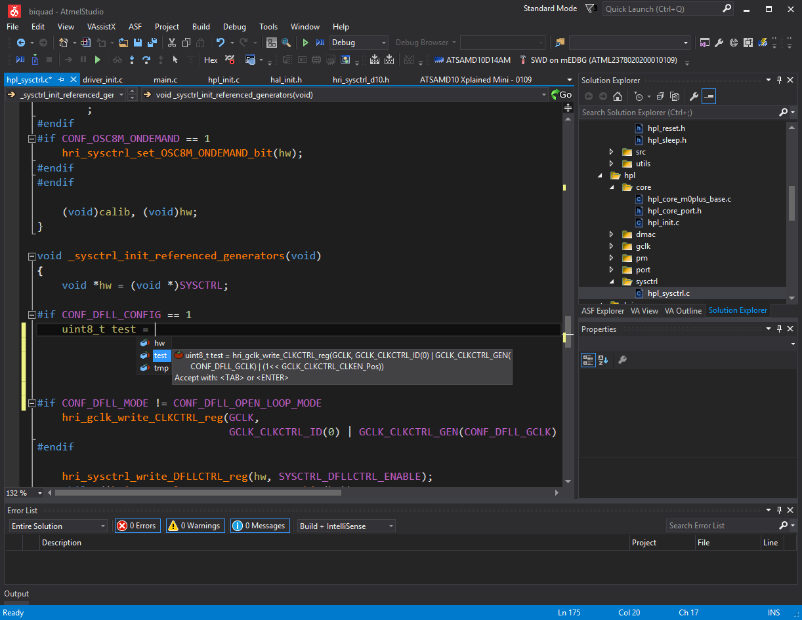
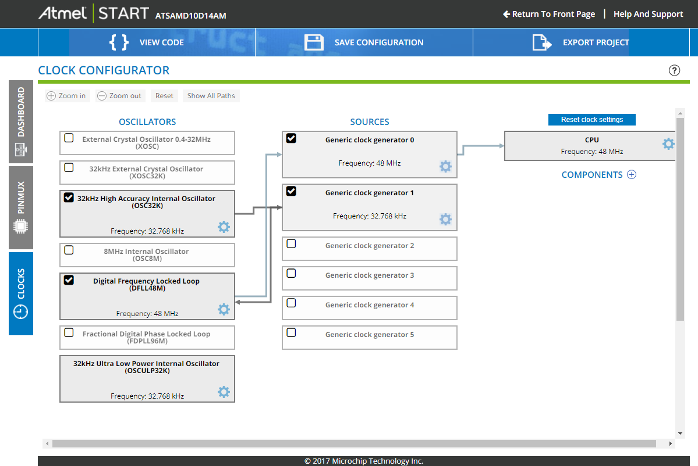
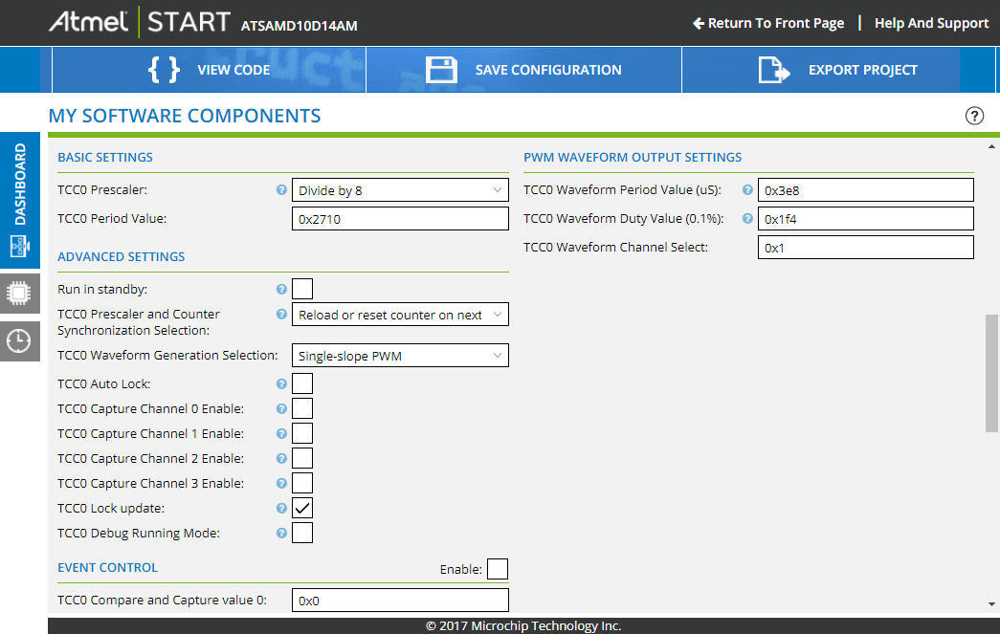
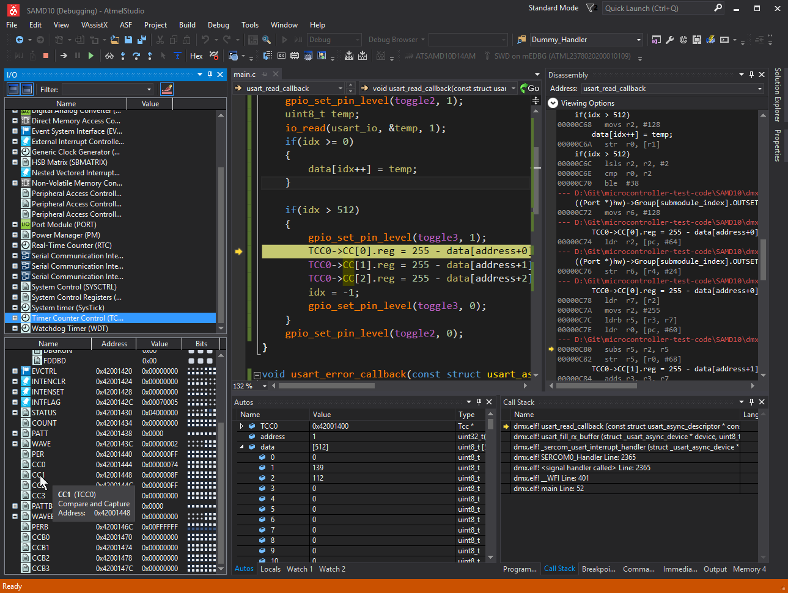

ATMEL (MICROCHIP)
SAM D10

https://jaycarlson.net/pf/atmel-microchip-sam-d10/

September 15, 2017  Microcontrollers  [12](https://jaycarlson.net/pf/atmel-microchip-sam-d10/#)

Atmel introduced the SAM D09, D10, and D11 in 2016 with pricing that aggressively cannibalized its own 8-bit line of [AVR](https://jaycarlson.net/pf/atmel-microchip-megaavr/)s (and [TinyAVR](https://jaycarlson.net/pf/atmel-microchip-tinyavr-1-series/)s). Here were three 32-bit Arm Cortex-M0+ microcontrollers that started down below 50 cents for 14-pin 4 KB flash devices, and went up to 16 KB of flash, USB-equipped 24-pin packages that stayed well under $1.

With Microchip’s acquisition of Atmel, the company has doubled-down on promoting the SAM D10 series — and I assume Atmel’s low-cost Arm portfolio was a major source of interest for Microchip, who has struggled with PIC32 adoption since its introduction.

For this review, I’m zeroing in on the SAMD10D14, but 98% of this review will cover the range of these entry-level devices, as well as the more-mainstream D20 and D21 parts. In fact, there are several cousins that all have different permutations of essentially identical peripherals:

- **SAM D09/D10/D11/D20/D21:** mainstream entry-level family
- **SAM C20 / C21:** 5V-compatible version
- **SAM L21 / SAML22:** low-power version

I love this entry-level MCU family for having source-code compatible options — lots of Arm vendors have different families for low-power versus 5V versus mainstream applications, but these MCUs are usually radically different (consider the Freescale/NXP Kinetis [KL03](https://jaycarlson.net/pf/freescale-nxp-kinetis-kl03/) versus the [KE04](https://jaycarlson.net/pf/freescale-nxp-ke04/)).

We can’t push our luck too far, though — these D-, C-, and L-series microcontrollers vary quite substantially from the rest of the Cortex-M3 and M4 microcontrollers Atmel produces.

But I digress. Here’s a quick run-down of the SAM D10 specs:

- 48 MHz Cortex-M0+
- 16 KB flash, 4 KB of RAM
- 6-channel DMA
- Two 16-bit auto-reload timers and a 24-bit special control timer
- Three SERCOM modules, independently configurable as a UART, SPI, or I2C
- 10-channel 12-bit, 350 ksps ADC (eight channels on the package tested)
- 10-bit 350 ksps DAC
- 13-channel capacitive-touch sensing

I really like the packaging options for this part: anyone building up prototypes by hand (both professionals and hobbyists) will appreciate the 1.27mm-pitch SOIC packages that come in both 14 and 20 pin variants. Standard production boards will probably use the 24-pin 0.5mm-pitch QFN package — but for high-density designs, there’s a 1.9 x 2.4 mm 20-ball WLCSP package that can be ordered [direct from Microchip](http://www.microchipdirect.com/ProductSearch.aspx?Keywords=ATSAMD10D14A-UUT) at any quantity.

# PERIPHERALS & CORE

The SAM D10 uses a Cortex-M0+ processor. For an overview of the Cortex-M0+, check out the [main article](https://jaycarlson.net/microcontrollers/#arm-cortex). This is one of the few MCUs in this price range with direct memory access (DMA) support through a flexible 6-channel peripheral. The core also features a 6-channel event system for routing binary signals between peripherals, which is useful for hands-off control operations (e.g., to trigger an ADC conversion on a PWM overflow event — without CPU intervention).

Atmel SAM D10 parts have some of the most complicated (and flexible) clocking configuration among the parts evaluated.

The D10 has flexible clocking options: internally, there are three oscillators: 32 kHz high-accuracy, 32 kHz low-power, and 8 MHz high-accuracy. There’s a 32-kHz-sourced 48 MHz FLL that can be used to internally run the MCU’s core and peripherals at maximum speed. There’s also a 96 MHz PLL sourced from oscillators up to 2 MHz — this is only useful for the TCC0 timer module, which can handle a 96 MHz input.

To route clocks around, Atmel provides another layer of complexity — oops, I mean “flexibility.”

Instead of each peripheral directly hooking into a clock source (with a few ad-hoc dividers thrown in for fun), there are five separate clock generators that can mux and divide-down any of these oscillator sources. Peripherals must source their clocks from these clock generators — and even the FLL and PLL must source their clocks from the generators.

## GPIO

While a normal write to a register would be a two-cycle operation over the AHB bridge, the SAM D10 implements the Cortex-M0+’s single-cycle GPIO access through the CPU local bus (IOBUS). The GPIO peripheral follows Atmel’s backward convention: “1” for “output” — “0” for “input” — and, like the [Tiny 1-Series](https://jaycarlson.net/pf/atmel-microchip-tinyavr-1-series/), the SAM has separate set, clear, and toggle registers.

There’s an interesting low-power sampling function that allows the user to reduce power consumption by only sampling input pins on request (introducing a two-cycle delay); this can be disabled for maximum performance at the expense of added current consumption.

The GPIO peripheral has configurable pull-up resistors and can toggle the input-read functionality (even when the output direction is configured). There’s no direct support for open-drain outputs, but the DIR can be toggled to emulate this.

## TIMERS

The D10 has two identical TC (timer/counter) modules, along with a TCC (timer/counter for control) module. The TC module is a 16-bit auto-reload counter with two capture/compare channels. The two TC modules can be paired together to form a single 32-bit TC module.

TCC is a 24-bit auto-reload timer with 4 capture/compare channels that has several capabilities and output modes designed for control applications. With it, you can drive 4 independent PWM outputs, along with advanced push-pull configurations with programmable dead-time.

## COMMUNICATIONS

Atmel kept the SAM D10 simple and flexible by providing three identical SERCOM modules — each configurable as a UART, SPI, or I2C peripheral.

In USART mode, the SERCOM features synchronous and asynchronous capabilities with flexible baud rate capabilities: there’s 16x, 8x, and even 3x oversampling options, and selectable fractional or arithmetic baud rate generation (most MCUs provide one or the other) This means the SAM D10 supports speeds from 45 baud to 16 Mbaud, but can also dial in extremely precise baud rates with the three-bit fractional option.

The USART has RTS and CTS flow control, IrDA modulation/demodulation, and LIN support (plus stand-alone start-of-frame detection, too). Without FIFO support, the USART really relies on the SAM D10’s DMA functionality at higher baud-rate settings.

When operating in SPI mode, the SERCOM supports SPU clock rates up to 12 MHz, hardware-controlled chip-select, and optional 8-bit address-match mode when in slave mode.

In I2C mode, SERCOM provides 7-bit and 10-bit address matching, along with address range matching and DMA support for both master and slave modes. There’s no multi-master arbitration support, unfortunately.

## ANALOG

The SAM D10 has a 350 ksps ADC with 8, 10, or 12-bit resolution, differential and single-ended input modes, and 1/2 to 16x gain. It supports single, continuous, and scanning conversion options, and also has a window monitoring mode. There are two VREF inputs, as well as an internal 1.0-volt reference that can be used (in addition to the normal VCC reference).

The D10 has a single 10-bit DAC output that can convert at 350 ksps and can be triggered to start a conversion from the event system.

There are also two analog comparators that can source from various inputs, including external pins, the DAC, a bandgap reference, and essentially a separate 6-bit DAC (that Atmel calls a 64-level scaler).

The D10 also adds capacitive-touch support to the D10 with its Peripheral Touch Controller, supporting 16 discrete buttons or 72 mutual-capacitance buttons. Users configure the peripheral using the QTouch Composer. Unlike the PTC controller on the [TinyAVR 1-Series](https://jaycarlson.net/pf/atmel-microchip-tinyavr-1-series/), the D10’s PTC doesn’t take over the ADC.

# DEVELOPMENT TOOLS

Microchip sells the [Xplained Mini SAM D10](http://www.microchip.com/Developmenttools/ProductDetails.aspx?PartNO=ATSAMD10-XMINI) board as the sole development board for this chip (though there’s also the S[AM D11 Xplained Pro](http://www.microchip.com/DevelopmentTools/ProductDetails.aspx?PartNO=ATSAMD11-XPRO), along with the [SAM D20](http://www.microchip.com/DevelopmentTools/ProductDetails.aspx?PartNO=ATSAMD20-XPRO) and [D21](http://www.microchip.com/developmenttools/productdetails.aspx?partno=atsamd21-xpro) Xplained Pro boards that cover close relatives, too).

These dev boards have integrated mEDBG debuggers which use the USB HID-based CMSIS-DAP debugging standard; CMSIS-DAP is not known for fast code uploads, and my testing confirmed this. None of these boards are built for debugging external targets, but with a soldering iron, they can be adapted.

For stand-alone debuggers, Microchip sells the [Atmel-ICE](http://www.microchip.com/DevelopmentTools/ProductDetails.aspx?PartNO=ATATMEL-ICE), but Atmel Studio also supports the industry-standard Segger J-Link. Students and hobbyists should probably opt for the $60 [J-Link EDU](https://www.segger.com/products/debug-probes/j-link/models/j-link-edu/) or tiny $18 [J-Link EDU Mini](https://www.segger.com/products/debug-probes/j-link/models/j-link-edu-mini/).

Which of these #ifdefs are enabled? Your guess is as good as mine; Atmel Studio is Visual Studio without Microsoft’s excellent IntelliSense engine, making it worse than even Keil µVision in terms of text-editing productivity — and far inferior to the Eclipse- and NetBeans-based IDEs from competitors. I added 6 publicly-visible global variables in this file among others in the project, and none of them appear in the auto-complete list.

## DEVELOPMENT ENVIRONMENT

While many vendors have transitioned to Eclipse-based IDEs, Atmel went with a Visual Studio Isolated Shell-based platform in Atmel Studio. I do a ton of .NET and desktop-based C++ development, so I expected to feel right at home in Atmel Studio when I first launched it. Unfortunately, Microsoft calls this product “Visual Studio Isolated Shell” for a reason — it’s simply a “shell” of Visual Studio, without any of the meat. The excellent IntelliSense engine that Microsoft spent years trying to get right (even for large, complex C++ projects) has been replaced by a version of Whole Tomato Software’s [Visual Assist](https://www.wholetomato.com/)technology (that doesn’t seem nearly as capable as it does on their website).

The ARM-GCC toolchain editor is missing GUI options for several important functions, and some commonly-used favorites seem absent or buggy; for example, I couldn’t get GCC’s link-time optimization working through the Atmel Studio interface at all.

If you prefer a cross-platform, open-source Eclipse-based environment, the [GNU MCU Eclipse](https://gnu-mcu-eclipse.github.io/) project has support for the D10.

While Atmel START provides a nice-looking graphical interface especially useful for the flexible clocking schemes available on modern Arm microcontrollers, its design validation is hit or miss: in this picture, there’s absolutely no warning that the main 32 kHz oscillator isn’t enabled. Most seriously, the DFLL module indicates it’s outputting a frequency of 48 MHz, even though its multiplier is set to “0” in the configuration properties dialogue. Changing this to arbitrary values does not update the “48 MHz” display. This is a tool you cannot trust.

## CODE-GEN TOOLS

Atmel START is the web-based code-gen tool that Atmel rolled out for its AVR and Arm processors to replace its Atmel Software Framework version 3 peripheral libraries.

ASF3 was large and cumbersome and seems unpopular with users. Atmel START fixes these problems by generating an ASF4 API at the user’s discretion.

START provides a nice graph-based clock editor, pin muxing (with a footprint view of the chip), and peripheral initialization and basic run-time support. Once you’ve configured the project to your liking, you can download the configuration file, or download a generated project package for Atmel Studio, IAR EW, Keil µVision, or a Makefile-based project. The last format may seem strange, but Atmel has an extremely vocal hobbyist crowd that uses Linux/macOS as a primary embedded development platform (which precludes them from using Atmel Studio), and these people love CLI-based build tools.

In terms of the style of code generation, Atmel START is what I call a hybrid code generator — it generates configuration structures which it then passes to runtime peripheral libraries. Instead of generating functions that strictly initialize registers to predefined constant values (fast!), this style of code-gen tool produces bulkier, slower code that must be evaluated at runtime to calculate baud rates, divider values, clock source settings, etc.

The advantage of this style of tool is that you have more control as to when and how the initialization routines are called — and you can use the code-gen tools as a one-time launchpad for your project, instead of relying on it constantly as you work your way through design changes.

Atmel START has some shortcomings: all projects must originate in the web browser, which presents a clunky workflow when compared to truly integrated code-gen tools (or even code-gen tools that are written in a native software framework). Strangely, you can edit Atmel START projects inside Atmel Studio (and re-gen the code when you’re done) — so why can’t you start an Atmel START project from Atmel Studio in the first place?

It’s not clear to me how it’s possible to independently configure a PWM channel’s total period, pulse duration, and duty cycle (aren’t these dependent on each other?); yet Atmel Studio has separate inputs for each of these. I assumed that if I changed one the other ones would update accordingly, but that’s not the case.

The second problem is much more serious: there’s essentially no error-checking done by Atmel SMART. It will gladly generate a project that has no functional oscillator, or one that has the DFLL set to an invalid frequency, or one that doesn’t have the proper number of wait-states set for the flash controller.

And, not surprising at this point: don’t expect to have any useful explanation or documentation in SMART. There is no information inside the tool that explains what a particular setting does, or what its acceptable input values are. This is a tool that may save you from *typing*, but it certainly won’t save you from *reading the datasheet*.

Most of the reasons I use code-gen tools is to avoid goofing up silly stuff like that, and Atmel START did not help in that regard at all. I spent way too much time trying to get past a check-oscillator-ready loop before realizing that while my 32 kHz oscillator module was enabled and routed properly, I didn’t tick the “Enable 32 kHz Output” checkbox (as I assumed that was related to some sort of clock-out peripheral pin function — again, no docs in Atmel START). Any decent code-gen tool I’ve ever used has issued warnings in cases like this (or flat-out refused to generate code).

Exacerbating this problem, Atmel START has a “Frequency: 32.768 kHz” label under the clock module, regardless of state. Is this a software drawing bug, or a design decision? The *most serious* problem is in the same vein: there are several persistent text strings displayed that absolutely must be considered bugs; most notably, with two of the three projects I generated, the DFLL text display was stuck at “48 MHz” — regardless of what the DFLL multiplier was actually set to. This is a serious flaw that makes me nervous whenever using Atmel START — this is a tool I cannot trust.

Atmel Studio’s debugging is more beauty than brains: while it has all the important views, stepping through code, viewing registers, and inspecting data was painfully slow.

## DEBUGGING EXPERIENCE

Code uploading through the CMSIS-DAP-based Xplained Mini board was slow — taking as long as 20 seconds (!) to flash a firmware image that uses the entire 16 KB of storage found on this part. If I were doing anything but the most casual development, I’d probably opt for a J-Link or Atmel-ICE debug probe.

Atmel Studio has the typical debugging windows you’d expect from Visual Studio — the disassembly view is hidden by default, but once activated, tracks the source code window properly. There’s an Atmel Studio-specific I/O window that allows inspecting and manipulating peripherals. It has registers broken up logically down to the bit level, and while there are tooltip hover-over descriptions, I’d prefer a dedicated column. Hex values are fine, but I always prefer drop-down menus, too — especially for “enumeration” style multi-bit registers. Without that, you won’t be able to keep your face out of the datasheet.

Note that you can only view one peripheral’s register list at a time, which can be limiting when you’re interested in seeing interactions between multiple peripherals.

# PERFORMANCE

## TOGGLE

The Atmel SAM D10 has single-cycle I/O operations that bypass the AHB interface altogether; coupled with the M0+’s 2-cycle branch instruction and Atmel’s flash caching yielded a three-cycle bit-wiggle time.

## BIQUAD FILTERING

The SAM D10 brought in excellent numbers — averaging 1823 kSPS biquad processing rate into 3.41 mA of current. This equates to 9.22 nJ/sample, which is the most efficient result seen in my testing.

## DMX-512 RECEIVER

I used Atmel START to generate all the project code. Rather than using the initialize-only driver for the UART, I decided to try the asynchronous buffered driver, as it’s the only driver mode that’s documented in the manual, and it has a callback interface that seemed suitable for my application.

Unfortunately, the buffered callback mechanism is quite slow; I had to run the processor at 12 MHz. Any lower, and there wasn’t enough time to save and process the data. This brought in a poor score for power consumption. The SAM D10 pulled an average of 3.41 mA while running my DMX receiver — one of the worst showings in the round-up.

Atmel START generated ASF4 code that was middle of the pack in terms of space efficiency: 3720 bytes of flash memory were used by the DMX-512 receiver. The project required a lot of RAM (1744 bytes), but that’s most likely from statically-configured stack/heap allocation which could be optimized depending on the application.

# BOTTOM LINE

The SAM D10 is an excellent entry-level modern Arm microcontroller. Excellent flash caching, a controls friendly event system, and decent timer configurations make this an attractive part for a lot of applications I work on with chips in this price range. The three SERCOM modules provide a ton of communication flexibility while offering the same or better timer and analog peripherals as the best parts reviewed.

Initial configuration is a bit maddening in Atmel START (which is required for ASF4 projects), but once your skeleton project is built up, it’s totally workable — and some hobbyists and indie developers will appreciate Atmel START’s project generation support for a make-based open-source build environment.

And that’s pretty typical Atmel, honestly: just like the AVR architecture, you can go the Atmel way — with a somewhat-buggy, Windows-only Atmel Studio — or you can roll your own toolchain from scratch using open-source components that Atmel provides no official support for (though many people in the community seem to use).

Instead, I’d appreciate a middle ground: an easy-to-setup, vendor-provided cross-platform Eclipse-based IDE that makes jumping between Arm vendors a bit easier.

It looks as though Microchip is going to integrate the Atmel Arm portfolio into MPLAB X, but this only changes the calculus slightly — MPLAB X is cross-platform, but it comes with its own host of issues, and uses NetBeans — not Eclipse — as a jumping-off point.