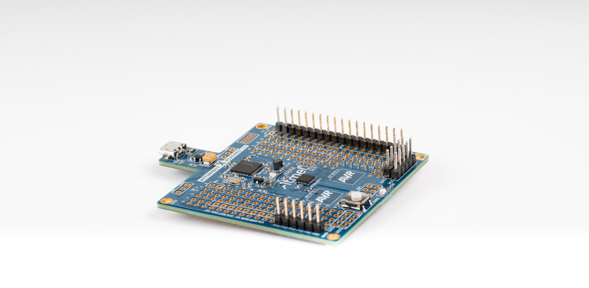
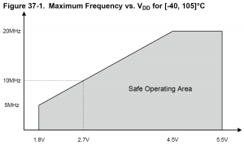
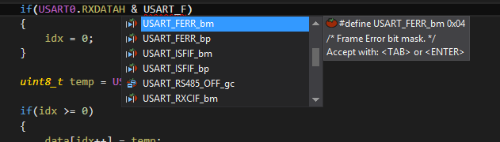
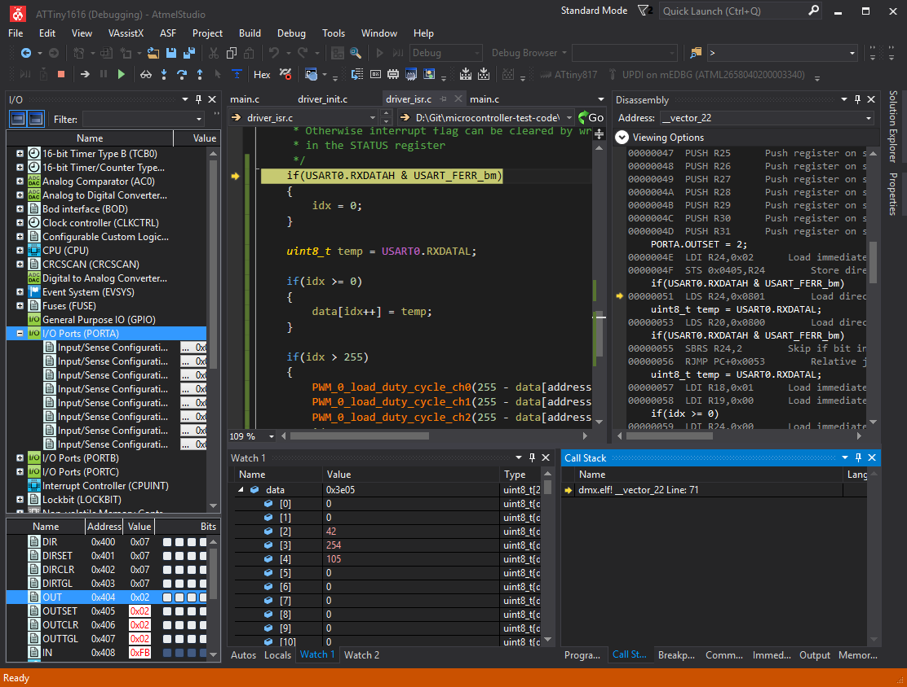
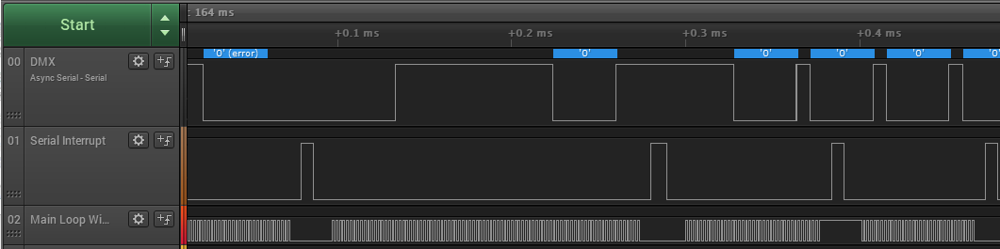

ATMEL (MICROCHIP)
tinyAVR 1-SERIES

https://jaycarlson.net/pf/atmel-microchip-tinyavr-1-series/

September 15, 2017  Microcontrollers  [7](https://jaycarlson.net/pf/atmel-microchip-tinyavr-1-series/#)

The Microchip (formerly Atmel) tinyAVR line of entry-level AVR devices got a jolt of energy earlier this year when Microchip unveiled seven new members of the family, referred to as the 1-Series.

These mark a radical departure from the previous ATtiny MCUs by offering peripherals from the XMEGA line of MCUs, along with a 20 MHz internal oscillator, new UPDI single-wire debug interface, and full AVR core (with the two-cycle 8×8 multiplier).

These parts are as low-cost as [75 cents in single quantities](https://www.digikey.com/product-detail/en/microchip-technology/ATTINY816-MFR/ATTINY816-MFRCT-ND/6556166), and all the parts currently shipping are less than $1 in quantities of 100 units.

For this review, I’ll be talking about the top-of-the-line ATtiny1617 unless otherwise noted.

Specs at a glance:

- Internal 20 MHz high-accuracy / 32 kHz low-power oscillators
- 16 KB of flash, and 2 KB of RAM, plus 256 bytes of byte-addressable EEPROM
- True one-wire UPDI flashing/debugging interface
- Three 16-bit timers, plus a 12-bit control timer and RTC
- Up to 24 channels spread across two 10-bit ADCs
- Three 8-bit DAC channels
- Two interrupt levels
- Separate UART, SPI, and TWI (I2C) modules
- 14 channels of capacitive-touch sensing (up to 49 channels when wired as mutual-capacitance)
- Configurable logic look-up table
- 22 external interrupts, 22 GPIO, and 6-channel event system
- SOIC (for the 14- and 20-pin chips), and 0.5mm 20/24-pin QFN packages available, down to 3x3mm.

The seven current members in the family are the ATtiny417, ‘814, 816, 817, ‘1614, ‘1616, and ‘1617. On the horizon, but not yet shipping, are the ‘212 and ‘214 eight-pin devices, and the larger ‘3214, ‘3216, and ‘3217 devices that will support 32 K of flash. These all have essentially the same peripheral set, but vary by flash/RAM size, and package size (affecting the number of DAC outputs, GPIO pins, and ADC channels).

As you can see, these parts (plus the soon-to-ship ATtiny321x) meet or exceed the specs of popular megaAVR microcontrollers (including the [ATmega168PB](https://jaycarlson.net/pf/atmel-microchip-megaavr/)), while also bringing a substantially lower price tag. Most designers will probably want to consider switching, but there’s a few key things to consider that we’ll discuss.

# CORE & PERIPHERALS

While the tinyAVR 1-Series feels more modern than its predecessor, this is still a shamelessly 5V part, so be careful when operating it in more modern contexts, where the clock speed has to be cut in half.

Starting with the clock and core, the tinyAVR 1-Series has an internal 3% 20 MHz oscillator that can also be configured for 16 MHz oscillation via a fuse configuration. There’s also a low-power 32 kHz oscillator with particularly awful accuracy (10% error), but particularly good power consumption (0.71 μA in standby with the oscillator running).

Both of these oscillators will maintain 2% or better accuracy at 25°C, which should eliminate external crystals in any design that doesn’t need time-keeping capabilities.

The two-level interrupt controller is another XMEGA backport that’s not even found on the more-expensive megaAVR line of processors (though the XMEGA is three-level instead of two).

There’s also an independent-from-the-CPU event system that allows peripherals to signal to other peripherals. For example, a PWM event could signal to the ADC to take a reading for vector motor control applications, or a comparator output event could signal to the PWM waveform output to cut off the signal due to an overcurrent condition.

While many 8-bit microcontrollers have special provisions for enabling specific instances of this, few have this level of flexibility, which makes the Tiny 1-Series particularly useful for control applications.

Like the XMEGA, the 1-Series uses logically-organized register groups; a peripheral has a base address, and all its registers live at particular offsets. This is how ARM microcontrollers operate universally, but almost unheard of in 8-bit architectures.

### GPIO

There are 22 GPIO pins on the ‘1617. Each pin has individually-controlled pull-up resistors (though no pull-down), as well as I/O inversion.

While the GPIO port lacks open-drain support, the pull-up resistors are controlled through separate PINCTRL registers, which means this MCU doesn’t have the [emulated open-drain glitch that the megaAVR has](https://jaycarlson.net/pf/atmel-microchip-megaavr#gpio).

Just like the XMEGA, port registers live in extended (16-bit) memory space, which opens the design up for individual set, clear, and toggle registers for both the GPIO’s direction and output value; again, this is common in ARM microcontrollers, but a novelty in 8-bit parts.

Because GPIO lives outside of the low 32-byte memory space, there’s no support for AVR-specific set-bit and clear-bit instructions. As a remedy, the 1-Series supports up to 3 VPORTS to remap GPIO IN, OUT, DIR, and INTFLAGS to lower addresses.

While this makes more sense on XMEGA parts that can hover in the 100-pin range, this seems silly on a part that only has 22 GPIO pins spread across 3 8-bit ports — all three of these ports could exist within the 64-byte boundary, meaning they could support single-cycle IN and OUT instructions. Plus, all the GPIO ports have separate SET, CLR, and TGL registers, which seems to cover the bit-manipulation instructions.

### ANALOG

The 1-series has two separate 115 ksps 10-bit ADC with 12 channels each. These, along with three 8-bit DAC channels, can reference individually-selectable internal 0.55, 1.1, 1.5, 2.5, and 4.3V references.

Unfortunately, while the ADC can additionally reference VDD or an external AREF pin, the DAC can only reference the internal VREF signal, which means you can’t use the device to output ratiometric voltages. Strangely, VREF can’t be output to any pins, which further reduces the usefulness of the DAC. I suppose with three channels, you can dedicate one of them to output a 100% VREF value.

The ADC itself is rated for 2 LSB absolute accuracy with a 115 ksps  sampling clock; the internal voltage reference hasn’t been characterized in the datasheet yet.

There’s also three analog comparators with the usual features: three levels of optional hysteresis, direct pin output, input routing from VREF, DAC outputs, or physical pins, and configurable interrupt generation on all edge configurations.

### TIMERS

The Tiny1616 has four timers: TCA, TCB0, TCB1, and TCD. TCA is a 16-bit auto-reload timer with three compare channel outputs that can be used for PWM, or for periodic interrupts. This timer can be configured to count up, down, or up/down, and can also count external events (and divide them down, too).

The Tiny1616 has two TCB timers, each one can be configured independently as a normal 16-bit auto-reload timer, an input capture module, or an 8-bit PWM output.

TCD is a 12-bit timer that two independent capture/compare units. This timer has separate “set” and “clear” registers, allowing arbitrary-phase PWM signals to be generated. It also has two inputs that can be programmed to capture the timer’s value asynchronously, as well as to do different command functions (blanking, resetting, jumping to next compare cycle, etc).

If we’re counting channels, the 1-Series is capable of five 16-bit PWM outputs, plus two additional 12-bit PWM outputs. The MCU could also be configured for up to five 16-bit capture/compares, plus four 12-bit capture/compares.

Outside of the standard timers, the ATtiny has a dedicated RTC that can either be sourced from an external source, or from the internal 32 kHz low-power oscillator (if precise time-keeping isn’t required). There’s a 15-bit prescaler, which you’ll probably need to use since the RTC counter / compare register used to generate alarms is only 16-bit.

While this is an effective solution for timekeeping, for what it’s worth, I prefer 32-bit RTC timers. On more than one occasion, I’ve needed to time events at a millisecond interval, while also being able to sleep for hours without having to wake up every second to increment a software counter.

The RTC also has a periodic interrupt timer separate from the RTC counter/prescaler that is driven directly from the clock source. This isn’t so much a timer as it is a 4-bit clock divider hooked up to an interrupt — with a 4, 8, 16… 32,768 division ratio selection.

This is a low-cost timer that I wish more vendors had in their microcontrollers; it allows you to easily run periodic functions at fractions-of-a-second intervals; as an example, I often need to sample a slow-moving signal, digitally filter it, and “do something” if the amplitude exceeds a certain value. There’s really no reason to tie up a big, beefy 16-bit timer on that task. One reason is because the ATtiny’s TCA uses 12.6 µA of current; its RTC uses 1.2 µA.

### COMMUNICATIONS

The Tiny has separate USART, SPI, and TWI (I2C) peripherals.  These are similar to the ones found in the [megaAVR](https://jaycarlson.net/pf/atmel-microchip-megaavr#communications), but with a few important additional features.

The USART features an 8x-minimum sample frequency, an internal fractional baud rate generator, an 8051-style multiprocessor communication mode, start-of-frame detection, IrDA, LIN, and RS-485 support.

Unlike the megaAVR, the Tiny 1-Series has a fractional baud-rate generator that uses a 16-bit register, which allows you to dial in fairly precise baud rates, with 10 bits for the integer counter, and 6 bits for the fractional part. At a fast baud rate of 115200 bps, for example, each bit is worth about 83 baud of resolution. With the standard 16x sampling rate, the lowest baud rate you can generate at 20 MHz is 1220 bps, which should be sufficient for most applications.

There’s no hardware flow control, but unlike the megaAVR, the Tiny 1-Series has a Transmit Enable signal that can be attached to an external RS-485 transceiver, which avoids having to handle half-duplex bus-sharing in software.

There’s a convenient half-duplex mode that internally connects the RX and TX pins together; great for interfacing with 1-Wire peripherals.

Just like the megaAVR, the Tiny 1-Series can throw its USART into a fully-compliant, full-duplex SPI mode — a handy feature in modern designs, where UARTs are going increasingly unused. The 1-Series also brings the start-of-frame detection functionality from the megaAVR; this enables a sleeping MCU to wake up and receive bytes on a start-of-frame condition.

The SPI peripheral is more of what you would expect: master/slave operation (with hardware chip-select handling), basic clock divider for timing, and write collision detection. As there is no internal baud rate generator, if you need precise clock speeds, you’re better off with the USART module and its fractional baud rate generator.

The TWI peripheral is a modern I2C communication module that supports master and slave modes, along with multi-master arbitration. The Tiny supports both 7- and 10-bit addresses, along with an address mask register for matching arbitrary sets of addresses. This peripheral can detect and separately report arbitration errors, bus collisions and errors, and clock holds. Otherwise, the TWI peripheral is similar to the megaAVR’s.

### OTHER PERIPHERALS

In addition to the standard analog, timer, and comms peripherals, the 1-Series has a peripheral touch controller (PTC) that brings Atmel’s capacitive-touch sensing capabilities into the mix. This peripheral can work in mutual-capacitance mode for dense sensing structures (great for sliders and 2D touchpads), or in self-capacitance mode for easy one-pin-per-sensor configurations that’s intuitive for most button layouts. You can also do a driven shield configuration which is good for moisture immunity and better noise handling.

Unlike some MCUs with fully-dedicated capacitive-touch sensing peripherals, the Tiny’s PTC controller uses an ADC for charge integration, so that will tie up one of the ADCs.

Another interesting peripheral is the CCL — Configurable Custom Logic — block, which can implement glue logic that can process inputs from pins or events using combinatorial logic, with some limited flip-flop sequential logic, too. These outputs can be routed to the event system or connected directly to IO pins.

This sort of basic digital logic peripheral isn’t on the same level as a CPLD, or even a Cypress PSoC digital block, but it’s definitely handy when implementing custom protocols (think of weird UART schemes like DMX-512 that need specific break sequence lengths, or something like the [WS2812](https://learn.adafruit.com/adafruit-neopixel-uberguide/overview)one-wire daisy-chain LED strip that’s popular among hobbyists).

# DEVELOPMENT ENVIRONMENT

Like all Atmel MCUs, the tinyAVR’s official development environment is Atmel Studio, which combines the Visual Studio 2015 shell with the AVR GCC toolchain. I discuss Atmel Studio pretty extensively in the [main Microcontrollers article](https://jaycarlson.net/microcontrollers#atmel-studio).

## COMPILER

I wrote up a pretty thorough description of AVR-GCC in the [main article](https://jaycarlson.net/microcontrollers/#avr-gcc); check it out to learn more about the infamous open-source compiler that has been so critical to AVR’s success over the years.

## SDK

Compared to the megaAVR’s lousy SDK, the Tiny 1-Series has register documentation along with autocomplete-friendly bit field names, and pre-masked defines to make development more productive (and code more readable).

Compared to the megaAVR, Atmel has fixed precisely [everything I complained about](https://jaycarlson.net/pf/atmel-microchip-megaavr/#sdk), and did so in the manner which I suggested, which feels a bit spooky, quite honestly.

With the Tiny 1-Series, SFRs are now documented in the header file with their full name. The struct-based layout directly translates to the peripheral-offset organization style on the Tiny 1-Series, and it’s a welcome change — no longer do you have to remember which registers are associated with which peripheral.

Best yet, bit fields inside the register are now prefixed with the name of the peripheral (good enough I guess). These also have bit-mask and bit-position defines, which should keep your code looking a lot cleaner than older AVR projects.

## ATMEL START

[Atmel START](http://start.atmel.com/), the web-based code generator, has support for some of the newer ATtiny devices, including the new 1 Series.

Like I mentioned in my [Code Generator Tools](https://jaycarlson.net/microcontrollers#code-generation-tools) section of the main review, START feels clunky because of its poor integration with Atmel Studio. START projects originate in the web browser, not in Atmel Studio. However, once you’ve generated the Atmel Studio project files, you can open the project in Atmel Studio and make changes to the START configuration (the same START interface will reload into a web browser pane inside Atmel Studio).

Having said that, Atmel START more or less gets the job done for tinyAVR-based projects. I rather like that peripheral drivers like the USART have both an Init and a Basic driver you can select — the Init driver will cobble together the correct register settings to hit the target baud rate, enable the proper RX and TX enable flags, and interrupt flags. It will generate an empty ISR routine, ready for your application-specific code.

On the other hand, the Basic driver provides higher-level “read buffer” and “write buffer” functions that use polling or interrupt-driven requests. It’s probably not as efficient as something you’d write specifically for your application, but it’s great if you just want to get something working quickly.

Nitpicking some more: I don’t think peripheral configuration projects are generally be considered particularly sensitive intellectual property, but be aware that Atmel START lacks support for SSL encryption.

# DEVELOPMENT TOOLS

Microchip has has three dev boards that cover the entire 1-Series: the [ATtiny817 Xplained Pro](http://www.microchip.com/DevelopmentTools/ProductDetails.aspx?PartNO=ATTINY817-XPRO), the [ATtiny817 Xplained Mini](http://www.microchip.com/developmenttools/productdetails.aspx?partno=attiny817-xmini), and the [ATtiny817 QTouch Moisture Demo](http://www.atmel.com/tools/ATTINY817-QTMOISTD.aspx) board. Oddly, these all target the same, mid-tier ‘817 part.

The Xplained Pro boards are a bit more expensive than your typical under-$20 dev kit, but the board has built-in current measurement capabilities, and a layout that lacks extraneous LEDs that would unwittingly consume current.

Like other manufacturers, these boards have a built-in mEDBG embedded debugger wired straight to the part. There are no built-in provisions for using the mEDBG with external targets, but there *is* a 2×5 header that an Atmel ICE debugger could use to program the on-board ATtiny817 target.

The Xplained Mini boards are the more basic: an mEDBG debugger is connected directly to the target MCU, whose pins are broken out to yucky Arduino Shield form-factor headers (well… spots for headers. The board comes without any headers mounted, and doesn’t include headers in the box: gotta save a buck).

I ended up using the Xplained Mini board for all of my testing, and it performed more or less in line with what I expected.

The Xplained Mini isn’t designed at all for external target debugging, so you’ll have to lift a zero-ohm resistor and solder a wire on if you want to use the board to program external UPDI parts. One annoyance is that, out of the gate, mEDBG is tied to a particular part number; if you want to use an mEDBG board with a part other than the one mounted on the board, you’ll have to go to **Tools -> Options … -> Tools -> Hide Unsupported Device -> False**.

If I ever end up using the ATtiny817 in a professional design, I’ll obviously have no problem buying the $140 Atmel ICE for it, but I wish mEDBG boards were better equipped to program and debug off-board targets. These hacks are easy enough for hobbyists, but it’s not something I can expect, say, a room full of students to do, which limits the board’s use in education, since electronics prototyping on breadboards — without using “black box” finished dev boards like the Xplained Mini — is a critical skill to develop.

It also pits the Xplained Mini boards behind the competition; most dev boards these days snap apart or have jumpers or some other mechanism for routing the programming capabilities off-board.

Atmel Studio provides a typical debugging interface, though sometimes the interface feels a bit sluggish.

# DEBUGGING EXPERIENCE

Debugging the tinyAVR in Atmel Studio is a mixed bag. Thanks to the new UPDI debug interface, flashing and debugging code is now done through a single interface, instead of having separate ISP and debugWIRE protocols, as previous AVR devices had.

However, the main AVR debugging annoyance remains: Atmel Studio is worthless at working with breakpoints in optimizer-enabled code.

It appears that AVR’s GDB is unable to intelligently determine suitable instructions to break on; instead, GDB simply adds a breakpoint to the first machine instruction emitted by a line of code. Consequently, it is often impossible to break on loops, which routinely jump to instructions that occur *after* registers are initialized — therefore causing those breakpoints to never hit more than once.

The AVR community seems content with surrendering this as a casualty of optimization, however, I didn’t experience quite as many of these optimization issues on any other platform tested. Combined with the compiler’s insistence on generating absolute garbage code with the optimizer off makes it challenging to debug complex projects that need the speed or code size reduction that optimization provides.

# PERFORMANCE

## BIT TOGGLING

The ATtiny 1-Series consumed 4 cycles in the bit-toggle test: 2 cycles for an STS call (store to data space — in this case, to the PORTB.OUTTGL register), and two cycles for the jump. I used the standard GPIO calls for this experiment, though as mentioned above, you can remap a GPIO port into the 64-byte peripheral address space, which allows single-cycle port access. This would reduce the bit toggling to 3 cycles, but you can only do this with one GPIO port at a time.

## BIQUAD

At full speed (20 MHz), the tinyAVR achieved 319.36 kHz running at 5.29 mA, resulting in a 54.66 nJ/sample rating — delivering extremely impressive results for an 8-bit part.

Unfortunately, this is actually running the system out-of-spec — the datasheet requires a 4.5V minimum supply voltage for 20 MHz operation.

I reduced the clock rate to 10 Mhz to comply with the datasheet, since I’m conducting all testing at 3.3V. Performance was obviously cut in half to 159.72 kHz; power consumption dropped to 3.34 mA.

The 1-Series now sits at 69.01 nJ/sample, which is still the lowest figure of all the 8-bit devices tested.

 

Oddly, at clock rates less than 5 MHz, I missed every other byte — even though there appears to be plenty of time after the ISR competition before the next byte is received.

## DMX

Unfortunately, the Tiny didn’t turn in particularly great numbers for the DMX receiver test — the lowest I could get the part to go to is 1.27 mA. This is because the Tiny needed a relatively fast 5 MHz clock: when it was lowered even to 4 MHz, it started skipping bytes.

The figure above illustrates what I was up against — the DMX data is on channel 0; the ISR duration is on channel 1; a main-loop constant-wiggle in on channel 2.

As you can see, the Tiny takes quite a bit of time to save and restore the appropriate registers before jumping to the ISR, and before returning to main(). Even still, the return-to-main routinely occurs *before* the stop bit of the next byte; why doesn’t the USART have time to interrupt the core?

If I can work through this issue, I’ll update this post with better power consumption figures; the Tiny should end up around 850-900 µA, I’d hope.

# BOTTOM LINE

The Tiny 1-Series offers a one-two-punch that should make any professional using a mid-tier megaAVR parts consider a change: impressive compute performance, 24 channels of 10-bit ADC, a control-friendly event system, XMEGA peripherals, and plenty of timer options for almost any general-purpose project — while carrying a price tag that’s at least 25% cheaper than comparable megaAVR memory configurations.

The new UDPI interface brings flashing and debugging in-line with other manufacturer’s 8-bit parts, but this double-edged sword will surely hinder adoption by hobbyists and educators — an Atmel stalwart demographic — since the open-source programming tools these people use have no support for this new interface. Atmel Studio is still annoying when compared to other vendors’ Eclipse-based toolchains, but eliminating the horrid ISP/debugWIRE combination makes development feel more productive.

I think a major teetering point for professional designers will be Microchip’s continued use of an archaic 5V CMOS process that severely limits this MCU’s performance at voltage levels more common in modern and battery-powered designs — even though in many designs, a 10 MHz MCU with reasonable power numbers and a cycle-efficient core is about the perfect configuration. I’d love to see a die-shrink using a 1.8V core with an integrated LDO, giving users 1.8 – 5.5V operation at full speed, and excellent run-mode power consumption figures.