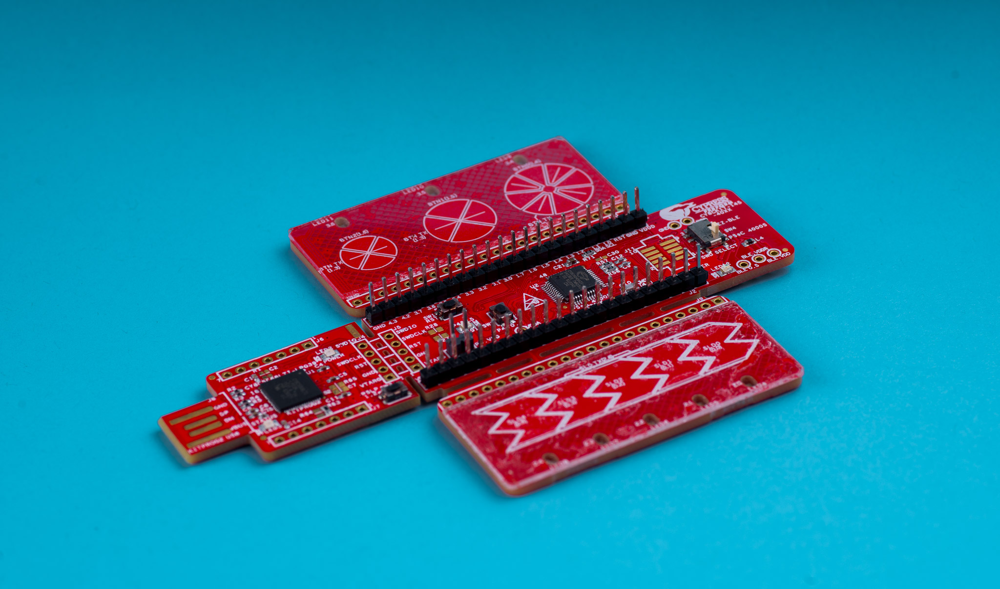
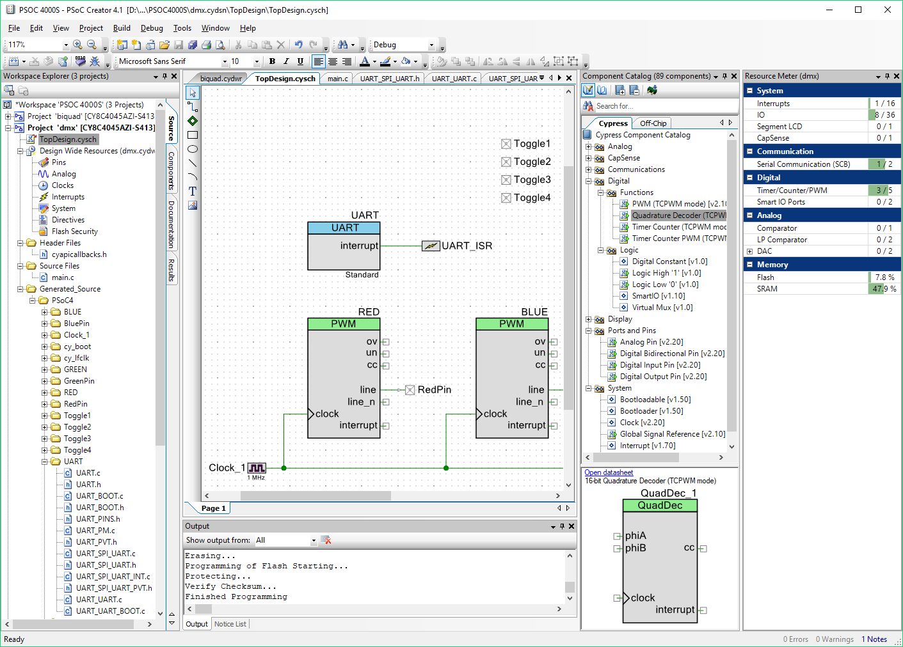
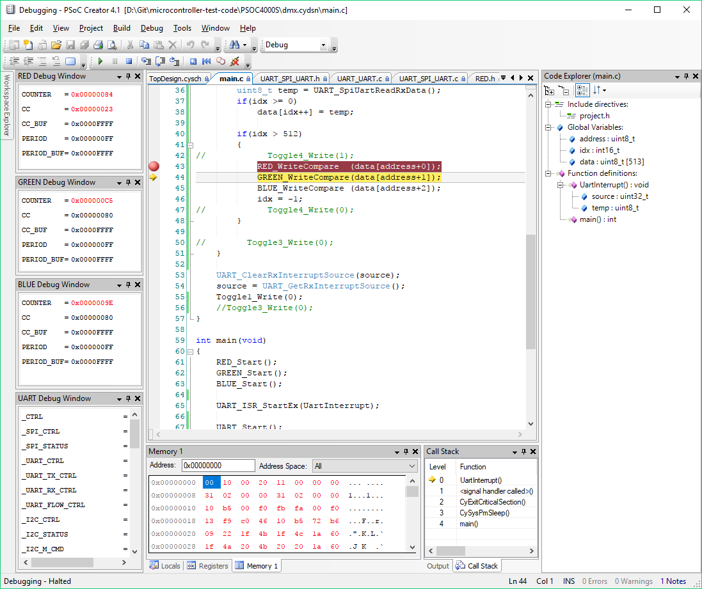

CYPRESS
PSOC 4000S

https://jaycarlson.net/pf/cypress-psoc-4000s/

September 15, 2017  Microcontrollers  [2](https://jaycarlson.net/pf/cypress-psoc-4000s/#)

Cypress makes the case that the PSoC is uniquely suited to simplify designs by integrating programmable digital and analog blocks into its microcontrollers. High-end PSoC parts have up to two dozen Universal Digital Blocks (UDBs) which can be configured as timers, serial interfaces, or digital logic function blocks. These parts also have transimpedance and programmable-gain amplifiers, along with IDACs and VDACs, and 20-bit delta-sigma ADC converters. Having said that, the PSoC 4000S reviewed here (the best-available part in the <$1 price range) brings a much more modest feature set:

- 24 MHz Arm Cortex-M0+
- 1.8 – 5.5V operation
- 16 KB flash, 2 KB of RAM
- Two comparators
- 5 TCPWM timers
- 2 serial blocks

I reviewed the CY8C4024LQI-S401, though other parts in the PSOC 4000S family run up to 48 MHz, with 32 KB of flash and 4 KB of RAM, and come in larger 48-pin packages (in the case of the CY8C4045AZI-S413).

# CORE & PERIPHERALS

The PSoC 4000S has a Cortex-M0+ — a core design I cover more thoroughly [in the main article](https://jaycarlson.net/microcontrollers/#arm).

The big difference between most PSoC devices and every other Arm microcontroller out there is the configuration bitstream that configures the peripherals, multiplexing, and programmable digital fabric. While these registers remain accessible to the CPU, part of the PSoC secret sauce is to map them into the configuration bitstream memory space, too. I imagine the main advantage of this approach is faster start-up and less flash usage.

Clocking is relatively simple on the 4000S — an internal main oscillator (IMO) runs at 24 MHz — and this can be divided down; the internal low-speed oscillator (ILO) runs at 40 kHz.

## GPIO

The 4000S has really interesting GPIO options that allow different drive modes: pull-ups, pull-downs, open-drain driving low, and open-drain driving high modes. There’s also adjustable slew rate for push-pull drive.

The only programmable logic on the 4000S is the Smart I/O module which allows basic boolean functions on the port I/O.

## TIMERS

The PSoC 4000S has 5 identical TCPWM timer blocks. Each TCPWM has a 16-bit auto-reload counter, a capture register, and a compare register. The PWM outputs have programmable dead-band and complementary output functionality for motor control and power converter applications.

## COMMUNICATIONS

The 4000S has two reconfigurable Serial Communication Blocks (SCBs) that can function as UART, SPI, or I2C modules.

In UART mode, the SCB supports standard full-duplex UART in addition to multiprocessor mode, LIN slave, SmartCard, and IrDA. There’s an 8-byte FIFO that helps offload the processor at high baud rates.

In SPI mode, the SCB supports all four SPI modes, along with programmable data frame sizes from 4 to 16 bits.

I2C mode supports master, multi-master, and slave operation.

## ANALOG

There are two comparators that can use I/O pads or any signal muxed to the analog bus, but otherwise, this entry-level PSoC device has no analog capability.

PSoC Creator is built around Cypress’s code-gen tools, which provides a schematic capture interface for instantiating and connecting components; these tools generate the configuration bitstream along with an API for the peripherals.

# DEVELOPMENT ENVIRONMENT

All Cypress PSoC development is done in PSoC Creator, which tightly integrates a schematic capture system, code generator tool, text editor, and debugger. Out of the box, PSoC Creator uses GCC 5.4 for compiling Arm-based projects (though PSoC Creator also supports the 8051 core used in PSoC 3 devices).

PSoC Creator can export projects to other IDEs, though you’ll have to repeat this process if you need to change the components in your project.

PSoC Creator is built in .NET and has an overall design that mimics Microsoft Office 2003 — making it both familiar and stale. PSoC Creator has a multiple-projects-in-a-workspace metaphor. Its text editor includes fairly zippy text-completion support, even across multiple files. There’s a resource meter that shows you real-time usage of flash and SRAM — but also of peripherals, which is an interesting perk that comes with tight hardware integration.

The Documentation tab provides nice, one-click access to PDFs that document both the datasheet and TRM for the device — but also all the components you add to your project, which you’ll consult for API information.

The code-gen tool takes the form of a schematic capture system; modules are instantiated inside the schematic and configured through property panes. I appreciate how visual this is, and it’s nice to see how signals are routed around — but it’s also somewhat clunky compared to other code-generator tools, as there’s no visual way on the schematic to implement sensible defaults; for example, to use a single PWM channel, you have to create a PWM component, a digital pin component, and a clock component, and then use the schematic editor to wire everything up.

By the way, if you’re not into code-gen tools, the PSoC ecosystem is not for you.

Even though this device has no real reconfigurable resources, you’re going to have to use PSoC Creator and its schematic-capture tools to configure your project. That’s because Cypress takes a radically different approach to software development than other MCUs — there’s no “cy8c4024.h” header file you can include in your project and start manipulating registers. Even if there were, I’m not even sure where you’d look for documentation — even the [Technical Reference Manual](http://www.cypress.com/file/230701/download) for the part doesn’t really have any standard register documentation; rather, you can read the documentation for the software components to get some hints about what’s going on behind the scenes, but even then, you’re strongly encouraged to use the generated API to do everything.

While Arm parts are usually quite favorable when it comes to open-source cross-platform development, because of this SDK design, you’re going to have to use PSoC creator at some point in project development cycle. Cypress is trying to add support for other development environments — at least once initial project configuration is finished in PSoC Creator.

 

PSoC Creator has no global register inspector like other environments; you can only view peripheral registers associated with instantiated components.

## DEBUGGING EXPERIENCE

Coming to the PSoC ecosystem from other MCUs, the debugging experience is a bit jarring. There’s no global list of registers that you can inspect and modify; instead, you must manually instantiate the relevant component debug windows you’re interested in inspecting and modifying.

I had difficulty obtaining power consumption figures in the datasheet, and having access to even basic peripheral registers — like GPIO — would have allowed me to eliminate possible sources of current consumption; instead, I dredged through several edit-build-debug iterations to track down the issue.

Flash load times were OK, but not great; PSoC Creator took 7.8 seconds to load a basic program (1.4 kB), and almost 11 seconds to load a 16 KB image into flash. However, setting breakpoints and stepping through code was fairly snappy, though variable display was a bit sluggish.

## DEVELOPMENT TOOLS

I used the [CY8CKIT-145](http://www.cypress.com/documentation/development-kitsboards/cy8ckit-145-40xx-psoc-4000s-capsense-prototyping-kit) in all my testing. This $15 dev kit has a snap-off CMSIS-DAP-compatible adapter and an onboard EZ-BLE PRoC module. I’m sure most developers will appreciate having this BLE module onboard, but I struggled to get current consumption figures down to what was mentioned in the datasheet and ended up ripping off a bunch of parts from the development board. I would have appreciated better power-isolation capabilities (and the documentation to go along with it).

A traditional Segger J-Link workflow isn’t supported by PSoC Creator — the only debug adapter supported is the [PSoC MiniProg3](http://www.cypress.com/documentation/development-kitsboards/cy8ckit-002-psoc-miniprog3-program-and-debug-kit), a $90 probe that supports all of Cypress’s devices. This device uses a high-speed USB interface and provides a performance improvement over the CMSIS-DAP probes used on the development boards. MiniProg3 is a lower-cost solution than the Atmel and Microchip high-speed USB equivalents (the Atmel-ICE and the Microchip ICD4).

# PERFORMANCE

## BIT TOGGLE

I created a “Toggle” digital output component, and compiled this code:

1. **for**(;;)
2. {
3.   Toggle_DR ^= 1;
4. }

This compiles into

```
ldr r3, [r2, #0] // 4 cycles
eors r3, r1      // 1 cycle
str r3, [r2, #0] // 4 cycles
b.n              // 2 cycles
```

which results in 11 cycles, due to the slow GPIO load-store calls.

If we use the API calls, this goes up to 21 cycles. Even though the functions are properly inlined when compiler optimizations are enabled, the API has no GPIO “toggle” function, so the only way to toggle a pin is:

```
Toggle_Write(!Toggle_ReadDataReg());
```

Even with optimizations, the `Toggle_Write()` function *has to* compile to a redundant register read, some bit math, and a GPIO register write.

The flash read accelerator works beautifully in this test — all the way up to 48 MHz, I didn’t see any wait-state effects on the performance.

## BIQUAD

The PSoC 4000S is available in two speed grades — 24 MHz and 48 MHz. The dev board I used actually has the 48 MHz part, so I down-clocked the part to 24 MHz (the only speed grade available at this price point). In this configuration, current consumption was at 3.66 mA, and the chip achieved a performance of 891.34 ksps, resulting in an efficiency of 13.64 nJ/sample. Compared to the competition, this was better than the higher-power peripheral-heavy control-oriented Arm parts but not as good as the lowest-power Arm microcontrollers.

## DMX-512 RECEIVER

The UART has a 16x or 8x oversampling rate, requiring a minimum clock of 2 MHz for the 250 ksps DMX-512 protocol. At this frequency, the PSoC 4000S pulled in 1.03 mA for the DMX-512 receiver project, which was better than every Arm microcontroller except the STM32F0.

The PSoC 4000S used 2280 bytes of flash, which was less than all other Arm parts tested (though still much more than most of the 8-bit MCUs). This illustrates the efficiency of PSoC Creator’s generated APIs when compared to runtime libraries that other vendors provide.

#  BOTTOM LINE

The PSoC 4000S may lack the peripherals that made the PSoC line of microcontrollers famous, but this low-cost part still buys you into the Cypress ecosystem. This particular MCU will easily get lost in the field of similarly-priced Arm parts, but at the same time, PSoC Creator makes getting a design up and running with this part much less time-consuming than most other Arm workflows — and this development experience has to be taken into consideration when judging the ecosystem. Plus, the higher-end PSoC devices have interesting analog and digital capabilities that aren’t always available on competing parts.

Unfortunately for Cypress, other vendors have added arbitrary pin-muxing, programmable logic, advanced analog, and capacitive-touch sensing — and at a lower price point than this PSoC device. In fact, by the yardstick that Cypress uses when selling the idea of the PSoC, the ‘4000S — with no programmable logic, only a single 10-bit ADC, two 7-bit IDACs, and a couple comparators — is actually less equipped than most other devices in this round-up.