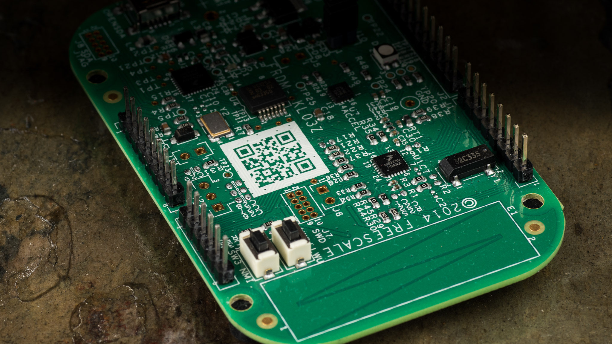
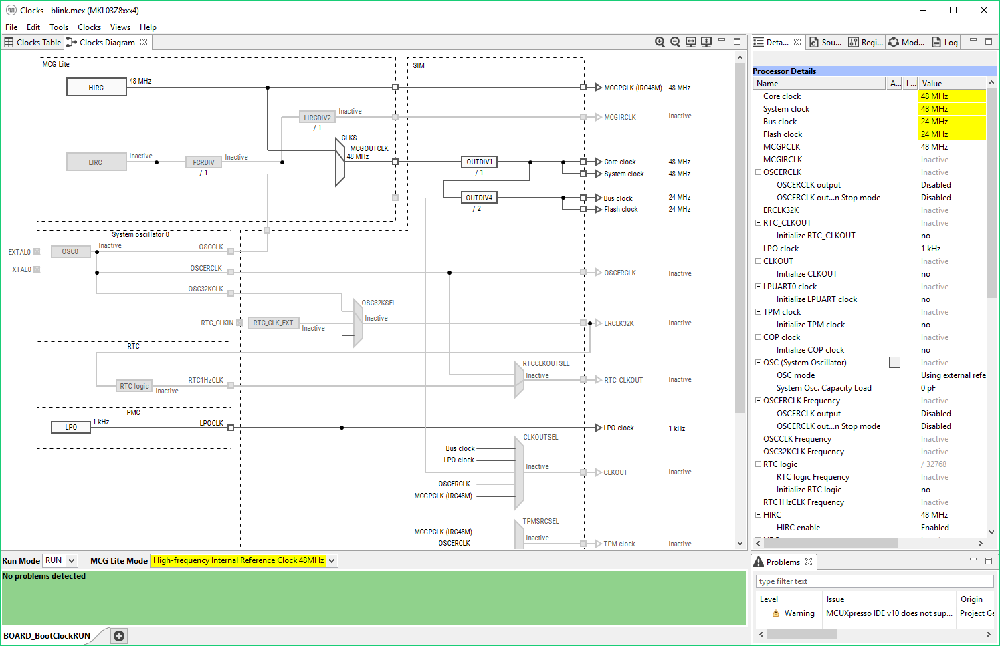
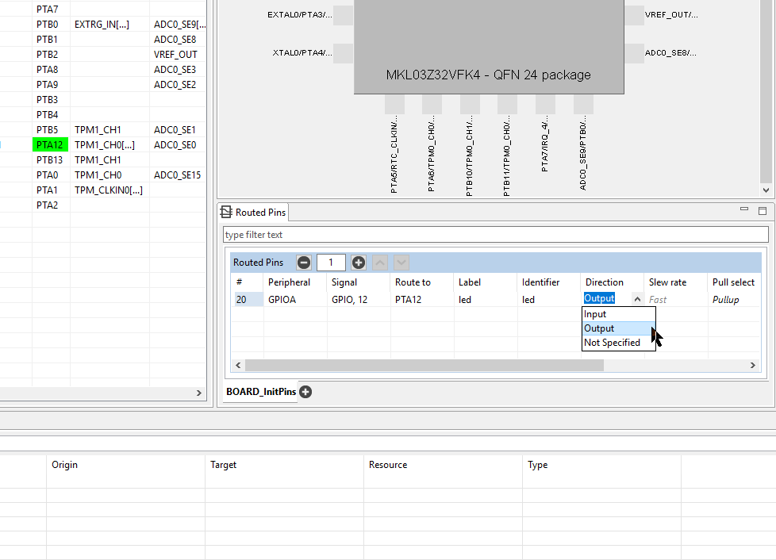
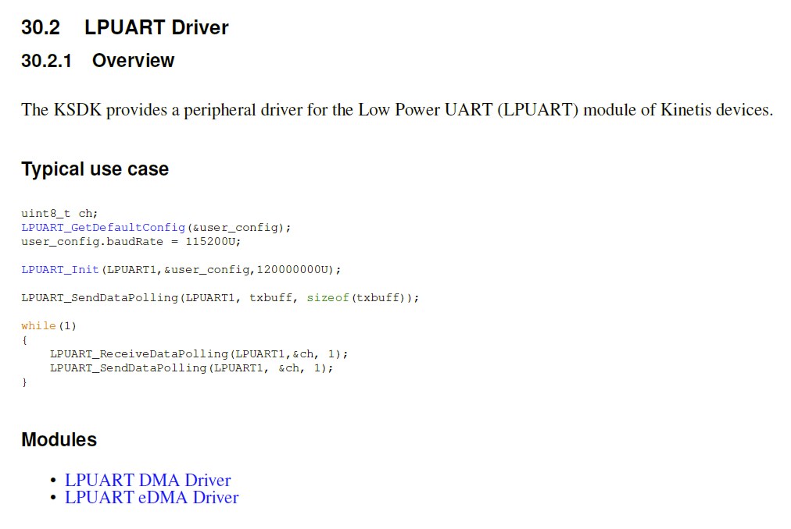
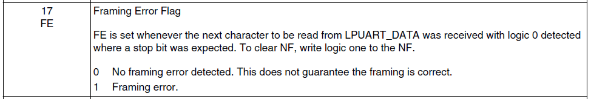
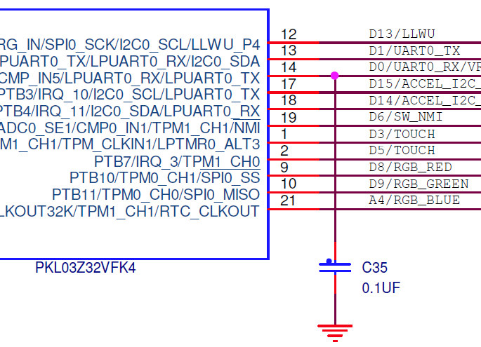

FREESCALE (NXP)
KINETIS KL03

https://jaycarlson.net/pf/freescale-nxp-kinetis-kl03/

September 15, 2017  Microcontrollers  [4](https://jaycarlson.net/pf/freescale-nxp-kinetis-kl03/#)

The L series is the low-power line of Kinetis devices from Freescale (now owned by NXP). With both QFN and teeny-weeny 2.0 x 1.6 mm WLCSP packages — plus the ability to keep an RTC running at less than 1.5 μA — this line of processors is clearly designed for portable, battery-powered applications.

We don’t get this low-leakage current for free, though — the KL-03 has higher full-speed active-mode current than other modern Arm Cortex-M0+ parts; I suspect Freescale used a larger, less-leaky process to achieve these numbers.

Here’s a run-down of the KL-03:

- 48 MHz Arm Cortex-M0+
- 8 KB of flash, 2 KB of SRAM
- Internal 48 MHz HIRC, plus low-power 8 MHz and 1 kHz oscillators
- QFN-16 package with 14 I/O
- 12-bit 818 ksps ADC with 4 channels
- Dedicated 8KB ROM with SPI, I2C, and UART bootloaders built-in
- 5 timer channels, including 4 channels of PWM
- Separate UART, SPI, and I2C modules
- Analog comparator
- On-chip 48 MHz, 8 MHz, and 1 kHz oscillators
- Lots of low-power modes for running, waiting, and sleeping

# CORE & PERIPHERALS

The KL03 uses a Cortex-M0+ core. I discuss this processor in my [main article](https://jaycarlson.net/microcontrollers/).

## TIMERS

There are two 2-channel Timer/PWM Module timers, along with an RTC and LPTMR module. Each of the Timer/PWM Module (TPM) has a 16-bit auto-reload (period) timer with two channels supporting input capture, output-compare, or PWM, for a total of 4 channels.

## COMMUNICATIONS

The LPUART (low-power UART) module is a full-duplex UART mdoule with configurable oversampling from 32x all the way down to 4x (helpful for reducing the clock speed for power-sensitive applications) — it can also be clocked asynchronously outside of the bus. The UART supports LIN break detection without resorting to detecting framing errors. The UART also has a match feature that can help offload typical CPU-involved tasks. There’s no support for hardware flow-control or RS485 TXEN signaling — though the UART can operate in a single-wire half-duplex mode.

The SPI peripheral supports full-duplex communication up to 12 MHz. Just like the UART, there’s a match function that can interrupt the CPU when a correct byte value is received.

The I2C peripheral supports, master, multi-master, and slave modes, 7- and 10-bit addresses, and address range matching.

## ANALOG

The analog-to-digital converter supports 12-bit resolution into 7 channels (4 for the smaller 16-pin QFN). There’s external hardware conversion triggering support, plus a hardware averaging mode. The chip has an internal 1.2V bandgap reference, available to analog peripherals, as well as to a pin on the package.

There’s also a single analog comparator that can be driven from external pins, as well as 64-tap resistor divider.

# DEVELOPMENT ENVIRONMENT

While you can use Kinetis Design Studio to develop with the KL03, NXP is pushing its own MCUXpresso environment pretty hard, so that’s what I used for evaluating this microcontroller. MCUXpresso is an Eclipse Neon-based IDE that’s been lightly augmented with an MCUXpresso-specific debug configuration system, but otherwise, has typical [GNU MCU Eclipse](https://gnu-mcu-eclipse.github.io/) tools integrated.

While MCUXpresso doesn’t have a built-in config tool, the MCUXpresso Config Tools (separate application) works well for what it does. Too bad it integrates so poorly with MCUXpresso IDE.

### CODE GEN TOOLS

The old way of doing code-gen on Kinetis was with Processor Expert — the new way is using MCUXPresso Config Tools, a stand-alone lightweight program that can configure clocking, pin muxing and…. well, that’s about it. I was surprised how bare-bones it was; not even letting you initialize peripherals.

And some of the stuff it claims to do, it’s just lying about. There’s a nice little pane below the processor top-view that seems to allow you to set up GPIO pins with their direction, pull-up, drive strength, and even labeling. I spent a good 30 minutes trying to figure out why I couldn’t get my little LED to blink when calling GPIO_WritePinOutput(). Turns out the GPIO_PinInit() function was never generated by MCUXpresso Config Tools. Whoops! That’s OK, though — engineers are pretty cheap to pay to sit around and troubleshoot this stuff.

MCUXpresso Config Tools is such a trickster — it gives you options to label and set the direction of GPIO pins. Don’t spend too much time diligently working through this, though: the tool doesn’t actually use this information to generate any GPIO initialization routines. You’ll be doing that yourself. Why is this in the tool? Who knows.

While other vendors make stand-alone config tools that can generate project files for a wide variety of IDEs that these vendors don’t even make, MCUXpresso Config Tools *can’t even manage to generate a config file for its own IDE*. When you click the “generate project” button in MCUXpresso Config Tools, it generates some weird xml/gen/mex file collection that has nothing to do with MCUXpresso IDE’s project file format.

If you want to bring this into MCUXpresso IDE, you have to click the “Import SDK example(s)…” button in MCUXpresso. “*Wait, SDK examples? I thought we were importing a code-generated project?”* — yeah, but, in NXP’s twisted universe, there’s no difference. Choose a board (*why? —* I don’t know), and then click Next. Ignore everything on the page except for the little, unlabeled icon with an arrow pointing into a box — this is how you import your code-gen project.

Forget to mux a pin correctly? No problem, just head back to MCUXpresso Config Tools and fix the configuration. When you’re done, you’ll see a shiny button that says “Update Project” — go ahead and click it, then go back to MCUXpresso IDE and notice that absolutely nothing happened. When you imported the “SDK Example(s)” you really just **copied** them. So the only way to update the project is to go through the whole process again, and then rewrite all your code.

This is an utter disaster.

I ended up exporting the “generated project” into a subfolder in an already-created MCUXpresso IDE project; I had to clear out the “src” folder and configure the Paths and Symbols Properties to include the header and source folders inside the generated folder. It’s a total hack, and means that it takes quite a bit of time to start a new project.

By the way, if you’re shuffling around between multiple projects, be careful: MCUXpresso Config Tools will remember the last place you generated the project; this gets retained even when you open different mex files.

It’s absolutely incredible that Freescale has gone from the company with the best code-gen tool out there, to a company that produces absolutely worthless tools that have to be hacked together to get anything done. Imagine being a first-time Arm microcontroller user, trying to navigate this mess?

Hey, at least the MCUXpresso Config Tools throws error messages at you to prevent you from generating invalid clocking configurations that won’t work on your part. [Atmel can’t seem to figure out how to do that](https://jaycarlson.net/pf/atmel-microchip-sam-d10/#start).

Just how bad is the Kinetis SDK documentation, you ask? This is the only “complete” code example for the UART peripheral, and the functions that it calls — SendDataPolling() and ReceiveDataPolling() — don’t even exist in this version of the API. Whoops.

## KINETIS SDK

By now, you’ve realized that the code-gen tools are really just clock and pin-muxing. If you want to actually do anything with those peripherals you just clocked and pin-muxed, you’ll have to use the Kinetis SDK, a runtime peripheral library.

KSDK is a light-weight C API that consists of thin-layer APIs that each sit on top of the individual peripheral modules. This is a library that’s built for people who have good, fundamental understanding of Kinetis peripherals. KSDK feels like a knee-jerk counterpoint to Processor Expert; it’s jarring to use if you come from that development environment, since all the sudden, you’re going to have to keep reference manuals on your screen at all times, and you’ll be constantly reading then content of KSDK functions to see precisely what they do and if they’re suitable to call.

Consequently, KSDK has an extremely steep learning curve.

For people who are interested in getting their projects plumbed quickly so they can focus on the application itself, KSDK is not for you. Each peripheral library module is confined solely to that peripheral, which wouldn’t be a problem on an 8-bit MCU, but on a modern Arm microcontroller with complex clocking requirements and power gating, you’re actually going to be juggling several different KSDK modules just to get one peripheral working.

As an example, to initialize the LPUART (low-power UART), you need to:

```c
CLOCK_SetLpuart0Clock(1U); /* Set LPUART0 clock source. */

PORT_SetPinMux(PORTB, PIN1_IDX, kPORT_MuxAlt3); /* PORTB1 (pin 13) is configured as LPUART0_RX */
PORT_SetPinMux(PORTB, PIN2_IDX, kPORT_MuxAlt3); /* PORTB2 (pin 14) is configured as LPUART0_TX */

SIM->SOPT5 = <sup id="footnote_plugin_tooltip_1" class="footnote_plugin_tooltip_text" onclick="footnote_moveToAnchor('footnote_plugin_reference_1');">1</sup><span class="footnote_tooltip" id="footnote_plugin_tooltip_text_1">SIM->SOPT5 &
 (~(SIM_SOPT5_LPUART0RXSRC_MASK</span>%MINIFYHTML3a744bacb36a0379d8deb02ba8b59a0023%) /* Mask bits to zero which are setting */
 | SIM_SOPT5_LPUART0RXSRC(SOPT5_LPUART0RXSRC_LPUART_RX) /* LPUART0 Receive Data Source Select: LPUART_RX pin */
 );

lpuart_config_t user_config;

LPUART_GetDefaultConfig(&user_config);

config.baudRate_Bps = 9600;
config.enableRx = true;
config.enableTx = true;
LPUART_Init(LPUART0, &config, CLOCK_GetFreq(SYS_CLK));
LPUART_WriteBlocking(LPUART0, "Hello world", sizeof("Hello world"));
```

Notice that we’re using four separate peripheral calls: CLOCK, PORT, LPUART, and SIM (and for SIM, we’re not even using KSDK APIs — just interacting with the raw registers).

Unlike other peripheral libraries, KSDK doesn’t attempt to manage hairball stuff for you. No, you can’t just tell it that you want to use B2 as a UART transmit pin; you need to read in the processor datasheet which alt mode corresponds with that function, and pass that along to KSDK.

Full disclosure: I am **not a fan** of this style of peripheral library. To me, it feels like KSDK is just being lazy. It’s as though Freescale/NXP doesn’t want to take the time to write up all this meticulous crap that has to go on under the hood to be able to abstract this stuff — so they’ll just pass the buck along to you. My guess is they got a little trigger-shy after trying to maintain Processor Expert for their ever-changing list of products.

I hope they’ll come up with something more useful. Imagine a hypothetical re-imagining of the LPUART initialization routine:
```c
const lpuart_config_t user_config = {
 .baudRate_Bps = 9600,
 .enableRx = true,
 .enableTx = true,
 .txPin = Pin_B1, // mux pin B1 as TX
 .rxPin = Pin_B2, // mux pin B2 as RX
};
LPUART_Init(LPUART0, &amp;amp;config);
LPUART_WriteBlocking(LPUART0, "Hello world", sizeof("Hello world"));
```
Here, the lpuart_config_t struct would have all-zero “defaults” — which means parameters like “number of stop bits” or “parity” or “data bit count” all have to have “0” correspond with their defaults. Suddenly, enums would not relate directly to the underlying hardware’s bits, but rather, simply convenient abstractions. But who cares?

This would also mean that LPUART would have to have knowledge of the PORT module, and then tell the PORT module to mux the pins in the desired way. Look-up tables would have to be generated for each processor so that the peripheral runtime would know that Pin_B1 has a TX alt function setting of “Alt3” — and LPUART would have to ask CLOCK what the system frequency is.

I think meticulous, detail-oriented people who want to rack up a lot of billable hours will have no complaints about KSDK, but personally, it makes me feel like a human compiler. I was trying to get three channels of PWM going (spread across the two TPM modules on the MCU). Here’s the code I had:
```c
// Timer Config
tpm_config_t tpmInfo;
TPM_GetDefaultConfig(&tpmInfo);
TPM_Init(TPM0, &tpmInfo);
uint8_t updatedDutycycle = 0U;
tpm_chnl_pwm_signal_param_t tpmParam[2];
tpmParam[0].chnlNumber = kTPM_Chnl_0;
tpmParam[0].level = kTPM_LowTrue;
tpmParam[0].dutyCyclePercent = 0U;
tpmParam[1].chnlNumber = kTPM_Chnl_1;
tpmParam[1].level = kTPM_LowTrue;
tpmParam[1].dutyCyclePercent = 0U;
TPM_SetupPwm(TPM0, tpmParam, 2, kTPM_EdgeAlignedPwm, 1000, CLOCK_GetFreq(SYS_CLK));
TPM_SetupPwm(TPM1, tpmParam, 1, kTPM_EdgeAlignedPwm, 1000, CLOCK_GetFreq(SYS_CLK));
TPM_StartTimer(TPM0, kTPM_SystemClock);
TPM_StartTimer(TPM1, kTPM_SystemClock);
```
When I set-up TPM1, KSDK called something that was hard-faulting the processor. The Kinetis nerds reading this will quickly notice the problem, but it probably took me at least half an hour to work through *(I’ll leave the answer as an exercise!)*

This is the stuff I thought I was done with — I thought we figured out how to make peripheral initialization and configuration just work, so we can focus on the interesting, application-specific problems we love solving.

## DOCUMENTATION

The KSDK documentation is essentially just an API reference sheet — list of the functions, their parameters, and return types. Brief, one-sentence explanation of what the function does. A conservative smattering of example snippets of code is sprinkled throughout, but it’s usually not much help.

Instead, KSDK leans heavily on “peripheral driver examples” — a collection of projects you get to import into your workspace, load on the board to see what they do, and then step through the code, line-by-line, trying to make sense of everything. You then copy and paste this junk into your own project, hack away at it a bit, and hope for the best.

I’d prefer a simple, concise set of instructions in the Kinetis SDK manual that instructed me how to configure each of the peripherals to do all of their supported tasks. Sure — it’s a lot of work to put that documentation together, but many other manufacturers have taken the time; why can’t NXP?

The documentation for the Framing Error (FE) flag instructions you to clear the Noise Flag (NF) by writing a logic one to the NF. There are tons of typos like this throughout the reference manual.

Honestly, since KSDK is just a wrapper around the underlying peripherals, your main source of documentation isn’t going to be your peripheral library — it’s going to be the 613-page reference manual.

The KL03 family reference manual is little more than a list of registers, with a few pictures illustrating the peripheral in use. The FRM has no code examples or configuration procedures for any of the peripherals.

Why the heck is there a 0.1 µF capacitor across this RX pin?!

## DEVELOPMENT TOOLS

The FRDM boards were Freescale’s attempt to compete with all the low-cost development tools — unfortunately, they suffer the same “evaluation kit” marketing bloat that other dev boards do: yes, you get a microcontroller and a debugger built-in. But you also get:

- An RGB LED
- A MMA8451Q accelerometer
- Some random thermistor thing
- Plenty of random pull-ups, debouncing filters, push-buttons, and mysterious zero-ohm switch resistors everywhere.

In fact, of the 22 I/O pins on this board, **only three** of them are completely free of extraneous circuitry: A5, A6, and A7.  This means that you have to be extremely careful when trying to do **anything** on this dev board other than running the pre-programmed demos.

For example, while you can certainly send and receive data from the built-in USB UART at 9600 baud, don’t think that will translate to higher bit rates or arbitrary transmitters — there’s a whopping 0.1 µF capacitor across the RX pin, which will completely destroy any high-speed communication you want to do. Why did they put that capacitor there? Because all the pins are heavily multiplexed, and in some other alternate-function universe, that pin is used as a VREF capacitor.

This is the kind of stuff that absolutely kills productivity — I probably spent an hour going back and forth between my computer and my workbench, removing zero-ohm resistors to try to isolate stuff.

And the problem is that even when they do design something properly on the board, you don’t *know* that they did, because it’s not in the documentation (or if it were, it would take too long to find and read). *This is a dev board you can’t trust.* When I couldn’t get my transmitting code to work right, I started popping off the zero-ohm switch resistors on the board that connected the target MCU to the onboard USB-to-serial converter. That didn’t fix the problem (since Freescale made the USB-to-UART buffer tri-stated when the port isn’t open on your computer, it won’t interfere with things), but I *couldn’t trust it*. There’s nothing more maddening than that.

## DEBUGGING

Just like the ST-Link and a few other vendors’ on-board debuggers, the FRDM boards support running an alternative J-Link firmware, in addition to the PE Micro OpenSDA debugger firmware. I’m not really sure why you *wouldn’t* immediately upgrade every FRDM board you ever buy with the J-Link firmware, as it’s extremely fast, reliable, and supports unlimited breakpoints (“for evaluation only” — whatever that means?).

To swap out firmware, unplug the FRDM board and while holding down the boot button next to the USB connector, plug the board in again. [Download the OpenSDA V1](https://www.segger.com/downloads/jlink/OpenSDA_V1) version of the J-Link firmware image and copy it onto the USB MSD that appears on your computer when the FRDM board is in bootloader mode.

It took 5.5 seconds to start a debug session and break on the main() function. Debugging in MCUXpresso is completely average for an Arm development environment, with very few bells and whistles. Many of the MCUXpresso-specific debugging features only work with LPC debuggers, and not the FRDM boards from the Freescale acquisition. Strangely, it’s not clear that NXP even *wants* you to be in debug sessions. This is an Eclipse-based IDE, yet when you start debugging, it keeps you in the developer perspective; if you click to switch to the Debug perspective so that you can look at memory, inspect and change variables, set breakpoints, view the disassembly, look at the call stack — you know, unimportant stuff like that — MCUXpresso will dump you back in the Developer perspective immediately. You can change it in the preferences menus, but why is this the default?

# PERFORMANCE

As annoying as the development ecosystem can be, it has to be said that this chip is fast. For the biquad test, I set GCC optimization options to -O2 and also ensured it wasn’t doing loop unrolling. The KL03 achieved a throughput of 1.542 MSPS, drawing 5.21 mA of power for an efficiency of 10.45 nJ/sample — one of the best results I’ve seen.

FGPIO uses the Cortex-M0+’s 1-cycle store that bypasses the AHB (versus regular 2-cycle STR accesses). Coupled with a two-cycle Cortex-M0+ unconditional branch instruction, this should yield a 3-cycle bit-wiggle. However, as is often the case with fast MCUs, we’re limited by our flash memory controller, which only has a 24 MHz clock.

Out of the gate, the MCU can only execute the bit-wiggle program at 6 clock cycles per wiggle, due to default caching behavior with the flash memory (essentially handicapping the core to 24 MHz in this particular operation). But when prefetch speculation is enabled for both data and instruction memory, this decreases to a 4-cycle bit-wiggle.

Oddly, this is still a cycle longer than it should be. I’ve verified that if I run the flash and CPU clock at the same rate (24 MHz), this 4-cycle period is reduced to 3-cycle.

This seems to indicate that the flash prefetch is unable to cache properly. I’m not sure if there are additional steps I need to take to decrease the speed to 3 cycles, but Kinetis SDK doesn’t provide any mechanism for further configuration, and the reference manual doesn’t have any additional hints.

This is very strange, as the KL03’s sister chip in this review, the [KE04](https://jaycarlson.net/pf/freescale-nxp-ke04/), executes this same code in 3 cycles @ 48 MHz.

## DMX-512 RECEIVER

I struggled over the course of a few nights to get this working on the KL03. While Processor Expert provides highly customizable callbacks and methods, KSDK has two extremes: low-level functions that manipulate registers, and super high-level functions that have precisely one way of working.

The DMX-512 receiver project was a perfect illustration of the doughnut hole in the middle that other MCUs’ code generator / peripheral libraries can handle; KSDK has no high-level callback mechanism for anything other than vanilla UART transactions; there’s no API to register a callback on a framing error, which is the “hack” that makes DMX-512’s start-of-frame receivable with nothing more than a UART.

Because KSDK didn’t have this mechanism, the only way for me to implement it was by bypassing KSDK altogether and implementing the LPUART0_IRQHandler() function myself.

I think my knowledge gap was in forgetting that I needed to study the reference manual thoroughly to ensure I was babysitting the UART when necessary; in this case, that meant clearing any exception flags (framing errors, overrun errors, etc) inside the interrupt. KSDK has functions to do some of this stuff, but everything goes back to the fact that there’s essentially no documentation for KSDK, so it’s challenging to figure out precisely what needs to be done unless you back up and read the reference manual directly.

After two nights of struggling, I finally got the UART and the timer working properly. While the KL03 blazed through the other performance measures, it struggles with this one; the lowest clock speed I could get the microcontroller down to was a 4 MHz speed all around (core, bus, flash, peripherals). Anything lower than that, and the microcontroller started missing bytes from the DMX frame.

Just like with all the other microcontrollers, I put the KL03 in a “wait” mode in the main loop to reduce power consumption; all said, the KL03 pulled 1.31 mA during the DMX receiving.

While I disconnected the MCU’s own VDD supply for current measurement, I haven’t finished unsoldering all the crap on this board — these power measurements might be affected by that, but only marginally (this 1.31 mA figure is similar to what the datasheet quotes).

Code size could become a huge issue on “real” projects — this DMX-512 project was compiled for -Os, with link-time optimization enabled as well, and it used 5284 bytes of flash (65% of our 8KB part) and 964 bytes of SRAM (47% of our 2K of RAM).

I understand a lot of this is startup code and reusable peripheral code, but this could really handicap you down the road.

# BOTTOM LINE

The KL03 has a basic set of peripherals and relatively low memory density for the price — but it has good low-leakage power consumption.

In many ways, NXP seems to be aligning the dev tools to be more similar to how other Arm vendors are doing things — run-time peripheral libraries that you pass config structures into to get up and running.

At the same time, most other Arm vendors are actually moving *toward* what NXP is walking away from with Processor Expert. ST has STM32Cube, Infineon has DAVE, Atmel recently rolled out START, Cypress has PSoC Creator.

I wouldn’t recommend this part to someone getting started with Arm microcontrollers, since there’s so much else out there in the same price range that has better peripherals, a more sane development environment, and development tools that have better out-of-the-box productivity.

At the same time, if you’re working on an ultra-low-power project that would benefit from excellent low-leakage power consumption, and you don’t mind spending quite a bit of time learning a new platform at a fairly deep, fundamental level, this is a tough microcontroller to beat. It has some of the best compute-per-nJ performance I’ve evaluated, and it also has excellent deep sleep capabilities.