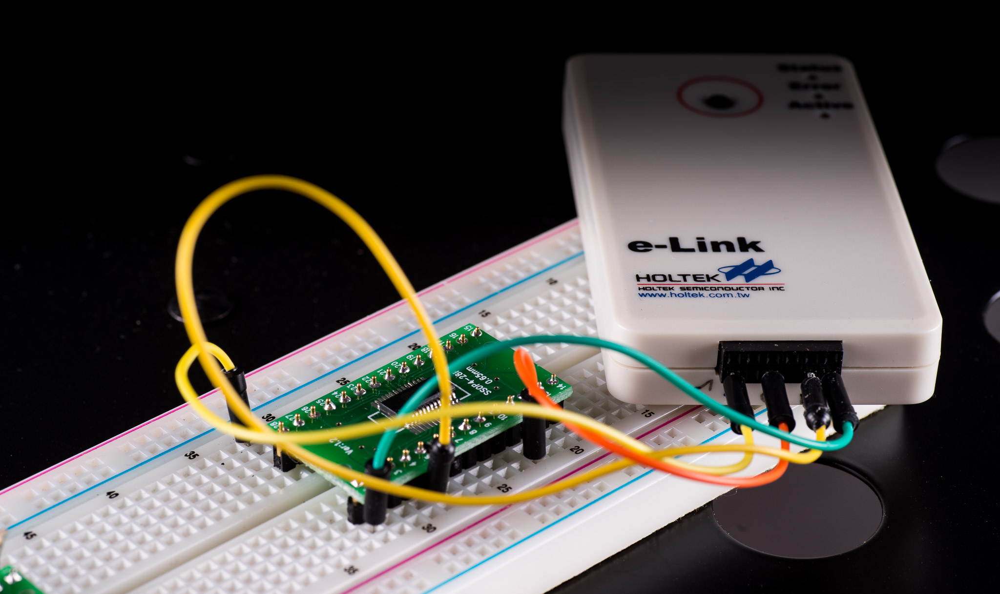
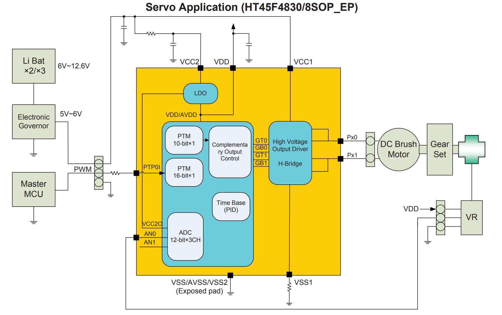
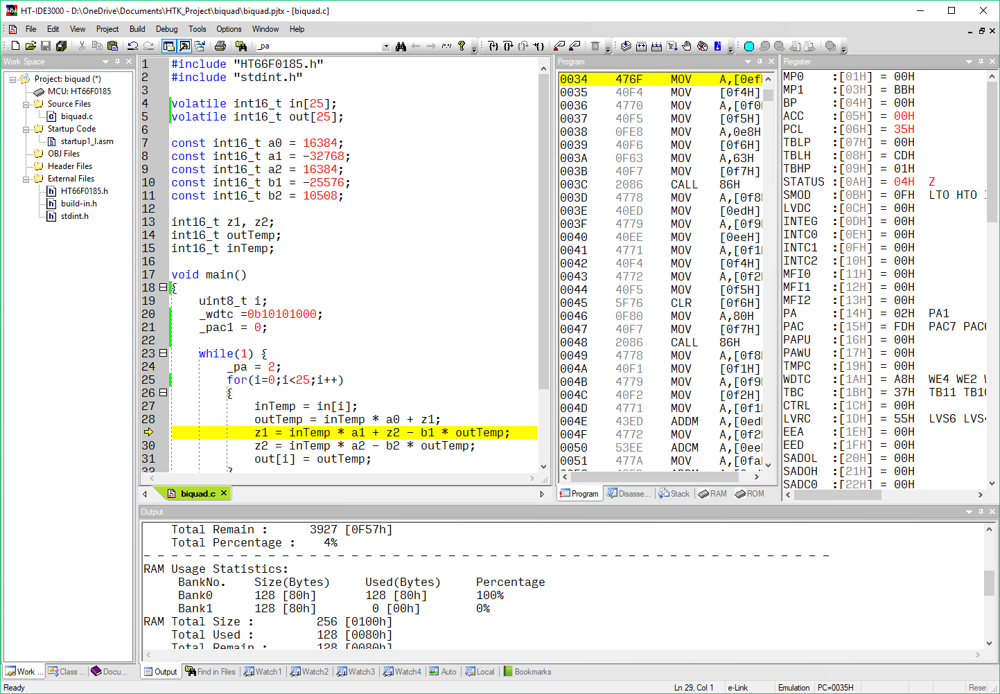

HOLTEK
HT-66

https://jaycarlson.net/pf/holtek-ht-66/

September 15, 2017  Microcontrollers  [6](https://jaycarlson.net/pf/holtek-ht-66/#)

The HT66 is an entry-level general-purpose 8-bit MCU manufactured by Taiwanese-based Holtek Semiconductor. I’m calling this line of microcontrollers the HT66, even though this is not an official designation from Holtek; in fact, they seem to have no designation for their core — only referring to these chips as “8-bit flash MCU” — which includes the HT45, HT46, HT48, HT66, HT67, and HT68 series (all have the same 8-bit core I’m referring to in this review). The HT66 looks like the mainstream, high-end series in this line-up, so it’s as good of a name as any other. Still, at only [30 cents per unit at 100 qty](https://lcsc.com/product-detail/HOLTEK_HT66F0185_C81481.html), don’t think of this part as particularly high-end.

 

Note that Holtek also makes microcontrollers in the HT85 series (which are 8051-type MCUs), as well as the HT32 series (which are ARM Cortex-M0 parts).

Holtek is probably most known for their application-specific MCUs, of which there are *many*. On their website, they include MCUs specialized for LCD, USB, Motor Control, Health & Measurement, Battery Charger, Touch, Voice/Music, and “Special Purpose” (whatever that means).

The HT45F4830 is an example of one of Holtek’s application-specific MCUs — this one contains everything you need to build a one-chip hobby servo solution; just add some caps!

Some of these application-specific MCUs are *essentially perfect* for a given application. For example, Holtek’s [HT45F4830](http://www.holtek.com.tw/productdetail/-/vg/45F4830) Digital Servo Flash MCU is an 8-pin IC with an integrated 10V, 800 mA H-bridge, 10V LDO, plus two additional I/O with analog and timer capture capabilities — in other words, a single-chip hobby servo controller, just waiting for someone to plop it down on a board with some decoupling caps, and write 15 lines of code to control it.

On the other hand, it’s hard to imagine how some of these specialized MCUs compete. Sure, they have specialized BLDC motor controller MCUs, but the only special sauce these contain is a nice 6-channel PWM module, and a timer peripheral that can clock in Hall effect sensors — nothing overwhelmingly more useful than what many other MCUs in this review project contain. And economies of scale most certainly favor nonspecialized, general-purpose MCUs that can be made in higher volume: even when these parts have unnecessary peripherals that have added cost when compared to the more specialized ICs, then win.

Since this review project focuses on general-purpose MCUs, I reviewed the [HT66F0185](http://www.holtek.com.tw/productdetail/-/vg/ht66F0185), a 28-pin model with the widest peripheral selection I could find. It’s important to note that most of this review is totally relevant to their huge line of application-specific MCUs as well — since they all use the same core and basic peripheral structure.

Features:

- 20 MHz maximum clock
- 16 MHz and 32 kHz internal oscillators
- 4K of flash, 256 bytes of RAM
- 128-byte EEPROM
- Eight-channel 12-bit ADC with a maximum 125 ksps conversion rate
- UART and a single SIM (serial interface module), supporting SPI or I2c slave communication (but not concurrently!)
- LCD segment driver
- Analog comparator with optional 40 mV hysteresis
- 20-28 pin SOP and SSOP packages available, with 26 available for I/O (no hardware reset pin!)

# CORE & PERIPHERALS

The HT66 feels quite similar in design to a Microchip PIC16: a 4-cycle single-accumulator RISC architecture, with an 8-level stack for saving the PC address, plus a banking arrangement used to address more than 256 bytes of memory. Unlike the PIC16, there’s a single 128-byte SFR set placed at the bottom of RAM. The remaining 128 bytes of addressable space are split into two banks to cover the 256-byte capacity this part has. The 63-instruction ISA is similar to the PIC16, but also includes bit manipulation instructions.

## TIMERS

The HT66 has three CCP-capable timer channels of various resolutions.

TM0 and TM2 are 16-bit, while TM1 is 10-bit. Each of these timers has capture, compare, and PWM modes, in addition to standard interrupt generation, pulse output, and similar functions.

One interesting space-saving design I like is that the 16-bit timers support 16-bit PWM, but save an 8-bit register by instead giving you the “high byte” period register. This gives you coarser period control when compared to having a full 16-bit period register, but in every PWM application I’ve built, I’ve never needed fine control of the PWM period — just the duty cycle.

## ANALOG

The ADC is an 8-input, 12-bit design with a maximum conversion rate of 125 ksps. The ADC also allows you to measure fractions of VDD, as well as VR (an internal reference voltage). The ADC can measure signals relative to VDD, or an external VREF signal — or, it can generate a VREF signal (using an internal reference with a 1-4x PGA), measure signals relative to this, and also output this value on a pin (useful for low-voltage ratiometric sensors). While I would like to have seen an input mux with more pins, Holtek is known for good-quality low-drift ADCs for industrial applications, and I have confidence this part would hold up well in that scenario. Even at maximum speed, the ADC only has a differential nonlinearity of ±3 LSBs (0.732%).

The LCD controller allows you to interface with bare LCD panels; the driver allows 6 COM terminals and 20 segments (20×6 = 120-segment panels). You can also configure all pins as segment drivers with a shared common terminal, for up to 24-segment displays. Bias current is adjustable in 4 steps from 8.3 – 100 µA, and voltage can be adjusted in three steps from 0 to VDD.

## COMMUNICATIONS

The UART features an internal baud-rate generator, full-duplex operation with both 8 and 9-bit data lengths, a 2-byte-deep FIFO, and receiver error detection. It uses an x16 or x64 sample clock, and can also detect and send breaks.

The serial interface module (SIM) supports either SPI or I2C modes; in SPI mode, there’s a simple two-register configuration set-up with coarse clock division from fsys/4 to fsys/64, but also allows using TM1 to generate a precise frequency. Otherwise, the SPI is standard fair — comparable to any other 8-bit MCU you’ve used.

The I2C interface is more complex, with additional configuration and status registers to handle START/STOP and ACK processing, and slave address matching. Note that the H66’s SIM *only supports I2C slave mode*, not master mode — I assume this is because i2C master mode can be implemented using bit-banging without requiring much effort. I would have preferred a single read-only register that provided a “state” representation inside the interrupt context — this would make implementing an SMBus-compliant slave much less verbose (essentially, it would be a switch-case statement). Instead, there are disparate flags that must be checked individually to determine the next operation to perform.



## DEVELOPMENT ENVIRONMENT

The only game in town for targeting Holtek MCUs is HT-IDE3000: their free in-house IDE. It’s a one-click download and installation process — there’s no additional compilers or libraries to download and install, and the entire process is registration-free. While many of the proprietary IDEs reviewed in this series look like they belong in Windows 98, HT-IDE3000 turns up the notch with a decisive Office 2003 look, and a name best suited for a hip-hop artist peaking at about that time as well.

Under the hood, IDE3000 calls into Holtek’s C compiler, seemingly called HCC. The compiler and SDK provide named bitwise definitions of every register on the microcontroller, accessible both as bitfields in structs, as well as singletons. I really enjoy this nomenclature when compared to read-modify-write instruction sequences (even if they intelligently get compiled into set-bit/clear-bit instructions, a la AVR-GCC).  The major annoyances with the compiler are that it’s missing standard includes (like stdint.h), and doesn’t have much in the way of optimization options. But, in my tests, it seems to generate code with similar instruction counts as the Atmel tinyAVR (another RISC-type MCU), as well as the PIC16 (its closest competitor, in terms of architecture). That tells me that the compiler must be about as good.

There are no peripheral libraries or examples included with the development environment — rather, Holtek provides a few app notes that cover some — but not all — peripherals. There are a few glaring omissions, such as the UART peripheral. These microcontrollers have a basic architecture, but there are a few

## DEVELOPMENT TOOLS

Holtek offers a smattering of development boards, but I opted to buy an [e-Link debugger](https://world.taobao.com/item/40606474716.htm?fromSite=main&spm=a1z09.2.0.0.1f30a53fU2EB4E&_u=d342i8db0c5b) along with a few bare [HT66V0185](https://world.taobao.com/item/537785438025.htm?fromSite=main&spm=a230r.1.14.4.ebb2eb2DTrLxD&ns=1&abbucket=8#detail) ICs from Taobao, though these are also available from [Holtek USA’s samples page](http://holtekusa.com/tool.html). No, that “HT66V0185” is not a typo — to save a buck, Holtek omits their on-chip debugging hardware from their production parts. If you want on-chip debugging for the HT66**F**, you need to buy the corresponding HT66**V** part. In 2017, it seems patently ridiculous to still require separate emulation versions of MCUs, but it’s still fairly common among these high-volume parts (many of which are also OTP or mask-programmed).

Having said that, I must admit the entire system worked almost flawlessly throughout my review; the documentation is clear, there was no configuration beyond having to specify the MCU during project creation, and the entire debugging system is tightly integrated into HT-IDE3000. This last point was most interesting about the debugging ecosystem: there is no separate programming/debugging view — instead, whenever you build the project, it is quietly uploaded to the board, and a debugging session begins. And it’s fast — much faster than the Eclipse-based toolchains with which I’m used to developing ARM projects. When you hit “Build” you’ll end up on main() breakpoint in 4.1 seconds.

The debugging commands are a bit confusing; “Step” (F11) is core instruction stepping; you can hit “Step over” or “Step into” (F10 and F8 respectively) to step through logical lines of C source code.

The hardware provides 7 hardware breakpoints (a nice perk when compared to most other MCUs in this review), but other than that, the on-chip debugging is extremely basic: there’s no conditional breakpoints or tracing support. There’s a separate real-time RAM monitor, but it’s not integrated into the IDE very well (it’s a pop-up window that requires you to type the absolute addresses of the locations you want to monitor) — also, I’m almost positive that it works by halting the core, reading the RAM, and then continuing — which would interfere with the firmware running on the target.

## PERFORMANCE

In one word: *slow*. Two words? *Really slow*. But there’s more to the story. Read on:

Toggling a pin takes 16 clock cycles. It’s a 4T architecture, so divide-by-four to get the number of instruction cycles: 4. To wiggle PA1:

```assembly
MOV A, 2H    ; move 0x02 (bit1 mask) into A (1 cycle)
XORM A, PA   ; XOR the contents of A with PA; save back to PA (1 cycle)
JMP          ; jump back to the MOV instruction (2 cycles)
```

You may think you can save an instruction by jumping to the second — instead of the first — line of code. However, it appears that A gets overwritten with the value before it’s written back to the port — i.e., the XOR operation actually takes place in A. This is why we have to reload the immediate value each time.

The biquad performance was the worst we’ve seen. The compiler can’t split arrays across multiple banks, so the largest array you can store is whatever you have left over in a bank of RAM (after excluding stack and SFRs). I had to reduce my 64-byte arrays to 25-byte, just to get the code to compile. Once I got it to compile, I had to check my numbers several times: this part was only able to hit 2.71 ksps, while running at 3.3V. The lower voltage required me to use a 12 MHz oscillator to keep everything in-spec, but in controlled (T = 25° C) environments, I was able to use the 16 MHz oscillator at 3.3V, which boosted performance to 4.73 ksps.

It took 1333 clock cycles to calculate a single filter update. Again, the main performance issue is the 4T architecture coupled with a low clock speed: 1333 clock cycles is 333 instruction cycles, which would be perfectly respectable for an 8-bit MCU. And while the PIC has a PLL and internal design allowing it to run fast — 32-48 Mhz isn’t uncommon — this processor is limited to 12 Mhz at 3.3V. Either way, this chip is not built for 16-bit math.

The DMX-512 receiver, however, illustrates what this platform is built for: simple, 8-bit peripheral management. When taking into account the 4T architecture, this platform has an interrupt latency of 17 instruction cycles (73 clock pulses), and was able to process the data in 41 instruction cycles (better than all the ARM processors). Most impressively, though: this platform uses only 568 µA, since it can run off a 4 MHz clock to achieve this.

## BOTTOM LINE

General-purpose parts like the ‘185 reviewed here don’t really capture what Holtek specializes in: application-specific MCUs. The HT66 has one of the weaker peripheral lineups in my roundup. The 4T, single-accumulator core suffers from the same performance problems the PIC16 has. With the PIC16, though, many modern variants clock up to 48 MHz, which makes the 4-cycle instruction clock easier to swallow — but the HT66 tops out at 16 MHz (4 MHz instruction clock) using its internal oscillator. Consequently, this microcontroller is *just plain slow*.

Having said that, here’s the deal: these parts are extremely simple; they’re easy to program; they have excellent power consumption when you need to fast-clock your peripherals and run them constantly.

Holtek’s software is arcane, but it’s also free and totally usable; the e-Link debugger works out of the box and is relatively inexpensive; there’s good-quality English documentation, U.S.-based support, and most importantly, Holtek makes a ton of application-specific MCUs that might be perfect for your project.

While I’m not sure I’ll be dropping a ‘185 in any of my projects, I must admit that reviewing this microcontroller has made me more comfortable with the idea of using more obscure architectures in my work.

If I ever needed an [MCU with a 24-bit ADC for load-cell applications](http://www.holtek.com.tw/productdetail/-/vg/BH66F5233), or an [MCU to build 3D glasses](http://www.holtek.com.tw/productdetail/-/vg/45fh3t), I would call up Holtek in an instant, because if there’s one thing I learned about the HT66, it’s that this is a solid, established, reliable microcontroller that can get basic business done without much more fuss than an Atmel or Microchip 8-bit MCU.