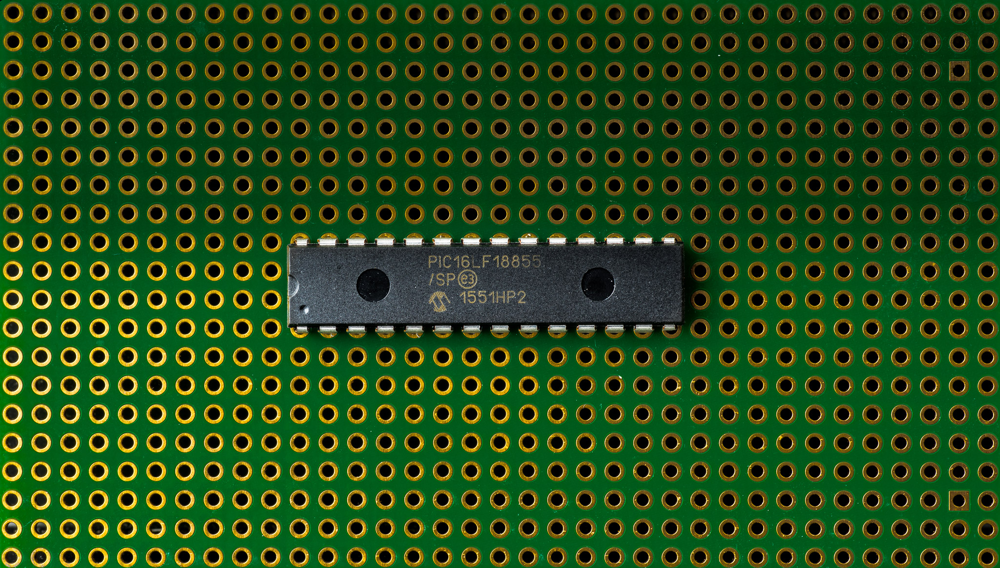
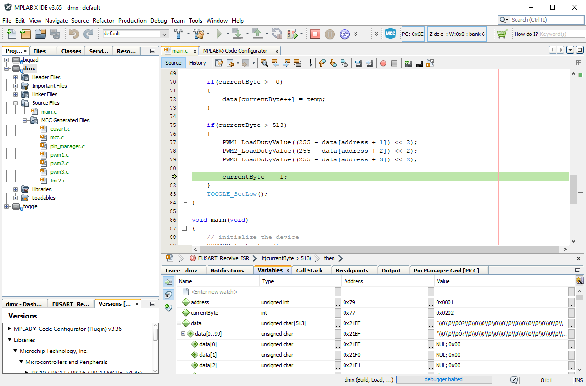

MICROCHIP
PIC16

https://jaycarlson.net/pf/microchip-pic16-five-digit-enhanced/

September 15, 2017  Microcontrollers  [0](https://jaycarlson.net/pf/microchip-pic16-five-digit-enhanced/#)

Microchip has made *a lot* of PIC16s over the years, and tends to produce these parts indefinitely (for five and a half bucks, [DigiKey will sell you a 20-year-old PIC16F877](https://www.digikey.com/product-detail/en/microchip-technology/PIC16F877-04-P/PIC16F877-04-P-ND/281146)1).

I think they’re starting to run out of digits; they’re up to five of them with their latest batch of PIC16 incarnates. To distinguish them from previous generation PIC16s, I’ll be calling them Five-Digit parts; they currently include everything in the PIC16F15xxx and PIC16F18xxx namespace. This review will cover the PIC16LF18855, which is the low-voltage version of the PIC16F18855 (since we’re testing everything at 3.3V, it didn’t make sense to use a 5V part).

An overview of the part:

- PIC16 Enhanced Midrange 8-bit core
- 32 MHz max frequency from internal PLLed oscillator
- Support for two external oscillators
- 8192 words (14K) of flash, 1K of RAM
- 24 channels of 10-bit ADC, 5-bit DAC, two comparators, and a voltage reference
- Twp SPI/I2C modules, plus a USART
- Tons of timers: two 24-bit dedicated input capture timers, seven additional timers, plus five capture/compare/PWM modules, with two additional dedicated PWM modules
- An assortment of interesting digital peripherals: numerically-controlled oscillator, complementary waveform generator, programmable logic, and data signal modulator (DSM).
- Full pin remapping support through the Peripheral Pin Select module.

## THE CORE

PIC originated from the 1976 General Instrument Programmable Interface Controller, a peripheral controller built to boost the speed of the CP1600 CPU (which struggled with poor I/O performance). General Instrument sold the PIC1650A, with customer’s own microcode, separate from the CP1600 shortly thereafter.

The PIC1650 had a 12-bit-wide program ROM word size — each instruction fit into a single word. There were three types of instructions: standard byte-oriented file register operations, bit-oriented file register operations, and literal/control operations.

Instructions were able to be so short because there was only a single working register, W.

Byte-oriented file register operations had a 12-bit word had a 6-bit opcode, a 1-bit “destination” flag (determining if the CPU should place the result in W, or in the original register), and a 5-bit “file” (register) value. These would be operations like “Move W to f” or “Subtract W from f.”

The architecture had dedicated bit-set, bit-clear, and bit-test support for all register files, too. The bit instructions append the three-bit index of the bit to the 4-bit instruction — leaving room for the 5-bit file register address.

Literal operations were also accomplished with 4-bit instruction, leaving room for an 8-bit value. An interesting literal instruction is RETLW — return with literal in W — which allows the core to access ROM look-up tables in three instructions.2

Absent from the instruction set are conditional-branch statements; rather, there is a “skip” instruction — often combined with “goto” — to control program execution.

I always assumed the 4T architecture breaks each instruction into separate fetch, decode, execute, and store operations — but actually, the core pipelines the instruction execution into two instruction cycles — making each instruction take 8 cycles to complete, not 4.

It takes four clock cycles to fetch an instruction from flash; the remaining four cycles decode, read, process, and write (in general). Microchip calls these instruction cycle slices Q cycles — and each instruction describes the Q cycle activity.

During normal execution, the pipeline ensures instructions execute in 4 cycles — but the pipeline is why “skip” instructions take 8 cycles, instead of 4, to complete.

I haven’t mentioned the stack because there isn’t one — at least not something that’s user-accessible. There’s a two-deep stack used only to store subroutine return addresses.

You may be wondering why I’m discussing such an ancient architecture that surely has no relevance today. Yet, as it turns out, Microchip has made only minor tweaks over the years, and even the latest, greatest PIC16F15688 reviewed here has only modest changes from this original architecture.

In fact, the PIC1650A lives on in the “Baseline 12-bit” series of PIC parts, which encompass PIC10, PIC12, and even some PIC16 devices (like the PIC16F54).

Why? Because for lots of basic embedded projects, this is more than plenty — and while you could reach for a more-powerful microcontroller, it most likely won’t hit the 1.4 mA @ 16 MHz mark this PIC16 does.

Most of the PIC12 devices add a bit deeper stack and interrupt support (the “Enhanced 12-bit” series), but the first real change is the 14-bit and Enhanced 14-bit series — made up mostly of PIC16 parts, but also some PIC12 devices.

Here, the program word size has increased to 14-bit, allowing more RAM and program space access. Enhanced 14-bit devices have additional instructions plus indirect address modes through a new set of File Select Register (FSR) — of which there are two.

The PIC18 devices bump up the word size again to 16-bit, while adding much better indirect addressing support, and a few more instructions — some of which allow using the FSR2 as an emulated stack pointer.

When you’re developing, be careful about debugging: many low-end devices have no on-chip debugging support. Even the higher-end PIC18 and PIC16 mid-range and enhanced devices have only two hardware breakpoints — and the low-cost PIC development tools have no support for software breakpoints.

By the way, if you’re trying to learn to decode PIC names, Microchip seems to prefix 8-bit parts with a pin count rule: PIC10 parts are (mostly) 6-pin; PIC12 parts are (mostly) 8-pin; PIC16 parts are 14 or more pins. PIC18 parts… use a completely different naming scheme: all PIC18 parts are 16-bit program memory parts, where the next digit indicates pin-count: “1” for 18/20-pin devices, “2” for 28-pin, “4” for 40-pin, ‘6’ for 64-pin, ‘8’ for 80-pin, and ‘9’ for 100-pin.

For PIC12 and PIC16 parts, if the next digit starts with a “1” it’s an enhanced 14-bit part. If it starts with a ‘5’ it’s a 12-bit core. Everything else is a non-enhanced midrange 14-bit part.

 

## TIMERS

This PIC has essentially four basic 16-bit timers: Timer0 and Timer1/3/5; three 8-bit timers with a period register: Timer2/4/6; five capture/compare modules that hook up to these timers (depending which mode they’re in); plus two dedicated PWM modules.

- **Timer0 (T0)**: 8051-style timer with switchable 16-bit counter / 8-bit auto-reload modes. 16 prescaler values in powers of 2 up to 32768, plus an output divider from 1:1 to 1:16.
- **Timer1/3/5:** 16-bit counter with 2-bit prescale, with nice gate options.
- **Timer2/4/6**: 8-bit auto-reload timers with 4 prescale values up to 1:64, and an optional 1:16 divider on the output.
- **CCP modules:** support 16-bit capture (from a pin or other internal signals), or compare (to a pin and/or interrupt). In these two modes, these modules can be driven from any of the 16-bit timers independently. There’s also a slightly-weird 10-bit PWM mode that configures Timer2 in 8-bit auto-reload mode — extended with the 2-bit prescaler values — to compare against the duty cycle specified in a 10-bit latched value from the 16-bit CCP register.

###  MAXIMUM PWM CHANNEL COUNT

I think you could probably generate 8 hardware-based PWM outputs, if you combined the 5 CCP modules, the PWM5 and PWM6 modules, plus used the CLC module to generate additional signals (maybe requiring the NCO). And that’s not even tossing in the CWG function, which could generate 8 signals (though they’d be dependent on the existing signals I mentioned). The flexibility of the architecture allows you to do some weird stuff with it, even if you feel dirty doing so.

## COMMUNICATIONS PERIPHERALS

This PIC16 has a EUSART and two MSSP (master synchronous serial port) modules.

The EUSART supports typical full-duplex asynchronous serial communication, as well as typical half-duplex synchronous serial — in both a master and slave configurations. The EUSART works with LIN, as it supports both transmitting and receiving break signals up to 13 bits long.

The EUSART has a two-character FIFO in the receiver, too, which is a nice addition that can help you save power by lowering your CPU speed without missing characters (useful for the DMX-512 receiver project). The EUSART has an 8-bit or 16-bit baud rate generator (BRG) — and there’s an auto-baud detect function as well.

The MSSP supports SPI and I2C communication protocols. In SPI mode, it supports master and slave mode, and hardware slave-select outputs and inputs.

In I2C mode, MSSP supports master and slave mode, with address masking, clock stretching, and bus collision detection.

## ANALOG

This PIC16 has 24 channels of 10-bit analog inputs, sampled at 570 ksps. There are also two comparators, a fixed voltage reference (selectable between 1.024, 2.048, and 4.096V), and a 5-bit DAC with internal comparator and ADC reference inputs.

This PIC has additional post-capture processing capabilities, including accumulation, averaging, and low-pass filtering. It also has threshold comparison support — a much more mainstream feature among MCUs.

## OTHER PERIPHERALS

This PIC part also has four configurable logic cells (CLCs) that support programmable combinatorial and sequential logic.

The three complementary waveform generators (CWGs) can generate signals to directly control bridge drivers — sourced from any of the digital signals in the peripherals.

There’s also a precision 0-32 MHz numerically controlled oscillator (NCO) that could be mixed with the CLC or CWG modules to create some interesting peripherals handled totally in hardware. I could imagine using these peripherals to do spread-spectrum PWM modulation or communication protocols.

# DEVELOPMENT TOOLS

I did an extensive write-up of the MPLAB X, the PicKit3, and Curiosity Boards on the [main page](https://jaycarlson.net/microcontrollers/#mplab). There are only two hardware breakpoints on the PIC16, and one is reserved for stepping — this means, you only get a single breakpoint. While load times are fine, stepping through lines of C code feels *very slow*— maybe as a result of the 4T architecture.

The peripheral register viewer is also painfully slow when debugging PIC16 projects — it’s faster to add the registers you’re interested in to the variable watch window.

# PERFORMANCE

## BIT-TOGGLE

The bit-wiggle program, with or without the optimizer enabled, resulted in 4 instructions:

```
0x7DC: MOVLW 0x1     ; load "1" into W
0x7DD: MOVLB 0x0     ; switch to bank 0
0x7DE: XORWF LATA, F ; XOR LATA with W and store to LATA
0x7DF: GOTO 0x7DC    ; go back to the top
```

I’m honestly not sure why XC8 generates MOVLB instructions in each cycle — is it unaware that the BSR will always be 0?

Anyway, as this is a 4T architecture, it took 20 total clock cycles — four cycles for each of the first three instructions, and then eight cycles for the goto instruction.

## BIQUAD FILTER

The 4T PIC16 was one of the lowest-performing parts tested in the biquad filtering exercise — filtering data at 21.83 kHz while consuming 3.61 mA. This resulted in an efficiency of 565.76 nJ/sample, putting it toward the bottom of the pack.

A more serious problem: it used 1466 clock cycles per iteration to perform the filtering operation, which puts it dead-last in terms of clock-cycle efficiency.

## DMX-512 RECEIVER

With the optimizer off, it took 258 total cycles — 215 in the ISR, plus a 44-cycle latency. With the optimizer on, the ISR had a 35-cycle latency, and took 200 cycles total to execute, resulting in a total time of 235 cycles. In this test, the optimizer provides a modest but measurable increase in performance.

Using the UART’s two-byte FIFO, I was able to slow the core down to 4 MHz, which caused the ISR to occupy 134% of the incoming byte’s duration — this resulted in 470 µA of power consumption, beating out every part in the round-up except the MSP430.

# BOTTOM LINE

Microchip has jam-packed this PIC16 with a huge assembly of both analog and digital peripherals, making it one of the best-endowed parts in the round-up — regardless of architecture. Unfortunately, these peripherals prop up a 4T architecture that is extremely slow. No part I reviewed used this many cycles for the biquad filtering.

Yet, this part was able to achieve some of the lowest power figures in this round-up when it came time to do what 8-bit MCUs do best: shuffling bits around. Here, its 235 cycles fell much more in line with other parts tested (though still definitely the high end).

And that’s where the PIC excels — its slow, 4T architecture actually serves as an advantage when your core clock is constrained by your peripherals instead of your processing needs; and this is definitely the case in many simple, industrial scenarios (quite frankly, the DMX-512 receiver is about as good of a PIC16 application as you’ll find).

Still, the modern world is run by chips that do their low-power work through duty-cycling — waking up every five seconds, ramping up the clock to full-speed, processing data, and then going back to sleep. When running the PIC16 in this mode, things are more complicated. First: I’m almost positive Microchip did a die-shrink with this revision that has made this part leakier than older PIC parts (say, the PIC16F54) — the good news is the LF version of the part has a ridiculously low (50 nA) power-down current, but as soon as you activate the secondary oscillator as an RTC, current will go up to 400-600 nA — similar to other parts reviewed. The problem is that if you need to wake up and process some data as quickly as possible to get back to sleep, the PIC is not for you. It’s just too slow.

MPLAB X, in my testing, felt slow and choppy compared to the Eclipse-based IDEs I evaluated — it’s also less featured (and less productive). And this is coming from someone who has used MPLAB X for hundreds of hours on commercial engineering projects — lack of familiarity is not the issue.

In my testing of the XC8 compiler, the PRO version’s optimizer produced measurable (though dubiously significant) differences from the free version. My issue is more just the sour taste I have in my mouth from getting a compiler built by Microchip they so graciously charge $30/month for — just so I can have the privilege of using their slow 4T microcontroller at full speed. If you don’t pay for the compiler, you will be notified every time you build a project that you could get slightly less-crappy performance out of the part if you would empty your pockets. They have no student/hobbyist pricing — instead, they insist that hobbyists and students don’t need the 60% space improvement and 400% speed improvement that the PRO version provides. Note that there are examples and demo projects like the USB bootloader that will not work when compiled in free mode, due to the lack of flash space.

In general, this used to be an easy ecosystem to recommend to students and hobbyists — but I think there’s considerable less value here than there used to be — especially up against other ecosystems these days. This isn’t a problem for professionals who are going to lay down $250 for an ICD4 programmer (which will work perfectly well), but why should indie developers, hobbyists, and students be stuck with crappy flash-load times and debugging performance, simply because they can only afford a PicKit3 or Curiosity board? That kind of money buys you USB high-speed programmers and dev kits in other ecosystems — and you aren’t additionally charged for a compiler.

Having said all that, this is a unique controller that has some plausibly useful (though heavily application-specific) peripherals that you should keep in the back of your mind. The NCO, digital modulator, and configurable logic are especially useful for things like modulating IR, driving NeoPixels, or doing spread-spectrum generation for quiet stepper motor drive. I haven’t seen many open-source projects that use these peripherals, so if you know of anything, leave it in the comments!

### *RELATED*

[Holtek HT-66](https://jaycarlson.net/pf/holtek-ht-66/)September 15, 2017With 1 comment

[Microchip PIC32MM](https://jaycarlson.net/pf/microchip-pic32mm/)September 15, 2017Similar post

[Microchip PIC24](https://jaycarlson.net/pf/microchip-pic24/)September 15, 2017Similar post

Footnotes

| 1.   | ↑    | hey, at least they mark it as “Not Recommended for New Designs” |
| ---- | ---- | ------------------------------------------------------------ |
| 2.   | ↑    | You can do this with a CALL into a routine that manipulates the program counter to point it to the correct RETLW offset. |