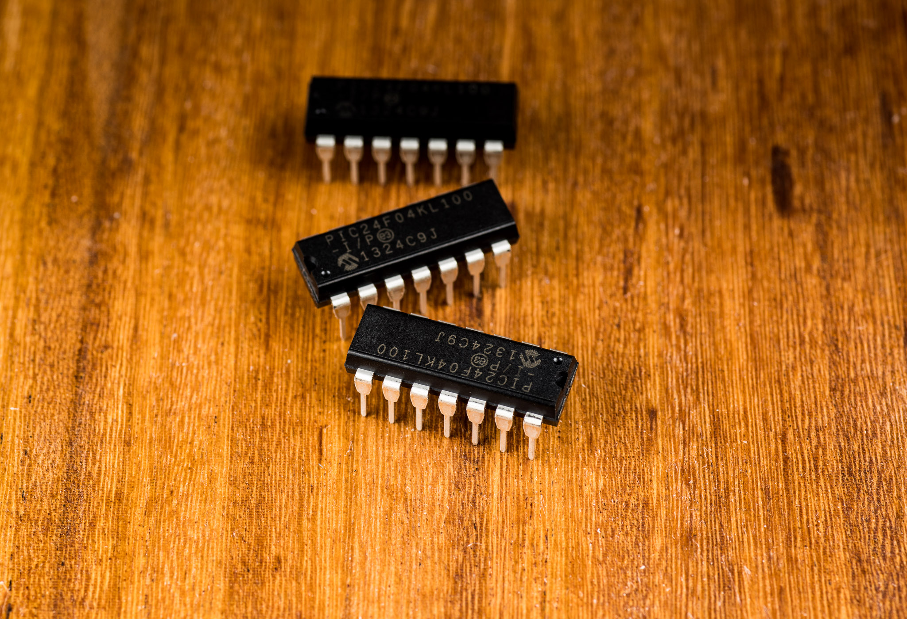

MICROCHIP 
PIC24

https://jaycarlson.net/pf/microchip-pic24/

September 15, 2017  Microcontrollers  [0](https://jaycarlson.net/pf/microchip-pic24/#)

The PIC24 is Microchip’s 16-bit microcontroller intended to offer better performance than their PIC16 or PIC18 8-bit parts. But the way Microchip pitches the PIC24, it seems intended to be a shot across the bow of the [Texas Instruments MSP430](https://jaycarlson.net/pf/texas-instruments-msp430fr/). I evaluated the PIC24F16LK100, which has the following specs:

- 32 MHz operation (via internal 8 MHz oscillator and 4x PLL)
- 4K of flash, 512B of RAM
- Two 16-bit timers, one 8-bit timer
- Two capture/compare/PWM channels
- Analog comparator
- Separate UART and SPI/I2C interfaces

…and that’s it. Like the [MSP430](https://jaycarlson.net/pf/texas-instruments-msp430fr/), this series of MCUs is extremely expensive when compared to most other parts in this round-up. My $1 budget precluded me from purchasing a part that even had an analog-to-digital converter.

# PERIPHERALS & CORE

The PIC24 is a modified Harvard architecture 16-bit CPU with two-cycle instruction timing. It has a 17×17 single-cycle multiplier as well as a 32-by-16-bit hardware divider. There are 16 general-purpose registers, and its RISC architecture made the architecture more suitable for C development. The PIC24 has close lineage to the dsPIC DSP-endowed microcontrollers.

The PIC24 is named for the 24-bit instruction width used by the architecture; like the other PIC parts, the PIC24 does an instruction fetch and execution in a single cycle, regardless of instruction (except for branches and double-word moves).

The PIC24 has a vectored exception system similar to ARM microcontrollers; there’s also a seven-priority interrupt controller with up to 118 interrupt sources.

There’s an internal 8 MHz oscillator with an optional 4x PLL, along with a 500 kHz oscillator and 31 kHz internal low-power RC oscillator. Like other PIC parts, the PIC24 uses configuration fuses to select many options; however, many of these values can be changed during runtime.

There are 12 GPIO pins. Of those, 11 can be used for input-change notification interrupts. Unlike lower-end PIC parts, the PIC24 has a separate register that allows GPIO pins to be configured as true open-drain outputs; there’s also configurable pull-up or pull-down internal resistors.

The MSSP master synchronous serial port supports SPI and I2C operation — in SPI mode, it can operate in master or slave mode; in I2C mode, it supports master, multi-master, and slave mode — with both 7-bit or 10-bit addressing. The peripheral supports clock speeds up to one-fourth the system clock speed.

The UART module supports full-duplex operations with hardware flow-control and  IrDA support. The UART has a built-in baud-rate generator and a two-level-deep FIFO buffers for both TX and RX. The maximum baud rate for this part is 4 Mbps; the minimum is about 15 bps. I wish the baud-rate generator were fractional, allowing dialing in better precision (at the expense of range — but does anyone need 15-baud communication?)

Timer1 is a 16-bit auto-reload timer and counter. Timer2 is an 8-bit auto-reload timer — its output can be routed to the PWM or MSSP module. Timer3 is a 16-bit counter without an auto-reload (“period”) register; it has a single-pulse one-shot gate option that the other times don’t have.

The two CCP modules each support 16-bit input-capture, 16-bit output-compare, and 10-bit PWM generation. There are routing capabilities which allow you to trigger other peripherals on a capture or compare event.

# DEVELOPMENT ENVIRONMENT

I’ve done a [full write-up of MPLAB on the main review page](https://jaycarlson.net/microcontrollers/#mplab). There’s really no PIC24-specific information to add to this assessment.

## PERIPHERAL LIBRARIES & CODE GENERATOR TOOLS

There’s a [legacy PIC24 PLIB package](http://www.microchip.com/SWLibraryWeb/product.aspx?product=PIC24 MCU dsPIC Peripheral Lib) available, but this peripheral library does not abstract the underlying hardware very much — it’s also not recommended for new designs.

Unfortunately, the Microchip Code Configurator — a lovely code-gen tool built into MPLAB X — does not support this particular PIC24. In fact, there’s a *lot*of devices it doesn’t support, which is problematic because MCC supported device lists aren’t widely available on the web when selecting parts.

Here’s what MPLAB X looks like with the processor halted when the code was compiled with -O1. Note that even the disassembly view is empty — this is absolutely unheard of in any microcontroller architecture reviewed.

# DEBUGGING EXPERIENCE

The moment you turn the optimizer on, you can no longer debug code on the PIC24. I don’t mean “it’s a lot harder, because you jump around a lot” — no, it’s actually flat-out impossible. The disassembly view is totally blank, and the C source view doesn’t even attempt to determine where it is — it’s as though the compiler builds the program without any debugging metadata in the binary file. I didn’t experience anything like this with the [PIC16](http://jaycarlson.net/microcontrollers/pic16/) (which uses Microchip’s XC8 compiler), or the [PIC32](http://jaycarlson.net/microcontrollers/microchip-pic24/) (which also uses a GCC-derived compiler, the XC32, which is similar to PIC24’s XC16)

# PERFORMANCE

## BIT-WIGGLE

Bit-wiggling was not good — the PIC24 took 10 clock cycles to toggle a pin, as there is no “toggle” register; here’s the disassembly that XC16 spit out:

```assembly
.L2:
mov	_LATAbits,w0
lsr	w0,#2,w0
com	w0,w0
and	w0,#1,w0
sl	w0,#2,w0
mov	_LATAbits,w1
bclr	w1,#2
ior	w0,w1,w1
mov	w1,_LATAbits
bra	.L2
```

## BIQUAD

The 16-bit architecture (with hardware multiplier) makes the PIC24 well-suited for this task; it turned in a biquad processing rate of 838.46 kSPS, and used 10.74 mA, turning in an efficiency score of 42.27 nJ/sample. Given its effective clock speed of 16 MHz (due to its 2T architecture), it performed better than expected: it was only about half the speed of the 48 MHz 32-bit ARM Cortex-M0 parts running three times faster than it.

## DMX RECEIVER

The minimum frequency I could run the CPU at is 2 MHz — while the UART can run in a 4x-sampling high-speed mode, its peripheral clock is the *instruction clock* of the processor; not the system oscillator speed — and the PIC24 is a 2T architecture, necessitating a 2 MHz system oscillator speed to achieve a 250 kbps baud for the UART receiver.

The PIC24 had good power consumption figures for the DMX-512 receiver project — pulling in 667 µA. However, there was a variety of 8-, 16-, and 32-bit parts that eclipsed it, including most notably the lower-cost, better-endowed [PIC32MM](https://jaycarlson.net/pf/microchip-pic32mm/) — which beat it by a long shot (493 µA versus 667 µA).

# BOTTOM LINE

The PIC24 is an expensive microcontroller, but provides good per-cycle performance, and decent low-power operation. I wouldn’t recommend using this particular variant in designs, but larger, more modern parts may be useful to applications that need good sleep-mode power consumption while waking up for duty-cycle processing. But even staying inside the Microchip umbrella, it’s hard not to look at the [PIC32MM](https://jaycarlson.net/pf/microchip-pic32mm/) parts, which offers similar performance, even lower power consumption in run-mode, and better peripheral options for the same cost.