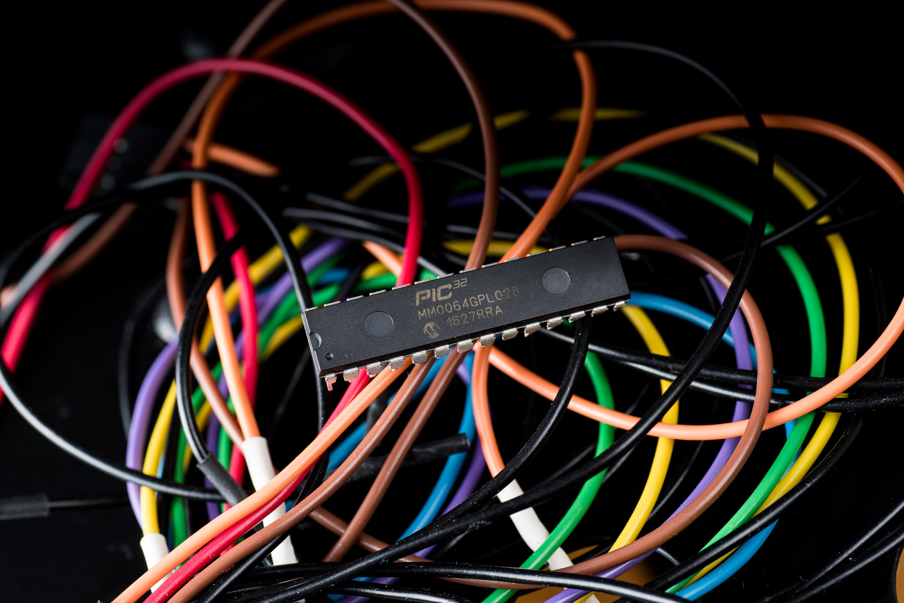
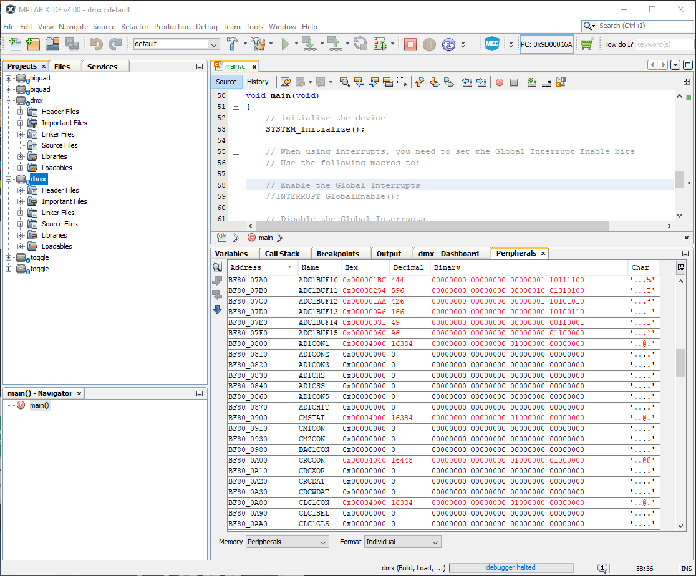

MICROCHIP
PIC32MM

https://jaycarlson.net/pf/microchip-pic32mm/

September 15, 2017  Microcontrollers  [4](https://jaycarlson.net/pf/microchip-pic32mm/#)

The PIC32MM is the entry-level 32-bit MIPS-based PIC family from Microchip. Without trying to start a flame war, I think most people would be hard-pressed to find substantial, meaningful differences in the core design from the more-familiar Arm Cortex-M0 parts reviewed here — though these parts lose a lot of generality that Arm is famous for. Your SEGGER J-Link has limited support for some PIC32MX parts (though no MM parts), and getting an open-source GCC-based MIPS toolchain working with the PIC32 is nontrivial — as is setting up a more-standard Eclipse-based environment for the part.

That said, the PIC32MM has good flash and RAM configurations, and a few peripheral perks. Here’s an overview:

- 25 MHz MIPS core
- Internal 8 MHz oscillator with PLL support
- 32 KB of flash, 8 KB of RAM
- Six 16-bit timers with three independent PWM channels
- Two UART and two SPI transceivers
- 12-bit ADC across 11 pins (14 in larger packages), plus two comparators and a 5-bit DAC
- Two configurable logic cells
- SOIC, QFN, and DIP package availability in the family

## TIMERS

The PIC32MM has three Capture/Compare/PWM/Timer (CCP) modules that you can use as general-purpose timers, or for input capture, output compare, and PWM.

All of these timers support 16-bit and 32-bit time bases in input-capture, output-compare, and general-purpose timer configurations.

Two of these modules have a single-channel capture/compare. The third module supports 6 channels of PWM output — but note that these are *dependent*outputs, so all share a single duty cycle. This is not clearly explained in the datasheet, and many parametric search engines indicate this part has 8 channels of PWM — it does not. This six-output module is obviously designed for driving half- or full-bridge circuits directly, and the part has programmable dead-time delays.

Suffice it to say, these timer modules have asynchronous clock inputs, and input/output triggering for synchronizing with ADC conversions.

In capture mode, there is a four-deep FIFO capture buffer (a nice perk)

Timer1 is a stand-alone 16-bit auto-reload timer designed for generating periodic interrupts and the sort.

## COMMUNICATIONS PERIPHERALS

The ’32MM has a somewhat-strange complement of communications capabilities: it has two UARTs, and two SPI modules.

The UARTs are typical full-duplex serial peripherals with internal baud-rate generation. Each UART has auto baud-baud detection, 8-level FIFO transmit and receive buffers, LIN and IrDA support, and sleep-mode reception.

The SPI module supports typical SPI duties but can also drive an I2S codec or other peripheral in master or slave mode — with up to 16-level transmit and receive FIFOs in either mode.

While it’s nice to see I2S support (the [XMC1100](https://jaycarlson.net/pf/infineon-xmc1100/) is the only other part in the roundup with this capability), there’s a glaring omission: I2C.

I checked the datasheet twice just to make sure I wasn’t mistaken — nope, this part has no I2C peripheral. While you can bit-bang an I2C master device relatively easily, it’s bizarre to see this sort of absense — especially from a modern, 32-bit microcontroller.

 

The peripheral register viewer was painfully slow to try to use — taking several seconds to scroll just a few lines through the registers when debugging with my PicKit3. The register view provided awkward value display, too, which was one of the least intuitive views in my round-up.

## DEVELOPMENT TOOLS

While the big brother of the ‘MM, the PIC32MX, supports Segger J-Link debugging, the ‘MM does not; this leaves you with three Microchip options: the [PicKit3](http://www.microchip.com/Developmenttools/ProductDetails.aspx?PartNO=PG164130) ([$48](http://www.microchipdirect.com/ProductSearch.aspx?Keywords=PG164130)), [ICD3](http://www.microchip.com/developmenttools/productdetails.aspx?partno=dv164035) ([$199](http://www.microchipdirect.com/ProductSearch.aspx?Keywords=DV164035)), the new [ICD4](http://www.microchip.com/Developmenttools/ProductDetails.aspx?PartNO=DV164045) ([$249](http://www.microchipdirect.com/product/search/all/DV164045)), and [RealICE](http://www.microchip.com/Developmenttools/ProductDetails.aspx?PartNO=DV244005) ([$499](http://www.microchipdirect.com/ProductSearch.aspx?Keywords=DV244005)) debuggers.

I still don’t understand the fuss about surface-mount prototyping, but hobbyists and plumbumphobic engineers will be happy to learn that the the PIC32MM is widely available in DIP packages. Given these package versions are offered in only the largest memory densities, Microchip fully understands that DIP packages are for prototyping, not production. And combined with the simple electrical connections needed to get the MCU running, this largely neglects the need for a dev board at all — just make a one-time purchase of a debug probe, and you’ll be set when it comes to developing with any 8-, 16-, or 32-bit PIC architecture.

If you’re afraid of electricity in general, Microchip also offers a [low-cost PIC32MM board](http://www.microchip.com/DevelopmentTools/ProductDetails.aspx?PartNO=dm320107) from their Curiosity series — I have not tried it, but it appears to have what I like in the Curiosity line of development tools: on-board PicKit debugger, bare MCU system, a low price tag, and an absence of extraneous peripheral crap that you have to disable to perform accurate power measurements and pin muxing.

## DOCUMENTATION

Microchip never split up its documentation for its 8-bit MCUs, but when they entered the 32-bit market with the PIC32, they noticed the ubiquitous practice of manufacturers splitting documentation into separate *data sheets* (for electrical specs and package info) and *reference manuals* (for actually, you know, programming the chip). I honestly don’t know why manufacturers continue to do it this way, as we live in an era where Acrobat can instantly search through an 800-page PDF (which took 15 seconds to download, and occupies 1/100,000th of our drive’s space) — so manufacturers could easily dump the reference manual in the back of the PDF datasheet.

Either way, not wanting to be outdone, Microchip split the PIC32MM documentation into not only just a datasheet and reference manual — but actually *dozens* of different reference manuals. To rub salt in the wounds, you’ll note the conspicuous absence of these reference manuals on the the [product family](https://www.microchip.com/design-centers/32-bit/architecture/pic32mm-family)‘s page — the only logical way to find them is on the [individual product page for the chip](http://www.microchip.com/wwwproducts/en/PIC32MM0064GPL020).

## DEVELOPMENT ENVIRONMENT

Just like the [PIC16](https://jaycarlson.net/microcontrollers/microchip-pic16/) and [PIC24](https://jaycarlson.net/microcontrollers/microchip-pic24/), the PIC32 uses MPLAB X — I tested both the 3.x series and the brand new 4.x series of this IDE, and [wrote about it in my main article](https://jaycarlson.net/microcontrollers/#mplab).

## DEBUGGING EXPERIENCE

The PIC32MM appears to use a small debug executive that is appended onto your hex file.

Two words come to mind: *slow* and *tedious*. In my testing, it took 12-17 seconds to launch a debug session and land on the main() breakpoint. The PIC32MM has 4 breakpoints, but they can’t be set while the target is running; you must halt the CPU, set breakpoints, and then continue.

Know that the PicKit3 is *very slow* compared to the ICD3 or 4. It’s much slower than one of the embedded J-Link programmers on the common under-$30 Arm dev boards.

# PERFORMANCE

## BIT-TOGGLING

The PIC32 turned in as fast of performance as the Arm Cortex-M0+ parts — three-cycle bit-wiggling, due to

```

```

## BIQUAD FILTERING

In terms of biquad filter performance, the PIC32 delivered the worst results of any 32-bit processor in the review, managing only 829.88 ksps processing speed @ 7.65 mA, which puts it at 30.42 nJ/sample — three times more than most of the Cortex-M0 processors (only the Nuvoton M051 had worse power measurements among 32-bit MCUs). It was also beat by its slightly-faster 32 MHz cousin, the [PIC24](https://jaycarlson.net/pf/microchip-pic24/).

## DMX-512 RECEIVER

The PIC32MM punched back in the DMX-512 receiver test. Because of the 4x oversampling UART, the system oscillator could run as slow as 1 MHz while still hitting the 250 kbaud needed for DMX. Normally, you wouldn’t be able to run a core this slow, but the PIC32 UART’s deep FIFO had no problem handling incoming data while the processor sluggishly iterated over it.  In fact, the ISR routine ran at 207% the width of a received byte — the slowest tested in this round-up.

Consequently, the PIC32MM turned in an impressive 493 µA figure which was — by far — the lowest consumption of any 32-bit part. Heck, it was better than almost every 8-bit part too — beat out only by the [PIC16](https://jaycarlson.net/pf/microchip-pic16-five-digit-enhanced/).

The 91-cycle ISR duration was better than many (but not all) code-gen tools and peripheral libraries. Microchip Code Configurator didn’t produce especially compact flash code — pulling in at 3904 bytes — but  I didn’t see any way to enable link-time optimization, so perhaps this could be reduced further.

# BOTTOM LINE

The PIC32MM is a 32-bit processor that does a good job masquerading as an 8-bit part. Excellent low-power capabilities, easy fuse-based configuration of clocking schemes, and DIP packaging make this part an obvious choice for people looking to move up from PIC16-based projects. Microchip Code Configurator is inoffensive, relatively snappy, and generates fast code.

The PIC32 skyrockets up to 200+ MHz parts with integrated LCD controllers and DDR memory, so this part has plenty of power — even if the low-end part reviewed here was scratching the bottom of the barrel (no I2C, only three independent PWM channels, relatively slow clock speed).

This part is much less goofy than the PIC16, but it lacks a lot of its charm (and peripheral assortment), too.

If you’re an Arm developer, you should feel comfortable working with this part — other than the fuse configurations, this is standards-compliant C, and the underlying toolchain is based on GCC.

But you should know you’re giving up flexibility when migrating from Arm to the PIC32 ecosystem — in many cases, you’ll be limited to Microchip’s (expensive) dev tools, their sluggish, unproductive IDE, and their expensive compiler.

That’s why I’d probably lean toward finding a comparable Arm processor before picking up the PIC32 — but you’ll be hard-pressed to find a part that runs as cool as the PIC32MM, and some of the higher-end parts have peripherals and features that are unique to the PIC32 ecosystem.

If you’re getting started, know that Microchip has an active forum, great support, and long-term production commitments that exceed that of many other manufacturers. That’s why they’re so popular in the industry.

It’s just hard to recommend the part to hobbyists, students, and indie devs — the $50 PicKit3 debugger is painfully slow on this part, and there’s no equivalent of an [$18 J-Link EDU Mini](http://shop-us.segger.com/J_Link_EDU_mini_p/8.08.91.htm) like the Arm world has. Plus, who wants to pay for a MIPS build of GCC?