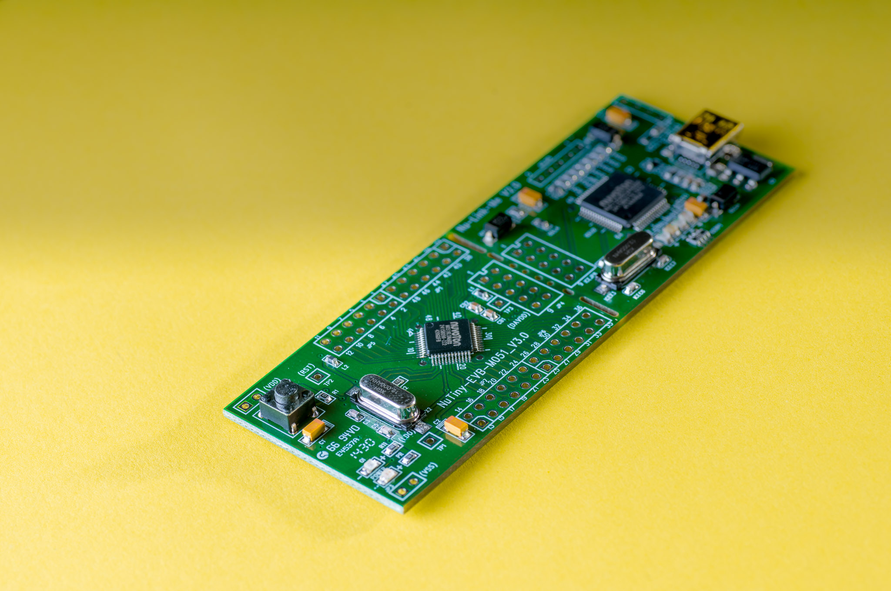
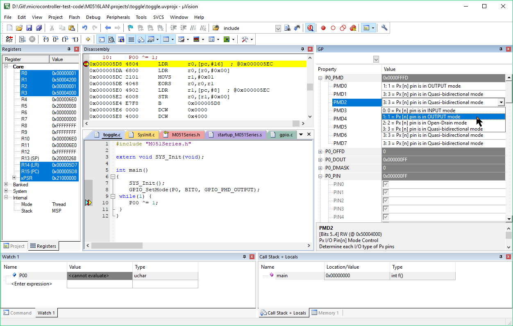
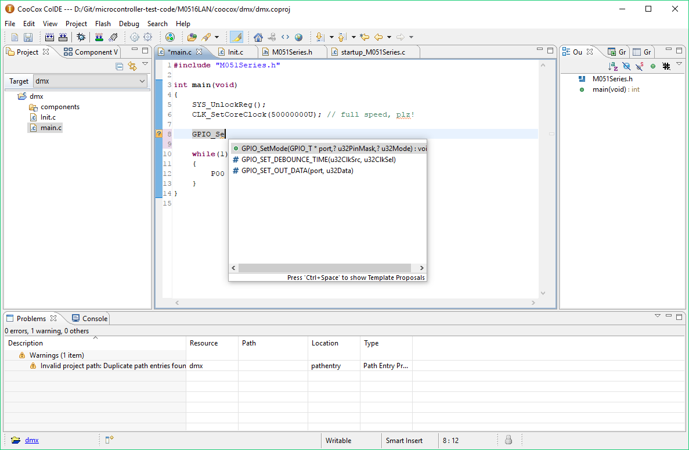
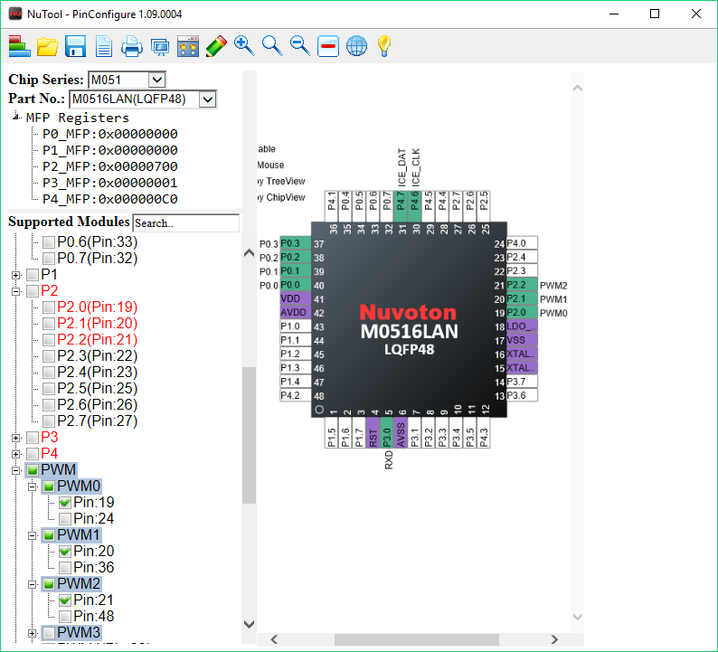
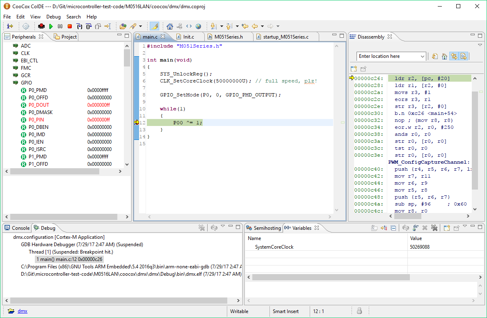
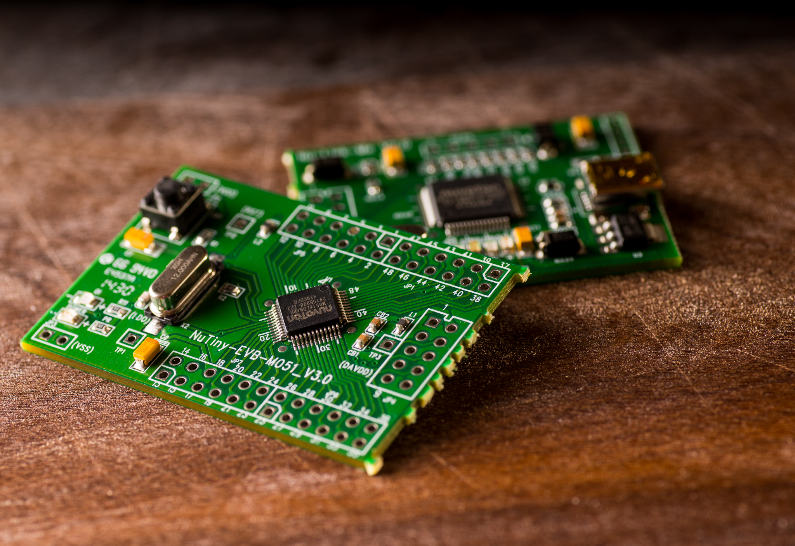

NUVOTON
M0

https://jaycarlson.net/pf/nuvoton-m051/

September 15, 2017  Microcontrollers  [0](https://jaycarlson.net/pf/nuvoton-m051/#)

The Nuvoton M051 is Nuvoton’s entry-level industrial/controls Cortex-M0 microcontrollers. In this family, there are 20 MCUs — tightly packed together around the $1 price point, yet gesticulating wildly in terms of functionality (1-8 PWM channels and ADC channels, 4-64 KB of flash — some devices don’t even have a flash peripheral for in-field updates).

All have 4 KB of RAM (good to see in this price range), a 50 MHz maximum core clock speed (via an on-board PLL via an internal 22 MHz oscillator), and four 32-bit-wide timers (which no other MCU in my round-up can claim). If that’s not enough parentheticals, the M052LDN selected for this review also has

- Two UARTs (with LIN support and 16-byte-deep TX and RX FIFOs)
- Two SPI modules (with 4-byte FIFOs)
- Two I2c modules (with wake-up support)
- Eight channels of ADC (12 bit, 760 ksps sampling rate)
- Eight channels of 16-bit PWM (with center alignment, complementary outputs, programmable dead zones, and ADC triggering)
- External bus interface (for off-chip memory-mapped peripherals)
- 48-pin LQFP (with 40 I/O — with a dedicated register for each pin’s data value, making it look “bit-addressable”)
- 4 KB of data flash and 8 KB of program flash (with hardware bootloader support)

## 

Keil µVision 5 feels much lighter-weight than Eclipse-based IDEs, while having a fantastic out-of-the-box debugging experience — but its text editor can barely compete with the free offerings from many vendors.

## DEVELOPMENT ENVIRONMENT

Nuvoton ships their Arm microcontrollers with a BSP that supports both Keil MDK and IAR. All the examples they provide include project files for EW and µVision — for which neither I have a strong affinity: Keil µVision is well-liked among a narrow constituency, but for many, it is a product of a bygone era of expensive, proprietary compilers and IDEs.

CoIDE is a heavily-modified

As a free alternative, Nuvoton teamed up with CooCox to provide support for the M051 in CoIDE, which I used (along with some Keil for comparisons). I discuss CoIDE and my general dislike of it in the [main review](https://jaycarlson.net/microcontrollers/#eclipse), but suffice it to say, it’s a stripped-down version of Eclipse aimed squarely at students and hobbyists. It’s fine, but it’s missing a lot of Eclipse buttons and menus I use, without adding much additional functionality.

## SDK

Nuvoton provides a CMSIS-complaint start-up system, as well as simple, no-nonsense peripheral drivers. Many vendors use struct-based peripheral libraries these days; there’s a lot of power and flexibility there, but also a lot of verbosity. The Nuvoton peripheral library uses a simple, functional programming model that’s much better suited to small M0 microcontrollers like this, which don’t offer much configuration options the bigger guys have. Want to set pin P0.2 as an output?

```
GPIO_SetMode(P0, 2, GPIO_PMD_OUTPUT);
```

None of this clock gating or GPIO initialization structure rubbish you have to pass around between functions.

I love that their GPIO peripheral has a dedicated data register for each pin, as it makes you feel like you’re operating on a bit-aware 8051:

1. P02 ^= 1; // toggle P0.2
2. **if**(P01 == **false**)
3. printf("Button pressed\r\n");

There are similarly nice programming constructs and functions for configuring most peripherals. For example, to mux a UART RX pin, enable a UART clock, open the UART at a given baud rate, and enable interrupts we’re interested in:

1. SYS->P3_MFP |= SYS_MFP_P30_RXD0;
2. CLK_EnableModuleClock(UART0_MODULE);
3. CLK_SetModuleClock(UART0_MODULE, CLK_CLKSEL1_UART_S_HIRC, CLK_CLKDIV_UART(12));
4. UART_Open(UART0, 250000);
5. UART_EnableInt(UART0, UART_IER_RDA_IEN_Msk | UART_IER_RLS_IEN_Msk | UART_IER_BUF_ERR_IEN_Msk);
6. NVIC_EnableIRQ(UART0_IRQn);

It’s certainly not the least-verbose SDK I’ve seen (that honor would probably go to [XMCLib](https://jaycarlson.net/pf/infineon-xmc1100/)), but I feel like I have more intuition about how to use their SDK than I do for most Arm peripheral libraries — and that’s good because there’s essentially no documentation for this.

Nuvoton gives you demo programs and the docs embedded in the code, but that’s it. I found a Windows Help file (??) floating around on their site, but it didn’t seem to work on my computer. That was the sole piece of documentation I was able to find through official channels, though I believe if you’re using the BSP in CoIDE, it will give you access to Doxygen-created documentation for the modules (that’s effectively the same as just reading the docs in the code).

For what it’s worth, that’s par for the course with Arm peripheral libraries these days.

If you’re using CoIDE, be careful — the peripheral drivers in their repository are old and have bugs in them; while working on the DMX project, I noticed the PWM driver assigned one of my PWM channels to run off the wrong clock source. This bug has long since been fixed in the official Nuvoton BSP, so you’ll probably want to copy it over the existing one in CoIDE when you create your project.

## DOCUMENTATION

While Nuvoton’s SDK has no documentation, the actual MCU’s reference manual and datasheet are quite good when compared to other Arm MCUs I tested; very few vendors provide good, concept-oriented documentation that helps you understand how to tie all the separate modules together to accomplish something, but Nuvoton includes detailed, step-by-step instructions to configure each peripheral (supporting the most common modes of operation).

I also appreciated how disparate information was collected together into useful forms — like a single table that lists the peripheral’s interrupt flags, how to enable them, and how to clear them. Sure, you could look that up bit by bit in the register lists, but it was nice to see it grouped together in tabular form for handy reference.

Nuvoton ships a basic pin configurator that does muxing, but the tool has no clock initialization code-generation or peripheral initialization and configuration. The tool was written in some weird, web-based language, has zero support for recalling saved configurations (there’s a button there, but when you select a file, it complains that it’s invalid), and generally feels like it was put together over someone’s lunch break.

## CODE GENERATION TOOL

Nuvoton ships a basic pin-muxing tool, but it’s potentially clunkier to use than a datasheet plus a text editor. The tool doesn’t provide support for clock gating, let alone peripheral initialization, and it’s written in some weird web-based framework that makes the entire layout fixed size.

While the “save config” button may give you piece of mind that you’ll be able to recall your configuration at a later date, you’ll be sorely disappointed when you attempt this feat — trying to load a saved configuration file always results in a file format error.

CooCox has a separate pin configuration tool, called CoSmart, and it’s fantastic. Unfortunately, it doesn’t seem to have been updated with the current-generation BSP; the code it produces will not compile against the BSP in CoIDE.

Luckily, if you can figure out which pin config register you need to use, Nuvoton’s SDK provides predefined masks that make it next to trivial.

CoIDE has

## DEBUGGING

CoIDE was par for the course in terms of debugging. Load times were average-to-slow, and the usual features are here. I know I sound like a broken record, but like a lot of IDEs, CoIDE has a weak-sauce peripheral viewer that doesn’t really give you any useful display of the register’s individual bits, and what they do. Keil µVision was much better on the M051 in this regard.

Just like many other manufacturers, Nuvoton has joined the snap-apart club. This helps give paranoid developers confidence that they know exactly what’s going on with their development board — especially critical for taking power measurements or interfacing with high-impedance sensors.

## DEVELOPMENT TOOLS

Nuvoton has a series of NuTiny dev boards [available from Nuvoton Direct](https://direct.nuvoton.com/pt/m0-development-tool/) (warning: overseas DHL shipping).

Nuvoton has joined the “snap apart” club. I’m on the fence about these boards — it’s cool that they snap apart (so you know for a fact the target is isolated from the debugger) but once they’re broken apart, there’s no good way of putting them back together. You’ll need right-angle male/female header sets, or an angle grinder to cut off the mouse bits that remain.

They also have a $26 stand-alone [Nu-Link](https://direct.nuvoton.com/id/nu-link) debugger, and a fancier $38 [Nu-Link Pro](https://direct.nuvoton.com/id/nu-link-pro) debugger (that supports 1.8-5.5V targets). Both of these debuggers were some of the least-expensive name-brand debuggers available.

Interestingly, there’s also a $10 Arduino-compatible board called the [NuMaker Uno](https://direct.nuvoton.com/pt/numaker-uno). Lots of vendors have “Arduino-compatible” boards — but I definitely air-quote that whenever I use the phrase since this usually means a dev board that has nothing more than a mechanically-similar header layout.

But Nuvoton actually has [Arduino IDE board support](https://github.com/OpenNuvoton/NuMaker_UNO) for the product, which has an NUC131 processor — a Cortex-M0 that’s similar to the one reviewed here. I have to applaud their efforts.

# PERFORMANCE

## BIT TOGGLING

The Nuvoton part has no GPIO toggle register, so I had to do a two-cycle read, a single-cycle XOR, a two-cycle write, and a three cycle jump. Suddenly, a task that takes just three cycles on a Cortex-M0+ takes 8 cycles — more than twice as long — on this part.

## BIQUAD PERFORMANCE

This 50 MHz behemoth had no issue plowing through the biquad filtering — taking just 29 cycles to process a single iteration while running at full internal speed. This was just two cycles short of the Cortex-M0+ 27-clock-cycle ideal speed, which illustrates that the flash caching system on this part is working flawlessly.

Unfortunately, this part doesn’t give a hoot about power consumption, pulling in 19.16 mA — showing a relatively poor efficiency of 36.50 nJ/sample.

## DMX-512 RECEIVER

The M051 was able to cut its power by a factor of 10 in the DMX-512 receiver project — still, at 1970 µA, it was beat by both 8- and 16-bit parts, along with a handful of other Arm parts.

# BOTTOM LINE

The Nuvoton M0 is a fast Cortex-M0, packed full of peripherals, that trades in raw capabilities for low-power prowess. The peripheral library is easy to use — especially if you start with the latest version, which has fewer bugs.

The Achilles heal is the lack of a true Eclipse-based IDE. Instead, Nuvoton relies on Keil µVision, CooCox CoIDE, and — of all things — Arduino.

This part sports an extensive set of peripherals — especially timers and communications interfaces. This all comes at the expense of pretty weak power figures.

If you can get past the current consumption, and you’re a µVision addict, you’ll find the Nuvoton to be a formidable competitor — especially in this price range.

For everyone else, though, it’s hard to find much here that sticks out when compared to the SAM D10 or [STM32F0](https://jaycarlson.net/pf/st-stm32f0/).