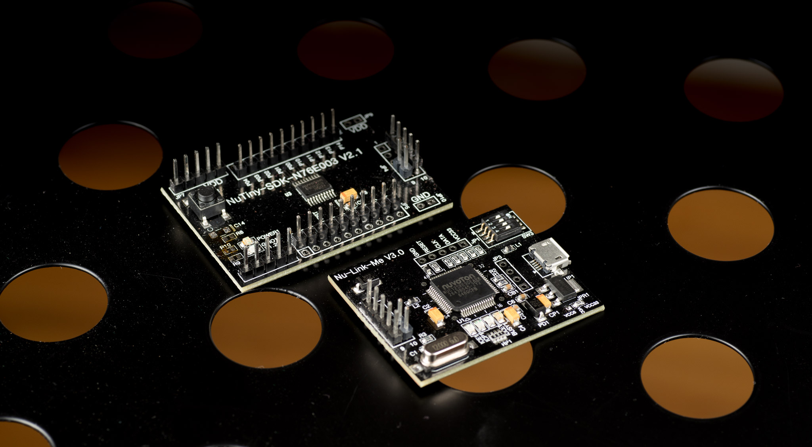
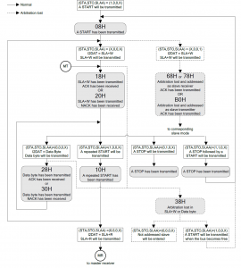
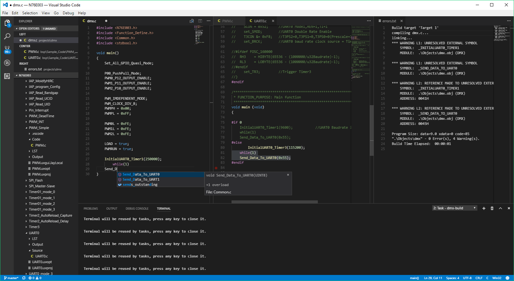
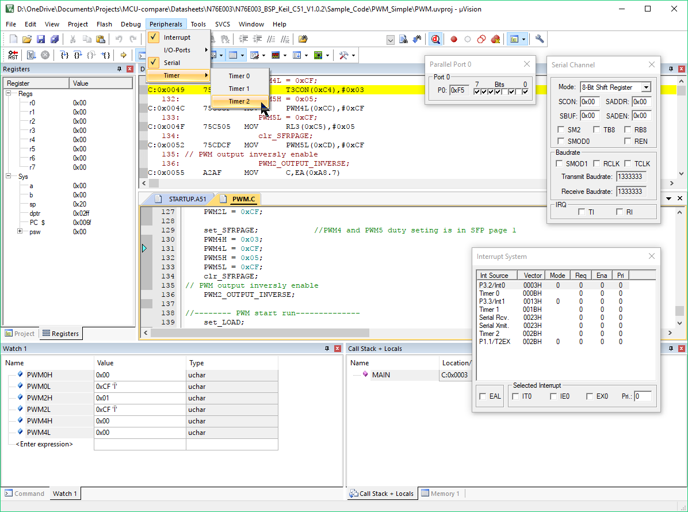

NUVOTON
N76

https://jaycarlson.net/pf/nuvoton-n76/

September 15, 2017  Microcontrollers  [6](https://jaycarlson.net/pf/nuvoton-n76/#)

The Nuvoton N76 is their latest stab at the 8051 — this time, a true 1T architecture (though, as we’ll see, is any 8051 truly 1T?). The N76 is built for cost-sensitive applications, and at [23 cents/unit @ 100 qty](https://lcsc.com/product-detail/NUVOTON_N76E003AT20_C82751.html), you’d be hard-pressed to find a cheaper part with these kind of peripherals.

I tested the N76E003AT20, which has:

- 16-MHz 8051 core
- 2.4 – 5.5V operating range
- 18 KB of flash memory
- 1 K of SRAM
- Dedicated 6-channel 16-bit PWM module
- Two UARTs, an SPI peripheral, and an I2C peripheral
- 12-bit 8-channel ADC @ 500 ksps
- Programmable slew-rate GPIO
- Dual data pointers (DPTRs)

# CORE & PERIPHERALS

I do a really extensive [deep-dive into the 8051 in my main article](https://jaycarlson.net/microcontrollers/#8051).

Note that because the device has more than 128 SFRs, Nuvoton implements a paging system. There’s only two pages — the “normal” one, and the alternative page (“page 1”). It should be simple enough, but they protect the SFR page with a “Timed Access Protection” (TA) system that requires you write an unlock sequence to the TA register before modifying the “critical” SFRs. I’m using a lot of passive-aggressive quote marks because I really don’t understand the validity to this at all — yes, I agree that if you change the SFR page without changing it back, everything is going to get screwy. But you can say that about almost **everything** on a microcontroller.

## GPIO

The N76 has 18 I/O pins spread across three GPIO ports — each of them bit-addressable.

One of the defining features of the 8051 is its flexible, no-nonsense GPIO, and the N76 keeps that tradition alive. On power-up, each pin is a quasi-bidirectional pin with pull-ups. This means the pin can drive a strong “0” (open-drain), or a weak “1” — and it can read the current pin value at any time, too. This turns out to be an extremely useful default I wish more MCUs used; as you’ll rarely need to change the mode.

Any high-current load (say, an LED) is usually driven in an open-drain configuration anyway (so that you’re using your GPIO’s N-channel transistors instead of its less-efficient P-channel ones). Certainly, quasi-bidirectional GPIO works in this case.

But it also works for digital inputs, too: simply write a “1” to the pin, which will make it weakly pull-up (but driveable). If you’re connecting it to to switches or open-drain outputs, there’s no need for external pull-ups. And if you’re connecting it to push-pull logic outputs, you’re in the clear, too.

Nuvoton explains that their quasi-bidirectional GPIO structure actually has three different pull-up transistors — a “very weak” pull-up that is always on whenever the pin isn’t set to drive a “0”, a “weak” pull-up that kicks in when the pin is high (but turns off if the pin is externally pulled down), and a “strong” pull-up that kicks in for two CPU cycles when the pin goes from “0” to “1” (to speed up the transition).

None of these details are relevant to the user, and I’m sure other quasi-bidirectional GPIO designs incorporate something similar to this, but it’s kind of neat to read about the implementation details anyway.

Unlike the OG 8051, quasi-bidirectional isn’t the only game in town on the N76, though. Sometimes you’ll need a push-pull output (say, if you want to use a GPIO pin to supply power to a sensor), and sometimes you’ll need an input without pull-ups (say, to read the input from a high-impedance sensor) — both of those options are available, as well as a true open-drain mode that has no pull-up resistor.

A surprising addition is adjustable two-level slew-rate control; individually controlled for each pin. This isn’t commonly seen on 8-bit MCUs, and can provide some EMI mitigation, as well as help with long transmission lines.

## TIMERS

Timer0 and Timer1 are your typical 8051 16-bit counters; each has an optional 8-bit auto-reload mode, as well as a dual 8-bit counter mode.

Timer 2 is a 16-bit auto-reload timer that also has a three-channel input capture module; this timer also has a compare output.

Timer 3 is essentially just a 16-bit auto-reload timer with no additional hardware — it’s obviously for periodic-interrupt generation.

Timer 2 and 3 can’t be split into 8-bit counters, and they don’t offer separate high/low-byte overflow interrupts.

The PWM module on the N76 is not the standard 16-bit PCA that so many 8051s use — it’s a new design.

I like how Nuvoton implemented the I2C peripheral in the N76; there’s a single status register that can be inspected in a switch-case statement, instead of going through several layers of bitwise checks that some peripherals require.

## COMMUNICATIONS

The N76 has two USARTs, plus SPI and I2C modules. Like most 8051 derivatives, Nuvoton decided to keep the USART and SPI modules (mostly) backward-compatible with the original 8051, so there should be little fanfare there.

Unlike Silicon Labs, which endows some of their EFM8s with a second UART containing its own baud-rate generator, both N76 UARTs require timer resources for baud rate generation (except in the weird 9-bit multi-processor mode, or the SPI mode, which both use simple prescalers to set baud rate).

The N76 uses its own I2C peripheral design, and I rather like it. Instead of having separate bit fields to check (sometimes across different registers), the N76 has a single I2CSTAT register that you can use in a switch-case statement for walking through all the different states — whether you’re programming master or slave functionality.

This should make I2C interrupts quite snappy, and the whole process is easy to implement thanks to lovely flow-charts in the documentation.

# DEVELOPMENT ENVIRONMENT

Just like many other low-cost 8051s, Nuvoton assumes you’ll be using Keil µVision and Keil C51 as your IDE and compiler, respectively.

as their recommended IDE, like almost all low-cost 8051 MCUs (Silicon Labs is the only 8051 vendor that maintains their own free IDE, to my knowledge).

If you’re just getting your app going and you’re writing a lot of code, it might make sense to use a more productive text editor than Keil’s µVision, which doesn’t even have functional text completion when working in 8051 projects. Here, I used Visual Studio Code, which offered good auto-completion and allowed me to assign key bindings to build, flash, and debug tasks that invoked µVision in the background.

Since I used Keil µVision for the STC review, I thought I’d test out a text-editor-based workflow (where possible), so I tried using Visual Studio Code instead, and I really enjoyed it.

I created separate tasks to build, flash, and debug each project, and then set up key bindings to allow me to quickly execute these tasks. Keil µVision can be called from the command-line to build, flash, and debug projects (among other things), so this worked out really well, actually.

While it couldn’t auto-complete my #include statements, Visual Studio Code figured out where all the header files I was using came from, scanned through them, and provided basic code completion.

## PERIPHERAL LIBRARIES

The 8051 is an extremely simple microcontroller, and because many of the most commonly-used peripherals are bit-addressable, there’s barely a reason to do peripheral libraries. Having said that, there’s a lot of standard operations that get a little tedious — especially initialization code. Nuvoton included essentially two unrelated systems that help you be a bit more productive when you’re programming the 8051.

Saying that Function_Define.h is “just a set of preprocessor macros” is like saying Citizen Kane is “just a movie about a sled” — this is essentially a collection of 500 tasks you find yourself writing all the time, all put in one file.

Want to capture rising-edge events of P1.2 with CAP0 on IC1? No problem; just dump this line of code in your source file:

```
IC0_P12_CAP0_RisingEdge_Capture;
```

This is equivalent to writing:

```
CAPCON1&=0xFC;
CAPCON1|=0x01;
CAPCON3&=0xF0;
CAPCON0|=SET_BIT4;
CAPCON2|=SET_BIT4;
```

Note that Nuvoton doesn’t bother trying to make it look like a function — which I don’t mind at all. If it looked like a function, you might start confusing it with one, which can be confusing when you’re trying to squeeze a bit more performance out of your interrupt loop.

Want to set up PWM1 on P1.4? No problem:

```
PWM1_P14_OUTPUT_ENABLE;
```

Which, under the hood, is equivalent to:

```
BIT_TMP=EA;    // save interrupt state
EA=0;          // disable interrupts
TA=0xAA;       // TA unlock
TA=0x55;    
SFRS|=0x01;    // switch to the paged SFRs
PIOCON1|=0x02; // route P1.4 to PWM
TA=0xAA;       // TA unlock
TA=0x55;
SFRS&=0xFE;    // restore normal SFR page
EA=BIT_TMP;    // restore interrupts
```

 

Keil µVision doesn’t know anything about the N76-specific peripherals, such as the PWM module, or the various auxiliary timers.

## DEBUGGING EXPERIENCE

I purchased the [$10 NuTiny dev board](https://direct.nuvoton.com/pt/nutiny-n76e003) from Nuvoton Direct (beware of expensive DHL shipping — stock up on [M0](https://jaycarlson.net/pf/nuvoton-m0/) boards while you’re there!)

This is a great, no-frills dev board that snaps apart into separate debugger and target slices. I had to pop some pesky LED resistors off the target to get the current consumption measurements accurate, but otherwise, I have no complaints about the board.

Unlike some of the other ultra-low-cost Taiwanese/Chinese microcontrollers I reviewed (the [STC8](https://jaycarlson.net/pf/stcmicro-stc8/), the [HT-66](https://jaycarlson.net/pf/holtek-ht-66/)), the N76 proudly ships a dedicated on-chip debugger inside all of its parts. There’s no special “HT66V” or “IAP” version to buy.

I installed the NuLink driver in Keil, chose it in my project, crossed my fingers, and hit the debug button. Everything worked flawlessly without any further configuration.

The only problem I had with Keil µVision debugging is Nuvoton doesn’t seem to include N76-specific register peripheral views. Of course, Keil is aware of 8051 SFRs, so typing the names of the registers into the Watch window works fine (though you don’t get nearly as nice a display).

Overall stepping and register access was snappy — though code-load speeds were somewhat slow, taking at least 6 seconds to load any program and run to a breakpoint on main(). Filling the flash with 16 KB of program memory took 12 seconds. This was still faster than other parts tested (ahem, Microchip), but not nearly as snappy as the fastest-debugging parts.

Otherwise, my low expectations of Keil µVision were met — there’s nothing significantly different about using this IDE with a $4.00 SiLabs C8051, or a 23-cent Nuvoton part.

# PERFORMANCE

## BIT-WIGGLE

On all 8051 MCUs I tested, the Toggle routine gets compiled into:

```
CPL P0.0 (bit-complement)
SJMP -2  (signed-jump)
```

Each 8051 varies based on how long it takes to execute each of these instructions. This Nuvoton part took a surprisingly long time to execute the bitwise-complement operation (4 cycles) while taking 3 cycles to execute the signed-jump.

## BIQUAD

The N76 struggled through the 16-bit biquad filter test. There’s no way to fit the 64-word (128-byte) input and output buffers into normal RAM, which is limited to 128 bytes. Rather, the input and output buffers must be placed in extended RAM — called XRAM — which is addressable in a 16-bit address space (thus requiring longer instructions for slower access speed).

This concept is confusing for beginners, but it gives you, the developer, some power to optimize code the way you want, instead of treating all RAM as the same.

With 64-word buffers in XRAM, the MCU pulled out a 36 kSPS result. When I lowered the buffer size to 25 words, it fit perfectly in RAM; that improved performance to 41 kSPS. I measured 3.64 mA run current throughout, which means the N76 pulls 293 nJ/sample  with data in RAM, and 309.6 nJ/sample when data is in XRAM.

Compared to other 8051s, the Nuvoton struggled the most, and has the fewest single- and two-cycle instructions.

## DMX-512 RGB LED RECEIVER PROJECT

This project was extremely straightforward to implement on this microcontroller — this is the stuff 8051s excel at. I had the code working in about 45 minutes of work. The whole thing is composed of 43 statements, which compiled into 414 bytes of code, 512 bytes of XRAM (for the DMX buffer), and 12 bytes of other variables.

The UART initialization function provided by Nuvoton was the only thing that burned me — twice. I couldn’t resist the temptation of typing InitialUART0_Timer1(250000) and have it figure everything out for me.

They worked for the most part, but I did find a bug:

```
TH1 = 256 - (1000000/u32Baudrate+1);
```

Should be

```
TH1 = 256 - (1000000/u32Baudrate);
```

(at least by my math)

The second problem is that I was getting an unhandled TX interrupt, even though I wasn’t transmitting anything. Why? Because Nuvoton — to try to make using printf() easier for the user — explicitly sets TI (transmit enable) in the initialization routine for the UART. 1*.* Nuvoton also assumes you’re using the 16 MHz internal oscillator without any division and provides no support for calculating baud rates under other scenarios.

I feel like these routines are more for demonstration purposes than actual use — then again, I’m not sure anyone bothers controlling current consumption of these parts, so there’s really no reason to mess with clocking at all.

It’s amazing how fast the interrupts are on these 8051 MCUs. These bytes from the 250kbps UART are coming in every 44 µs; there’s only about a 7.3 µs delay, and even running at 8 MHz, the ISR is taking less than 20% of the byte period of the incoming data, which means you could slow down the clock by another four times and still catch all your data.

The bottleneck isn’t actually the processor — it’s the UART. When I clocked it at 4 MHz (i.e., exactly 16 times my baud rate), it really struggled with the mostly-all-zero data that was coming in; there were lots of framing errors, which forced me to bring the clock rate up to 8 MHz. The datasheet specs the oscillator as good for ±1% frequency deviation, so I’m not sure of what the issue is.

Nuvoton claims this part pulls 3.3 mA at full speed — in my DMX-512 test running at 8 MHz, average power was 1.75 mA. While there were a few MCUs worse than this, this part obviously isn’t designed for low-power use. I must say this part handily beat the [STC8](https://jaycarlson.net/pf/stcmicro-stc8/) — the other East Asian 8051 — even though it was running four times faster than the STC.

# BOTTOM LINE

The N76 is an ultra-low-cost 8051 built by Nuvoton for applications where power consumption and performance are less critical. This part has all the trimmings that you’d expect from a general-purpose part — a full array of comms peripherals, a 6-channel PWM module built for motor control, and a fast 8-channel ADC.

What I like about buying from Nuvoton is they have good U.S.-facing sales/support, and some of the best documentation out there (yes, it’s in English). But companies like Holtek have essentially caught up, and the [HT-66](https://jaycarlson.net/pf/holtek-ht-66/) definitely fits into some of the same applications as the N76 (though it is much slower — though also much lower power).

This part has amazing value, but before you spend your lunch money on a tube of them, recall that Nuvoton doesn’t have the same sort of [deal that Silicon Labs has with Keil](https://jaycarlson.net/pf/silicon-labs-efm8/#keil) — if you want to actually make use of that 16 KB of flash, you’ll be shelling out [a lot of money for a C51 license](https://www.digikey.com/product-detail/en/arm/PK51-T/PK51-T-ND/2714216). Keep in mind that this compiler hasn’t had major feature advancements for a while, so it’s plausible that your university or a local dev shop may have an old license kicking around that you could use.

Otherwise, you’ll be using the free evaluation version of C51, which is limited to 2 KB of flash (though you still get optimization and all that jazz). Having said that, for a lot of applications, 2 KB of flash is plenty (and 2 KB flash parts are common for production — especially for 8051 cores, which are very space-efficient).

There’s something fun about playing with an oddball chip you’re not going to find on DigiKey — and I think advanced hobbyists/hackers may want to play around with a chip that has [such a low barrier to entry](https://direct.nuvoton.com/pt/nutiny-n76e003), plus a access to a mountain of 8051 code on the internet.

But for more normal people looking for a solid MCU platform, and can afford to spend an entire U.S. dollar on a part, there’s probably better options out there.