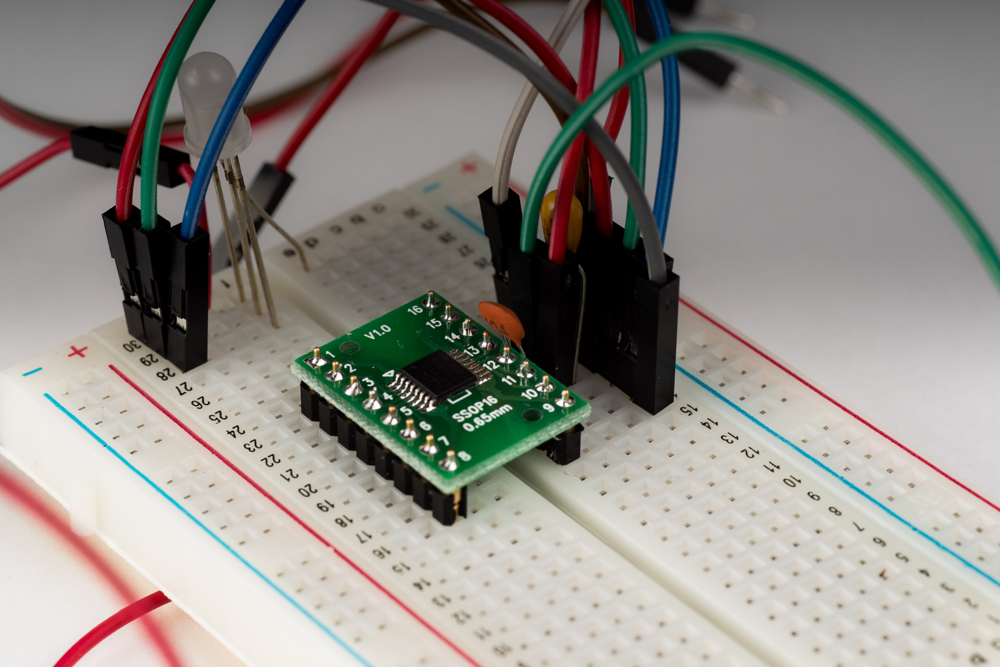
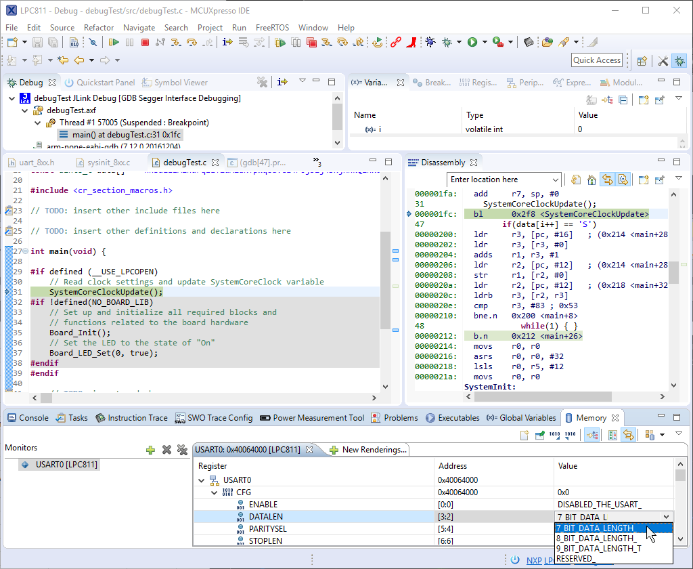
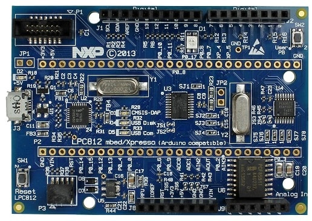

NXP
LPC811

https://jaycarlson.net/pf/nxp-lpc811/

September 15, 2017  Microcontrollers  [2](https://jaycarlson.net/pf/nxp-lpc811/#)

The LPC81x is the entry-level Arm Cortex-M0+ series from NXP. These parts became [really](https://hackaday.com/tag/lpc810/) [really](https://learn.adafruit.com/getting-started-with-the-lpc810/introduction) popular among hobbyists with the introduction of the LPC810, an 8-pin DIP microcontroller that — next to a crusty old ATtiny85 — looked like an obvious winner. While the part is [still available on Mouser](https://www.mouser.com/ProductDetail/NXP-Semiconductors/LPC810M021FN8FP/?qs=sGAEpiMZZMtmz9NzafXQyhIvAjwTEyrk), it’s no longer manufactured by NXP, but all the other parts in this series are still active.

We’ll be focusing on the slightly-more-endowed LPC811, though most of what’s said here will apply to the LPC810, too.

Features at a glance:

- Arm Cortex-M0+ @ 30 MHz
- 1.8 – 3.6V operation
- 8 KB flash, 2 KB SRAM
- Two USART, one I2C, and one SPI peripheral
- One analog comparator
- Two different timer units supporting four capture/match channels and four period counters
- 16-pin TSSOP package

I think the main peripherals of note are the timers. There are two timer modules — a State Configurable Timer/PWM (SCTimer/PWM) with capture and match functionality, plus a multi-channel Multi-Rate Timer (MRT) for generating interrupts.

The SCTimer can run as two 16-bit counters or a single 32-bit counter. This timer provides all I/O functionality with 4 inputs, 4 outputs, plus 6 events supported. Consquently, the LPC811 can drive 4 independent-duty-cycle PWM channels.

The MRT is essentially a 31-bit counter with four independent reload registers, which makes writing multi-task software running at different period intervals a cinch.

Debugging in MCUXpresso IDE was a typical Eclipse experience.

## DEVELOPMENT ENVIRONMENT

MCUXpresso is the Eclipse-based IDE developed by Code Red originally as Red Suite, which then turned into LPCXpresso when NXP acquired Code Red — and then renamed again to MCUXpresso when NXP acquired Freescale (and its Kinetis line of Arm processors).

It’s bog-standard fare, except for the proprietary Redlib C runtime library. Compared to the standard Newlib-nano library that every other vendor ships with their Eclipse-based IDE, Redlib is quite a bit more compact. Of course, this only matters for applications that need printf() support.

## DEBUGGING EXPERIENCE

MCUXpresso offers a fairly typical Eclipse-based debugging experience. Notably different is NXP’s proprietary debugging configurator; instead of having to manually set-up debug configurations, MCUXpresso has a one-click debug button. While other Eclipse toolchains use the open-source [J-Link debugging plugin](https://gnu-mcu-eclipse.github.io/debug/jlink/), there are proprietary panes for J-Link and PEMicro debuggers in MCUXpresso. As usual, a manufacturer-specific register viewer displays the MCU’s peripherals. I’m not a huge fan of this one — it’s a two-step process to view a register: first, you select the peripheral from the Peripherals+ view; selected peripherals appear in separate windows. One nice feature of the register viewer is a drop-down value list (though other environments have this feature, too).

The new LPCXpresso MAX boards have an Arduino form-factor — and in the case of the little LPC812 target on this board — require a bizarre collection of I2C GPIO and ADC peripherals.

## DEVELOPMENT TOOLS

The [classic NXP LPCXpresso](https://www.nxp.com/products/microcontrollers-and-processors/arm-based-processors-and-mcus/lpc-cortex-m-mcus/lpc-developer-resources-/lpcxpresso-boards/lpc812-lpcxpresso-board:OM13053) dev boards were fantastic. They included a snap-off debugger (with good header positions to facilitate re-attachment)  and all pins broken out on 0.1″ headers.

These boards have been retired, and replaced with the LPCXpresso MAX boards that use an … ugh…. Arduino Uno form-factor.

**Stepping on my soapbox momentarily:** This is so stupid. Are there actually advanced hobbyists and professional developers out there who intend to stack Arduino shields — those expensive, single-function 5V dev boards that I’ve never seen on a professional engineer’s workbench — on top of these dev boards? Even when the target processors have vastly different capabilities — both above and below — the ATMega328p?

Hey NXP, please point me to the GitHub repo you maintain that has driver library ports for every Arduino shield out there? Oh, wait, you don’t actually have *any* code for *any* of these shields?

Well, you at least provide a Wiring-compatible library for these boards, right?

No?

Then *why on Earth are you making Arduino form-factor boards?*

The [LPCXpresso812-MAX](https://www.nxp.com/products/microcontrollers-and-processors/arm-based-processors-and-mcus/lpc-cortex-m-mcus/lpc-developer-resources-/lpcxpresso-boards/lpcxpresso812-max-board-for-lpc81x-family-mcus:OM13055) board that covers the LPC811 in this review is especially bizarre. Here’s a cute little 16-pin microcontroller with only 11 GPIO (excluding the crystal / SWD signals), shoved onto a board that’s intended for an MCU with 20 IO pins — including 5 analog inputs (when the LPC812 *doesn’t even have an ADC!*)

So what does NXP do? They throw in random I2C GPIO and ADC peripherals to pad the LPC’s I/O count (and endow it with an ADC it doesn’t inherently have). Do they provide drivers for accessing these peripherals…. or examples?

No. Of course they don’t.

This is so stupid. **(Steps off soapbox)**

Of course, microcontrollers like this really don’t need much electronics support to get them running, so I assume most professionals will skip this gibberish and solder these parts directly to a breakout board when prototyping.

While these boards have an integrated LPC-Link JTAG/SWD debugger, NXP does not actually make the LPC-Link as a stand-alone debugger — so if you want something in a plastic box, look toward the usual suspects — SEGGER and PE-Micro probes are supported by MCUXpresso.

# PERFORMANCE

## BIT TOGGLING

The LPC811 has a toggle register, so it was able to achieve a bit-wiggle with two instructions — a toggle-set and a branch. On a Cortex-M0+, these should be single-cycle and two-cycle instructions, respectively — but the LPC uses 4 cycles to complete this task. I haven’t had a chance to test at lower clock speeds, but I suspect the flash is causing wait states that are stalling the processor.

## BIQUAD FILTERING

The LPC811 used 41 cycles for the biquad filter — worse than all other Arm parts. Again, I suspect flash read speeds being the culprit here. NXP does not talk at all about flash caching, read-ahead, or other flash accelerator technology. Since flash read speeds typically top out at 24-25 MHz for these sorts of parts, when they looked at the 30 MHz core clock, I suspect NXP simply tossed their hands up and decided not to mess with anything fancy. The processor will simply have to wait for the flash to catch its breath every four or five clock cycles.

Either way, its other numbers from this test showed it filtering up to 732 ksps — less than half of the best Arm parts tested (no help from the 30 MHz operating frequency). Running this from 4.43 mA of power yielded a 20 nJ/sample efficiency — twice that of the best Arm processors tested, but far from the worst Arm part tested — and certainly better than nearly every other 16- and 8-bit part.

## DMX-512 RECEIVER

The LPC811 moved to the middle of the pack for the DMX-512 test. Dropping the clock down to 4 MHz, the power consumption eased down 1950 µA — toward the high end, especially for parts that used a custom, clock-efficient ISR routine. Its LPCOpen peripheral library contributed to the UART ISR’s 159 cycles — a mediocre measure that’s far worse than the speed from the [Infineon XMC1000](https://jaycarlson.net/pf/infineon-xmc1100/), [STM32](https://jaycarlson.net/pf/st-stm32f0/), or the [Nuvoton M051](https://jaycarlson.net/pf/nuvoton-m051/); but still better than the [KE04](https://jaycarlson.net/pf/freescale-nxp-ke04/) and [SAM D10](https://jaycarlson.net/pf/atmel-microchip-sam-d10/).

# BOTTOM LINE

The LPC811 runs right down the middle in terms of performance and lacks any stand-out features. The part has a serious omission — an analog to digital converter — that dramatically stunts the usefulness of this part in general-purpose contexts.

MCUXpresso has some nice tricks up its sleeve — but most of the stand-out profiling and runtime analysis features require an SWO pin you’re not going to find on parts in this price range, so I wasn’t able to test these features.

NXP makes some great parts, but they’re also expensive — for a lot of applications, paying 20-30% more for an MCU isn’t a deal-breaker. If they have a part that works in your application — like the interesting [dual-core Cortex-M4/M0](https://www.mouser.com/new/nxp-semiconductors/nxplpc4300/) combo chips — you can feel confident that the development ecosystem won’t disappoint.

As for the LPC811 (and the LPC81x series), the best way I can describe it is inoffensive, but unremarkable.