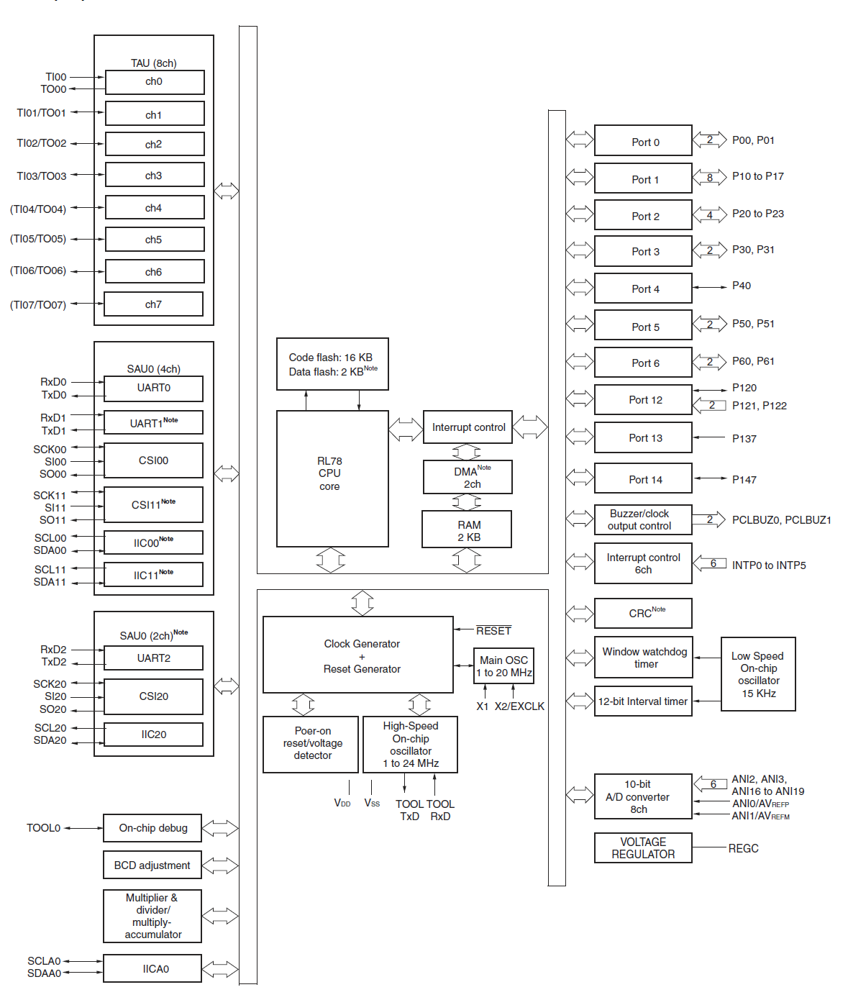

RENESAS
RL-78

https://jaycarlson.net/pf/renesas-rl-78/

September 15, 2017  Microcontrollers  [5](https://jaycarlson.net/pf/renesas-rl-78/#)

The Renesas RL78 is a 16-bit CISC architecture that is sort of a merger between the Renesas R8C and the NEC 78K architecture. It, along with Renesas, came into existence when Hitachi, Mitsubishi, and NEC combined their semiconductor businesses.

The Renesas line ranges in price from about $0.36 for the 10-pin R5F10Y14 to $8 for the R5F100PL parts with 100 pins, and half a megabyte of flash. Many of these devices are designed for power-sensitive consumer goods; LCD interfacing is featured prominently in the family, but I would have liked to see a bit more connectivity at the lower end of the range; as an example, it takes $2.80 to get a part with USB, and it’s overspec’d for most USB device needs. They have fairly uniform clock speed across the family — only ranging from 20 to 32 MHz. However, with a three-stage pipeline, four banks of eight registers, 16×16 hardware multiplier and divider, and a fully-orthogonal instruction set, it’s plenty fast for most workloads.

For this review, I’m using the R5F102A8. I’m not really sure I understand their naming scheme — this part is considered part of the RL-78/G12 family. Why is it not called something like RL78G12FA8? No clue.

The specs rundown for this part is:

- 24 MHz, 8 KB of flash, 2 KB of data flash, and 768 bytes of RAM
- 30-pin TSSOP package, with 26 I/O
- Runs at 1.8 – 5.5V, with an internal core regulator
- 8 timers, plus a low-speed interval timer
- 8 channels of 10-bit ADC
- 3 multi-purpose serial array unit (SAU) channels, with a 4th dedicated I2C peripheral
- 6 External interrupts
- Two-channel DMA

The RL78 has arrayed timer units and communications peripherals that makes understanding the capabilities of the system straightforward. I wish there weren’t so many different I/O ports, though; it’s clear that these chips were designed to be big — 80/100-pin packages, and have since been scaled down.

## PERIPHERALS

One thing I particularly enjoy about the RL-78 is that it’s fairly easy to understand exactly what capabilities a particular MCU has, since the peripheral selection is arrayed nicely. All the timers are identical, and all the communications peripherals are identical. Compared to Microchip and 8051 MCUs, which have to maintain “classic” timers and communications peripherals for legacy reasons, it’s refreshing to eliminate all of those gotchas.

The RL-78 has a confusing mess of GPIO ports — all with different supported drive configurations.

### GPIO

That’s not to say this chip doesn’t have gotchas, though. GPIO — of all things — is extremely nonuniform and confusing on this part. I understand that manufacturers put big dies in little packages, and have to figure out how to bond out the pads, but this is ridiculous. There’s FOURTEEN different ports on this 30-pin chip — most of which only have one or two pins on them!

Worse yet, all these ports are different: some have configurable pull-ups, some don’t; some have configurable TTL input mode, some don’t; some have an open-drain output mode, some don’t; some have analog functionality; some don’t.

I suspect I will keep Table 4-5 handy when designing PCBs around this part.

Pin names, by the way, are simply concatenated bit numbers with their port; depending what you’re doing, you’ll interact with both full port values or specific pins. So if you see “P112” that’s “Port 11, bit 2” and “P12” is “Port 12.” Or is that Port 1, bit 2″? I’ll get back to you.

I played a little bit with almost all the peripherals on this MCU, and — other than GPIO — they had few surprises.

### COMMUNICATIONS

The RL-78 part I tested has two Serial Array Units (SAUs), along with a third stand-alone IIC unit. The Serial Array Units are effectively collections of USARTs — configurable as either a UART, SPI, or I2c master transceiver. SAU0 has two of these USARTs, and SAU1 has one of them. Each of these three USARTs can operate in whichever mode you wish, giving you quite a bit of communications flexibility compared to other MCUs in this round-up.

### TIMERS & CLOCKS

There are two internal oscillators: a 24 MHz ±1% main oscillator, and a 15 kHz ±15% (yes, 15%) low-power oscillator that drives the watchdog timer and a dedicated, 12-bit interval timer, which allows you to build the world’s shittiest clock, I suppose. The interval timer, being 12-bits @ 15 kHz, limits you to a 66 µs to 273 ms range. The main oscillator can be divided down to 1 MHz minimum operating frequency.

There are 8 identical timer units — each is a full, 16-bit timer with a separate reload register. A single timer unit can be used as an interval timer interrupt source, square wave output, an external event counter, a clock divider, an input pulse interval measure tool, or a delay counter. Two timer units can be ganged together to do one-shot pulse outputs and PWM. There’s also a multi-PWM output mode that allows TU0 to drive as many other timer units as you wish, giving you up to 7 channels of PWM.

The RL-78 hardware user’s manual is graphics-heavy and full of ancillary material that I wish had been in my embedded systems textbook. I also appreciate all the electrical specifications, packaging, and pinouts are reprinted in it, which means you don’t have to keep the datasheet around for the part, too.

## DOCUMENTATION

Speaking of timers, the timer documentation in the RL78 datasheet is some of the best I’ve ever read, and I was glad to see much of it made it into the code generator tool. They carefully explain — with illustrative graphics — all the different operations of the timer units, along with procedures for configuring different modes.

Overall, documentation was excellent. The RL-78 family has separate datasheets and reference manuals, but the reference manual (called the “User’s Manual: Hardware”) has reprints of all the data in the (much shorter) datasheet. There’s a software user’s manual, but I didn’t need to look at it while developing — it’s for people writing assembly, or researching the core.

By removing R55, R64, and R66, you can re-route the debugger connections to the off-board connector. You can still debug the on-board target by jumpering the appropriate wires on this header, as it will now have all the debugger and target signals on it.

## DEV BOARDS & DEBUGGERS

The official cheap programmer for the R78 is the E2 Emulator Lite (MPN: RTE0T0002LKCE00000R, because Renesas) but there’s not a lot of suppliers for it, and it [rings in at $60](https://octopart.com/search?q=RTE0T0002LKCE00000R). Instead, I [stumbled upon](https://www.digikey.com/product-detail/en/renesas-electronics-america/YRPBRL78L1A/YRPBRL78L1A-ND/6605483) the YRPBRL78L1A board at DigiKey, which is a $25 dev board for the (much nicer) [RL78/L1A](https://www.renesas.com/en-us/products/microcontrollers-microprocessors/rl78/rl78l1x/rl78l1a.html). I figured there would be some option to do off-board debugging, as I saw a huge, unpopulated header in the pictures. When I got the board and started parsing the [schematics](https://www.renesas.com/en-eu/media/solutions/key-technology/human-interface/rl78-l1a/RPBRL78L1A_Schematics_r12uz0008eg0100.pdf), I realized that the off-board connector was so you could use an off-board emulator with the target on the board; not so that you could debug an off-board target with the on-board emulator. Luckily, several of the pins were unconnected, so I popped off some zero-ohm resistors and re-routed the debug connections to the connector.

With the launch of e2 studio, Renesas moves away from their old-school CubeSuite+ proprietary IDE, and joins the Eclipse club. While it has a few quirks, I found this tool to work as well as all the other Eclipse-based IDEs in this round-up.

## DEVELOPMENT ENVIRONMENT

Renesas is on the same train as nearly everyone else with e2 studio (their capitalization, not mine).  On its way out is CubeSuite+ (CS+) — their proprietary, expensive IDE — replaced by a free IDE based on Eclipse Mars 2. They provide a custom toolchain editor supporting their CC-RL compiler (along with GCC), but most of their modifications relate to their code configurator and debugging environment.

I really enjoyed the timer documentation in the datasheet, and I was glad to see much of it made it into the code generator tool. Too many embedded programmers don’t understand all the powerful functions of advanced timers, so this tool should help out a lot.

### CODE GENERATOR

e2 studio has a built-in code-gen tool called (somewhat unceremoniously) Code Generator. This tool generates both initialization code, as well as some runtime peripheral driver code. In terms of overall GUI responsiveness, this one is pretty good. Because of the relatively simple clocking structure of this MCU, the code-gen tool can quickly determine timing without having to back-solve for different possible permutations. But Code Generator seemed to lag when switching between peripheral functions.

One small feature that I liked was that Code Generator obeyed the Eclipse Perspective buttons — when I click on Code Generator, it appears. When I click on C/C++, it vanishes, and all I see is my open text editors. Some vendors have code gen tools that don’t seem to understand when they’ve overstayed their welcome; no matter which perspective you try, they stay open (I’m looking at you, Simplicity Studio!).

My main issue with the code generator tool is that it doesn’t stand in for the datasheet as much as I’d like when working with timers. If I’m going to create some PWM channels, couldn’t it generate some simple inline functions to set the duty cycle, so I don’t have to remember the register names of these timer units?

The other gripe only comes into play when you work on bigger devices; many of these chips support pin muxing flexibility — allowing you to decide which pin a particular peripheral ends up on. Unfortunately, Code Generator makes you decide your routing **before** you’re allowed to start assigning things. And the only way to “undo” is to literally delete the Code Generator document and start over. That’s ridiculous.

There are a few other oddities: not all the RL78 devices seem to have a functional Device Top View page; the device I worked with for this review simply had a blank page. This is a far cry from all the other code generator tools I used in this review, and seems very strange that Renesas didn’t take the time to finish generating these diagrams before shipping this product. Yet again, you’ll be returning to the database to see exactly which pin TxD0 is on, or where that PWM output goes.

Also, the initial page you see (pin assignment, clock settings, block diagram, on-chip debug settings, safety functions, data flash settings) is labeled as “Clock Generator” in the menus if you ever want to return to it (and, trust me, you will — since you’ll forget you have to enable On-Chip Debugging manually, as well as check to see which pin assignments you used for the peripherals). Bizarre.

When building out the DMX-512 demo, the Stack Analysis tool helped me see where my stack-heavy calls were. One thing that scared me was the red — this indicates the “worst-case” stack usage; it doesn’t indicate where the stack overflowed.

## ANALYSIS TOOLS

This is where e2 studio really shines. The Memory Usage tab in e2 studio automatically updates with flash and RAM usage — as well as a fine-grained break-down of different symbols — whenever you build your project. Building this stuff into the IDE isn’t rocket science, but it’s nice to see it when so many vendors rely on printing sizes in the build console.

There’s also a Stack Analysis tool that will statically analyze your call trees and point you to worst-case scenarios (in red). It’s important to note that the red color doesn’t indicate a stack overflow, but rather, just the deepest stack usage call. In fact, the Stack Analysis tool will happily report stack sizes into the 10s of thousands of bytes without issuing you any sort of error or anything.

I can’t say enough about how useful real-time tracing is. Renesas e2studio’s real-time tracing starts with real-time expressions, progresses to Visual Expressions (with both outputs and inputs), all the way up to graphing and plotting. There’s an amazing amount of insight you can gain from a project as simple as my DMX-512 receiver with these advanced views.

## DEBUGGING EXPERIENCE

It seems like Renesas uses a sort of monitor program that does the on-chip debugging in software, as the on-chip debugger must be explicitly enabled or disabled as fuse bits in configuration flash. Code load times and debug session start-up was average.

Once you’re debugging, there are several Renesas-specific views. The Current Consumption tab doesn’t work with my tool (consulting the schematic reveals the target is fed directly from a 3.3V LDO, so this isn’t surprising), but I’m sure if I had one of their higher-end debug tools, the feature would work fine. The performance analysis view isn’t helpful on the RL-78 series MCUs because there are no event timers built into the hardware as there are on the RX-series parts. Similarly, I couldn’t get the profile view to do anything (I can’t imagine it would be useful without performance timers, though).

Having said that, the debug system still has support for real-time tracing on the RL-78. Once you add a variable to the Expressions view, you can click on the icon to the left of the variable name to enable real-time updates of the variable. Polling defaults to 100 ms but can be adjusted. Once you’ve got real-time expressions set-up, you can visualize them using the Visual Expression widgets (totally gimmicky for output, but the inputs could be useful for simulating analog sliders and push-buttons when you have no hardware yet) — but there’s also a real-time chart tool that will plot your expressions as time series. It’s pretty basic, but this is the stuff I’ve never seen on anything other than ARM microcontrollers before, so it’s a welcome addition.

## HEADER FILES

Alright, start with the good stuff: I was pleased to see the header files supported bit unions, like this:

```c
P6_bit.no1 = 1; // set pin P61 true
```

Unfortunately, they use the same, generic 8-bit bitfield type for *all* registers. What does this mean? None of the big units are *named!* Consider reading the ADCEN bit from the PER0 register:


To add insult to injury, there is no documentation in the header file, so don’t expect to ctrl-click your way out of this conundrum.


Interestingly, though, if you get rid of the bit union, and only use the raw register, you can hover over it to actually bring up a miniature snapshot of the hardware reference manual that you could scroll through. It’s a neat feature that I kind of like, but its’ slow and clunky enough that I think I would have just preferred header file documentation. Also, it doesn’t work on bitfields. Boo. Hiss.

Combined with the fact that Code Generator doesn’t generate much in the way of timer functions, you’ll notice yourself wading through the datasheet, trying to remember what the name of the damn timer reload register is called.

Having to look up registers is the sort of stuff that absolutely kills productivity, and it could be so easily solved: just put useful comments next to the register in the datasheet. I’ll probably end up doing this myself if I ever pick up an RL-78 for serious development work.

## COMPILERS

Pluralized, since the RL78 has different options — even within the e2 studio environment. Essentially, the options are:

- **Renesas CCRL:** Fast, efficient code, with a price tag allowing you to empty your bank account in a fast, efficient manner.
- **Renesas GCC:** GNU-style toolchain that’s unrestricted. Compiled binaries are behind a free registration wall.
- **KPIT GNURL78-ELF**: Yet another GCC toolchain, from KPIT. I wasn’t able to test this, because their web site was down. From consulting the forums, this is a regular issue. Lovely.
- **IAR EWRL78:** I didn’t personally install this behemoth to test, but from my research, it should be as good if not better than CCRL, and possibly cheaper.

I’m sure all the GNU fans will rejoice in the presence of a GCC toolchain, but from a code quality standpoint — on this architecture at least — it doesn’t seem very good at all. GCC doesn’t really seem to know what SFRs are, and instead, just treats them like 16-bit memory. Consider a bit-toggle:

```c
P6_bit.no0 = !P6_bit.no0;
```

Got compiled into:

```assembly
00000aea: movw 0xffef2, #0xff06
00000aee: movw 0xffef0, #0xff06
00000af2: movw ax, 0xffef0
00000af4: movw 0xffef4, ax
00000af6: movw hl, 0xffef4
00000af8: mov a, [hl]
00000af9: and a, #1
00000afb: mov 0xffef0, a
00000afd: xor 0xffef0, #1
00000b00: movw ax, 0xffef2
00000b02: movw 0xffef4, ax
00000b04: movw hl, 0xffef4
00000b06: mov1 cy, 0xffef0.0
00000b09: mov1 [hl].0, cy
```

Ouch. I tried several different bit-math forms, but they all produced the same thing. If this GCC is anything like AVR-GCC, you have to turn the optimizer up. Here’s -O3:

```assembly
0000053b: mov a, 0xfff06
0000053d: xor a, #1
0000053f: mov 0xfff06, a
```

OK, now that’s starting to look a bit more like real code. But why is it insisting on doing the XOR in register A, instead of directly on Port 6? This is a CISC architecture with a beautiful, fully-orthogonal instruction set. I have no idea why GCC is refusing to work directly on registers, but I was never able to get it fixed, no matter what I tried. It’s a shame, as GCC integrates nicely into e2 studio, and I had no problems with any other aspect of it (including debugging).

If we switch to CC-RL, Renesas’s in-house toolchain, we get a nice, single instruction for that bit toggle:

```assembly
xor 0xFFF06, #0x01
```

These are the things that drive me nuts about compilers.

Suffice it to say, right now, CC-RL works great, and I’d recommend using it until GCC gets fixed up. Once the 60-day full-version trial is up on your copy of CC-RL, the compiler imposes a 64 KB linker limit. Our device has 8 KB of flash, so I’m not going to cry much about this limitation.

## PROCESSING & POWER CONSUMPTION

Because this is a CISC architecture with a fully orthogonal instruction set, the RL-78’s pin-toggle program was compiled into two easy-to-digest machine instructions, taking 5 cycles total:

```assembly
00000190: xor 0xfff02, #4    ; toggle P22 (2 cycles)
00000193: br $0x190 <main+3> ; rinse and repeat (3 cycles)
```

The RL-78 executed the digital biquad test at 315.42 kHz, with a run-mode current of 3.79 mA, giving it an efficiency of 39.65 nJ/sample. I tried different optimizer settings, but the defaults turned out to produce the best performance in this test.

The datasheet rates a typical power consumption figure in active-mode, full-speed, at 3.7 mA; my digital biquad test was a bit higher than that, but this is to be expected. Consumption drops to 440 µA when in halt mode, and 230 **nA** when in STOP mode, though I wasn’t able to get current consumption down below about 240 **µA** — even after disconnecting the debugger, and trying different combinations of fuse settings. I’ll need to investigate this further and update this post.


## DMX-512 RGB RECEIVER

For this project, I ticked the PIOR0 bit checkbox in the Pin Assignment page of Code Generator, which let me get TO01, TO02, and TO03 all next to each other.


#### UART

Setting up the UART peripheral for this project was a walk in the park, as the Code Generator drivers for this MCU provide interrupt-based buffered UART reception with a callback-on-complete, along with receive error callbacks. Recall that we’re receiving a DMX frame by waiting for a framing error, and then reading in the next 512 bytes as your frame.


#### PWM

The PWM module supports initial output value and active-high or active-low configurations, so I didn’t have to do any software math to invert the incoming DMX frame’s value to handle the active-low scenario of the LED.

An annoying Code Generator thing is that it stores constants (in our case, timer periods) as **#define**s *with the value of the constant in the name*. This is utterly ridiculous, because the moment that Code Generator changes the value, your software won’t work anymore. Since Code Generator doesn’t provide methods for setting the duty cycle, you have to hit the datasheet to figure out how it’s implemented.

#### Power Reduction

In my case, the UART baud rate was the limiting factor — I could only reduce the main oscillator down to 2 MHz. As for halting the CPU, there’s nothing special you have to do; just call HALT().

#### Results

I only had to write 7 lines of code to correctly implement this project. The RL-78 produced moderately good results — using only 575.52 µA of current on average.