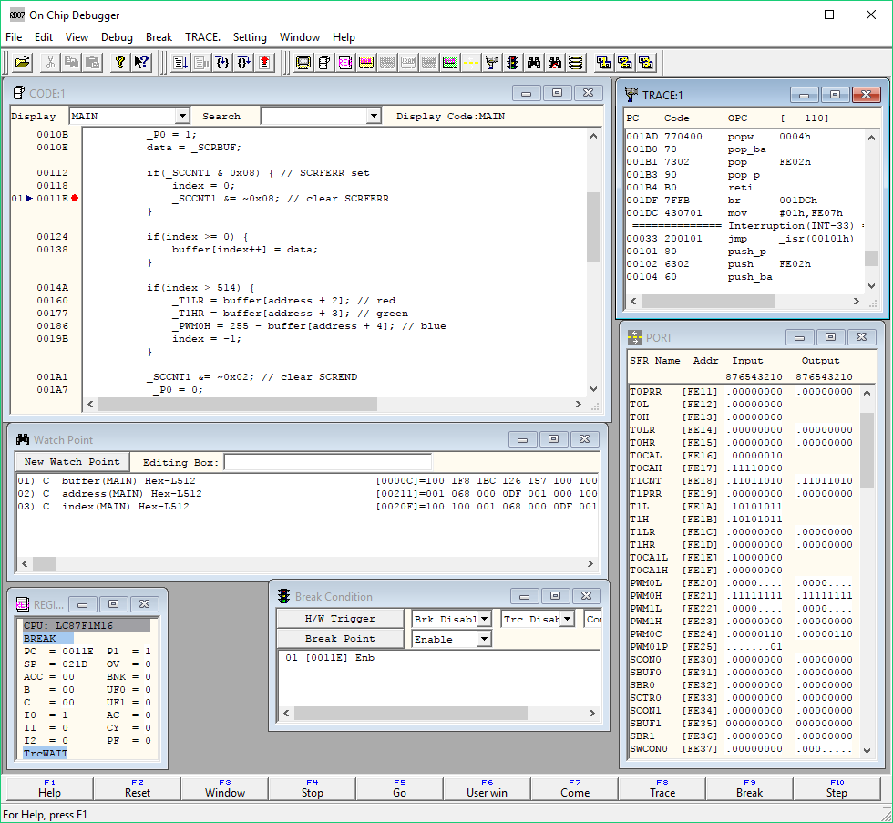

SANYO
LC-87

https://jaycarlson.net/pf/sanyo-on-semiconductor-lc87/

September 15, 2017  Microcontrollers  [1](https://jaycarlson.net/pf/sanyo-on-semiconductor-lc87/#)

The LC87 is an 8-bit MCU originally from Sanyo, then sold off to Silicon Storage Technology (SST), which was absorbed by ON Semiconductor. This is an oddball part that I’ve seen in a few Japanese products (like [Wacom’s graphics tablets](https://www.youtube.com/watch?v=TeCQatNcF20)), but it hasn’t really been available to American designers until the ON Semi acquisition.

I’m looking at the LC87F1M16A — one of the few parts I could secure for review. Its features include:

- 12 MHz clock (4 MHz instruction timing)
- Two 16-bit auto-reload timers, that can also be configured into a total of two 16-bit capture channels and two 8-bit PWM channels
- Four 8-bit auto-reload timers
- Two additional dedicated 12-bit PWM channels
- 12-bit 15 ksps ADC with 20 inputs
- Two UARTs plus one SPI interface

## CORE

The LC87 has a 16-bit address space, capable of addressing up to 256 KB of ROM spread across two banks, along with 256 SFRs and 64 KB of RAM (along with 16 MB of external memory). In practice, these parts come in sizes up to 256 KB flash / 10 KB RAM. The core has 16×8 and 24×16 hardware multipliers and dividers (though they are unsigned-only). This core has a fully orthogonal instruction set with three different indirect offset address options, which should make memory-intensive workloads straightforward on the part. The LC88 is an incompatible but related 16-bit version of the LC87.

## PERIPHERALS

The LC87 includes a ton more option fuses than other MCUs — in fact, the port output type is configured through fuses, not run-time accessible registers. A separate configuration program sets these options.

The LC87 features a healthy count of timers, serial communications peripherals, and ADC channels — but these peripherals are generally pretty basic when compared to the competition. This isn’t necessarily a bad thing, though; I found myself only needing to modify a few bits here or there to get peripherals to come alive, as the peripherals generally have sensible POR default values.

 

The GPIO on the LC87 has high-current N-channel / P-channel output options on Port 0 and Port 1 — these support 50 mA max drive (alright, so not *that high* of output current, but still usable for some small LED COBs).

This chip has 6 independent timers — four auto-reload 8-bit counters, and two auto-reload 16-bit counters. These can be configured to provide two capture/compare channels and additionally two 8-bit PWM channels. There are also two dedicated 10-bit PWM outputs that operate without using any of the timer resources.

The Serial Interface 1 (SIO1) half-duplex UART peripheral takes its inspiration from the 8051 UART. It has four operating modes: synchronous serial, asynchronous serial, plus multi-chip asynchronous master and slave communication. The interface uses an 8x sampling, but unfortunately for high baud rates, instead of being clocked off the main oscillator, it is clocked from the instruction clock, which runs three times slower than the main oscillator. Thus, the fastest baud rate possible is 500 kHz when the IC is sourced from the 12 MHz oscillator.

The LC87 also has an SIO4 module, a synchronous SPI peripheral.

 

Tasking EDE is the old-school development environment for invoking the Tasking C compiler for the LC87. Ignore the debugging functionality built into this IDE — the LC-87 has no support for debugging in this program; you have to use a separate RD87 debugger application.

## DEVELOPMENT TOOLS

The only compiler I could find supporting the LC87 is an old version of (now Altium’s) Tasking compiler/EDE development environment. The IDE is similar to what you would imagine of a late-90s/early-2000s proprietary IDE. It has some basic text completion, but its the least-productive text editor I encountered in my review. There’s no automatic indentation or formatting. There’s no shortcuts for commenting or uncommenting lines of code. And its one of those weird cell-based editors that allows you to place your cursor at arbitrary positions on the screen and start typing.

The biggest problem with EDE, though, is that Sanyo has no debugging capabilities built-in. You have to use an entirely separate program — RD87 — to load your binaries and debug them.

The LC87 uses a separate program for flashing and debugging. This app has a clunky UX, but otherwise brings all the standard debugging features, and has impressive code loading speeds.

## DEBUGGING EXPERIENCE

RD87 is the stand-alone debugger application for the LC-87. It provides breakpoints, variable watches, register manipulation, and a few other tricks, but it looks even worse than EDE. It’s extremely clunky to inspect variable’s values, and set breakpoints — plus, the program doesn’t even monitor the filesystem to enable automatic reflashing whenever you build an image. Instead, you have to manually re-load the flash image every time you want to start a debugging session.

Having said that, debugging speed was *really* fast — by some measures, the fastest part reviewed. While breakpoints can only be set when the target is halted, once the breakpoints and memory watches are set up, I found the system to be quite snappy; the entire 256-item SFR list refreshes in a fraction of a second, as do long data arrays that are watched. I didn’t inspect the debugging protocol used, but it works well.

# PERFORMANCE

## BIT TOGGLING

The LC-87 does not have dedicated toggle GPIO registers or bit manipulation instructions. It took 6 machine cycles (18 clock cycles) to toggle a bit — the only part worse than this was the [PIC16](https://jaycarlson.net/pf/microchip-pic16-five-digit-enhanced/).

## BIQUAD FILTERING

While this part was a bit better than the 4T [PIC16](https://jaycarlson.net/pf/microchip-pic16-five-digit-enhanced/) and [HT66](https://jaycarlson.net/pf/holtek-ht-66/) processors, its 23 ksps into 6.51 mA is nothing to be proud about: worse than 900 nJ/sample — 100 times that of the [SAM D10](https://jaycarlson.net/pf/atmel-microchip-sam-d10/).

## DMX-512 RECEIVER

Its 159-cycle ISR duration was middle of the pack, but especially bad among the 8-bit parts. Its 28-cycle ISR latency is much more in line with what I saw from other parts.

I tried taking the system clock down from 12 MHz to 6 MHz, but the LC-87 could not reliably receive characters at 250 kbaud. Thus, I had to leave the processor running at full speed. Putting the chip in idle mode reduced power consumption by about the same amount that enabling the UART increased it — yielding a 6520 µA active current measurement. This was far worse than every other part tested — including the [STC8](https://jaycarlson.net/pf/stcmicro-stc8/).

# BOTTOM LINE

The LC-87 is a slower, 3-cycle 8-bit MCU with easy-to-program peripherals and plenty of memory headroom — but with little else going for it. Its abysmal power consumption, underwhelming feature set, unfriendly pricing, and obnoxious development ecosystem should steer away almost any rational person, but if ON Semiconductor decides to dump the prices on these parts, they could find a home in basic industrial/automation applications, I guess.