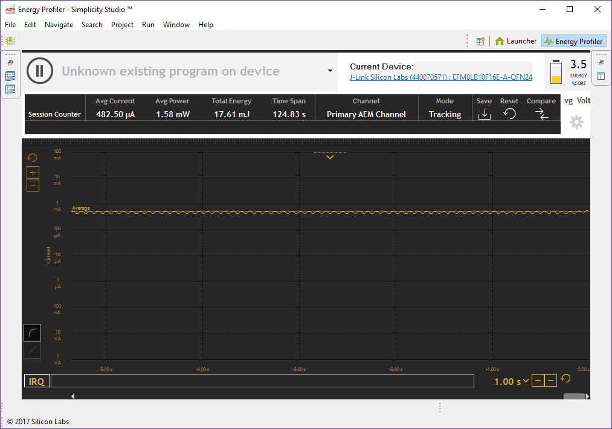

SILICON LABS
EFM8 LASER BEE

https://jaycarlson.net/pf/silicon-labs-efm8/

September 15, 2017  Microcontrollers  [14](https://jaycarlson.net/pf/silicon-labs-efm8/#)

The EFM8 is Silicon Labs’ current line of 8051 microcontrollers. If you hear “8051” and think of a 1980s slow 12T microcontroller that comes in big DIP-40 packages, remove that image from your head. All 8051s I reviewed are 1T architectures that use pipelined instruction execution, and the EFM8 is no exception. Since there were three vastly-different 8051 parts I reviewed, I did [a bit of an 8051 core shoot out](https://jaycarlson.net/microcontrollers/#https://jaycarlson.net/microcontrollers/#battle-of-the-8051s) in the main article.

Some of these EFM8 parts seem like re-badges of their later-generation C8051 parts, while some are obviously new designs.

These parts complement their EFM32 Arm products by offering some excellent power consumption figures — but unlike some power-friendly parts like the [MSP430](https://jaycarlson.net/pf/texas-instruments-msp430fr/), EFM8 parts also have incredible value.

There are four families of EFM8 devices:

- EFM8 Busy Bee (EFM8BBxx): mainstream features with the lowest price tag
- EFM8 Sleep Bee (EFM8SBxx): designed for low-power, battery-operated products
- EFM8 Laser Bee (EFM8LBxx): high-performance 72 MHz speed with an emphasis on analog capabilities
- EFM8 Universal Bee (EFM8UBxx): basically a 48 MHz EFM8BB with USB connectivity

In fact, each EFM8 series has availability in this price range, which made selection difficult. I ended up with the Laser Bee — specifically, the EFM8LB11F16.

Here’s a rundown of the part:

- 72 MHz 1T 8051 core
- 16 KB of flash, 1.28 KB of RAM
- 14-bit 900 ksps ADC, with two 12-bit DACs and two analog comparators
- Two 8-bit auto-reload timers, plus four 16-bit auto-reload timers, 10 capture channels, and six 16-bit PWM channels
- Two USARTs (one classic 8051, one modern), plus separate SPI and I2C peripherals
- Four-channel configurable logic
- 24- and 32-pin QFP and QFN package options — along with a 24-pin QSOP

The high core speed is the first thing that stands out. The EFM8 has 25 MHz flash memory, so running this part at full speed requires two wait-state configuration. Unfortunately, there’s no flash caching accelerator in the EFM8, so cycle efficiency drops substantially as you increase the clock speed.

Silicon Labs has a large customer base that needs compatibility with existing 8051 firmware, so — like the [STC8](https://jaycarlson.net/pf/stcmicro-stc8/) and [N76](https://jaycarlson.net/pf/nuvoton-n76/) — these parts include traditional Timer0/Timer1/Timer2 modules, plus the bog-standard 8051 UART peripheral. That means T0 and T1 are basic 16-bit-counter/8-bit-auto-reload timers, and UART0 has no internal baud-rate generator.

Rathern than getting crafty like STC does, Silicon Labs has simply added seconary peripherals that are more modern — UART1 has an internal baud-rate generator and support for modern features like LIN break and sync detection, plus separate 8-deep TX and RX FIFO buffers.

The 14-bit 900 ksps SAR ADC is a total beast — it can select from 20 external pins on the package, along with VDD, the internal LDO, or the internal temperature sensor. There’s selectable 1.2, 1.65, and 2.4 volt precision references available.

It can be kicked off in software, or asynchronously from external pin interrupts, a timer overflow, a rising PWM signal (though no center-aligned synchronization), or from the configurable logic outputs.

The ADC has an accumulate-and-shift function (for averaging), supports automatic channel sequencing, has a window comparator, and has a psuedo-DMA feature that can store data direct to memory without processor intervention.

The DAC supports two channels of 12-bit voltage output that’s fully static — allowing operating when the core is asleep (or even under a reset condition if configured). Multiple DAC outputs can be synchronized together and can generate complementary waveforms. They can be switched between two output levels based on configurable logic or PWM input triggers.

All EFM8 parts are flashed and have on-chip debugging through the Silicon Labs C2 debug interface. All devices come pre-programmed with a UART bootloader (or USB bootloader in the case of the EFM8UBxx series), though this bootloader is simply stored in flash, and can be easily overwritten (inadvertently or not). There’s also an SMBus bootloader available — great when you’re integrating an EFM8 into, say, an embedded Linux design, or another high-end application-oriented system.

# DEVELOPMENT ECOSYSTEM

Simplicity Studio includes a Launcher perspective that collects documentation, demos, and software examples — immediately filtered for the board you plug in.

## DEVELOPMENT ENVIRONMENT

When you’re working with the 8051, the best compiler in town is Keil’s C51. Most vendors toss up their hands and throw a debugging DLL at you to be used with µVision — which has [poor text-editing capabilities when working with 8051s](https://jaycarlson.net/microcontrollers/#uvision).

Not so with Silicon Labs. They built Simplicity Studio — the only Eclipse-based IDE provided by a manufacturer for use with an 8-bit architecture. Simplicity Studio still uses Keil C51 under the hood, but you get the excellent productivity enhancements and beautiful UI. They’ve had to highly customize it for use with Keil, but I can’t complain about any of their changes.

There’s a nice target selection pane in the project properties view, and you can tick checkboxes next to peripheral libraries you want automatically copied into your project. Why didn’t everyone else think of that?

All the documentation and sample code is built into the IDE, and it’s accessible in the “Launcher” perspective. Sample projects are cloned into your workspace, allowing you to modify them to your heart’s content. Simplicity Studio will even connect and identify your dev kits automagically, and optionally show you only the filtered documentation that’s actually relevant to the part you’re working with. Wonderful!

I have a small gripe about Simplicity Studio — it does not include Keil reserved words in its reserved word list. Users new to the 8051 will find annoying the extensive list of keywords Keil claims — including words like “data” — and Simplicity Studio does not provide visual indication when you use one of these non-standard Keil-specific reserved words. Since Keil will throw fairly cryptic errors when you do something like name a variable “data” this is a definite trap for young players.

Silicon Labs’ Simplicity Studio includes the built-in Simplicity Configurator for generating lightweight initialization code and ISR stubs.

## CODE GENERATOR

Simplicity Configurator is the code-gen tool built into Simplicity Studio. Rather than being everything to everyone, Configurator only burdens itself with peripheral initialization — which it performs with efficient (but also well-documented) register-writes.

The code generator supports multiple “modes” — application states — that allows you to use the code-gen tool to build more complex projects that might enter and exit low-power states, or have different muxing throughout the course of execution. Each mode has its own set of configuration options, and `enter_ModeName()` functions are automatically generated that you can call as you need.

There’s a whole separate system — the peripheral libraries — that you can use to initialize peripherals, but also to work with them. An important concept for new users to learn is these are completely separate systems that have no dependency on each other. Just because you tick the “UART 0” box and configure the UART, you won’t automatically get the UART_0 peripheral driver. You can, of course, add the UART_0 peripheral driver to your project, but you can also work with the peripheral directly (or using your own peripheral library).

I like the flexibility this provides, though it also adds a bit of complexity — for example, it’s not always clear if you need to call the peripheral driver’s Init() function since the peripheral is already initialized by Simplicity Configurator. Perhaps SiLabs could update the documentation for the Peripheral Libraries to include comments for people calling these functions from within a Simplicity Configurator project.

## SDK

The SDK is right where it needs to be — header files are well-documented, and SiLabs provides named bitwise masks for all registers — with built-in code documentation. The peripheral libraries are automatically copied into your project, and are nicely readable and filled with comments. This allows you to modify and manipulate them to suit your application — but for people getting started, they’ll cover all the basics.

## DEVELOPMENT TOOLS

Silicon Labs supports the EFM8 line of processors with a range of starter kits (STKs). Regardless of the EFM8 target, these all cost $30 — a bit pricier than other dev kits in this review, but also one of the most capable dev boards manufactured.

First of all, each of these dev boards comes with a J-Link On Board debugger. This is the Caddilac debugger used mostly by Arm parts, but smartly supported by the EFM8, too (through its C2 debug protocol).

What really stands out is that, ironically, the only dev board in this roundup with a USB 2.0 High-Speed interface isn’t one of the Arm Cortex-M0 parts — it’s this EFM8.

I hope Silicon Labs doesn’t mind, but I found their STK so effective at measuring current consumption that I ripped the EFM8 off one of them, and now use it solely as a time-series ammeter.

Piling on the features, Silicon Labs builds a custom energy monitor firmware into this J-Link — and this has turned into my de facto tool for measuring the power consumption of *all* my projects, not just my EFM8 parts. It’s basically a [µCurrent GOLD](http://www.eevblog.com/product/ucurrentgold/) built into a dev board — and has a huge dynamic range allowing logarithmic plotting of current consumption, from 100 mA down to the dozens-of-nanoamp range.

Because the energy monitor runs in a separate perspective, I actually have a whole second Simplicity Studio workspace set-up just for running this energy monitor — as soon as I launch it, it’s ready to go.

There’s one pitfall with these boards: they can debug external targets, but it’s somewhat clunky — rather than just put some physical jumpers on the board, Silicon Labs uses software-controlled muxes that can route debug signals to a 20-pin micro-header connector that I can’t imagine anyone finding particularly useful. There’s a three-pin unlabeled 0.1″ header on the corner of the board that routes the C2 signals externally from the target, so if you pop off the MCU, you’ve got a $30 USB 2.0 high-speed debugger with built-in power consumption measurements.

For those looking for stand-alone programmers, you can, of course, go with a J-Link (including the [J-Link EDU](https://www.segger.com/products/debug-probes/j-link/models/j-link-edu/) and [J-Link EDU Mini](https://www.segger.com/products/debug-probes/j-link/models/j-link-edu-mini/) — built for hobbyists and students). But Silicon Labs also has the [$35 USB Debug Adapter](https://www.silabs.com/products/development-tools/mcu/8-bit/8bit-mcu-accessories/8-bit-debug-adapter), which is a lot cheaper than a commercial J-Link you’ll need for professional work.

If you want to go even cheaper, there are USB Debug Adapter clones [on eBay](https://www.ebay.com/sch/i.html?_from=R40&_trksid=p2380057.m570.l1313.TR0.TRC0.H0.XUSB+debug+adapter.TRS0&_nkw=USB+debug+adapter&_sacat=0) that work well (and have nicely labeled pins and more convenient pin-out organization) — and if you *really* want to hack something together yourself, you can build your own debugger, too. They sell the [CF326-SX0261GM](https://www.digikey.com/product-detail/en/silicon-labs/CF326-SX0261GM/CF326-SX0261GM-ND/7349647), which is a C8051F326 pre-programmed with the C2 debugger firmware — and it’s only $1.78 in single quantities.

Simplicity Studio has a beautiful and functional register view that allows you to interact with registers using names and drop-down lists — this saves a lot of time when tracking down problems — no datasheet required.

## DEBUGGING EXPERIENCE

SiLabs provides a beautiful and stunningly productive debugging experience for an 8-bit microcontroller. You get full support for all the default Eclipse views — variables, expressions, memory, disassembly, breakpoints, and code views all work exactly as you would imagine.

The registers viewer, however, was probably the best one in the review. Registers are grouped by peripheral, and broken down into individual bit-wise or multi-bit-wise values. There are drop-down list with human-readable names of all the options. As you step through code, changed registers highlight red, so you can see precisely what changed in each debug frame.

I had no issues with skipped breakpoints — even with Keil C51 set to full-optimization mode — though sometimes breakpoints would hit on the line after I set them.

Flash loading with the J-Link-based debugger was *really fast* — about 3.2 seconds to load a basic program, and 4.2 seconds to completely fill the 16 KB of flash. Even the USB Debug Adapter clone managed good speeds — 3.6 seconds loading a basic program, and 5.5 seconds loading up the flash completely. Note that these times include loading flash and running to the main() breakpoint.

No other major 8-bit part beat it — and only the Infineon XMC1000 edged out under these times.

# PERFORMANCE

## BIT TOGGLING

What should be a four-cycle job took eight on the EFM8LB1 — due to the 72 MHz core speed combined with 25 MHz flash access. That’s the Achilleas heal of the EFM8 Laser Bee’s performance.

## BIQUAD FILTERING

Keil has poor optimization strategies when it comes to math library calls — even if you instruct it to optimize for speed, it will never in-line these calls. Consequently, the EFM8 pays a heavy penalty on the biquad filtering when compared to other 8-bit parts — taking 272 cycles to execute a single iteration of the filter. Compare this to the 63 cycles the similarly-priced [tinyAVR](https://jaycarlson.net/pf/atmel-microchip-tinyavr-1-series/) puts up. Again, the cacheless flash is of no help here.

However, the EFM8 powers through with brute force — its 72 MHz core simply overwhelms other parts, pulling in an impressive 265 ksps performance. The penalty it pays is in power consumption — a massive 14.15 mA — which places this at 176.2 nJ/s. Both the [tinyAVR](https://jaycarlson.net/pf/atmel-microchip-tinyavr-1-series/) and [megaAVR](https://jaycarlson.net/pf/atmel-microchip-megaavr/) beat the EFM8 at the efficiency game (as did many of the Arm parts, too).

## DMX-512 RECEIVER

But before you call the Laser Bee a bumbling brute with no regard to power consumption, take a look at the DMX-512 figures: by making use of the built-in FIFO in the UART and reducing the core to 1.531 MHz, the EFM8 was able to slide in far under most other 8-bit parts, using only 607 µA of current. This was not the lowest in our round-up, but the parts that were lower were either very slow 4T processors, or more expensive 16- and 32-bit parts that didn’t nearly match this in functionality.

# BOTTOM LINE

With their productive Eclipse-based IDE, J-Link debugging, and modern peripheral set, Silicon Labs wants you to forget you’re working on a [37-year-old microcontroller core](https://jaycarlson.net/2017/06/27/blinking-an-led-with-an-original-intel-8051/), and they’ve largely succeeded. The EFM8LB1 is both the fastest 8-bit microcontroller I tested — and one of the lowest-power.

But here’s the killer fact: the EFM8 is the only 8-bit system on the market that has unrestricted, cross-platform, vendor-provided tools.

This is absolutely huge for hobbyists and students — and SiLabs sweetens the deal with low-cost dev kits and readily available $10 sanctioned clone debuggers, so you can get into the ecosystem without breaking the bank. Plus, from browsing around for the last few months working on this project, I think the [Silicon Labs community](https://www.silabs.com/community) is as useful and inviting as the Atmel and Microchip ones — which I can’t say about many other parts.

Professionals will be hard-pressed to find a line of 8-bit parts with the amazing analog features and power consumption that this part provides. Plus, if you’re building USB-connected gadgets, or ultra-low-power devices, the EFM8 has special-purpose chips just for you. I think these are obvious choices if you’ve got existing PIC16 or AVR projects in this pin range — though there’s a pretty low parametric ceiling that you’ll hit if you need bigger parts. SiLabs is not Microchip — it’s not important to them that they produce 15 million different products with 30-year commitments on all them. They specialize in this corner of the market, and they don’t try to do stuff they’re not good at. I’m totally fine with that.

The part isn’t perfect. I would love a future EFM8 to have a truer 1T design — in the style of the [STC8](https://jaycarlson.net/pf/stcmicro-stc8/) — which would allow better performance without resorting to such high clock speeds. A 72 MHz part really needs a flash cache/accelerator — otherwise, you simply don’t get expectedly good performance out of the core. I think the comms peripherals could use a bit of rework — like dedicated baud-rate generators for the SMBus and UART0 peripherals. And the STK boards need a better debug-out connection (just put the C2CK and C2D pins on 0.1″ headers and get on with your lives).

But overall, this might just be the most compelling 8-bit part you can buy today.