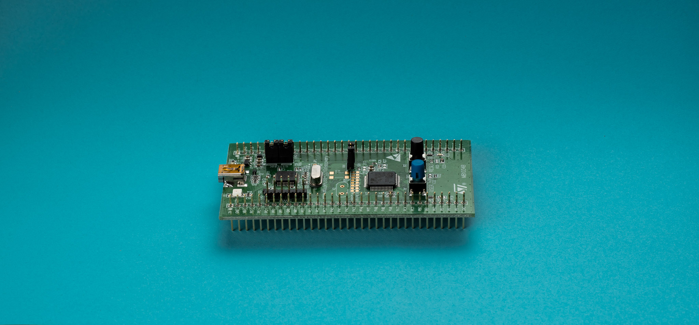
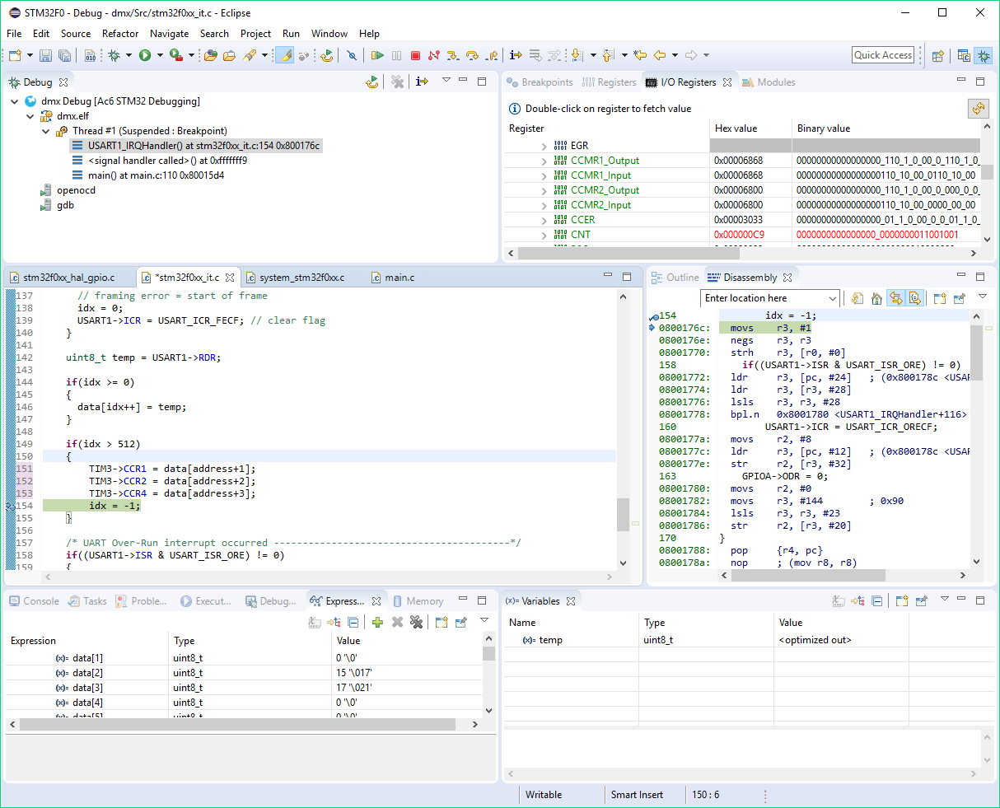
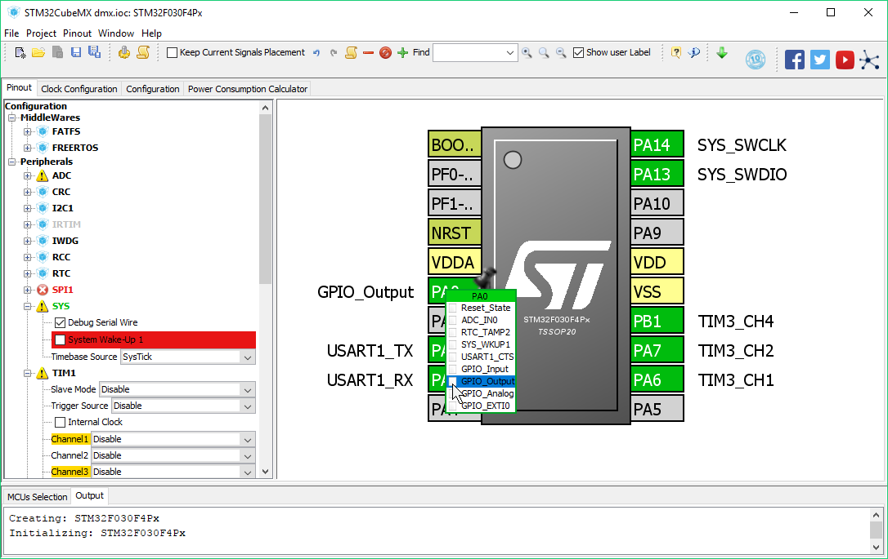

ST
STM32

https://jaycarlson.net/pf/st-stm32f0/

September 15, 2017  Microcontrollers  [23](https://jaycarlson.net/pf/st-stm32f0/#)

The STM32F0 is a broad family of Cortex-M0 parts from ST. Many people use the STM32F042 as their Swiss Army Knife Arm controller — they strike a good balance between performance, power consumption, functionality, cost, and dev tools. I’m looking at the even-less-expensive STM32F030 series, specifically the STM32F030F4P6. This part features:

- 48 MHz Arm Cortex-M0, with 16 KB of flash and 4 KB of RAM
- 1 Msps 12-bit ADC with 9 external inputs (16 on bigger packages)
- Five 16-bit auto-reload timers — including an advanced control timer with six independent PWM channels
- Separate UART, SPI, and I2C peripherals
- 5-channel DMA controller
- RTC peripheral with external crystal support
- 20-pin TSSOP package, with other family members available in QFP32, 48, or 64-pin packages

This chip has a 2.4 – 3.6V operating range, which is a bit higher than the 1.8V minimum supply I generally look for when building battery-powered products. Combined with the TSSOP and large LQFP package options, this puts the part in the [Kinetis KE04](https://jaycarlson.net/pf/freescale-nxp-ke04/) / [Nuvoton M051](https://jaycarlson.net/pf/nuvoton-m051/) group — general-purpose Arm chips designed for industrial control solutions.

This particular part has a bland set of peripherals — the stand-out feature is the 1 Msps 12-bit ADC. There’s no other analog — not even a comparator or cap-touch capabilities.

Some parts in the STM32F030 umbrela have up to six USARTs and multiple I2C and SPI interfaces, though the part I reviewed here has one of each.

 

## DEVELOPMENT ENVIRONMENT

 

System Workbench provides a no-frills stock Eclipse debugging experience. The I/O Registers view is a nice addition, but I wish the Description column would be visible in the default view; instead, the useless “Binary value” column takes up a majority of the space.

System Workbench for STM32 is a nearly-stock Eclipse Neon-based IDE that focuses on being fast. It largely excludes gimmicky features, and lets Eclipse shine through — which is a refreshing change of pace.

The debugging perspective is standard Eclipse stuff — the peripheral register viewer is somewhat awkward to use (you have to double-click to update a variable), and the content it emphasizes — a binary value broken up by register bit — is less useful than some of the alternative formats, but it’s totally usable.

STM32CubeMX is a lightweight, stand-alone code-gen tool that focuses on peripheral initialization.

## CODE-GEN TOOLS

STM32CubeMX is a stand-alone Java app that allows you to configure, initialize, and use essentially every peripheral on every STM32 processor. Cube generates code that calls into the standard STM32 peripheral libraries, so jumping between project types isn’t as dreadful as, say, moving from a Kinetis SDK to Kinetis Processor Expert project.

STM32CubeMX has received a lot of criticism for the size of the code it generates. In my testing, it’s bigger than almost all other vendors’ code-gen/peripheral library tools (beat out by Atmel START, most notably).

Having said that, I’m in the pro-Cube camp: in my testing, the code it generates executes quickly where it counts — in tight ISR contexts. And where it doesn’t count — one-time peripheral initialization — the code provides immense flexibility; it’s one of the few libraries that seems to anticipate and provide support for every single mode, feature, and bit exposed by the peripherals.

Buying 32 KB of 64 KB microcontrollers usually isn’t an issue in the projects I work on, so I rarely even look at flash memory usage until it comes down to spec’ing parts for actual production.

The peripheral drivers it provides are simple and self-documenting enough to be useful for anyone new to the ecosystem. And STM32CubeMX is much better at at updating source files without wiping all your content out, which means you can customize things here and there.

I use a bit of a hack to quickly and dramatically change peripheral library functionality. Whenever I have to fundamentally change a function (say, a UART interrupt), I’ll put my code at the top, and just add a “return” statement when I’m done — the remaining STM32 peripheral library code will be compiled away, and I’ll never see it again.

# DEVELOPMENT TOOLS

ST has a massive collection [STM32 Discovery boards](http://www.st.com/en/evaluation-tools/stm32-mcu-discovery-kits.html?querycriteria=productId=LN1848) — 22 in all — which are a gold-standard of dev boards in my book (along with the [MSP430](https://jaycarlson.net/pf/texas-instruments-msp430fr/)LaunchPad). These are inexpensive — $8-20.

If that’s not a wide enough selection, ST also has the ever-expanding line of [Nucleo](http://www.st.com/en/evaluation-tools/stm32-mcu-nucleo.html?querycriteria=productId=LN1847) boards — at the time of this review, there’s almost 40 of them. They cover almost every sub-family of STM32 that ST makes.

These all have integrated ST-Link debuggers — disconnectable via jumpers — which allow external debugging of the dev board’s target, and also debugging external targets with the dev board’s debugger.

ST-Link debuggers support [J-Link firmware](https://www.segger.com/products/debug-probes/j-link/models/other-j-links/st-link-on-board/), which is the industry-standard debugger used by pros (and [hobbyists](https://shop-us.segger.com/J_Link_EDU_mini_p/8.08.91.htm)) alike.

Copying and pasting from my [STM8](https://jaycarlson.net/pf/st-stm8/) review, the STM32 is compatible with stand-alone ST-Link debuggers — both [official](http://www.st.com/en/development-tools/st-link-v2.html) and [unofficial](https://www.amazon.com/dp/B072J7QKDJ). I have tested both thoroughly and they perform equally well. I like the pin-out of the knock-off more than the original, though, as well as the form-factor. The knock-offs are dirt-cheap, though the official ST-Link is a [measly $23](https://www.digikey.com/products/en?WT.z_cid=sp_497_0928_buynow&Enterprise=44&lang=en&Vendor=497&mpart=ST-LINK%2FV2) — the lowest-cost official vendor tool in my round-up — which I can scarcely complain about in a world of [$260 Microchip ICD4](https://www.digikey.com/products/en/development-boards-kits-programmers/programmers-emulators-and-debuggers/799?k=icd4) debuggers with [flashy aluminum enclosures that people are raving about](https://www.youtube.com/watch?v=jXVWk-7OFvY).

Being an Arm part, you can also use basically any SWD-compatible debugger you have laying around; these tend to be fairly easy to integrate into ST Visual Develop, due to its Eclipse underpinnings.

# PERFORMANCE

## PIN-WIGGLING

The CMSIS API for GPIO toggling compiles into a function call (regardless of optimization or “inline” attributes), which results in a 22-cycle pin-wiggle duration.

However, by replacing the CMSIS call with a normal GPIO register manipulation:

GPIOA->ODR ^= GPIO_PIN_0;

this loop reduces to 9 cycles, as it is compiled into:

```
ldr r3, [r2, #20]       // 3 cycles on STM32F0
eors r3, r1             // 1 cycle on an M0+
str r3, [r2, #20]       // 3 cycles on STM32F0
b.n 0x8000c04 <main+72> // 2 cycles on an M0+
```

This is slower than many other Arm parts that have a GPIO toggle register.

## BIQUAD FILTERING

The STM32F0 puled 29 clock cycles per biquad iteration. This is the Cortex-M0 norm — so it’s a good check to make sure the flash prefetching / caching is working properly. Active current was high — 12.15 mA — third-highest among Arm parts.

Still, the STM32 was able to filter data at 1650 ksps at 24.33 nJ/sample. This is only a factor of two away from the best parts reviewed, so I have no real complaints.

## DMX-512 RECEIVER

In the DMX-512 receiver project, the STM32F0 was able to pull a 769 µA reading — the lowest-power Arm chip in my shoot-out. This was a surprising result, but there are a few things at work. First, I was able to run the core at 2 MHz due to the UART’s support of 4x sampling (versus the 16x that some parts require).

Second, the UART interrupt latency is snappy (for an Arm) — my ISR code was running in 24 cycles after the byte was finished sending. That’s better than all other parts (except the Infineon XMC1000). While ISR latency is fixed inside the Cortex-M0 core, I suspect that different UART receiver structures — especially ones that use FIFO buffers — take more cycles to process received data before triggering the interrupt line.

And finally, I was able to customize the STM32CubeMX-generated ISR to custom-tailor my application, and the ISR took only 83 cycles to execute — the lowest of any other part (other than the Infineon XMC1000).

# THE BOTTOM LINE

The STM32F030 is one of the most boring Arm microcontrollers in this review — there’s not much on-chip special sauce, and while the part isn’t missing anything dramatic, it also doesn’t have any extra perks that would push you toward the part (other than the 1 Msps ADC).

But, when you holistically consider the wider STM32 ecosystem, it’s not hard to see why ST is so popular among professional engineers and hobbyists alike — and the STM32F0 fits nicely into the ecosystem.

There are a ton of low-cost Nucleo and Discovery boards with built-in ST-Link debuggers (that can even run a J-Link firmware!), System Workbench for STM32 is a no-nonsense stock Eclipse IDE, and STM32CubeMX is a cross-platform code-gen tool that can output projects in a wide variety of formats.

I have a hard time finding anything particularly annoying or faulty with the STM32 ecosystem as a whole — and with wide parametric latitude up to the STM32F4 and F7 parts, I think this is a platform everyone serious about embedded development should be comfortable with using.