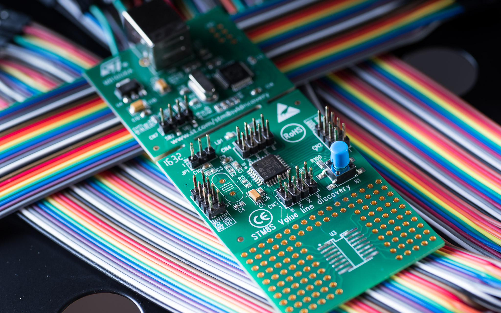

ST
STM8

https://jaycarlson.net/pf/st-stm8/

September 15, 2017  Microcontrollers  [8](https://jaycarlson.net/pf/st-stm8/#)

The STM8 is ST’s family of 8-bit microcontrollers. There are three families — the “S” mainstream line, the “A” atomotive line, and the “L” low-power line.

ST has been dumping the STM8 in the Chinese market, so it’s one of the cheapest general-purpose microcontroller you can buy these days (and that includes parts from STC and Holtek — two staples found in low-cost products made in China).

I recently spent 72 Yuan (~$11) on 50 of the most famous STM8 part: the STM8S003F3P6. Yes, that works out to 22 cents a piece for an 8K flash / 1K RAM microcontroller with 20 pins, 7 CAPCOM channels, 128 bytes of EEPROM, and 5 channels of 10-bit 430 ksps analog-to-digital conversion. And the fact that reputable U.S. suppliers sell the part in similar quantities for just north of $0.50 / unit should indicate the tremendous bargain the STM8 is.

The part I’m looking at in this review, though, is the STM8S005K6, which has an even better collection of features:

- 16 MHz core with 32 KB of flash, 2K of RAM, and 128 bytes of byte-addressable EEPROM
- Seven channels of 10-bit 430 ksps ADC
- Three 16-bit timers (including an advanced control timer) with 9 channels of capture, compare, and PWM
- Additional 8-bit basic timer, auto-wake-up timer, and beeper module
- UART, I²C, and SPI peripherals
- 32-pin LQFP package

# CORE DESIGN

The STM8 core has six CPU registers: a single accumulator, two index registers, a 24-bit program counter, a 16-bit stack pointer, and a condition register. The STM8 has a Harvard architecture, but uses a unified address space. There’s a 32-bit-wide program memory bus which can fetch most instructions in a single cycle — and pipelined fetch/decode/execute operations permit many instructions to execute in a single cycle.

The claim to fame of the core is its comprehensive list of 20 addressing modes, including indexed indirect addressing and stack-pointer-relative modes. There’s three “reaches” for addressing — short (one-byte), long (two-byte), and extended (three-byte) — trading off memory area with performance.

This is the only architecture in this round-up that has this level of granularity — all the other chips are either RISC-style processors that have lots of general-purpose registers they do their work in, or 8051-style CISC parts that manipulate RAM directly — but pay a severe penalty when hitting 16-bit address space. The STM8 manages these trade-offs in an efficient manner.

# DEVELOPMENT ENVIRONMENT

STVD — ST Visual Develop — is the official (and free) IDE for the STM8 microcontroller.

It can hook into Cosmic or Raisonance STM8 compilers, and provides project management, a text editor, and integrated debugging. There’s other IDE options out there, but I can’t comfortably recommend any of them. Raisonance has Ride7, but it only works with their expensive RLink debugger. Cosmic has IDEA, which is little more than a text editor — it doesn’t even support debugging. There’s an open-source SDCC + GDB + OpenOCD project that heavily targets Eclipse, but it’s clunky to set up, and uses SDCC — which struggles to produce reasonably fast code.

IAR Embedded Workbench has support for the STM8, and it’s probably the only third-party solution I would recommend for this part.

As far as proprietary vendor IDEs go, STVD is not completely terrible. There’s plausible (though unintelligent) text completion and syntax-highlighting; customizable text editor colors; Workspace and Project-level file management; quick debugging with bog-standard features; and a fairly generic “just works” interface that anyone who’s used Windows 98 before will feel right at home with.

STM8 has support for several compilers — open-source, free-as-in-beer, and commercial. I did not evaluate any of the compilers other than Cosmic, but Philipp Klaus Krause’s site, ColecoVision, has [an excellent STM8 compiler shoot-out](http://www.colecovision.eu/stm8/compilers.shtml).

# **STANDARD PERIPHERAL LIBRARY**

The preferred hardware abstraction library most developers use with the STM8 is the [Standard Peripheral Library](http://www.st.com/en/embedded-software/stsw-stm8069.html): a ZIP file containing runtime libraries, example projects, and an alright-but-not-amazing help file.

Modules are separated based on peripheral; preprocessor definitions are used to include / exclude different peripheral libraries, making the same library compatible with all STM8 devices.  It’s delivered in source form with separate header and implementation folders; it’s up to you to configure STVD’s include path appropriately, and to add any required source files to your project so they get built.

The library is function-parameter-based, not struct-based as some ARM SDKs are. This is usually suitable for 8-bit MCUs, but the STM8’s complex peripherals require verbose, bulky initialization functions that end up being a lot of copy-pasta for duplicated peripherals (multiple PWM channels, as an example). These functions require some knowledge about the peripheral being configured; I found the classic “copy-and-paste from the demo” methodology to be the easiest to make work — and there are enough demos included that cover all the basics.

The library is easy to use in an environment with text-completion, as all the enum constants — which you’ll be using often — are named with their module and functional type, as well as their value. So, GPIO_Init() takes a GPIO_Mode_TypeDef, which is going to be something like GPIO_MODE_OUT_PP_HIGH_FAST.

Other than that, there’s not much to say. The libraries expose basic functionality but avoid losing generality by implementing anything extraneous. For example, the SPI driver can initialize the SPI peripheral; send a byte; receive a byte; return various interrupt flags; and that’s basically it. If you want something as basic as a blocking *SPI_SendByteArray()*-sort of function, you’ll be implementing it yourself. You’ll obviously be on your own with any interrupt-based work, too. Peripheral initialization is the only place where the Standard Peripheral Library attempts to do anything for you; everything else is essentially just single-register manipulation.

I think this is most evident in an I2C example function that reads one or more bytes from an I2C EEPROM into an array:

```c
void I2C_EE_BufferRead(u8* pBuffer, u16 ReadAddr, u8 NumByteToRead)
{
  while(I2C_GetFlagStatus(I2C_FLAG_BUSBUSY));
  I2C_GenerateSTART(ENABLE);
  while (!I2C_CheckEvent(I2C_EVENT_MASTER_START_SENT));
  I2C_Send7bitAddress(EEPROM_ADDRESS, I2C_DIRECTION_TX);
  while (!I2C_CheckEvent(I2C_EVENT_MASTER_ADDRESS_ACKED));
  I2C_ClearFlag(I2C_FLAG_ADDRESSSENTMATCHED);
  I2C_SendData( (u8)(ReadAddr >> 8)); /* MSB */
  while (!I2C_CheckEvent(I2C_EVENT_MASTER_BYTE_TRANSMITTED));
  I2C_SendData( (u8)(ReadAddr)); /* LSB */
  while (!I2C_CheckEvent(I2C_EVENT_MASTER_BYTE_TRANSMITTED));
  I2C_GenerateSTART(ENABLE);
  while (!I2C_CheckEvent(I2C_EVENT_MASTER_START_SENT));
  I2C_Send7bitAddress(EEPROM_ADDRESS, I2C_DIRECTION_RX);
  while (!I2C_CheckEvent(I2C_EVENT_MASTER_ADDRESS_ACKED));
  I2C_ClearFlag(I2C_FLAG_ADDRESSSENTMATCHED);
  while(NumByteToRead)
  {
    if(NumByteToRead == 1)
    {
      I2C_AcknowledgeConfig(I2C_ACK_NONE);
      I2C_GenerateSTOP(ENABLE);
    }
    if(I2C_CheckEvent(I2C_EVENT_MASTER_BYTE_RECEIVED))
    {
      *pBuffer = I2C_ReceiveData();
      pBuffer++;
      NumByteToRead--;
    }
  }
  I2C_AcknowledgeConfig(I2C_ACK_CURR);
}
```

As you can see, the peripheral library exposes only the lowest-level functions necessary; it’s up to the developer to organize the appropriate logic (and certainly including understanding the I2C protocol).

# DEVELOPMENT TOOLS

ST provides the [STM8S-Discovery](http://www.st.com/en/evaluation-tools/stm8s-discovery.html), [STM8L-Discovery](http://www.st.com/content/st_com/en/products/evaluation-tools/product-evaluation-tools/mcu-eval-tools/stm8-mcu-eval-tools/stm8-mcu-eval-boards/stm8l-discovery.html), and the [STM8A-Discovery](http://www.st.com/content/st_com/en/products/evaluation-tools/product-evaluation-tools/mcu-eval-tools/stm8-mcu-eval-tools/stm8-mcu-eval-boards/stm8a-discovery.html). These are low-cost boards that integrate an ST-Link debugger into a snap-off target board.

I’m not a huge fan of snap-apart boards, and there’s not a clear matching row of headers you can use to reattach these boards together once you snap it apart; rather, you’ll have to figure out the pin-out on the chip and match it up. Despite the old-revision marketing photos, the current-shipping boards do, in fact, have the pins labeled (a serious omission on previous revisions) — but only for the pins on the target board.

ST also makes weird, old-school eval kits like the [STM8/128-MCKIT](http://www.st.com/content/st_com/en/products/evaluation-tools/product-evaluation-tools/mcu-eval-tools/stm8-mcu-eval-tools/stm8-mcu-eval-boards/stm8-128-mckit.html), but I really hate that style of dev board — and try to stay away from that stuff whenever possible.

The STM8 is compatible with standard ST-Link debuggers — both [official](http://www.st.com/en/development-tools/st-link-v2.html) and [unofficial](https://www.amazon.com/dp/B072J7QKDJ). I have tested both thoroughly and they perform equally well. I like the pin-out of the knock-off more than the original, though, as well as the form-factor. The knock-offs are dirt-cheap, though the official ST-Link is a [measly $23](https://www.digikey.com/products/en?WT.z_cid=sp_497_0928_buynow&Enterprise=44&lang=en&Vendor=497&mpart=ST-LINK%2FV2) — the lowest-cost official vendor tool in my round-up — which I can scarcely complain about in a world of [$260 Microchip ICD4](https://www.digikey.com/products/en/development-boards-kits-programmers/programmers-emulators-and-debuggers/799?k=icd4) debuggers with [flashy aluminum enclosures that people are raving about](https://www.youtube.com/watch?v=jXVWk-7OFvY).

# PERFORMANCE

## BIT-TOGGLE

The STM8 took four clock cycles to toggle a bit — a one-cycle bit-complement, followed by a three-cycle-effective relative-jump. ST claims that relative-jump instructions are two-cycle, but because they force the pipeline to flush, they delay the effective execution of the following instruction by a cycle. This is illustrated in their pipeline diagram, but not mentioned in the instruction timing.

Either way, this is a good result — beat only by the Cortex-M0+ parts (with one-cycle bit toggles and two-cycle jumps from their reduced pipelining) and the megaAVR (that has a funky toggle capability when writing a “1” to the PIN register when the pin is set as an output).

All other parts were equal or worse.

## BIQUAD FILTER

The STM8 Here, the STM8 took 201 clock cycles to do a single-iteration biquad filter. Here, the chip performs more like one of the 8051s than one of the AVRs. But with similar instruction timings between the two architectures, what’s going on?

This turns out to be Cosmic showing its lack of math wizardry. Rather than generating efficient in-line emulated 16-bit math instructions, Cosmic simply redirects the biquad filtering function into pre-compiled 16-bit multiplication libraries. This is the same problem many of the other proprietary 8-bit compilers had, including those for the HT-66, the Keil C51 compiler for the 8051, and the PIC16 compiler.

And while the EFM8 was able to lean on its 72 MHz core clock to squeeze out a (admittedly dirty) win, not so with the STM8 and its 16 MHz clock. This part ended up pulling 6.45 mA into a 79.5 kHz run, for an efficiency of 267.76 nJ/sample — the fifth-highest in my testing.

I would love to run these benchmarks again against other compilers — including SDCC — to see if anyone else has better optimization strategies.

## DMX-512 RECEIVER

Here, the STM8 didn’t manage to impress much, either. Lowering the clock to 4 MHz brought in a 67% processor usage during a DMX-512 frame. That’s 39 cycles of latency, followed by 118 cycles inside the ISR.

Keep in mind the lightweight peripheral library did not abstract the reception of bytes at all — I used a custom UART ISR, along with the required FWLib calls to check the UART’s status register and to receive the character from the buffer.

Interestingly, the STM8’s big sister — the STM32F0 — faired far better in both measures, despite its Arm Cortex-M0 core (not known for ISR efficiency) and STM32CubeMX-generated code (which many scoff at for being bloated).

I wish I could say the part was at least able to achieve some relief through low-power capabilities, but here, the part looks more like a greedy Arm Cortex-M0 — pulling 1620 µA when running at only 4 MHz.

# BOTTOM LINE

The STM8 has downright modern peripherals (sometimes STM32 direct copies), and other advanced features you’d find in Cortex-M0 parts — a nested vector interrupt controller, programmable slew rate, and an advanced core design with many single-cycle operations.

I think these parts looked amazing a few years ago up against crusty old [ATmega168](https://jaycarlson.net/pf/atmel-microchip-megaavr/)s and [Microchip PIC](https://jaycarlson.net/pf/microchip-pic16-five-digit-enhanced/) parts — especially considering pricing. But the new [tinyAVR 1-Series](https://jaycarlson.net/pf/atmel-microchip-tinyavr-1-series/) parts exceed this part in terms of peripherals, clock speed, development environment, and even power efficiency. And it’s hard to pick this part — with its crusty ST Visual Develop IDE — over a similarly-priced [EFM8](https://jaycarlson.net/pf/silicon-labs-efm8/), with its gorgeous, cross-platform Eclipse-based Simplicity Studio ecosystem.

Still, I think it’s actually the *lower end* STM8 parts, like the STM8S003F3, that are more interesting than this $1 part.

Just try to find a <30-cent part with 8 KB of flash, 1 K of RAM, 7 capture/compare/PWM channels, 400-ksps ADC — all in a relatively large 20-pin TSSOP package. You might be thinking of something similar to the [Nuvoton N76](https://jaycarlson.net/pf/nuvoton-n76/), [STCmicro STC8](https://jaycarlson.net/pf/stcmicro-stc8/), or [HT-66](https://jaycarlson.net/pf/holtek-ht-66/) field.

Now, make sure it has a free, unlimited C compiler that properly integrates into its IDE — there goes N76 and the STC8.

Next, ensure it has on-chip debugging without requiring special “developer versions” of its chips — there goes the HT-66.

That’s where the STM8 is without peers: a super-cheap, perfectly functional, easy-to-use 8-bit part with free tools and low-cost dev boards and debuggers.

Maybe you’re a commercial engineer building a bazillion units; or maybe you’re an art student working on a large-scale interactive installation — regardless of who you are, the STM8 is dirt-cheap — and without any surprises or headaches. Surely there’s room in your toolbox for a part like this.