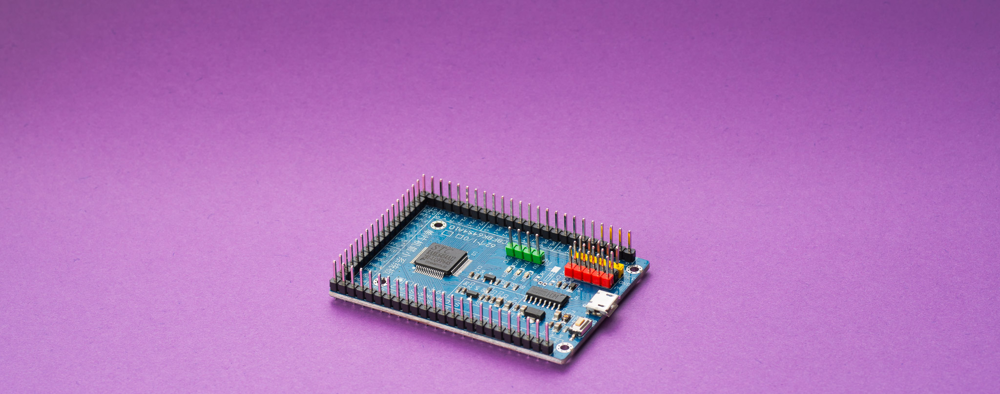
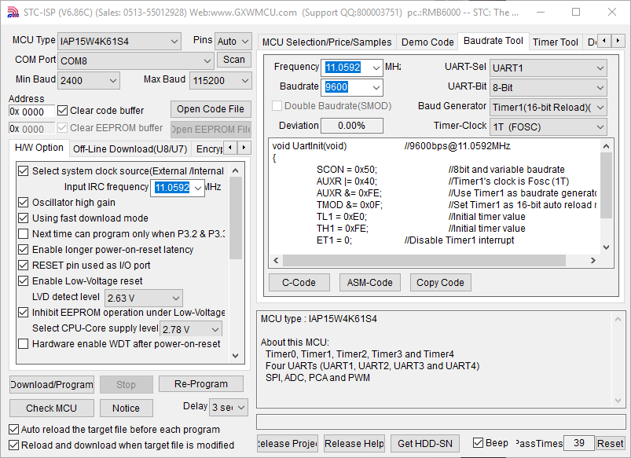
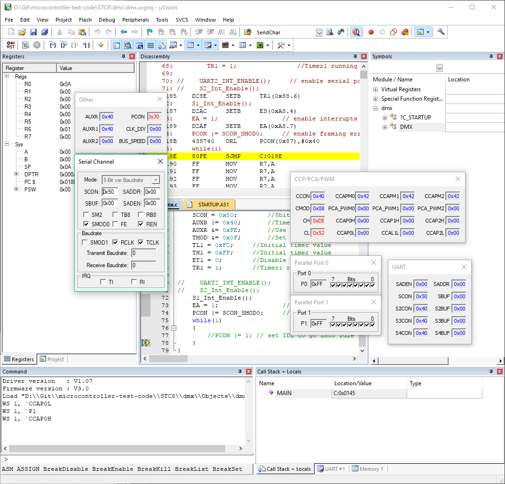

STCMICRO
STC8

https://jaycarlson.net/pf/stcmicro-stc8/

September 15, 2017  Microcontrollers  [5](https://jaycarlson.net/pf/stcmicro-stc8/#)

The STC8 is the newest generation of low-cost 8051-derivative MCUs made by STCmicro (often just called STC) in Beijing. This is a modern, 1 clock/machine cycle 8051 that’s the closest competitor to the Silicon Labs C8051/EFM8 parts, in terms of core design and peripherals.

For this experiment, I selected the STC8A8K64S4A12, which is the top-of-the-line device they make, while still [well under $1, even in single quantities](https://lcsc.com/product-detail/STC_STC8A8K64S4A12-LQFP-44_C83896.html).

The STC8 is brand new — there’s not even English documentation available yet. But before that scares you away, consider that the [IAP15W4K61S4](http://stcmicro.com/STC/STC15W4K32S4.html) — part of the STC15W line — is basically identical in terms of peripherals, development ecosystem, and package availability. The STC15W has been around for a while, [has good English documentation](http://stcmicro.com/datasheet/STC15W4K32S4-en.pdf), and has pretty good availability on English-friendly Chinese vendors on AliExpress and even eBay — along with [LCSC](https://lcsc.com/product-detail/STC_IAP15W4K61S4-30I-P_C53062.html), my preferred vendor for ICs from this part of the world.

The only difference — and it’s an important one — is the much faster core the STC8 has.

Not in terms of raw core speed, but in *clock efficiency*. What makes the STC8 amazing is that it has all the power of an 8051 CISC core — a fully-orthogonal instruction set that allows you to do tons of operations on any address in RAM (no need to move to registers) — but also has true, single-cycle execution on more than 80% of its instructions (while nearly 90% of them execute in two cycles or less).

The STC8 features:

- 33 MHz 1T 8051
- 8K of RAM, 64 K of flash memory
- Five 16-bit auto-reload timers
- Four standard 10-bit CCP PWM channels, plus an 8-channel, 15-bit PWM module  – that’s 12 channels of PWM total
- Four independent UARTs, plus an SPI and I2C peripheral
- 8 channels of 10-bit ADC
- 2.0 – 5.5V wide operating voltage
- DIP and LQFP package options up to 64-pin

This chip shares the same base 8051 peripherals that all 8051-style MCUs share (including the [EFM8](https://jaycarlson.net/pf/silicon-labs-efm8/) and [N76](https://jaycarlson.net/pf/nuvoton-n76/), also reviewed). This means you get handy quasi-bidirectional GPIO, 8051-style UART with no internal baud rate generator (lame), CCP module, and timers. STC was a little more aggressive with their 8051 modernizing than other brands; while others keep Timer0 and Timer1 identical to the classic, STC completely eliminated the rarely-used 13-bit timer mode and replaced it with an auto-reload mode — and then combined these two timers with three additional auto-reload timers.

STC has no problem hacking the architecture a bit to introduce new features while sort of preserving code compatibility. For example, the T0 and T1 timer reload registers are actually exposed as the *same* address as the timer’s value registers; they’re just only accessible when the timer is not running. So the timer’s state essentially sets which “page” to use when accessing, say, T0H, and T0L. Kind of a gross hack, but it’s totally serviceable, and with five timers, it reduces the number of SFRs by 10.

There’s also a unique 15-bit, 8-channel PWM module with separate on- and off-time registers, which allows arbitrary phase — useful for motor and power control applications.

## FLASHING & DEBUGGING

The STC8 line – like all their other parts – uses a ROM-based UART bootloader you’ll use for all of your computer-to-STC15 interactions. I’m not sure it’s even ROM-based, since even if your device doesn’t actually have a UART peripheral, (like the STC15W100-series), you still use the “UART” to program it.

It seems like some of the STC8 MCUs can actually use the TX and RX pins as USB D+ and D- pins, and run a built-in USB bootloader – but I didn’t have a 24 MHz crystal handy to try this.

The UART bootloader is a bit backwards from typical implementations: the bootloader on the chip will send out a character on cold-boot to the computer, which will then reply and tell the part to hang out in bootloader mode if the computer intends to flash an image.

The advantage is cold-boot times are really fast — since the STC8 gets to transmit first.

If you’re on Windows, you’ll be using the STC ISP utility (available in Chinese and English-ish). If you’re stuck on *nix (or are otherwise an open-source nut), [stcgal](https://github.com/grigorig/stcgal) is a Python-based open-source STC programmer that I haven’t tested, but is reported to work well.

There’s no proprietary debugger with the STC system, either — rather, you load a monitor program on the device, and Keil connects to it using the UART.

This was quite common back in the day — but it was also *definitely* before my time, so the workflow initially seemed confusing.

Rather than have dedicated, on-chip debugging hardware, the monitor program is essentially a specialized firmware that will take over a serial port, periodically check in and ask for commands from the computer it’s attached to, and otherwise “monitor” the user’s firmware image.

There’s a serious caveat to this: the device has to have self-programming capabilities — what STC calls *In-App Programming* (IAP) — and not all STC devices have this. In fact, 99% of them do not.

Prior to the STC8, IAP-capable parts had a completely different IAP name. The STC15W4K61S4 had an IAP version — the IAP15W4K61S4. These parts were meant for development only, but you see them quite often in small-run products, too.

That changed in name only with the STC8 — there are no longer IAP-named parts, rather, the highest-end STC8 retains IAP functionality; other parts do not.

The STC ISP programmer connects to the MCU over UART to reprogram it. As you can see, the app has no shortage of buttons and checkboxes.

## STC-ISP

STC doesn’t provide a stand-alone development environment (which is probably a good thing), but they have a small ISP program that hooks in with Keil C51 quite nicely. The ISP program is ugly, and some of the English translations have garbled up the UI, but if you can look at it from a utilitarian mindset, I think you’ll actually *like it*. Why?

- UI is littered with checkboxes and buttons that do *everything* imaginable.
- Tab after tab after tab of the cutest little utilities imaginable. UART code-gen tools; timer calculators; header file generators; built-in code examples; buttons for automagically programming the proper monitor firmware image onto your device; a device selector tab that’s much snappier than any web-based I’ve seen from ST or Microchip or Atmel… the list goes on.
- Good, fast batch programming support (which is good, since you probably won’t be ordering these chips pre-programmed when you go into small-volume production).
- Programming speed seems as zippidy as downloading code to an ARM chip over JTAG with a $500 Segger J-Link.
- As soon as the ISP program notices you’ve rebuild the project in Keil, it will automatically upload the new firmware to your IC.

Keil is aware of all the special, non-standard peripherals found in the 8051.

## DEBUGGING EXPERIENCE

Code load times were faster than other Keil-based targets. It took 4.1 seconds to load a minimum application on the target, and 6.24 seconds to load 16K of code. Keil displayed correct peripheral windows for some of the non-standard arrangement of 8051 peripherals (4 UARTs), but the fourth PCA channel was missing, and I didn’t see anything related to the I2C peripheral or 15-bit PWM array unit — though these can always be inspected using the Watch window in Keil.

# PERFORMANCE

## BIT-WIGGLE

On the 8051, the bit wiggle program compiles into a CPL.B instruction and a jump (absolute or relative — it doesn’t affect performance).

The STC8’s single-cycle bit complement (CPL.B) shaves a cycle off the EFM8’s 2-cycle CPL.B, and a cycle more off the STC15’s 3-cycle CPL.B instruction. But jumps are still three-cycle instructions on every 8051 tested, so the STC8 can only manage a 4-cycle wiggle — still hair less efficient than the Cortex-M0+’s capabilities.

## BIQUAD FILTERING

The STC8 achieved a 204 kHz biquad filter speed into 11.87 mA of power consumption, ringing in 192 nJ/sample — more than twice the power consumption of the best 8-bit parts, but much better than a lot of the 8-bit pack.

As mentioned in the main review, all the 8051s struggled with the 16-bit biquad filtering, and I’m comfortable placing the blame on Keil’s C51 compiler, which really can’t seem to generate efficient math code. Having said that, the STC8 used only 153 clock cycles to execute the filter — that’s 43% fewer cycles than the EFM8, which relies on its high 72 MHz core speed to beat out the STC8. The efficient STC8 core means a 33 MHz STC8 performs the same as an EFM8  running at nearly 60 MHz — so this part isn’t far from striking distance of the 72 MHz EFM8 (while actually using a bit less power).

## DMX-512 RECEIVER

The 4x oversampling UART is not the limiting factor here, which would allow me to reduce the clock to 1 MHz. Unfortunately, I couldn’t get basic clock division to work — so the lowest speed I could run the core is 4 MHz — set by the STC-ISP program.  At this frequency, the STC8 used 4560 µA of current, which was the second-worst in our round-up.

Having said that, the STC8 executed its ISR with only 10 cycles of delay — fewer than all other parts (by a long shot); and ,its ISR totaled 45 cycles — faster than everything but the Infineon XMC1000.

# BOTTOM LINE

First thing’s first: the STC8 has one of the most clock-efficient cores tested, and has a huge amount of flash, RAM, and peripherals. If you dig deep into the instruction timings, you’ll realize you can sort of think of this chip like it’s a 30 MHz AVR with 128 registers instead of the usual 32 — because all RAM operations are single-cycle. You pay a bit of a penalty for accessing “main RAM” (XRAM), but for control applications, this chip is definitely king — this has more than three times faster ISR latency than the AVR (one of the slowest ISR latencies among 8-bit MCUs) and efficient ISR processing (since all the local variables live permanently in RAM — akin to AVR registers).

But I feel like only architecture nerds will appreciate that. Most users want a processor that is somewhere along the fast-to-low-power spectrum, and the problem is this chip is really neither. It’s *fast enough* for most basic control applications (STC has a quadcopter reference design to show off this chip, for what it’s worth), but it doesn’t touch the Arm processors in math performance, and it was one of the worst power-consumers in my round-up.

There are other reasons why STC products are hard to justify if you’re a professional engineer working on small-run projects that will be manufactured in the U.S. — no English-based forum/community; zero tech support; no US-based distributors. I used one of my private consulting email address to request a quote for 1000/10,000 units of a few parts, and they never got back to me. These people won’t even *sell me their chips*, let alone support them.

Having said that, these are definitely fun chips to play with if you’re an advanced hobbyist or hacker. There’s oodles of 8051 resources on the internet, and 99.9% of what you will find is applicable to this chip (especially if you’re not going to try to do any low-power stuff, which is very vendor-specific).

You need absolutely zero hardware, other than an MCU (available in DIP, so you don’t even need a breakout board) and a USB-to-serial adapter (which you already have).

For most pet projects that hobbyists will dork around with, the 2K code size limit in Keil will be fine. If not, Keil C51 and µVision haven’t seen substantial changes in the last 5-10 years, so you can probably find an old license floating around somewhere (check your university, or ask engineering friends — or resort to eBay).

And you can do an open-source development route using [SDCC](http://sdcc.sourceforge.net/) + stcgal, too — though there’s no mechanism for debugging. And if you’re simply alergic to Windows but noncommittal about FOSS software, I know for a fact that Keil C51 runs great under Wine.