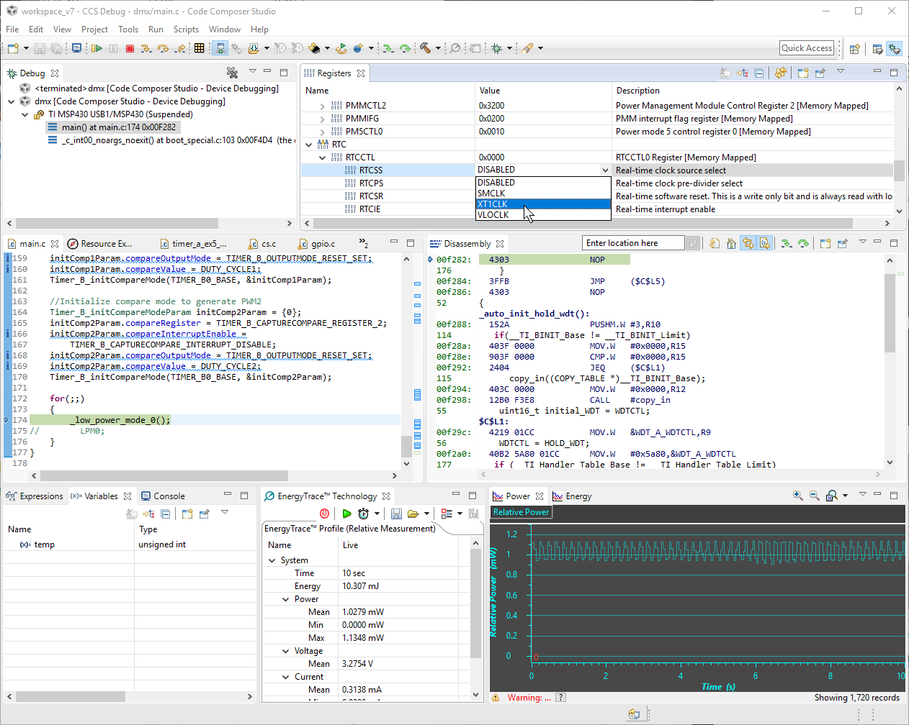

TEXAS INSTRUMENTS
MSP430

https://jaycarlson.net/pf/texas-instruments-msp430fr/

September 15, 2017  Microcontrollers  [13](https://jaycarlson.net/pf/texas-instruments-msp430fr/#)

Most MSP430s are 1.8 – 3.6V devices, though there are also specialized MSP430 parts that operate at extremely low voltages down to 0.9 volts. These are great for running off a single AAA battery, and I’ve spotted it in several different active digitizers that accompany tablets computers. Note that these parts are made on a smaller, leakier process, so they have worse power consumption figures than the other MSPs.

One secret this part has is its FRAM memory in lieu of traditional flash. This allows the part to be shut off completely, while still preserving the contents of its memory. Note that FRAM replaces flash — not RAM. But, it’s almost as easy to use as RAM:

 ```C
#pragma PERSISTENT(x)
unsigned int x = 5; // this variable lives in FRAM
 ```

I’m not sure if the pricing is due to a marketing scheme or actual low fabrication prices, but the FRAM series is, by far, the best value.

Their older “G” series parts are popular with hobbyists (and some of them even come in DIP packages), but they have a scarce set of peripherals (many without analog functionality or even a UART).

FRAM parts at the low end are better-endowed than the “G” series devices. Most have an eight-channel 10-bit ADC, analog comparator, USART, SPI, and I2C, though the ADC and I2C support fades away as you hit rock bottom.

These parts top out in the $6+ range, with 128 KB of FRAM and 2 KB of RAM (though you can get MSP430s, more broadly, with better specs yet).

We were limited to the [MSP430FR2111](http://www.ti.com/product/MSP430FR2111) due to pricing constraints, but for general-purpose applications, I would have preferred something around the MSP430FR5738 range, which looks like a more direct competitor to other parts in this review.

These parts are rather expensive — you’re paying for the ultra-low-power marks this chip puts up. This particular model can run an RTC in sleep mode while sipping 350 nA of power. Just how low is that? An ideal CR2032 coin-cell could run this part for 78 years.

The main specs of the part we reviewed:

- 16 MHz MSP430 core
- 3.75 KB FRAM program memory
- 1 KB of RAM
- One timer with three capture/compare registers (two PWM outputs), plus an RTC counter
- eUSCI_A communication peripheral, supporting either USART (with IrDA) or SPI
- Comparator with 6-bit DAC and hysteresis
- 8-channel 10-bit 200 ksps ADC with optional 1.5V reference
- Capacitive-touch support on all pins

…and that’s about it.

The part comes in TSSOP and VQFN packaging, though other MSP430 families include DIP, SOIC, and QFP options, too.

# DEVELOPMENT ECOSYSTEM

Eclipse-based development environments, such as Code Composer Studio from Texas Instruments, provide a complete text editor, toolchain, and debugging system in one application — plus many vendors choose to extend Eclipse with vendor-specific features, such as the ULP Advisor that Texas Instruments bundles to help developers get active- and sleep-mode current down to the minimum.

## DEVELOPMENT ENVIRONMENT

Code Composer Studio is TI’s Eclipse-based IDE for the MSP430 (along with all their other parts, too). It’s lightly modified with some useful MCU-specific features, but anyone used to a stock Eclipse environment should feel right at home.

I really like the ULP Adviser TI builds into Code Composer Studio — it will analyze your source code, looking for common sources of higher-than-necessary power consumption. It will tell you about configuring unused pins, but it will also encourage you to take care of the little stuff — like counting down to zero, instead of up to a constant.

They modified the text completion in Eclipse to automatically text-complete the function call — complete with variables named after the parameters. This ended up tripping me up constantly since I often text-complete functions as a way of popping up documentation.

The compiler toolchain editor is greatly expanded from stock Eclipse versions; almost everything is spelled out in easy-to-read formats. Code Composer Studio supports both the TI compiler and GCC.


I enjoyed the Resource Explorer feature in Code Composer Studio; it’s an optional pane in CCS that contains documentation, code examples, and API references.  I usually detach it from CCS altogether and let my operating system manage it as a separate window. The problem with it is that since it’s Eclipse, this pane — docked or floating in its own window — is considered a *view* which is part of a *perspective*; if you get the Resource Explorer open to the correct page, the moment you start debugging, it will vanish. You can create a Resource Explorer view when you’re debugging, but *it’s not the same Resource Explorer!* Consequently, it will have its own internal state.

## DEVELOPMENT TOOLS

A hallmark of the Texas Instruments ecosystem is its popular low-cost [LaunchPad boards](http://www.ti.com/lsds/ti/tools-software/launchpads/overview/overview.page). Each board has a built-in USB debugger (with USB-to-serial capabilities, too), target device, 0.1″ headers, and, in some cases, a sparse collection of peripherals.

When these boards launched, they were $4.30 each (get it?), but they’ve steadily gone up in price. They’re still $10-20 for most models, which makes them perfectly reasonable.

The hallmark feature, in my opinion, is the firewall between debugger and target. Each signal passes through a row of jumpers, allowing you to individually route or unroute signals from the two sides. This gives you tons of options:

- Keep all the jumpers in place for onboard debugging and UART communication, with self-powering.
- Remove the UART jumpers to easily interface your target with external UART equipment (say, a differential receiver).
- Remove the debugger jumpers to allow debugging on off-board MSP430 (say, one of the few DIP-packaged ones installed on a breadboard).
- Remove the power jumpers and hook up an external target to the debugger’s power to measure its current consumption.

Forget the snap-apart fads or complex software-selectable debug routing. Just give me a set of jumpers, and you’ve made me a happy man.

If you want a robust, stand-alone debugger, look toward the [$115 MSP-FET](http://www.ti.com/tool/msp-fet). This debugger has a built-in energy monitor and UART (for conveniently gathering printf()-style traces from the target). Having said that, this doesn’t really do anything the LaunchPad boards don’t do, so you’re essentially paying for a plastic box and nice cabling. It’s less than half the price of other manufacturer’s tools, however, so I won’t judge you if you buy one.

## CODE GENERATION

Historically, MSP430 projects supported the GRACE code configurator tool, but Texas Instruments has apparently deprecated it, and it doesn’t support newer devices.

## PERIPHERAL LIBRARIES

Texas Instruments distributes a peripheral library called the MSP430 DriverLib (also referred to as, or part of, MSPWare, or MSP430Ware — it’s TI, so there are three or four different names for it).

The recommended way of installing it is from within the Resource Explorer view in Code Composer Studio; from there, make sure to ignore the outdated documentation, and instead, browse around on the forums to discover [people wondering how to create a project which uses DriverLib](https://e2e.ti.com/support/development_tools/code_composer_studio/f/81/t/517229).

Like the peripheral libraries from a few other MCU vendors, TI puts heavy emphasis on example projects and very little emphasis on documentation. To really understand DriverLib, you’re going to be importing a lot of example projects, carefully reading them line-by-line, and digging into the source file to see what each DriverLib call does; this will require a strong understanding of the MSP430 peripherals.

In my opinion, a well-written peripheral library helps abstract underlying hardware. For example, something like:
```C
UART_Init(EUSCI_A_BASE, 115200, P1_6, P1_7, 8, 1); // initialize EUSCIA @ 115200, 8N1, and use P1_6 as TX and P1_7 as RX
```
Instead, this peripheral library is not designed to abstract the hardware, but rather to simply abstract the registers, which gets quite silly.

You essentially do everything manually; you’ll quickly notice how comical these functions start to look. For example, to mux the TX and RX pins, you call:
```c
GPIO_setAsPeripheralModuleFunctionInputPin(
GPIO_PORT_P1,
GPIO_PIN6 | GPIO_PIN7,
GPIO_PRIMARY_MODULE_FUNCTION
);
```
How do you know that P1_6 and P1_7 have a “primary module function” that’s the UART TX and RX pins? Read the datasheet!

This is equivalent to this:

```c
P1SEL0 |= (BIT6 | BIT7);
```

If I have to look in the datasheet anyway, I might as well notice that primary module functions are activated using the SEL0 register. How is this peripheral library saving me time?

With the pins muxed, just initialize the UART:

```c
EUSCI_A_UART_initParam param = {0};
param.selectClockSource = EUSCI_A_UART_CLOCKSOURCE_SMCLK;
param.clockPrescalar = 8;
param.firstModReg = 0;
param.secondModReg = 0xD6;
param.parity = EUSCI_A_UART_NO_PARITY;
param.msborLsbFirst = EUSCI_A_UART_LSB_FIRST;
param.numberofStopBits = EUSCI_A_UART_ONE_STOP_BIT;
param.uartMode = EUSCI_A_UART_MODE;
param.overSampling = EUSCI_A_UART_LOW_FREQUENCY_BAUDRATE_GENERATION;

EUSCI_A_UART_init(EUSCI_A0_BASE, &param);
EUSCI_A_UART_enable(EUSCI_A0_BASE);
```

This is where things get downright awful. How do you set the baud rate? You calculate it from formulas in the datasheet, and then plug the raw numbers into clockPrescalar, firstModReg and secondModeReg variables.

None of these calls are self-documenting or self-discoverable, like they are in other peripheral libraries (like the library for the [STM8](https://jaycarlson.net/pf/st-stm8/)).

For example, the method signature for CS_initClockSignal is:

```c
void CS_initClockSignal(uint8_t selectedClockSignal,
uint16_t clockSource,
uint16_t clockSourceDivider)
```

C doesn’t really have strongly-typed enums, so all these functions just take integers, which are determined based on named constants you pass in. If TI cared about making the peripheral library self-documenting and self-discoverable, these named constants would have names that match their module and parameter name, like:

```
CS_initClockSignal(CS_SELECTEDCLOCKSIGNAL_ACLK,CS_CLOCKSOURCE_XT1CLK,CS_CLOCKSOURCEDIVIDER_1);
```

That way, I can start typing out the parameter name, and auto-complete will give me all my options for each parameter. Instead, they have arbitrary names:

```c
CS_initClockSignal(CS_ACLK, CS_XT1CLK_SELECT, CS_CLOCK_DIVIDER_1);
```

If we were in the 1980s and didn’t have good text-completion, I’d enjoy the shorter names — but it’s 2017; variable names should be descriptive and logically organized.

All of my criticism about the DriverLib boils down to it being verbose, hard to recall, and redundant.

But it’s not worthless: there are lots of great examples — if you just want to get something up and running quickly, you’ll end up with a project full of copypasta from example projects that seems to work, and that’ll be good enough for many people.

Code Composer Studio supports building Energia projects directly from within the IDE — complete with the same code-completion and debug capabilities you’d expect from Eclipse. This is a great transitional environment for people used to the Arduino ecosystem.

## ENERGIA

TI doesn’t have an active code-gen tool, and its peripheral library is sort of silly, but one interesting thing about the ecosystem is built-in support for an entirely separate ecosystem — called [Energia](http://energia.nu/) — that’s an open-source port of Wiring (Arduino) to the MSP430.

Energia started out as a stand-alone Wiring-based IDE and Arduino-compatible library, but Texas Instruments added direct support into Code Composer Studio a few versions back. Now, you can create Energia projects from scratch in CCS, edit them with full Eclipse-based text-completion and code insights, and debug them, too.

The hilarious part about this whole ordeal is that it’s actually *easier* to do Arduino-like development in Code Composer Studio using Energia projects than it is in [Atmel Studio](https://jaycarlson.net/pf/atmel-microchip-megaavr/#arduino), which can’t even create Arduino sketches, and only allows you to convert existing sketches into Atmel Studio projects.



## DEBUGGING EXPERIENCE

It takes about 5 or 6 seconds to start a debug session on the MSP430. Code-stepping responsiveness is equally average. The debugging functionality is typical Eclipse fair, with a few useful additions. The EnergyTrace analyzer communicates with power-measurement hardware on the LaunchPad (and other dev kits) to measure current and voltage. The Registers view can read and modify individual register values (grouped by function), while also breaking down the register into its individual configuration values. There’s built-in documentation for everything, with drop-down selections for each option. I wish more IDEs had this style of register view — it helps keep you away from PDF datasheets, so you can focus on your project.

There’s also built-in support for plotting arrays of signals (though not live — you have to halt the core to allow the debugger to read the data array), and some profiling.

# PERFORMANCE

## BIT-WIGGLING

Because of its orthogonal instruction set, bit-wiggling the MSP430 results in two instructions — and XOR.B and a JMP. I observed a 7-cycle period between toggles; the XOR.B instruction appears to take five cycles, with the JMP taking two.

## BIQUAD FILTERING

The MSP430FR2111 lacks a hardware multiplier (which higher-end MSP430s have), which really stunted the performance of this chip; the processor turned in a dismal 35.65 ksps performance figure into a 2.41 mA operating current, yielding more than 223 nJ/sample. This was, by far, the worst 16 or 32 bit part in the review, and even many of the 8-bit microcontrollers beat it.

## DMX-512 RECEIVER

This is where the MSP430 shined — it turned in a 279 µA current consumption reading for the DMX-512 receiver project. The closest competitor — the PIC16 — used 60% more power (and the PIC16 makes the MSP430 look like a math genius).

It wasn’t all roses, though. I fought nonstop with the peripheral library, and I wasn’t actually able to build a functional RGB DMX-512 light since this part doesn’t even have a third PWM channel: turning my RGB LED to an RG… LED one.

But even still, without using any of the fancy receive-while-sleeping UART functionality, or doing dynamic clock scaling, this part still performed well. Combined with ULP Advisor hints, I think the MSP430 was also the easiest processor to shave off power usage.

When I have some time, I want to re-visit the MSP430 and get this current consumption down even further.

# BOTTOM LINE

The MSP430 has a well-deserved reputation for its low-power prowess, and it didn’t disappoint in my testing. Its Eclipse-based IDE, [Code Composer Studio](http://www.ti.com/tool/CCSTUDIO), is now completely free and unrestricted — plus open-source fans will appreciate [MSP430’s GCC](http://www.ti.com/tool/msp430-gcc-opensource) support. [Energia](http://energia.nu/), a fork of the Arduino/Wiring IDE, is a great starter for hobbyists (especially when compared to the nearly-useless MSP430Ware peripheral library) — and TI fully embraces that ecosystem with integrated Code Composer Studio support.

This particular part didn’t perform well on the biquad filtering test, as it lacked a hardware multiplier, but a higher-end MSP430 should turn in results as good as the 16- and 32-bit parts in the round-up — while maintaining its excellent low-power figures.

But that’s the biggest problem with the MSP430: the price. The part reviewed — the [MSP430FR2111](http://www.ti.com/product/MSP430FR2111) — is an absolute baseline part with few bells and whistles (there weren’t even enough PWM channels to fully implement the RGB LED DMX receiver project), and you should expect to pay 2-3 times what competing 8-bit (and even 32-bit) designs cost. Having said that, TI supposedly has good volume pricing for production orders, and for <1000 units, spending $1 more on a microcontroller is the same as having to pay the team for an extra day’s worth of work — it won’t make or break the budget (hopefully!).

I’d love to get a better peripheral library or code-gen tool to help get MSP430 projects started a bit more quickly (especially when jumping between different parts), but neither feature is life-changing.

And honestly, for hobbyists and students transitioning from Arduino and looking for some continuity, I can’t think of a better platform than the MSP430 — and that’s taking into consideration AVR parts.